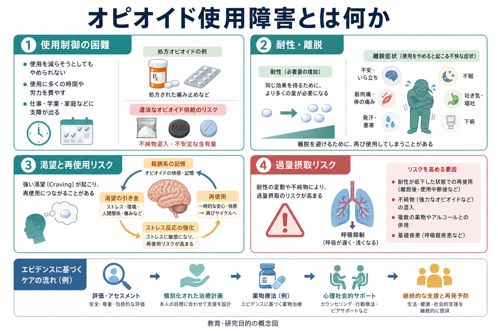
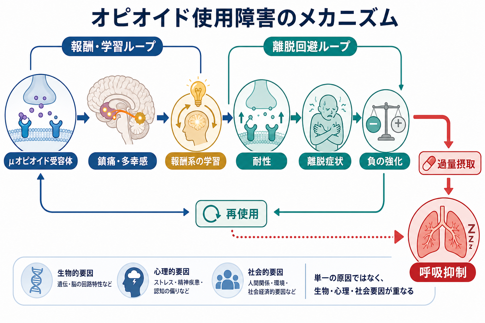
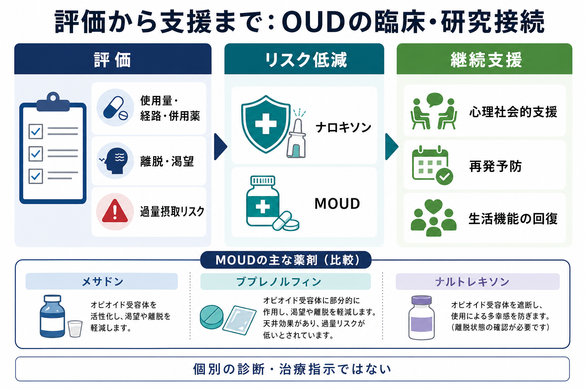

# オピオイド使用障害とは何か

## 要点

- オピオイド使用障害（opioid use disorder: OUD）は、処方鎮痛薬、ヘロイン、フェンタニルなどのオピオイド使用が、本人の意図や価値に反して制御しにくくなり、健康・生活・安全に重大な影響を及ぼす状態である[1]。
- 中核は「使ったかどうか」ではなく、使用制御の困難、渇望、役割障害、危険な状況での使用、害があっても続くこと、耐性、[[離脱症状とは何か|離脱症状]]などのまとまりである[1]。
- 仕組みは単純な快楽追求ではない。報酬学習、習慣化、離脱時の不快、ストレス系の動員、実行制御の低下が重なり、再使用を起こしやすい循環を作る[2]。
- 過量摂取では呼吸抑制が中心的な危険であり、違法供給に含まれる高力価オピオイド、耐性低下後の再使用、ベンゾジアゼピンやアルコールなどとの併用がリスクを高める[7]。
- 治療・支援では、メサドン、ブプレノルフィン、ナルトレキソンなどの薬物療法（MOUD）と心理社会的支援、過量摂取予防、継続的なケアを組み合わせることが重要である[3][4][8]。
- 本記事は教育・研究目的の整理であり、個別の診断や治療指示ではない。

## この記事で答える問い

1. オピオイド使用障害は、通常の鎮痛薬使用や身体依存と何が違うのか。
2. なぜ離脱、渇望、再使用、過量摂取リスクが一つの問題として結びつくのか。
3. 報酬系・ストレス系・実行制御の観点から、OUDをどう理解できるのか。
4. 臨床と研究では、どのような評価・支援・未解決問題が重要になるのか。

## まず結論

オピオイド使用障害は、「オピオイドを使った経験がある」ことでも、「処方薬を必要としている」ことでもない。問題になるのは、使用を減らしたいのに減らせない、使用に多くの時間や注意が奪われる、仕事・学業・家庭・安全が損なわれる、害が明らかでも使用が続く、離脱や渇望が再使用を強く押す、といった制御困難のまとまりである[1]。

重要なのは、身体依存や耐性だけでOUDと決めないことである。慢性疼痛で医師の管理下に長期オピオイド治療を受ける人にも、耐性や離脱が生じることはある。しかし、それだけでは使用障害とはいえない。OUDでは、使用の制御困難、生活上の障害、危険な使用、害があっても続くことが評価の中心になる[1]。この区別は、[[疼痛症状は精神科でどう評価するか]]や[[疼痛と精神疾患は脳内でどうつながるのか]]とも接続する。

## 背景

オピオイドには、モルヒネ、オキシコドン、ヒドロコドン、フェンタニル、ヘロイン、メサドン、ブプレノルフィンなどが含まれる。医療では鎮痛や特定の治療目的で用いられる一方、非医療的使用や違法供給により依存、感染症、事故、過量摂取死などのリスクが生じる。CDCは、OUDの同定を「潜在的に命を救う介入を始める機会」と位置づけ、非難ではなく協働的・非審判的に評価することを強調している[1]。

現在の臨床では、OUDを慢性疾患として扱う視点が重要である。CDCは、薬物療法を含むOUD治療が過量摂取と全死亡リスクの低下に関連するとし、OUDが中等度以上の場合にはMOUDを提供または手配することを勧めている[3]。SAMHSA TIP 63も、メサドン、ブプレノルフィン、ナルトレキソンというFDA承認薬と、回復を支える心理社会的・医療的サービスを合わせて整理している[4]。

## 基本概念

### オピオイド使用障害

OUDは、オピオイド使用に関する制御障害、社会的障害、危険な使用、薬理学的特徴の組み合わせとして評価される。CDCが示すDSM-5基準に基づくチェックリストでは、予定より多く・長く使う、減らそうとして失敗する、入手・使用・回復に時間を費やす、渇望、役割不履行、対人問題、重要活動の減少、危険な状況での使用、害があっても続く、耐性、離脱などが扱われる[1]。

この評価は、[[物質使用歴はどのように聞くべきか]]で扱うように、物質名、量、頻度、経路、最終使用、併用薬、入手経路、使用目的、離脱、過量摂取歴、治療歴、本人の変化への意向を構造的に確認する作業と重なる。

### 身体依存・耐性・離脱

身体依存は、オピオイドがある状態に身体が適応し、急な中止や減量で離脱が出やすくなる状態である。耐性は、同じ効果を得るためにより多くの量が必要になる、または同じ量で効果が弱くなる現象である。離脱では、筋肉痛、腹部不快、下痢、発汗、鼻汁、流涙、不眠、不安、焦燥、渇望などが問題になりうる[1]。

ただし、身体依存とOUDは同じではない。医療的に管理されたオピオイド治療でも身体依存や耐性は起こりうる。OUDと評価するには、使用制御の困難、害があっても続くこと、生活機能への影響を合わせて見る必要がある。

### 過量摂取

オピオイド過量摂取の急性リスクは、主に呼吸抑制である。強力な合成オピオイド、含有量が不明な違法供給、耐性が下がった後の再使用、アルコールや鎮静薬との併用、呼吸器疾患などはリスクを高める。ナロキソンは、ヘロイン、フェンタニル、処方オピオイドなどによる過量摂取を、時間内に投与された場合に反転しうる救命薬として位置づけられている[7]。

## 仕組み

OUDの仕組みは、少なくとも三つの循環で理解すると見通しがよい。

第一に、報酬・学習の循環である。オピオイドはμオピオイド受容体を介して鎮痛、安心、多幸感、苦痛軽減などをもたらしうる。これが[[報酬系とは何か|報酬系]]や記憶と結びつくと、薬物そのものだけでなく、場所、人間関係、気分、痛み、ストレス、時間帯などの手がかりが渇望を呼び出しやすくなる。これは[[依存症は報酬学習の病態としてどう理解できるのか]]で扱う強化学習モデルと接続する。

第二に、離脱回避の循環である。使用が続くと、薬物がない状態が苦痛、不安、身体不快、睡眠障害として経験されやすくなる。再使用は一時的に離脱を軽くするため、「快感を得る」よりも「つらさを避ける」行動として強化される。KoobとVolkowの神経回路モデルでは、依存症は過剰な誘因サリエンスと習慣形成、報酬低下とストレス過剰、実行機能低下が重なる三段階の循環として整理される[2]。

第三に、過量摂取リスクの循環である。耐性は一定ではない。中断、入院、収監、治療後、離脱後などで耐性が下がった状態で以前と同じ量を使うと、呼吸抑制リスクが上がる。また、違法供給ではフェンタニル等の混入や含有量の不確実性があるため、本人が意図した量と実際の薬理学的負荷がずれることがある[7]。

## 図解

図1は、OUDを「使用制御の困難」「耐性・離脱」「渇望と再使用リスク」「過量摂取リスク」の四つから整理している。処方薬の医療使用と違法供給のリスクを分けつつ、どちらでも使用制御と安全性の評価が必要になる点を示している。

図2は、μオピオイド受容体、報酬系の学習、耐性、離脱、負の強化、再使用、呼吸抑制を一つの流れとして示している。ここで重要なのは、再使用を「意思の弱さ」ではなく、学習・身体適応・ストレス反応・環境手がかりの相互作用として理解することである。

図3は、評価から支援までの流れを示す。OUDでは、薬物療法だけ、心理社会的支援だけ、過量摂取予防だけを切り離して考えるより、本人の安全、生活機能、治療継続、再発予防を同時に扱うほうが実践的である。

## 臨床・研究との接続

### 評価の入口

臨床評価では、まず安全を確認する。意識障害、呼吸抑制、強い眠気、チアノーゼ、過量摂取疑い、外傷、自殺リスク、感染症、妊娠、併用薬、重い身体疾患があれば、通常の面接より安全確保が優先される。これは[[身体合併症は精神科診療でなぜ重要なのか]]や[[精神科診断における除外診断とは何か]]の実践と重なる。

次に、物質使用の事実を責める形ではなく、本人の安全と目標に結びつけて確認する。たとえば、使用量・頻度・経路、処方通りか、追加使用の有無、違法供給の有無、併用薬、最終使用、離脱、渇望、過量摂取歴、治療歴、ナロキソンへのアクセス、住居や社会的支援を確認する。

### 治療とリスク低減

CDCは、MOUDが過量摂取と全死亡リスクの低下に関連し、単独の解毒・離脱管理は再使用、過量摂取、過量摂取死のリスクを高めうるためOUD治療として推奨されないと説明している[3]。SAMHSA TIP 63は、メサドン、ブプレノルフィン、ナルトレキソンの薬理学的特徴、治療設定、心理社会的支援、継続ケアを整理している[4]。NIDAも、OUDを慢性で治療可能な状態とし、MOUDが過量摂取死やHIV・C型肝炎などの感染リスク行動を減らすと説明している[8]。

WHOは2026年4月2日の更新情報で、オピオイド依存症に対するオピオイド作動薬維持療法を再確認し、メサドンと経口ブプレノルフィンへの強い推奨に加えて、長時間作用型注射ブプレノルフィンを条件付き推奨に含める方針を示した[5]。これは、治療選択肢が固定的ではなく、アクセス、継続性、本人の価値、医療制度に応じて更新される領域であることを示している。

### エビデンスの読み方

薬物療法のエビデンスは、薬剤同士の優劣だけで読むべきではない。Cochraneレビューでは、ブプレノルフィン維持療法はプラセボより治療継続に優れ、高用量では違法オピオイド使用の抑制にも有効とされた。一方、柔軟投与ではメサドンのほうが治療継続で優れる可能性が示されている[6]。実践では、薬剤の薬理作用、治療設定、アクセス、本人の希望、妊娠、疼痛、併存症、過量摂取リスクを合わせて判断する。

### 心理社会的支援

心理社会的支援は、OUDを「薬だけで解決する問題」として扱わないために重要である。トリガーの理解、渇望への対処、住居・仕事・家族・法的問題、疼痛、不眠、トラウマ、うつ・不安、スティグマ、治療中断リスクを扱う必要がある。ここでは[[心理教育とは何か]]、[[共同意思決定とは何か]]、[[生物心理社会モデルとは何か]]が実践上の足場になる。

## よくある誤解

### 誤解1: 処方薬ならOUDにはならない

処方薬でも、長期使用、用量増加、目的外使用、複数処方、併用薬、疼痛・不眠・不安への自己調整が重なるとリスクが上がる。CDCは、疼痛に対するオピオイド治療はOUDリスクと関連し、とくに90日を超える処方でリスクが高まると説明している[1]。

### 誤解2: 離脱があるなら必ずOUDである

離脱や耐性はOUDの一部になりうるが、それだけでOUDとはいえない。医療的に適切な長期使用でも身体依存は生じうる。OUDの評価では、制御困難、害があっても続くこと、役割障害、危険な使用、渇望などを合わせて見る。

### 誤解3: 解毒すれば問題は終わる

離脱を乗り切ることは重要だが、それだけでは再使用や過量摂取リスクが残る。CDCは、MOUDなしの解毒単独はOUD治療として推奨されないと説明している[3]。とくに耐性低下後の再使用は危険である。

### 誤解4: ナロキソンがあれば治療は不要である

ナロキソンは救命的な過量摂取対策だが、OUDそのものを長期的に治療するものではない。過量摂取を防ぐための入口として、MOUD、心理社会的支援、感染症対策、生活支援、継続的なフォローにつなげる必要がある[7][8]。

### 誤解5: OUDは本人の道徳性の問題である

OUDは、報酬学習、ストレス、身体依存、社会環境、疼痛、トラウマ、供給環境、医療アクセスが重なる問題である。道徳的な非難は、相談や治療継続を妨げる。教育・臨床・研究では、責任追及よりも、リスクを下げ、回復可能性を増やす条件を具体化するほうが有効である。

## 関連ノート

- [[物質使用歴はどのように聞くべきか]]
- [[離脱症状とは何か]]
- [[報酬系とは何か]]
- [[依存症は報酬学習の病態としてどう理解できるのか]]
- [[薬物療法は神経回路にどう作用するのか]]
- [[疼痛症状は精神科でどう評価するか]]
- [[疼痛と精神疾患は脳内でどうつながるのか]]
- [[精神科診断における除外診断とは何か]]
- [[身体合併症は精神科診療でなぜ重要なのか]]
- [[共同意思決定とは何か]]
- [[心理教育とは何か]]
- [[生物心理社会モデルとは何か]]

### 関連ノート候補

- オピオイド離脱とは何か
- フェンタニルはなぜ過量摂取リスクを高めるのか
- ナロキソンとは何か
- ブプレノルフィンとは何か
- メサドン維持療法とは何か
- 物質使用障害におけるハームリダクションとは何か

### MOC更新候補

- `content/00_MOC/MOC｜精神医学.md`
- `content/00_MOC/MOC｜臨床実践・治療.md`
- `content/00_MOC/MOC｜神経科学と精神疾患.md`
- 並列ジョブとの競合を避けるため、このタスクではMOC本体を更新しない。

## 理解チェック

1. 身体依存、耐性、OUDはそれぞれ何が違うか。
2. OUDで「快感を得るため」だけでなく「離脱や不快を避けるため」の再使用が重要になるのはなぜか。
3. 耐性が下がった後の再使用が過量摂取リスクを高める理由は何か。
4. MOUD、ナロキソン、心理社会的支援は、それぞれどのリスクや機能に働きかけるか。
5. OUDを道徳的問題として説明すると、評価や支援にどのような害が生じるか。

## 未解決問題

- 個人ごとの再使用リスクを、渇望、疼痛、睡眠、社会的孤立、供給環境、治療中断歴からどこまで予測できるか。
- 慢性疼痛とOUDが併存する場合、鎮痛、機能回復、過量摂取予防をどのように統合して評価するべきか。
- 長時間作用型ブプレノルフィンなど新しい製剤が、治療継続、過量摂取予防、スティグマ、アクセス格差にどのような影響を持つか。
- 脳画像・計算モデル・日常生活データを、個別診断ではなく支援設計に安全に使うにはどのような検証が必要か。

## 参考文献

[1] Centers for Disease Control and Prevention. *Opioid Use Disorder: Diagnosis*. April 16, 2024. https://www.cdc.gov/overdose-prevention/hcp/clinical-care/opioid-use-disorder-diagnosis.html/

[2] Koob GF, Volkow ND. Neurobiology of addiction: a neurocircuitry analysis. *The Lancet Psychiatry*. 2016;3(8):760-773. https://doi.org/10.1016/S2215-0366(16)00104-8

[3] Centers for Disease Control and Prevention. *Opioid Use Disorder: Treating*. April 9, 2024. https://www.cdc.gov/overdose-prevention/hcp/clinical-care/opioid-use-disorder-treating.html

[4] Substance Abuse and Mental Health Services Administration. *Medications for Opioid Use Disorder*. Treatment Improvement Protocol (TIP) Series 63, Updated 2021. https://www.ncbi.nlm.nih.gov/books/NBK574910/

[5] World Health Organization. *WHO updates guidelines on opioid dependence treatment and overdose prevention*. April 2, 2026. https://www.who.int/news/item/02-04-2026-who-updates-guidelines-on-opioid-dependence-treatment-and-overdose-prevention

[6] Mattick RP, Breen C, Kimber J, Davoli M. Buprenorphine maintenance versus placebo or methadone maintenance for opioid dependence. *Cochrane Database of Systematic Reviews*. 2014;(2):CD002207. https://doi.org/10.1002/14651858.CD002207.pub4

[7] Centers for Disease Control and Prevention. *Reverse Opioid Overdose to Prevent Death*. May 8, 2024. https://www.cdc.gov/overdose-prevention/reversing-overdose/index.html

[8] National Institute on Drug Abuse. *Medications for Opioid Use Disorder*. https://nida.nih.gov/research-topics/medications-opioid-use-disorder
