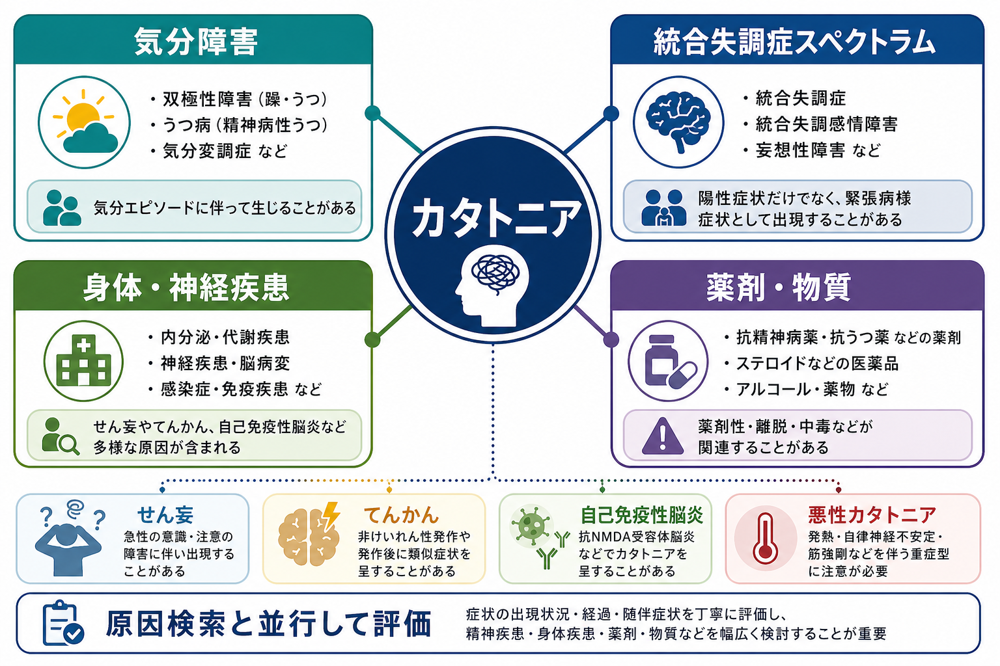
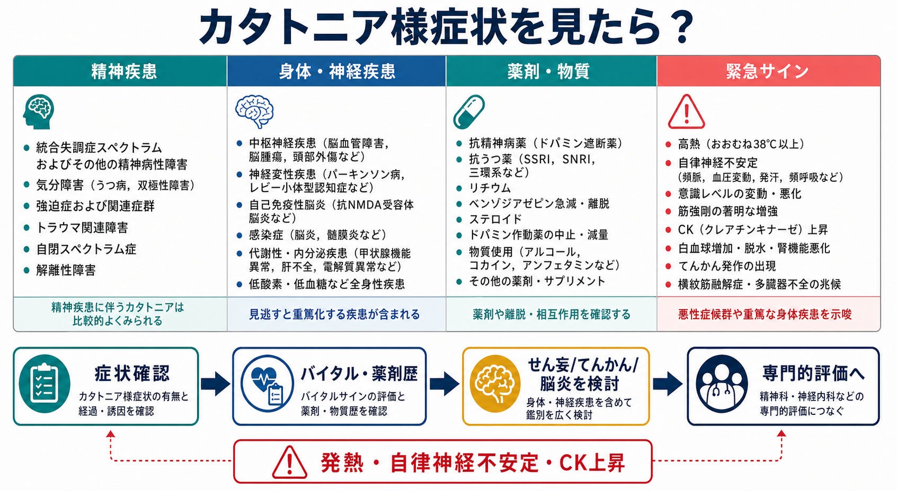

# カタトニアを伴う疾患には何があるのか

## 要点

- カタトニアは「統合失調症の一症状」だけではなく、気分障害、精神病性障害、身体・神経疾患、薬剤・物質、離脱状態にまたがって出現する症候群である[1][2]。
- DSM-5 系の考え方では、昏迷、カタレプシー、蝋屈症、無言、拒絶、姿勢保持、奇妙な姿勢、常同症、興奮、しかめ面、反響言語、反響動作などのうち複数を確認する[2]。
- 臨床的には、気分エピソード、統合失調症スペクトラム、せん妄、てんかん、自己免疫性脳炎、感染症、内分泌・代謝異常、薬剤性、悪性症候群を並行して考える[1][3]。
- 発熱、自律神経不安定、意識変容、脱水、栄養不良、CK 上昇、筋強剛がある場合は、悪性カタトニアや悪性症候群などの重篤な状態を念頭に置く[1][2]。
- 本稿は教育・研究目的の整理であり、個別の診断や治療指示ではない。

## この記事で答える問い

1. カタトニアはどのような疾患・状態に伴うのか。
2. 統合失調症、気分障害、身体疾患、薬剤性をどう見分けるのか。
3. どのような場合に、身体・神経疾患や救急的評価を強く疑うのか。
4. 「カタトニアらしさ」を確認した後、原因をどう層別化して考えるのか。

## まず結論

カタトニアを見たときの第一歩は、「精神疾患か身体疾患か」を二分法で決めることではない。カタトニアは、[[統合失調症とは何か|統合失調症]]、双極性障害や[[うつ病とは何か|うつ病]]などの気分障害、[[ICUせん妄とは何か|せん妄]]、[[てんかんに伴う精神症状とは何か|てんかん]]、自己免疫性脳炎、代謝・内分泌異常、感染症、薬剤・物質使用や離脱に伴って起こりうる[1][2][3]。

したがって実践的には、症状の型、時間経過、気分・精神病症状、意識水準、神経学的所見、バイタル、薬剤歴、物質使用歴、身体合併症を同時に見る。特に初発、急性発症、高齢発症、意識変容、発熱、けいれん、神経局在徴候、自律神経不安定を伴う場合は、身体・神経疾患を後回しにしない[1][3]。

## 背景

カタトニアは歴史的には統合失調症と強く結びつけられてきた。しかし現在の分類と臨床研究では、カタトニアは特定の診断名に閉じた症状ではなく、複数の精神疾患・身体疾患を横断する運動・行動・反応性の症候群として扱われる[1][5]。

この見方が重要なのは、見かけが似ていても背景が大きく異なるからである。たとえば、抑うつエピソードに伴う無動・無言、統合失調症スペクトラムに伴う緊張病様症状、抗精神病薬に関連する悪性症候群、抗 NMDA 受容体脳炎に伴う精神症状と運動異常は、観察される「動かない」「話さない」「拒絶する」という表面だけでは区別しにくい[1][3][6]。

## 基本概念

### カタトニアは症候群である

カタトニアは、運動、姿勢、発話、反応性、興奮、模倣・反響行動の異常がまとまって現れる状態である。代表的には、昏迷、無言、拒絶、蝋屈症、姿勢保持、常同症、興奮、反響言語、反響動作などが挙げられる[2]。

評価では、Bush-Francis Catatonia Rating Scale のような標準化された尺度が用いられることがある。尺度は診断そのものを自動化する道具ではないが、症状を漏れなく観察し、経過を追うための共通言語になる[4]。

### 主要な原因群

| 原因群 | 例 | 鑑別の手がかり |
|---|---|---|
| 気分障害 | うつ病、双極性障害、精神病性うつ病 | 気分エピソード、睡眠・食欲・活動性の変化、希死念慮、躁症状 |
| 統合失調症スペクトラム | 統合失調症、統合失調感情障害など | 幻覚・妄想、解体、陰性症状、長期経過 |
| 身体・神経疾患 | せん妄、てんかん、脳炎、感染症、内分泌・代謝異常 | 意識変容、急性発症、けいれん、発熱、神経学的所見 |
| 薬剤・物質 | 抗精神病薬、ベンゾジアゼピン離脱、アルコール・薬物、ステロイドなど | 開始・増量・中止・離脱、相互作用、中毒、離脱症状 |
| 重症型 | 悪性カタトニア、悪性症候群 | 発熱、自律神経不安定、筋強剛、CK 上昇、脱水、腎機能悪化 |

## 仕組み

カタトニアの機序は単一ではない。前頭葉、基底核、視床、辺縁系を含む運動・情動・行動制御ネットワークの変調、GABA、グルタミン酸、ドパミンなどの神経伝達の不均衡が関与すると考えられている[1][7]。ただし、これは「GABA が低いからカタトニアになる」といった単純な因果ではなく、複数の疾患過程が似た運動・反応性の表現型に収束するという理解が近い。

自己免疫性脳炎、とくに抗 NMDA 受容体脳炎では、精神症状、意識変容、けいれん、異常運動、自律神経症状とともにカタトニア様症状がみられることがある[6]。この例は、精神症状として見える状態が神経免疫学的過程と結びつきうることを示している。

## 図解

上の概念地図は、カタトニアを「疾患名」ではなく、複数の背景疾患が共有しうる症候群として読むための地図である。下のフローは、症状確認、バイタル・薬剤歴、せん妄・てんかん・脳炎の検討、専門的評価への接続という鑑別の流れを示す。

### 図解案: メカニズム

画像生成時に、メカニズム図では他ジョブ画像の混入があり、実在しても記事内容に合わない画像は採用しなかった。必要な場合は、次のプロンプトで再生成する。

> カタトニアの機序を示す日本語インフォグラフィック。中央に「前頭葉-基底核-視床回路」、周囲に「GABA」「グルタミン酸」「ドパミン」「気分エピソード」「炎症・免疫」「薬剤・物質」を配置し、右側に「無動・昏迷」「拒絶・緘黙」「興奮・常同」を示す。下部に「単一の原因ではなく、複数経路の収束として考える」と書く。

## 臨床・研究との接続

### 統合失調症との関係

統合失調症スペクトラムにカタトニアが伴うことはある。しかし、カタトニアを見た時点で統合失調症に決め打ちするのは危険である。精神病症状、陰性症状、病前機能、発症年齢、経過、気分症状の有無を合わせて評価する必要がある[1][5]。

### 気分障害との関係

カタトニアは気分障害、とくに重症うつ病や双極性障害の気分エピソードに伴って出現しうる。精神運動制止が強い抑うつ、昏迷に近い状態、躁状態に伴う興奮が、カタトニア症状と重なって見えることがある[1][5]。

### 身体・神経疾患との関係

身体・神経疾患を疑う手がかりは、急性発症、意識水準の変動、発熱、けいれん、頭痛、髄膜刺激症状、神経局在徴候、内分泌・代謝異常、感染症、脱水、栄養不良などである。せん妄では注意・意識の変動が中心になり、てんかんでは発作前後の意識変容や非けいれん性てんかん重積が問題になることがある[1][3]。

### 薬剤性・物質関連

抗精神病薬の開始・増量、ドパミン作動薬の中止、ベンゾジアゼピン離脱、アルコールや薬物の中毒・離脱、ステロイドなどは鑑別に入る。薬剤歴は「現在飲んでいる薬」だけでなく、最近の開始、中止、増量、減量、頓用、サプリメント、違法薬物、アルコール使用まで含めて確認する[1][2]。

## よくある誤解

### 誤解1: カタトニアは統合失調症にだけ起こる

現在の理解では、カタトニアは統合失調症だけに限定されない。気分障害、身体・神経疾患、薬剤・物質関連状態にも伴いうる[1][5]。

### 誤解2: 動かない人だけがカタトニアである

昏迷や無動は目立つが、カタトニアには興奮、常同症、反響言語、反響動作、姿勢保持、拒絶なども含まれる[2][4]。

### 誤解3: 精神症状が目立てば身体疾患は考えなくてよい

自己免疫性脳炎やせん妄、てんかん、代謝異常では、精神症状や行動変化が前景に立つことがある。精神症状が目立つことは、身体・神経疾患を除外する理由にならない[1][3][6]。

### 誤解4: 原因が分からないと評価できない

カタトニア症状の確認と原因検索は並行して行う。症状の有無、重症度、経過、身体リスク、薬剤歴を整理することで、原因が未確定でも危険度と優先順位を立てやすくなる[1][4]。

## 関連ノート

- [[統合失調症とは何か]]
- [[うつ病とは何か]]
- [[ICUせん妄とは何か]]
- [[てんかんに伴う精神症状とは何か]]
- [[薬物療法は神経回路にどう作用するのか]]
- [[ドパミン仮説は統合失調症をどこまで説明できるのか]]
- [[グルタミン酸仮説は統合失調症をどう説明するのか]]
- [[GABA機能低下は統合失調症にどう関わるのか]]

MOC 更新候補: 精神医学、疾患・症候群、せん妄・神経認知障害、精神薬理、神経免疫と精神症状。並列ジョブとの競合を避けるため、本タスクでは MOC 本体は更新しない。

## 理解チェック

1. カタトニアを統合失調症だけに結びつけると、どのような鑑別が抜け落ちるか。
2. 気分障害に伴うカタトニアを考えるとき、どのような気分エピソードを確認するか。
3. 発熱、自律神経不安定、CK 上昇がある場合、どのような重症状態を考えるか。
4. 薬剤歴を取るとき、「現在の処方」以外に何を確認すべきか。
5. せん妄、てんかん、自己免疫性脳炎を鑑別に入れる理由は何か。

## 参考文献

[1] Rogers JP, Oldham MA, Fricchione G, et al. Evidence-based consensus guidelines for the management of catatonia: Recommendations from the British Association for Psychopharmacology. *Journal of Psychopharmacology*. 2023;37(4):327-369. https://doi.org/10.1177/02698811231158232

[2] Jain A, Mitra P. *Catatonia*. StatPearls. Updated 2024. https://www.ncbi.nlm.nih.gov/books/NBK430842/

[3] World Health Organization. *ICD-11 for Mortality and Morbidity Statistics: Catatonia, secondary syndrome*. https://icd.who.int/browse/latest-release/mms/en

[4] Bush G, Fink M, Petrides G, Dowling F, Francis A. Catatonia. I. Rating scale and standardized examination. *Acta Psychiatrica Scandinavica*. 1996;93(2):129-136. https://doi.org/10.1111/j.1600-0447.1996.tb09814.x

[5] Solmi M, Pigato GG, Roiter B, et al. Prevalence of catatonia and its moderators in clinical samples: Results from a meta-analysis and meta-regression analysis. *Schizophrenia Bulletin*. 2018;44(5):1133-1150. https://doi.org/10.1093/schbul/sbx157

[6] Dalmau J, Lancaster E, Martinez-Hernandez E, Rosenfeld MR, Balice-Gordon R. Clinical experience and laboratory investigations in patients with anti-NMDAR encephalitis. *The Lancet Neurology*. 2011;10(1):63-74. https://doi.org/10.1016/S1474-4422(10)70253-2

[7] Northoff G. What catatonia can tell us about "top-down modulation": A neuropsychiatric hypothesis. *Behavioral and Brain Sciences*. 2002;25(5):555-577. https://doi.org/10.1017/S0140525X02000109

## 未解決問題

- カタトニアの生物学的機序を、疾患横断的な共通経路と疾患固有の経路にどこまで分けられるか。
- 気分障害、統合失調症スペクトラム、自己免疫性脳炎、薬剤性カタトニアを、早期に層別化する臨床指標は何か。
- 尺度評価、神経画像、脳波、免疫学的検査をどの順序で組み合わせると、過剰検査と見逃しのバランスが最もよくなるか。
