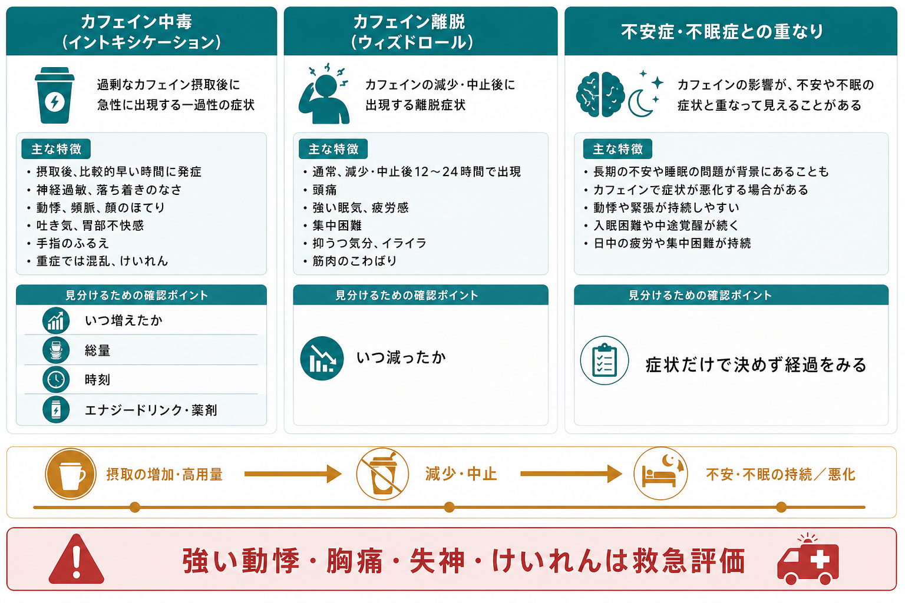
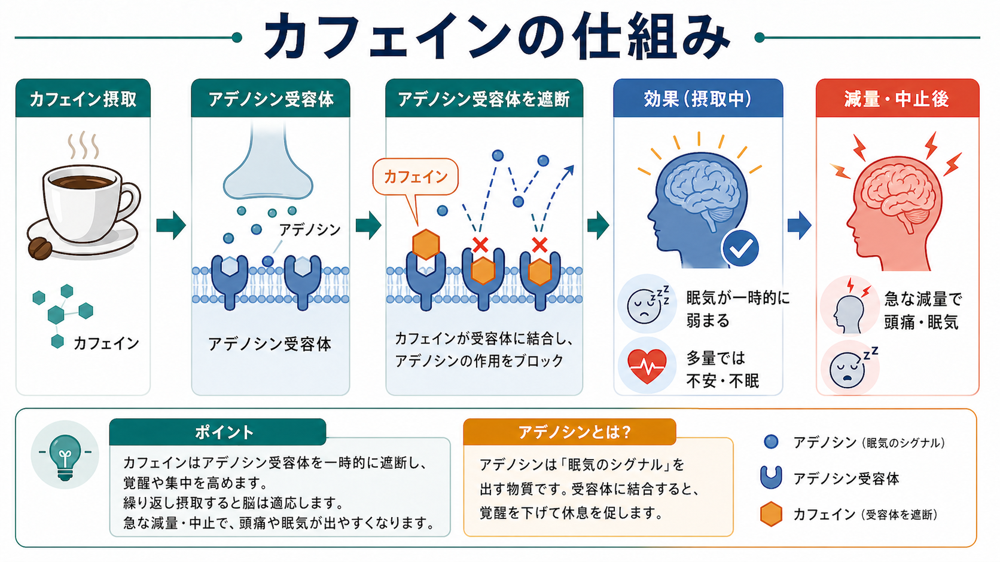

# カフェイン関連障害とは何か

## 要点

- カフェイン関連障害は、カフェインの摂取過多、急な減量・中止、または長期使用に伴う苦痛や機能障害を整理するための臨床概念である。
- 中心になるのは、摂取直後から起こる「カフェイン中毒」と、習慣的使用を急に減らした後に起こる「カフェイン離脱」である[1][2]。
- 症状は[[不安症群とは何か]]、[[パニック症とは何か]]、[[不眠障害とは何か]]、身体疾患、薬剤影響と重なりやすい。
- 評価では「何を、どれくらい、いつ、どの期間で増減したか」を聞く。エナジードリンク、サプリメント、鎮痛薬・感冒薬に含まれるカフェインも合算する[3][4]。
- これは教育・研究目的の整理であり、個別の診断や治療指示ではない。強い動悸、胸痛、失神、けいれん、意識変容などがある場合は緊急評価が必要になる。

## この記事で答える問い

1. カフェイン関連障害には、どのような状態が含まれるのか。
2. 過量摂取と離脱は、症状と時間経過でどう見分けるのか。
3. なぜカフェインは不安、不眠、動悸、頭痛、疲労を引き起こしうるのか。
4. 臨床・研究では、どのような点を確認すべきか。

## まず結論

カフェイン関連障害を理解する近道は、「摂取中に出る症状」と「減量・中止後に出る症状」を分けることである。多量摂取では、落ち着かなさ、神経過敏、不眠、頻尿、胃腸症状、筋肉のぴくつき、動悸などが前景に出やすい[1][3]。一方、習慣的な摂取を急に減らすと、頭痛、強い眠気・疲労、抑うつ気分、いらいら、集中困難などが出ることがある[2][6]。

## 背景

カフェインは、コーヒー、茶、エナジードリンク、コーラ、チョコレート、サプリメント、鎮痛薬や感冒薬などに含まれる、広く使われる中枢神経刺激物質である[3]。日常的な使用が多いため、症状の原因として見落とされやすい。

DSM-5系の整理では、カフェイン中毒とカフェイン離脱は臨床的に扱われる状態であり、カフェイン使用障害は「さらなる研究のための状態」として扱われてきた[1]。したがって、この記事でいう「カフェイン関連障害」は、単一の診断名というより、カフェインが不安・睡眠・身体症状・生活機能に関与する複数の状態をまとめて考える枠組みである。

## 基本概念

### カフェイン中毒

カフェイン中毒は、比較的多量のカフェイン摂取の後に、落ち着かなさ、神経過敏、興奮、不眠、顔面紅潮、利尿、胃腸症状、筋肉のぴくつき、思考や会話のまとまりにくさ、頻脈・不整脈感、精神運動性焦燥などが出る状態である[1][3]。

ここで重要なのは、摂取量の数字だけで機械的に決めないことである。健康な成人では1日400 mg程度までは一般に有害作用と関連しにくい目安として言及されるが、感受性、体重、妊娠、肝機能、併用薬、睡眠不足、不安の素因などで影響は大きく変わる[4][5]。

### カフェイン離脱

カフェイン離脱は、長く毎日摂取していた人が急に中止・減量した後に起こる。典型的には24時間以内に始まり、頭痛、著しい疲労・眠気、抑うつ気分またはいらいら、集中困難、インフルエンザ様症状、筋肉痛・こわばりなどがみられる[2][6]。

離脱は「カフェインが体に合わない」ことだけを意味しない。むしろ、習慣的摂取に脳と身体が適応していたため、急な変化に対して反動が出ると考えると理解しやすい。

### カフェイン使用障害

カフェイン使用障害は、カフェインを減らしたいのに減らせない、問題があると分かっていても使用を続ける、離脱を避けるために使用する、といったパターンに注目する研究診断である[1]。[[物質使用障害とは何か]]と似た観点を使うが、一般的な物質使用障害と同じ重みで扱うには、信頼性・妥当性・有病率についてさらなる研究が必要である[1]。

## 仕組み

カフェインの主要な作用は、脳内のアデノシン受容体を遮断することである[3]。アデノシンは覚醒が続くほど蓄積し、眠気や休息のシグナルとして働く。カフェインがこの受容体をふさぐと、眠気が一時的に弱まり、覚醒感や集中感が高まる。

ただし、同じ作用は過剰な覚醒にもつながる。交感神経系の活性化、心拍数の増加、胃酸分泌や胃腸運動への影響、利尿などが重なると、本人には「不安発作」「体調不良」「眠れない夜」として経験されることがある[3]。このため、[[全般不安症とは何か]]や[[不眠障害とは何か]]を評価するときにも、カフェイン量と摂取時刻は基本情報になる。

反復摂取では、身体がカフェインの存在に適応する。急な減量や中止でカフェインによる遮断が外れると、頭痛、眠気、疲労、集中困難が前景に出やすい[2][6]。カフェインの半減期は平均で約5時間とされるが、喫煙、妊娠、肝機能、CYP1A2に影響する薬剤などで大きく変わる[3]。

## 図解

| 観点 | カフェイン中毒 | カフェイン離脱 |
|---|---|---|
| きっかけ | 摂取量の増加、高濃度製品、短時間での摂取 | 習慣的摂取の急な中止・減量 |
| 時間経過 | 摂取中または摂取後に出やすい | 減量・中止後、しばしば24時間以内に出る |
| 主な症状 | 落ち着かなさ、不眠、動悸、胃腸症状、頻尿、筋肉のぴくつき | 頭痛、眠気、疲労、いらいら、抑うつ気分、集中困難 |
| 鑑別で重なるもの | [[パニック症とは何か]]、甲状腺機能亢進、薬剤性焦燥、[[中毒症状とは何か]] | 睡眠不足、感染症、片頭痛、抑うつ、[[離脱症状とは何か]] |
| 評価の焦点 | 総量、摂取時刻、製品濃度、併用薬、身体所見 | 減量幅、最後の摂取時刻、普段の量、生活機能への影響 |

## 臨床・研究との接続

臨床では、カフェイン関連障害を「診断名を先に決める」よりも、「症状の時間経過と摂取パターンを照合する」ほうが安全である。たとえば、午後から夜にかけてエナジードリンクを増やした後に不眠と動悸が出た場合と、長年のコーヒー摂取を急にやめた翌日に頭痛と眠気が出た場合では、同じ「調子が悪い」でも意味が異なる。

研究では、カフェイン使用障害の境界設定が課題である。カフェインは社会的に許容され、低から中等量では多くの人にとって大きな問題を生じない。一方で、一部の人では減量困難、離脱回避、身体・心理症状の悪化、睡眠障害との相互作用が生活機能に影響する[1][6]。この「よくある使用」と「臨床的に意味のある障害」の境界をどう測定するかが重要になる。

安全面では、粉末・高濃度液体カフェイン、複数製品の併用、エナジードリンクと他物質の併用、若年者、妊娠中、心血管疾患や重い不安症状のある人に注意が必要である[4][5]。

## よくある誤解

### 「カフェインは普通の飲み物だから、精神症状とは関係ない」

カフェインは日常的な食品成分であると同時に、中枢神経刺激物質でもある。睡眠、不安、動悸、胃腸症状、頭痛、疲労と関連しうるため、精神医学的評価では摂取歴を確認する価値がある[3]。

### 「カフェインをやめれば必ず良くなる」

急な中止は離脱症状を強めることがある。問題は「ゼロにするかどうか」だけではなく、量、時刻、速度、本人の感受性、併存症、生活リズムを合わせて見ることである[2][6]。

### 「不安症や不眠症なら、カフェインだけを見ればよい」

カフェインは症状を悪化させる要因になりうるが、[[不安症群とは何か]]や[[睡眠障害とは何か]]の原因をすべて説明するわけではない。症状が持続する場合は、睡眠習慣、ストレス、身体疾患、薬剤、他物質、精神疾患を含めて評価する。

## 関連ノート

- [[物質使用障害とは何か]]
- [[中毒症状とは何か]]
- [[離脱症状とは何か]]
- [[不安症群とは何か]]
- [[パニック症とは何か]]
- [[不眠障害とは何か]]
- [[睡眠障害とは何か]]
- [[物質使用歴はどのように聞くべきか]]

## MOC更新候補

- `content/00_MOC/` 配下の精神医学、物質関連障害、睡眠、不安に関するMOCへ追加候補。
- 並列ジョブとの衝突を避けるため、この作業ではMOC本文は更新しない。

## 理解チェック

1. カフェイン中毒とカフェイン離脱は、どの時間経過で区別できるか。
2. 不安や不眠を評価するとき、カフェインについて最低限どの情報を聞くべきか。
3. カフェインのアデノシン受容体遮断は、なぜ眠気の軽減と不眠・不安の両方につながりうるのか。
4. カフェイン使用障害が「研究診断」として慎重に扱われる理由は何か。

## 未解決問題

- カフェイン使用障害の診断閾値を、日常的使用の多さとどう切り分けるか。
- 遺伝的感受性、CYP1A2代謝、ADORA2A関連の個人差を臨床評価へどう組み込むか。
- エナジードリンク、サプリメント、粉末製品など、摂取形態の変化が若年者の不安・睡眠・身体症状に与える影響。
- カフェイン減量の最適なペースと、離脱症状を最小化する支援方法。

## 参考文献

[1] Meredith SE, Juliano LM, Hughes JR, Griffiths RR. (2013). Caffeine Use Disorder: A Comprehensive Review and Research Agenda. *Journal of Caffeine Research*, 3(3), 114-130. https://doi.org/10.1089/jcr.2013.0016

[2] Rocha Cabrero F, Hamilton RJ. Caffeine Withdrawal. *StatPearls*. NCBI Bookshelf. https://www.ncbi.nlm.nih.gov/books/NBK430790/

[3] Evans J, Richards JR, Battisti AS. Caffeine. *StatPearls*. NCBI Bookshelf. https://www.ncbi.nlm.nih.gov/books/NBK519490/

[4] U.S. Food and Drug Administration. Spilling the Beans: How Much Caffeine is Too Much? https://www.fda.gov/consumers/consumer-updates/spilling-beans-how-much-caffeine-too-much

[5] EFSA Panel on Dietetic Products, Nutrition and Allergies. (2015). Scientific Opinion on the safety of caffeine. *EFSA Journal*, 13(5), 4102. https://doi.org/10.2903/j.efsa.2015.4102

[6] Juliano LM, Griffiths RR. (2004). A critical review of caffeine withdrawal: empirical validation of symptoms and signs, incidence, severity, and associated features. *Psychopharmacology*, 176(1), 1-29. https://doi.org/10.1007/s00213-004-2000-x
