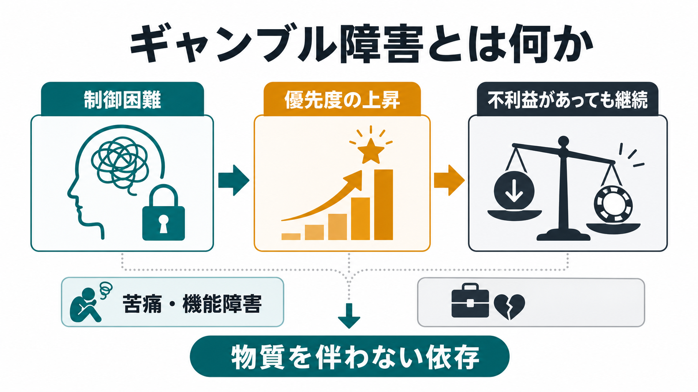
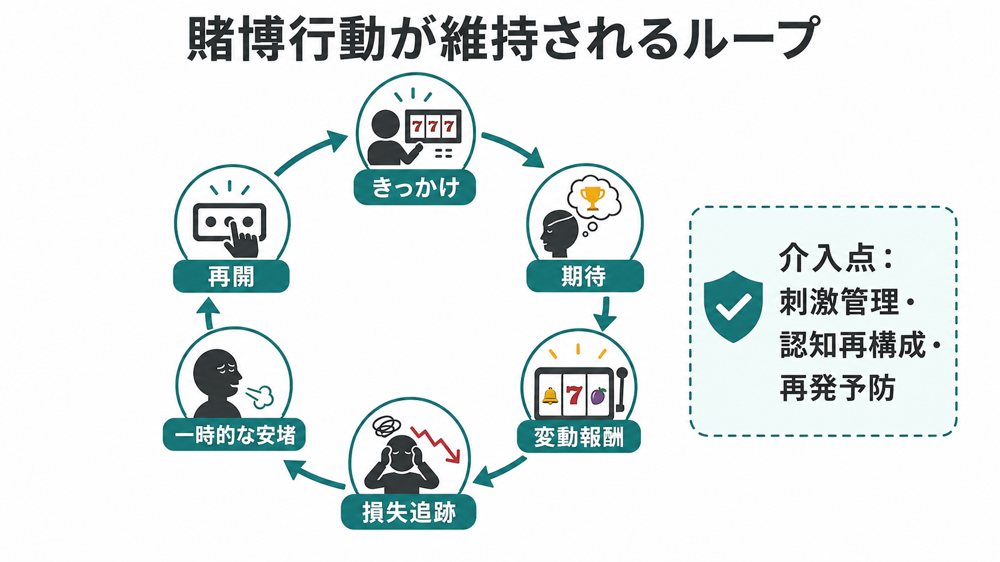

# ギャンブル障害とは何か

## 要点

- ギャンブル障害は、賭博行動そのものが生活の中心へ移り、やめたいと思っても制御しにくくなり、損失・対人問題・仕事や学業への支障があっても続いてしまう状態である[1][2]。
- DSM-5では、物質を摂取しないにもかかわらず依存症に近い臨床像と神経認知的特徴を示すため、「物質関連障害および嗜癖性障害群」の中の非物質関連障害として位置づけられた[2][3]。
- 中核には、[[報酬系とは何か]]、[[意思決定とは何か]]、[[認知バイアスとは何か]]、[[自己制御とは何か]]にまたがる問題がある。勝ち負けの記憶、ニアミス、損失追跡、短期的な安堵が、次の賭博行動を強めやすい[4][5]。
- 臨床的には「賭ける金額」だけでなく、制御困難、優先度の上昇、苦痛・機能障害、自殺リスク、併存する精神疾患・物質使用・神経疾患・薬剤影響を評価する必要がある[1][6]。
- 本記事は教育・研究目的の概説であり、個別の診断や治療指示ではない。生活上の危機、自傷・自殺念慮、深刻な債務や暴力リスクがある場合は、地域の専門機関や緊急支援につなぐ評価が必要である[6]。

## この記事で答える問い

1. ギャンブル障害は、単なる「遊びすぎ」や「意志の弱さ」と何が違うのか。
2. 物質を使わないのに、なぜ依存として理解されるのか。
3. 賭博行動は、どのような報酬学習・認知バイアス・感情調整によって維持されるのか。
4. 臨床・研究では、どのような評価点と支援の接点が重要になるのか。

## まず結論

ギャンブル障害とは、「賭博をするかしないか」を自由に選べる余地が狭まり、賭博が他の生活領域より優先され、損失や対人・職業上の不利益が明らかでも継続・再開してしまう状態である。ICD-11では、制御困難、賭博の優先度上昇、不利益があっても継続すること、そして苦痛または重要な機能障害が中心に置かれる[1]。DSM-5でも、12か月内の問題行動、損失追跡、隠蔽、関係・仕事・教育機会への支障、資金援助への依存などが評価される[2]。

重要なのは、ギャンブル障害を「借金の有無」だけで定義しないことである。借金が小さくても、賭博に多くの時間を使う、やめる試みが繰り返し失敗する、負けを取り戻そうとして賭けが大きくなる、気分の落ち込みや不安を紛らわせる手段になる、家族や支援者に隠す、といったパターンがあれば臨床的評価の対象になる[2][6]。

## 背景

賭博は、多くの人にとっては娯楽や社交活動で終わる。しかし一部では、勝ち負けの不確実性、即時報酬、オンライン化によるアクセスの容易さ、広告や環境刺激、社会的孤立やストレスが重なり、生活上の害を伴う反復行動へ変化する。世界的レビューでは、問題ギャンブルの推定率は国・調査方法・測定尺度によって大きく異なり、単一の有病率として単純化しにくいことが示されている[7]。

診断分類上の大きな転換は、ギャンブル障害が「衝動制御の障害」だけではなく、嗜癖の一形態として扱われるようになった点である。これは、賭博行動が[[依存症は報酬学習の病態としてどう理解できるのか]]、[[依存は学習の病態として説明できるのか]]と同じく、報酬予測、習慣化、渇望、制御困難、再発の問題を含むためである[3][4]。

## 基本概念

### 診断分類での位置づけ

ICD-11では、ギャンブル障害は「嗜癖行動による障害」に含まれ、オンライン・オフラインのどちらでも起こりうる。中心要素は、賭博の開始・頻度・強度・終了などを制御しにくいこと、他の生活上の関心や活動より賭博が優先されること、悪い結果が起きても継続または増悪することである[1]。このパターンは通常12か月程度観察されるが、重症で基準を満たす場合には短縮されうる[1]。

DSM-5では、ギャンブル障害は非物質関連障害として、物質使用障害と同じ大分類に置かれる。診断上は、耐性に似た賭け金増加、やめようとしたときの焦燥、制御失敗、没頭、苦痛時の賭博、損失追跡、隠蔽、重要な関係・仕事・教育機会の喪失、経済的救済への依存などが評価される[2]。また、躁病エピソードによって説明される過度な賭博とは区別する必要がある[2]。この点は[[双極I型障害とは何か]]や[[DSMとICDは何が違うのか]]とも接続する。

### 「問題ギャンブル」と「ギャンブル障害」

「問題ギャンブル」や「ギャンブル関連害」は、診断名より広い概念である。NICEは、ギャンブル関連害を、本人・家族・地域・社会の健康、資源、関係、仕事、債務、犯罪、家庭内暴力、自殺などに及ぶ悪影響として扱っている[6]。そのため、臨床や公衆衛生では、診断基準を満たすかどうかだけでなく、早期の害、家族など「影響を受ける人」、債務や安全確保も評価対象になる[6]。

## 仕組み

### 変動報酬と損失追跡

ギャンブルは、いつ報酬が得られるかが不確実な「変動報酬」の構造をもつ。報酬が毎回得られないからこそ、次は当たるかもしれないという期待が残りやすい。さらに、負けた直後に「取り戻す」ために賭けを続ける損失追跡が起こると、賭博は娯楽から損失回復の手段へ変わる[4][5]。

このとき問題になるのは、勝つ確率を冷静に計算できないことだけではない。ニアミスを「惜しかった」と解釈する、ランダムな結果に自分の技能や流れを読み込む、過去の負けが次の勝ちを保証するように感じる、といった[[認知バイアスとは何か]]が行動を支える[4][5]。

### 報酬系・認知制御・意思決定

神経科学的には、ギャンブル障害は単一の「快楽中枢」の異常ではなく、腹側線条体、腹内側前頭前野、島皮質、前頭線条体系、ドーパミン・オピオイド・グルタミン酸など複数の神経伝達系の関与として研究されてきた[4]。機能的画像研究のレビューでは、報酬・損失処理、ギャンブル手がかり、認知制御、リスク下の意思決定に関連する皮質線条体・辺縁系活動の差異が報告されている[5]。

ただし、脳画像所見は個人を診断する検査ではない。研究上の平均差は、発症前からの脆弱性、賭博経験による学習、併存症、薬剤、社会環境の影響を分けにくい。臨床では、脳部位名を原因として断定するより、[[意思決定とは何か]]、[[遅延割引とは何か]]、[[衝動性とは何か]]、[[自己制御とは何か]]に関わる複数過程として理解する方が実用的である。

### 感情調整としての賭博

ギャンブルは、興奮を求める行動であると同時に、不安、抑うつ、退屈、孤独、罪悪感、ストレスを一時的に下げる行動にもなりうる。短期的には気分が変わるため「役に立った」ように感じられるが、長期的には損失、隠蔽、対人葛藤、睡眠障害、債務が増え、さらに不快感が強まる。この負の強化は、賭博をやめにくくする重要な維持要因である[4][6]。

## 図解

| 図 | 読み方 |
|---|---|
| 図1 | 制御困難、優先度の上昇、不利益があっても継続、苦痛・機能障害、物質を伴わない依存という全体像を確認する。 |
| 図2 | きっかけ、期待、変動報酬、損失追跡、一時的な安堵、再開という維持ループを確認する。 |

図3を追加する場合は、診断分類、評価、心理社会的支援、家族・債務・自殺リスク対応を横断する臨床接続図が有用である。ただし今回は生成済み画像が2枚で要件を満たすため、存在しない画像リンクは挿入しない。

## 臨床・研究との接続

### 評価で見ること

評価では、賭けた金額だけでなく、頻度、時間、オンライン・オフラインの別、賭博の種類、借金、隠蔽、家族や仕事への影響、睡眠、身体健康、併存する不安・抑うつ・物質使用、ADHDや神経疾患、薬剤影響を確認する。NICEは、精神健康問題、自傷・自殺念慮、アルコール・物質依存、金融問題、ホームレスリスク、家庭内暴力や安全確保の問題がある場合に、ギャンブルについて直接尋ねることを推奨している[6]。自殺リスクは[[自殺リスク評価では何を聞くべきか]]と接続して考える。

### 支援と治療研究

心理社会的支援では、動機づけ面接、刺激管理、金銭アクセスの制限、認知再構成、再発予防、家族支援、債務相談、危機対応などが組み合わされる。認知行動療法系技法は有望だが、メタ解析では出版バイアスや異質性も指摘されており、すべての人に同じ効果が安定して期待できると断定するのは避けるべきである[8]。したがって研究・臨床では、どの介入が、どの重症度・併存症・環境条件の人に、どの程度有効かを分けて検討する必要がある。

薬物療法については、衝動性、渇望、併存する気分・不安・物質使用などを含めて研究されているが、ギャンブル障害そのものに対する標準的な単独薬物療法として単純化できる段階ではない。個別の治療選択は、専門家による評価、併存症、リスク、本人の価値観、地域資源を踏まえて検討される。

### 公衆衛生と環境設計

ギャンブル障害は個人の自己制御だけの問題ではない。オンライン化、広告、即時入金、24時間アクセス、スポーツやゲームとの接続、周囲から見えにくい利用環境は、行動を持続しやすくする。NICEは、ギャンブル関連害を本人だけでなく家族・社会にも及ぶ害として扱い、偏見、相談しにくさ、サービスへのアクセス、家族や「影響を受ける人」への支援を重視している[6]。

## よくある誤解

### 誤解1: 借金がなければ障害ではない

借金は重要な害だが、唯一の基準ではない。時間、心理的苦痛、隠蔽、仕事や学業の低下、家族関係、自殺リスク、生活の優先順位の変化も重要である[1][6]。

### 誤解2: 意志が強ければやめられる

自己決定は重要だが、ギャンブル障害では報酬学習、手がかり反応、認知バイアス、損失追跡、感情調整が絡み合う。支援では「叱る」よりも、きっかけを減らし、賭博以外の行動を増やし、金銭・アクセス・相談経路を具体化する方が実用的である[6][8]。

### 誤解3: 勝てば問題は解決する

勝ちは短期的な安堵をもたらすが、長期的には「次も勝てる」「取り戻せる」という学習を強めることがある。問題の中心は負けた金額だけでなく、賭博が生活を支配するパターンである[4][5]。

### 誤解4: 物質を使っていないので依存ではない

DSM-5でギャンブル障害が嗜癖性障害として扱われるのは、物質を摂取しなくても、渇望、制御困難、反復、再発、報酬処理や意思決定の変化がみられるためである[3][4]。ただし、物質使用障害と完全に同じという意味ではなく、共通点と相違点を分けて理解する必要がある。

## 関連ノート

- [[報酬系とは何か]]
- [[意思決定とは何か]]
- [[認知バイアスとは何か]]
- [[衝動性とは何か]]
- [[遅延割引とは何か]]
- [[自己制御とは何か]]
- [[行動変容はどのように起こるのか]]
- [[依存症は報酬学習の病態としてどう理解できるのか]]
- [[依存は学習の病態として説明できるのか]]
- [[自殺リスク評価では何を聞くべきか]]
- [[DSMとICDは何が違うのか]]

MOC更新候補: `content/00_MOC/` 配下の精神医学、嗜癖、臨床評価、学習・行動・動機づけ関連MOC。並列ジョブ衝突を避けるため、本記事作成時点ではMOC本体は更新しない。

## 理解チェック

1. ICD-11でギャンブル障害の中核とされる3要素は何か。
2. 「問題ギャンブル」と「ギャンブル障害」はどのように違うか。
3. 損失追跡は、なぜ賭博行動を維持しやすいのか。
4. 臨床評価で、賭けた金額以外に確認すべき点を3つ挙げよ。
5. ギャンブル障害を「意志の弱さ」だけで説明すると、どのような支援上の問題が生じるか。

## 未解決問題

- オンライン賭博、スポーツベッティング、ゲーム内課金、暗号資産取引などの境界領域をどのように評価するか。
- 報酬系・認知制御の研究知見を、個別の予防・治療選択へどこまで翻訳できるか。
- CBT、動機づけ面接、ピアサポート、家族支援、金融アクセス制限、政策的介入を、どの順序・強度で組み合わせるとよいか。
- 併存する抑うつ、不安、ADHD、双極症、物質使用、神経疾患、薬剤性衝動制御症状をどのように層別化するか。

## 参考文献

[1] World Health Organization. ICD-11 for Mortality and Morbidity Statistics, 6C50 Gambling disorder. https://icd.who.int/browse/2026-01/mms/en#1041487064

[2] Open RN. DSM-5 Criteria for Gambling Disorder. In: *Nursing: Mental Health and Community Concepts*, 2nd ed. NCBI Bookshelf, 2025. https://www.ncbi.nlm.nih.gov/books/NBK616955/box/ch14.box109/

[3] Sleczka P, Braun B, Piontek D, Bühringer G, Kraus L. DSM-5 criteria for gambling disorder: Underlying structure and applicability to specific groups of gamblers. *Journal of Behavioral Addictions*. 2015;4(4):226-235. https://doi.org/10.1556/2006.4.2015.035

[4] Potenza MN. Neurobiology of Gambling Behaviors. *Current Opinion in Neurobiology*. 2013;23(4):660-667. https://doi.org/10.1016/j.conb.2013.03.004

[5] Potenza MN. The neural bases of cognitive processes in gambling disorder. *Trends in Cognitive Sciences*. 2014;18(8):429-438. https://doi.org/10.1016/j.tics.2014.03.007

[6] National Institute for Health and Care Excellence. *Gambling-related harms: identification, assessment and management*. NICE guideline NG248. Published 28 January 2025. https://www.nice.org.uk/guidance/ng248

[7] Calado F, Griffiths MD. Problem gambling worldwide: An update and systematic review of empirical research (2000-2015). *Journal of Behavioral Addictions*. 2016;5(4):592-613. https://doi.org/10.1556/2006.5.2016.073

[8] Pfund RA, Forman DP, Whalen SK, et al. Effect of cognitive-behavioral techniques for problem gambling and gambling disorder: A systematic review and meta-analysis. *Addiction*. 2023;118(9):1661-1674. https://doi.org/10.1111/add.16221
