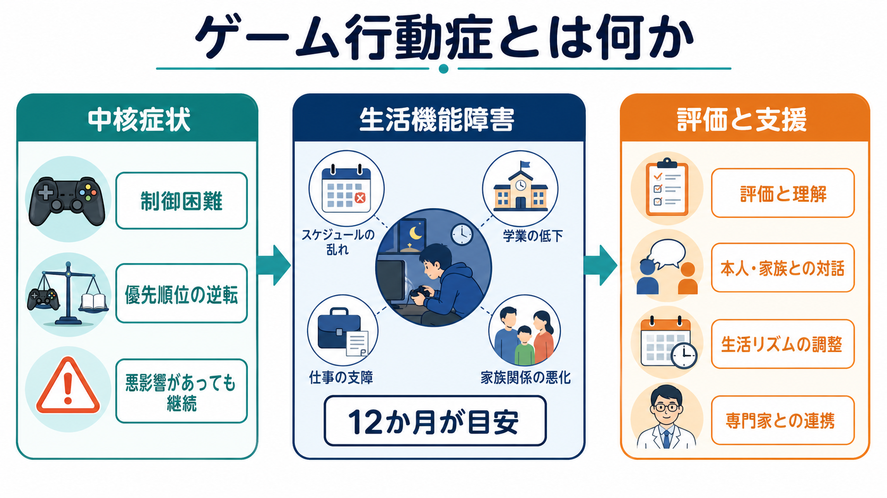
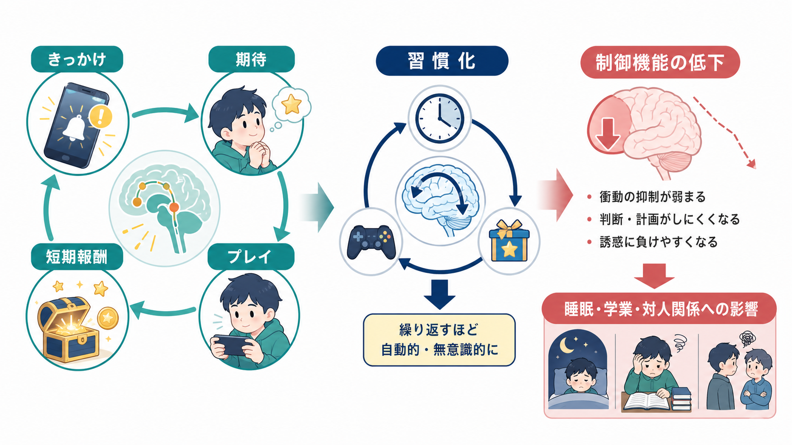
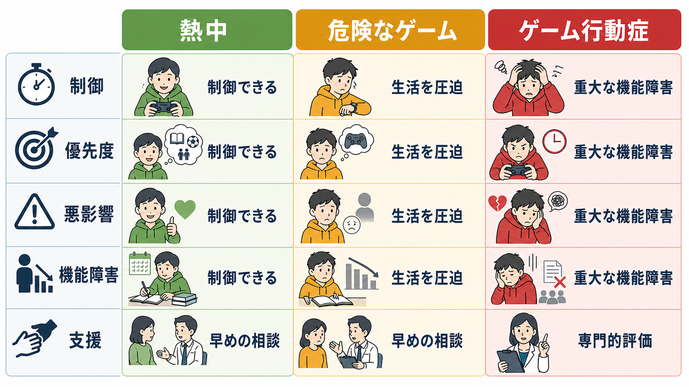

# ゲーム行動症とは何か

## 要点

- ゲーム行動症は、単に「ゲーム時間が長い」ことではなく、ゲームへの制御困難、生活上の優先順位の逆転、悪影響があっても継続すること、そして明確な生活機能障害を中核にする病態である[1]。
- ICD-11では、オンライン・オフラインを問わない「持続的または反復的なゲーム行動」として定義され、通常は少なくとも12か月の経過をみるが、重症で要件を満たす場合は短縮されうる[1][2]。
- DSM-5/DSM-5-TRでは、Internet Gaming Disorder は正式診断ではなく「今後の研究のための状態」として扱われる。したがって、ICD-11のゲーム行動症とDSMのインターネットゲーム障害は、近いが同一ではない[3]。
- 仕組みとしては、ゲーム内報酬、社会的承認、逃避・気分調整、習慣化、実行機能・抑制制御の低下が相互作用する。I-PACEモデルは、個人要因、情動、認知、実行機能の相互作用として説明する[6]。
- 支援では、ゲームを一律に禁止するよりも、睡眠、学業・仕事、対人関係、気分、不安、発達特性、家族関係を含めた評価と、現実生活の回復を中心に組み立てる必要がある[7][8]。

## この記事で答える問い

1. ゲーム行動症は、ゲーム好きや長時間プレイと何が違うのか。
2. ICD-11とDSMでは、ゲーム関連問題をどのように位置づけているのか。
3. なぜ「やめたいのにやめられない」「生活よりゲームが優先される」状態が起こるのか。
4. 臨床・研究では、どのような点を評価し、どのような支援につなげるのか。

## まず結論

ゲーム行動症とは、ゲームが生活の一部である状態ではなく、ゲームが生活全体の調整機能を奪っている状態である。診断概念の中心は「ゲーム時間」ではない。むしろ、ゲームを始める・終える・頻度や強度を調整する力が低下し、学校、仕事、睡眠、家族、友人関係、身体活動、金銭管理などが損なわれても、ゲームが優先され続ける点にある[1][2]。

この区別は重要である。競技ゲーム、創作、友人との交流、余暇活動としてのゲームは、それ自体で病的ではない。問題になるのは、本人が望む生活や発達課題を支える活動が狭まり、本人・家族・学校・職場の水準で明確な機能障害が生じている場合である。したがって評価では、プレイ時間だけでなく、制御困難、生活機能、苦痛、併存症、環境要因を組み合わせてみる。

## 背景

ゲームは現代の主要な娯楽、交流、競技、創作の場である。その一方で、一部の人ではゲーム行動が睡眠、学業、仕事、家庭内役割、対人関係を圧迫し、本人の努力だけでは制御しにくい状態になる。WHOはICD-11でゲーム行動症を「嗜癖行動による障害」の一つとして収載した[1][2]。これは、ゲームをする人全体を病理化するためではなく、臨床的に支援を必要とする少数のケースを見落とさないための分類である。

有病率の推定は研究方法に強く左右される。国際的なメタ分析では、世界全体のプール推定は約3.05%、より厳密な標本抽出に限定すると約1.96%と報告されたが、尺度、カットオフ、年齢、地域、サンプルの集め方によるばらつきが大きい[4]。つまり、「ゲーム行動症は非常に珍しい」とも「ゲームをする人の多くが該当する」とも単純には言えない。

日本でも、厚生労働省の補助事業としてゲーム依存・ネット依存の全国調査が実施されており、公衆衛生上の実態把握が進められている[8]。ただし、調査でのリスク群、スクリーニング陽性、臨床診断は同じ意味ではない。研究数値を読むときは、診断面接に基づくのか、自己記入式尺度なのか、どのカットオフなのかを確認する必要がある。

## 基本概念

### ICD-11のゲーム行動症

ICD-11のゲーム行動症は、オンラインまたはオフラインのゲーム行動について、次の3つがそろうことを重視する[1]。

| 中核特徴 | 内容 | 評価で見る例 |
|---|---|---|
| 制御困難 | 開始、頻度、強度、時間、終了、場面を調整できない | 「やめる予定だったのに朝まで続く」「試験前でも止められない」 |
| 優先順位の逆転 | 他の関心や日常活動よりゲームが優先される | 睡眠、登校、出勤、食事、対人関係が後回しになる |
| 悪影響があっても継続 | 問題を認識しても継続・増悪する | 欠席、成績低下、家族衝突、体調不良があっても変えられない |

さらに、個人、家族、社会、教育、職業などの重要領域で、著しい苦痛または機能障害があることが必要である[1][2]。このため、ゲーム行動症は「好きで長く遊ぶこと」とは区別される。

### 危険なゲームとの違い

ICD-11には、診断基準を満たすゲーム行動症とは別に、健康上のリスクが高まる「危険なゲーム」という概念もある。これは、頻度、時間、他活動の neglect、文脈、悪影響などによって健康リスクが増しているが、ゲーム行動症の診断要件までは満たさない場合に使われる[2]。

臨床的には、この区別は予防に役立つ。すでに機能障害が明確な場合は評価と治療的支援が必要になり、まだ診断域ではない場合でも、睡眠、学校・仕事、家族関係、課金、身体活動を整える助言が重要になる。

### DSMとの違い

DSM-5では Internet Gaming Disorder が Section III、つまり「さらなる研究が必要な状態」として記載された[3]。DSM案では9項目のうち5項目以上を満たすという形式が研究でよく使われるが、ICD-11は3つの中核特徴と機能障害をより簡潔に重視する。DSMは「インターネットゲーム」に焦点が寄り、ICD-11はオンライン・オフラインを問わないゲーム行動として整理する点も異なる[1][3]。

この違いは、[[DSMとICDは何が違うのか]]と接続して理解するとよい。DSM研究での「IGD」と、ICD-11での「ゲーム行動症」は重なり合うが、研究対象、尺度、カットオフが違えば、同じ人々を指しているとは限らない。

## 仕組み

ゲーム行動症を一つの原因だけで説明するのは不十分である。多くの場合、ゲーム側の設計、本人の情動調整、報酬学習、社会的承認、睡眠リズム、発達特性、家族・学校・職場環境が絡み合う。

### 報酬学習と習慣化

ゲームは、短い間隔で達成、報酬、レベル上昇、ランダム報酬、仲間からの承認、ランキング、期間限定イベントを提示する。これらは、行動の直後に強化が返ってくる学習環境を作る。報酬が予測できる場合だけでなく、予測しきれない場合にも行動は維持されやすい。この点は[[報酬系とは何か]]、[[報酬予測誤差とは何か]]、[[依存は学習の病態として説明できるのか]]とつながる。

最初は「楽しいから遊ぶ」だった行動が、次第に「不安、退屈、孤独、失敗感を避けるために遊ぶ」へ移ることがある。すると、ゲームは快感を得る手段であると同時に、不快感を下げる手段になる。この二重の強化が、やめにくさを強める。

### 制御機能と実行機能

I-PACEモデルでは、依存的なインターネット使用は、個人要因、情動反応、認知バイアス、実行機能の相互作用として整理される[6]。ゲーム関連刺激を見るとプレイへの期待や渇望が高まり、短期報酬の価値が大きく見え、長期的な損失を評価しにくくなる。ここに抑制制御や意思決定の弱まりが重なると、「明日困るとわかっているのに続ける」という状態が起こりやすい。

この説明は、ゲーム行動症を本人の意志の弱さだけに還元しないために有用である。ただし、神経画像や心理実験の知見は集団レベルの傾向であり、個々の診断や治療方針を単独で決めるものではない。

### 睡眠・気分・発達特性との相互作用

ゲーム行動が夜間に偏ると、睡眠不足、概日リズムの後退、日中の注意低下、欠席・遅刻が生じやすい。これは[[不眠障害とは何か]]、[[概日リズム睡眠覚醒障害とは何か]]、[[精神科診察で睡眠をどう評価するか]]と接続する。

また、うつ、不安、ADHD、自閉スペクトラム特性、孤立、いじめ、家庭内葛藤が背景にある場合、ゲームは現実の苦痛を一時的に軽くする退避先として機能することがある。したがって、ゲーム行動だけを切り離して評価すると、[[うつ病とは何か]]、[[不安症群とは何か]]、[[ADHDは前頭線条体回路の障害として説明できるのか]]のような併存・背景要因を見落とす。

## 図解

3枚の図は、記事の読み方に対応している。

1. 1枚目は、ゲーム行動症の全体像を「制御困難」「優先順位の逆転」「悪影響があっても継続」「生活機能障害」として整理する。
2. 2枚目は、きっかけ、期待、プレイ、短期報酬、習慣化、制御機能低下の循環を示す。
3. 3枚目は、熱中、危険なゲーム、ゲーム行動症を区別し、臨床的な判断が「時間」だけではなく「機能障害」と「支援の必要性」に基づくことを示す。

## 臨床・研究との接続

### 評価で確認すること

評価では、次のような領域を分けて確認する。

| 領域 | 確認する問い |
|---|---|
| ゲーム行動 | いつ、どこで、何を、何時間、どのような目的でプレイするか |
| 制御困難 | やめる予定を守れるか、制限しても反動が出るか |
| 機能障害 | 睡眠、食事、学業、仕事、家族、友人、金銭、身体活動への影響 |
| 情動調整 | 不安、抑うつ、怒り、孤独、退屈を下げるために使っているか |
| 併存・背景 | ADHD、うつ、不安、発達特性、いじめ、家庭内葛藤、ひきこもり |
| 保護因子 | ゲーム以外の達成感、友人、運動、学習支援、家族の協力 |

ここで重要なのは、本人と家族の語りが食い違うことを前提にすることである。本人は「大丈夫」と言い、家族は「生活が崩れている」と言う場合がある。反対に、家族がゲーム時間だけを問題視し、本人には別の苦痛がある場合もある。面接では、対立を勝ち負けにせず、機能障害と回復したい生活を共通の指標にする。

### 支援の方向

治療研究は増えているが、介入研究の数、質、追跡期間には限界がある。2024年のメタ分析では、治療介入には全体として効果が示唆される一方、小規模研究やバイアスの問題があり、どの介入がどの人に最適かはまだ十分に確立していない[7]。そのため、現時点では単一の技法だけでなく、本人の生活機能、併存症、家族・学校・職場環境を合わせて支援を組み立てる必要がある。

実践上は、次のような多面的支援が使われる。

- 睡眠・起床・食事・身体活動を整える。
- ゲームの使用状況を記録し、きっかけと結果を見える化する。
- ゲーム以外の達成感、所属感、休息手段を増やす。
- 家族が監視と叱責だけに偏らないよう、ルール作りと対話の形を調整する。
- 学校・職場・福祉・医療をつなぎ、欠席、退学、離職、孤立の二次的悪化を防ぐ。
- うつ、不安、ADHD、睡眠障害などがある場合は、それ自体を評価し支援する。

日本では久里浜医療センターがインターネット・ゲーム依存に関する専門的情報や治療プログラムを公開しており、認知行動療法、生活リズム、運動、家族支援などを組み合わせる実践が紹介されている[8]。

## よくある誤解

### 誤解1：長時間ゲームをすれば、すべてゲーム行動症である

違う。長時間プレイはリスク評価の入口にはなるが、診断概念の中心は制御困難、優先順位の逆転、悪影響があっても継続、生活機能障害である[1]。競技、創作、配信、友人関係の一部としてゲームをしていても、生活機能が保たれ、本人が柔軟に調整できるなら、ただちに病態とは言えない。

### 誤解2：ゲーム行動症は本人の甘えである

制御困難や習慣化には、報酬学習、情動調整、実行機能、環境設計が関わる[6]。もちろん本人の選択や責任を完全に消す必要はないが、「甘え」とだけ呼ぶと、睡眠障害、うつ、不安、発達特性、孤立、家庭内葛藤などの介入可能な要因を見落とす。

### 誤解3：ゲームを完全に取り上げれば解決する

急な遮断が一時的に必要な場面もあるが、単純な禁止だけでは、対立、隠れ使用、家庭内暴力、登校・就労のさらなる悪化につながることがある。支援の目標は、ゲーム時間を減らすことだけではなく、睡眠、学習、仕事、対人関係、身体活動、気分調整の選択肢を回復することである。

### 誤解4：ゲーム行動症はゲーム会社やゲーム文化だけの問題である

ゲーム設計は重要な環境要因である。しかし、同じゲームでも全員がゲーム行動症になるわけではない。本人の脆弱性、ストレス、生活環境、家族関係、学校・職場の適応、併存症、社会的孤立が重なったときにリスクが高まる。したがって、公衆衛生、教育、家族支援、臨床支援、ゲームデザインの議論を分けずに考える必要がある。

## 関連ノート

- [[DSMとICDは何が違うのか]]
- [[ギャンブル障害とは何か]]
- [[依存症は報酬学習の病態としてどう理解できるのか]]
- [[依存は学習の病態として説明できるのか]]
- [[報酬系とは何か]]
- [[報酬予測誤差とは何か]]
- [[衝動性とは何か]]
- [[不眠障害とは何か]]
- [[概日リズム睡眠覚醒障害とは何か]]
- [[精神科診察で睡眠をどう評価するか]]
- [[うつ病とは何か]]
- [[不安症群とは何か]]
- [[ADHDは前頭線条体回路の障害として説明できるのか]]

## MOC更新候補

- `content/00_MOC/MOC｜精神医学.md`
- `content/00_MOC/MOC｜脳・神経科学.md`
- `content/00_MOC/MOC｜認知科学・心理学.md`

並列実行時の競合を避けるため、本記事作成時点ではMOC本体は更新していない。

## 理解チェック

1. ゲーム行動症を、単なる長時間プレイと区別する最も重要な指標は何か。
2. ICD-11のゲーム行動症と、DSMのInternet Gaming Disorderはどの点で違うか。
3. ゲーム行動が「快感を得る手段」から「不快感を避ける手段」になると、どのような悪循環が起こりやすいか。
4. 評価で、ゲーム時間以外に確認すべき生活領域を3つ挙げよ。
5. 支援で、ゲームの禁止だけに頼らず整えるべき生活要素は何か。

## 未解決問題

- ICD-11基準に基づく診断面接と、自己記入式スクリーニング尺度の対応関係は、まだ標準化の余地が大きい。
- 青年期、成人期、女性、神経発達特性をもつ人、ひきこもり状態にある人で、同じ基準がどの程度妥当かはさらに検討が必要である。
- ゲーム設計、課金、オンラインコミュニティ、eスポーツ、配信文化がリスクと保護因子の両方になりうる点を、より精密に扱う研究が必要である。
- CBT、家族療法、学校・職場支援、デジタルツールを組み合わせた介入の長期効果について、質の高い比較研究が不足している。

## 参考文献

[1] World Health Organization. Gaming disorder. WHO frequently asked questions. https://www.who.int/standards/classifications/frequently-asked-questions/gaming-disorder

[2] World Health Organization. Inclusion of “gaming disorder” in ICD-11. 2018. https://www.who.int/news/item/14-09-2018-inclusion-of-gaming-disorder-in-icd-11

[3] American Psychiatric Association. Internet Gaming Disorder. DSM-5 Collection. 2013. https://www.psychiatry.org/File%20Library/Psychiatrists/Practice/DSM/APA_DSM-5-Internet-Gaming-Disorder.pdf

[4] Stevens, M. W. R., Dorstyn, D., Delfabbro, P. H., & King, D. L. (2021). Global prevalence of gaming disorder: A systematic review and meta-analysis. *Australian & New Zealand Journal of Psychiatry, 55*(6), 553-568. https://doi.org/10.1177/0004867420962851

[5] Kuss, D. J., Griffiths, M. D., & Pontes, H. M. (2017). DSM-5 diagnosis of Internet Gaming Disorder: Some ways forward in overcoming issues and concerns in the gaming studies field. *Journal of Behavioral Addictions, 6*(2), 133-141. https://doi.org/10.1556/2006.6.2017.032

[6] Brand, M., Young, K. S., Laier, C., Wölfling, K., & Potenza, M. N. (2016). Integrating psychological and neurobiological considerations regarding the development and maintenance of specific Internet-use disorders: An Interaction of Person-Affect-Cognition-Execution (I-PACE) model. *Neuroscience & Biobehavioral Reviews, 71*, 252-266. https://doi.org/10.1016/j.neubiorev.2016.08.033

[7] Danielsen, P. A., Mentzoni, R. A., & Låg, T. (2024). Treatment effects of therapeutic interventions for gaming disorder: A systematic review and meta-analysis. *Addictive Behaviors, 149*, 107887. https://doi.org/10.1016/j.addbeh.2023.107887

[8] 厚生労働省. ゲーム依存（ゲーム行動症）・ネット依存の全国調査について. https://www.mhlw.go.jp/stf/seisakunitsuite/bunya/0000149274_00002.html ; 久里浜医療センター. インターネット依存治療部門: 情報ボックス. https://kurihama.hosp.go.jp/hospital/section/internet/information-box.html
