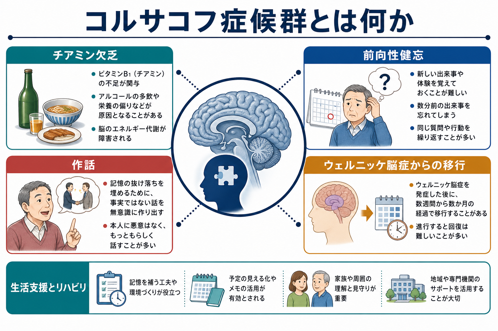
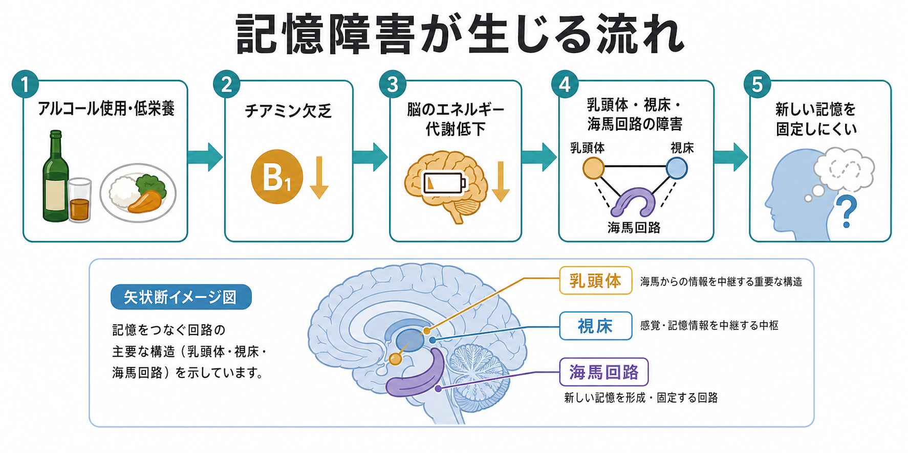
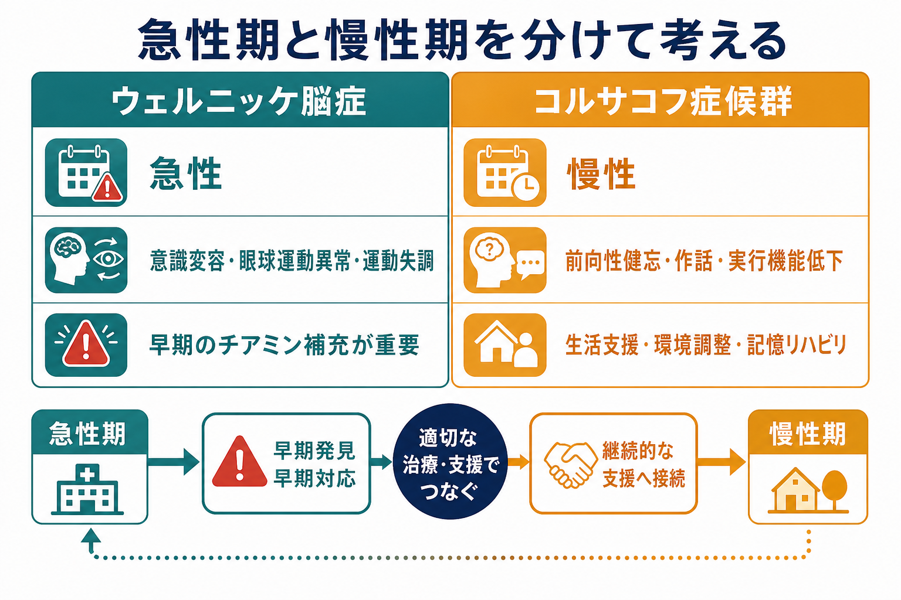

# コルサコフ症候群とは何か

## 要点

- コルサコフ症候群は、主にチアミン（ビタミンB1）欠乏に関連して生じる、持続性の健忘症候群である。
- 中核は、新しい出来事を覚えにくい前向性健忘であり、近時記憶の抜け落ちを埋めるように[[作話とは何か|作話]]がみられることがある。
- 典型的にはウェルニッケ脳症の後遺症として理解されるが、急性期のウェルニッケ脳症は見逃されやすい。
- 記憶障害は、乳頭体、視床、海馬系を含む記憶回路の障害と関係する。
- 治療論では「個別の治療指示」ではなく、早期発見、チアミン欠乏への対応、断酒支援、環境調整、記憶リハビリを組み合わせて考える。

## この記事で答える問い

この記事では、コルサコフ症候群を「アルコールで記憶が悪くなる」という一文で済ませず、何が欠乏し、どの脳回路が傷つき、どのような[[記憶障害とは何か|記憶障害]]として現れ、臨床・支援では何を区別すべきかを整理する。

## まず結論

コルサコフ症候群は、重いチアミン欠乏の後に残る慢性の神経精神症候群として理解するのが実用的である。アルコール使用は最も重要な背景の一つだが、病態の直接的な軸は「アルコールそのもの」だけではなく、低栄養、吸収障害、肝疾患、嘔吐、身体疾患などを含むチアミン欠乏である[1][2]。

臨床像の中心は、意識が比較的清明で会話も成立するのに、新しい出来事を保持できない点である。本人は数分前の説明、面会、約束を覚えていないことがあり、その空白を悪意なくもっともらしい話で補うことがある。これは嘘というより、記憶と自己理解の破綻が会話の形で表れたものとして扱う必要がある[1][3]。

## 背景

ウェルニッケ脳症とコルサコフ症候群は連続して語られることが多い。ウェルニッケ脳症は急性のチアミン欠乏性脳症で、古典的には意識変容、眼球運動異常、運動失調の三徴が知られる。ただし三徴がそろう例は多くなく、診断はしばしば難しい[4][5]。そのため、急性期が「酩酊」「せん妄」「栄養不良」「内科疾患」として見過ごされ、後に持続的な健忘が前景化してコルサコフ症候群として認識されることがある。

Caineらの操作的基準では、食事欠乏、眼球運動異常、小脳機能障害、意識変容または軽い記憶障害のうち複数をみることで、従来の三徴のみよりウェルニッケ脳症を拾いやすくする発想が示された[6]。この点は、[[せん妄とは何か|せん妄]]や急性の意識障害と、慢性に残る健忘症候群を分けて考えるうえで重要である。

## 基本概念

コルサコフ症候群の記憶障害は、[[健忘とは何か|健忘]]のなかでも前向性健忘が目立つ。つまり、病前のすべての記憶が消えるというより、新しく経験した出来事をエピソードとして固定しにくい。遠い過去の記憶が比較的保たれる一方で、最近の出来事や時間順序、誰から聞いた情報かといった文脈記憶が障害されやすい[3][7]。

一方で、すべての認知機能が同程度に壊れるわけではない。注意、即時記憶、会話能力、手続き的な学習の一部は相対的に保たれることがある[3][7]。そのため、短い面接では「しっかり話せている」ように見え、実際の生活場面で予定、服薬、金銭、飲酒、受診継続が崩れて初めて問題が明らかになることがある。評価では[[認知機能検査は何を測っているのか|認知機能検査]]だけでなく、生活史、物質使用歴、栄養状態、家族・支援者からの情報を合わせて読む必要がある。

作話は、コルサコフ症候群を象徴する症状として有名だが、常に劇的に出るわけではない。問われたときに空白を補う誘発性作話が多く、急性期にはより自発的で奇異な作話がみられることもある[1][3]。ここで重要なのは、作話を「虚言」と同一視しないことである。本人は記憶の欠損を自覚しにくく、会話の整合性を保つために、その時点で利用できる断片から説明を作っている場合がある。

## 仕組み

チアミンは脳のエネルギー代謝に関わる補酵素であり、欠乏すると代謝需要の高い神経組織が障害を受けやすい。ウェルニッケ・コルサコフ関連病態では、乳頭体、視床、第三脳室周囲、中脳水道周囲、小脳虫部などがしばしば問題になる[2][4]。記憶の観点では、乳頭体、乳頭体視床路、前視床核、内側側頭葉、[[海馬回路は記憶をどう形成するのか|海馬回路]]を含むネットワークが重要である[1][3][7]。

記憶は単一の箱ではない。[[エピソード記憶とは何か|エピソード記憶]]、[[意味記憶とは何か|意味記憶]]、[[手続き記憶とは何か|手続き記憶]]は、重なりながらも異なる処理を担う。コルサコフ症候群では、特に新しいエピソードを「いつ・どこで・誰から・どの文脈で」経験したかとして結びつける能力が弱くなる[7]。その結果、本人は断片的な知識や一般的な推測を使って答えられても、直近の具体的な出来事を再構成できない。

また、前頭葉系の実行機能、意欲低下、病識低下、感情の平板化や易刺激性が併存することもある[1]。このため、単なる記憶補助具の導入だけでは不十分で、環境の構造化、反復学習、エラーを起こしにくい手順設計、支援者との連携が必要になる。

## 図解

急性期のウェルニッケ脳症と、慢性期のコルサコフ症候群は、時間軸を分けて考えると理解しやすい。急性期では意識変容や運動失調、眼球運動異常の見逃しを避けることが重要で、慢性期では前向性健忘、作話、実行機能低下、生活上の安全確保が前面に出る。

## 臨床・研究との接続

臨床では、コルサコフ症候群は[[器質性精神病とは何か|器質性精神障害]]、アルコール関連認知障害、認知症、[[解離性健忘とは何か|解離性健忘]]、頭部外傷、てんかん、肝性脳症などと鑑別される。短時間の診察で本人の会話だけを頼りにすると、記憶障害の重さを過小評価しやすい。[[MSEで認知機能をどう評価するか|精神状態診察]]では、見当識、遅延再生、直近の出来事、情報源の記憶、病識、日常生活上の失敗を具体的にみる。

介入は、教育・研究目的で一般論として述べれば、急性期にはチアミン欠乏を疑って迅速に対応すること、慢性期には断酒支援、栄養管理、身体合併症の評価、心理社会的支援、環境調整を組み合わせることが基本になる[2][5]。ただし、ここでの記述は個別の診断や治療指示ではない。実際の対応は、身体状態、飲酒状況、栄養状態、併存疾患、地域資源に応じて医療専門職が判断する。

研究面では、コルサコフ症候群は「記憶が一枚岩ではない」ことを示す古典的なモデルでもある。前向性エピソード記憶が重く障害される一方で、即時記憶や一部の潜在学習が比較的残ることは、[[長期記憶とは何か|長期記憶]]の下位システムを考える手がかりになってきた[7]。また、[[視床は単なる中継核なのか|視床]]や乳頭体が、単なる中継点ではなく、記憶の文脈化と検索に深く関わることを考える入口にもなる。

## よくある誤解

**「アルコールで脳が萎縮しただけ」という理解は粗い。**  
アルコール使用は大きなリスクだが、コルサコフ症候群の中核にはチアミン欠乏とウェルニッケ脳症後の残遺障害がある。非アルコール性の低栄養や吸収障害でも関連病態は起こりうる[1][4]。

**「作話は嘘である」とは限らない。**  
作話は、記憶の欠損、病識低下、文脈記憶の障害が会話のなかで表れたものとして理解する。倫理的には、責めるよりも、記録、環境、支援者間の情報共有で失敗を減らすほうが実用的である。

**「話せるから生活も大丈夫」とは限らない。**  
会話能力が保たれていても、予定、金銭、服薬、火の管理、飲酒再開リスクなどは大きく崩れることがある。[[認知機能障害とは何か|認知機能障害]]は、検査室内の点数だけでなく生活機能として評価する必要がある。

## 関連ノート

- [[記憶障害とは何か]]
- [[健忘とは何か]]
- [[作話とは何か]]
- [[せん妄とは何か]]
- [[エピソード記憶とは何か]]
- [[意味記憶とは何か]]
- [[手続き記憶とは何か]]
- [[海馬回路は記憶をどう形成するのか]]
- [[視床は単なる中継核なのか]]
- [[器質性精神病とは何か]]
- [[物質使用歴はどのように聞くべきか]]
- [[認知機能検査は何を測っているのか]]

## MOC更新候補

- `content/00_MOC/MOC｜認知機能.md`
- 精神医学領域の疾患・症候群 MOC が統合ジョブで更新される場合、本記事を「アルコール関連認知障害」「器質性精神障害」「記憶障害」の近くに配置する。

## 今後の作成候補

- ウェルニッケ脳症とは何か
- アルコール関連認知障害とは何か
- チアミン欠乏と脳代謝
- 乳頭体視床路と記憶
- エラーなし学習と記憶リハビリ

## 理解チェック

1. コルサコフ症候群の中核症状は、単なる物忘れではなく何と呼ばれる健忘か。
2. ウェルニッケ脳症の古典的三徴がそろわない場合、なぜ見逃しが起こりやすいか。
3. 作話を「嘘」と決めつけると、支援上どのような問題が起こるか。
4. 乳頭体、視床、海馬回路は、新しい記憶のどの側面に関わると考えられるか。
5. 慢性期支援で、記憶補助具だけでなく環境調整が必要になる理由は何か。

## 参考文献

[1] Arts, N. J. M., Walvoort, S. J. W., & Kessels, R. P. C. (2017). Korsakoff’s syndrome: a critical review. *Neuropsychiatric Disease and Treatment*, 13, 2875-2890. https://doi.org/10.2147/NDT.S130078

[2] Akhouri, S., Kuhn, J., & Newton, E. J. (2023). Wernicke-Korsakoff Syndrome. *StatPearls*. NCBI Bookshelf. https://www.ncbi.nlm.nih.gov/sites/books/NBK430729/

[3] Kopelman, M. D., Thomson, A. D., Guerrini, I., & Marshall, E. J. (2009). The Korsakoff syndrome: clinical aspects, psychology and treatment. *Alcohol and Alcoholism*, 44(2), 148-154. https://doi.org/10.1093/alcalc/agn118

[4] Sechi, G., & Serra, A. (2007). Wernicke’s encephalopathy: new clinical settings and recent advances in diagnosis and management. *The Lancet Neurology*, 6(5), 442-455. https://doi.org/10.1016/S1474-4422(07)70104-7

[5] Galvin, R., Bråthen, G., Ivashynka, A., Hillbom, M., Tanasescu, R., & Leone, M. A. (2010). EFNS guidelines for diagnosis, therapy and prevention of Wernicke encephalopathy. *European Journal of Neurology*, 17(12), 1408-1418. https://doi.org/10.1111/j.1468-1331.2010.03153.x

[6] Caine, D., Halliday, G. M., Kril, J. J., & Harper, C. G. (1997). Operational criteria for the classification of chronic alcoholics: identification of Wernicke’s encephalopathy. *Journal of Neurology, Neurosurgery & Psychiatry*, 62(1), 51-60. https://doi.org/10.1136/jnnp.62.1.51

[7] Fama, R., Pitel, A.-L., & Sullivan, E. V. (2012). Anterograde episodic memory in Korsakoff syndrome. *Neuropsychology Review*, 22(2), 93-104. https://doi.org/10.1007/s11065-012-9207-0
