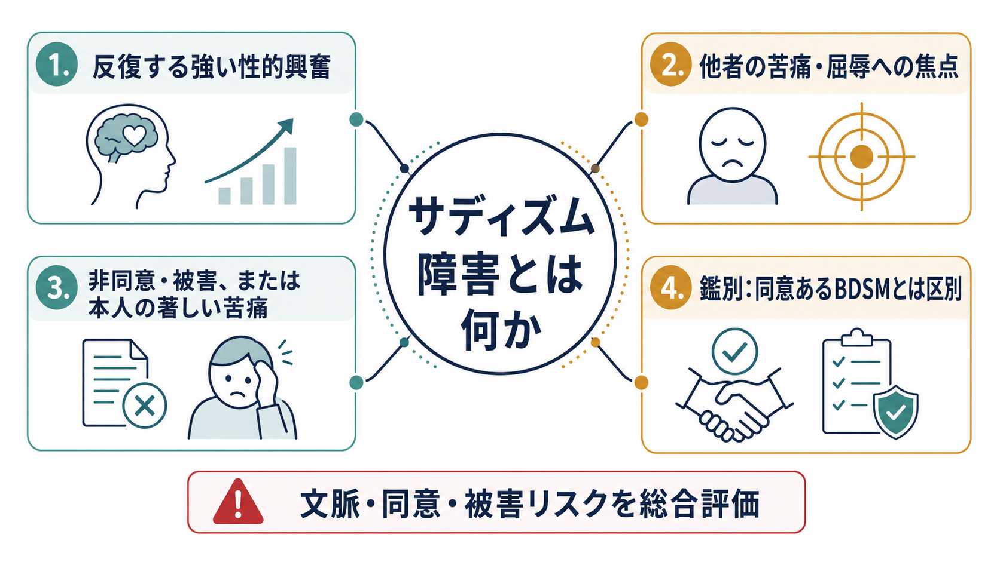
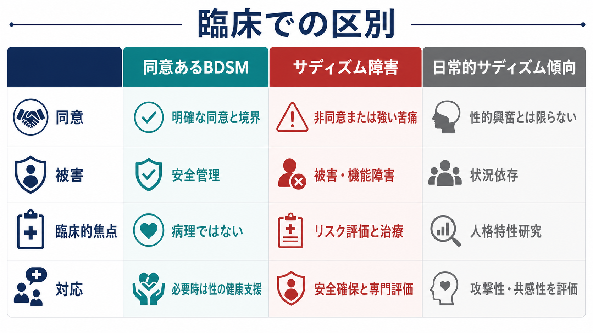
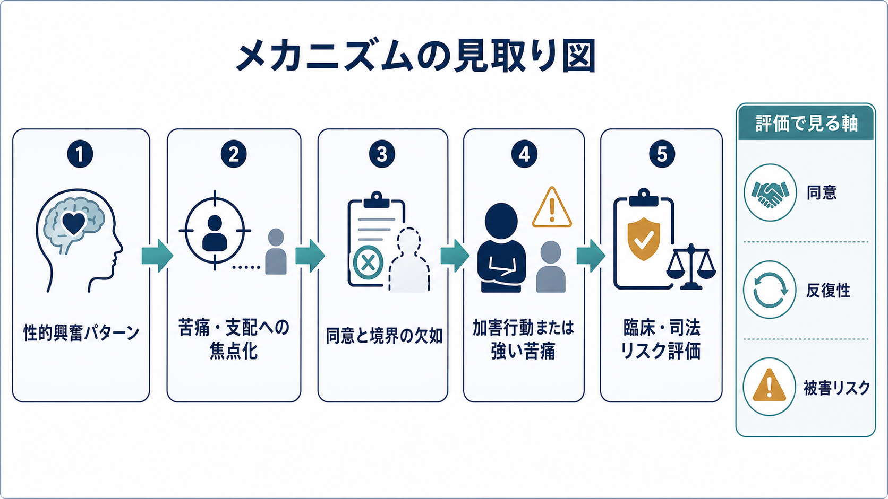

# サディズム障害とは何か

## 要点

- サディズム障害は、他者の心理的・身体的苦痛に結びついた反復的で強い性的興奮があり、非同意の相手に行動化した、または本人に著しい苦痛・機能障害を生じている場合に問題となるパラフィリア障害である[1][2]。
- 「変わった性的嗜好」だけでは精神障害ではない。DSM-5-TR以降の枠組みでは、非典型的な性的関心と、苦痛・機能障害・他者被害を伴うパラフィリア障害を区別する[1][3]。
- ICD-11では、非同意の相手に苦痛を与える性的興奮パターンを中心に「強制性性的サディズム障害」として整理し、同意ある性的サディズムやマゾヒズムを明示的に除外する[2]。
- 臨床・司法場面では、自己申告だけに依存せず、行動履歴、同意の有無、被害リスク、併存する[[反社会性パーソナリティ障害とは何か]]、物質使用、トラウマ歴などを統合して評価する[4][5]。
- 治療研究は限られる。実務上は、認知行動療法的アプローチ、再発予防、リスク管理、必要時の薬物療法、司法・福祉との連携が組み合わされるが、個別の診断や治療指示として単純化してはならない[6][7]。

## この記事で答える問い

1. サディズム障害は、一般的な「サディスティックな性格」や同意あるBDSMとどう違うのか。
2. DSM-5-TRとICD-11では、何を診断上の中核に置いているのか。
3. 他者の苦痛、支配、同意の欠如、性的興奮はどのようにつながるのか。
4. 臨床・司法場面で、どのような評価と安全確保が必要になるのか。

## まず結論

サディズム障害を理解する中心は、「苦痛に性的興奮するかどうか」だけではなく、「それが非同意の相手への被害、または本人の著しい苦痛・機能障害として現れているか」である。DSM-5-TRでは、少なくとも6か月続く反復的で強い性的興奮が、他者の心理的・身体的苦痛に由来し、さらに非同意の相手に行動化した、または本人の臨床的苦痛・機能障害を伴うことが診断の骨格になる[1][3]。

したがって、同意ある成人間のBDSMやロールプレイは、それ自体では障害を意味しない。問題は、相手の同意、予測可能性、安全管理、境界設定が欠け、被害や強制につながる場合である[2][4]。臨床的には、性的関心の内容だけで人を分類するのではなく、行動化の履歴、被害リスク、衝動性、共感性、併存症、生活環境、司法的文脈を含む多面的な評価が必要になる[5][6]。

## 背景

パラフィリアとは、典型的ではない対象・状況・行為に向けられる持続的で強い性的関心を指す。しかし、パラフィリアがあることと、パラフィリア障害であることは同じではない。精神医学の分類では、本人の著しい苦痛・機能障害、または他者への害やそのリスクがある場合に「障害」として扱う方向へ整理されてきた[1][3]。

サディズム障害は、とくに司法精神医学と性医学の接点で重要になる。非同意の被害、性的暴力、反復性、虚偽申告や否認の可能性、診断名が法的処遇に影響する可能性があるためである。レビュー研究では、性的サディズムの定義・操作化・測定方法が研究間で大きく異なり、過剰診断と過少診断の両方が問題になると指摘されている[4][8]。

## 基本概念

### 性的サディズムとサディズム障害

性的サディズムは、他者の苦痛、屈辱、恐怖、支配される状況などに性的興奮が結びつく関心や行動を指す。サディズム障害は、その関心が臨床的に問題となる水準、すなわち非同意の相手に行動化した、または本人の苦痛・機能障害を生じている状態を指す[1][3]。

この区別は重要である。性の関心が非典型的であることだけで病理化すると、同意ある性的実践や性的少数者の経験まで不当に障害化してしまう。一方で、非同意の被害や強制を「嗜好」として矮小化すると、被害者の安全と司法・臨床上の責任を見落とす。

### DSM-5-TRの考え方

DSM-5-TRの診断枠組みでは、他者の心理的・身体的苦痛から反復的で強い性的興奮を得ることが中核であり、それが6か月以上持続すること、そして非同意の相手への行動化、または本人の著しい苦痛・機能障害を伴うことが重視される[1][3]。また、管理された環境にいるか、寛解状態かといった指定も行われる[3]。

### ICD-11の考え方

ICD-11では「強制性性的サディズム障害」として、非同意の相手に身体的・心理的苦痛を与えることに焦点化した持続的で強い性的興奮パターンを扱う。診断には、その思考・空想・衝動を行動化しているか、それらにより著しい苦痛を感じていることが必要とされる。ICD-11は、同意ある性的サディズムやマゾヒズムを除外する点を明確にしている[2]。

### 関連概念との違い

| 概念 | 中核 | 障害とみなす条件 |
|---|---|---|
| 同意あるBDSM | 成人間の合意、境界、安全管理を伴う性的実践 | それ自体では障害ではない |
| 性的サディズム障害 | 他者の苦痛に結びつく強い性的興奮 | 非同意への行動化、または本人の著しい苦痛・機能障害 |
| 日常的サディズム傾向 | 他者の不快や支配を楽しむ人格特性研究上の概念 | 性的興奮を必ずしも含まず、診断名ではない |
| 性的暴力 | 非同意の性的加害行為 | 動機は多様で、全例がサディズム障害ではない |

## 仕組み

サディズム障害の機序は、単一の原因で説明できない。研究上は、性的興奮パターン、攻撃性、支配欲求、共感・罪悪感の処理、衝動性、反社会性、過去の学習歴、状況的要因が複合して関与すると考えられる[4][5]。

1つの見取り図としては、まず他者の苦痛や恐怖が性的興奮の手がかりとして学習・強化される。次に、相手の同意や境界を尊重する抑制が弱い場合、空想や衝動が非同意の行動へ移行しやすくなる。さらに、[[物質使用障害とは何か]]、衝動性、[[反社会性パーソナリティ障害とは何か]]、孤立、怒り、ストレスなどが加わると、行動化リスクが高まる可能性がある[5][6]。

神経科学研究もあるが、現時点では診断に使える単独の脳指標はない。小規模fMRI研究では、性的サディズムをもつ犯罪者群で、他者の痛み画像に対する扁桃体や前部島皮質の反応差が報告されている[7]。ただし、こうした知見は集団平均の研究であり、個人の診断、責任能力、将来の加害予測を単独で決める根拠にはならない。

## 図解

図解の読み方は、次の3点にまとめられる。

- 1枚目は、診断概念を「性的興奮パターン」「苦痛・屈辱への焦点」「非同意・被害」「BDSMとの区別」に分けて整理している。
- 2枚目は、性的興奮パターンが、同意と境界の欠如、行動化、臨床・司法リスク評価へつながる流れを示している。
- 3枚目は、同意あるBDSM、サディズム障害、日常的サディズム傾向を混同しないための比較表である。

## 臨床・研究との接続

### 評価

評価では、性的空想や興奮の内容だけでなく、実際の行動、相手の同意、被害の有無、反復性、被害者への接近可能性、衝動制御、物質使用、他の精神疾患、認知機能、生活環境を確認する。パラフィリアの評価では、自己申告の限界が大きいため、面接、記録、関係者情報、行動チェックリスト、必要に応じた専門的検査を組み合わせることが推奨される[5]。

ただし、評価は「危険人物かどうか」を直感で判定する作業ではない。リスクは、固定的な属性だけでなく、接近機会、ストレス、物質使用、監督環境、治療関係、保護因子によって変動する。[[PTSDとは何か]]などのトラウマ関連症状が併存する場合も、被害経験の理解と加害リスク評価を混同せず、別々に丁寧に扱う必要がある。

### 治療とリスク管理

治療研究は十分ではなく、性的サディズム障害に特化した強固なエビデンスは限られる[4][6]。実務上は、認知行動療法、再発予防、性的興奮パターンへの対処、同意と境界の学習、怒り・衝動・物質使用の管理、社会的孤立の改善、安全計画、司法・福祉機関との連携が組み合わされる[3][6]。

薬物療法は、性的衝動や併存症の評価に基づいて検討されることがあるが、本人の状態、法的枠組み、倫理、同意、身体的副作用を含めた専門的判断が必要である[3][6]。この記事は教育・研究目的の整理であり、個別の診断や治療方針を示すものではない。

### 研究上の課題

研究では、性的サディズムの操作的定義が一貫しないこと、サンプルが司法・矯正場面に偏ること、自己申告の信頼性に限界があること、治療研究が少ないことが課題である[4][8]。また、性的暴力のすべてをサディズム障害で説明することはできない。動機には、支配、怒り、機会、物質使用、反社会性、性認知の歪み、環境要因などがあり、サディズム障害はその一部のケースに関わる概念である[4][5]。

## よくある誤解

### 誤解1: サディズム障害は「残酷な性格」と同じである

同じではない。サディズム障害は、他者の苦痛に結びつく性的興奮パターンと、非同意の被害または本人の著しい苦痛・機能障害が問題になる診断概念である。一般的な冷酷さ、怒りっぽさ、支配的態度だけで診断されるものではない[1][3]。

### 誤解2: BDSMをする人はサディズム障害である

同意ある成人間のBDSMは、それ自体ではサディズム障害ではない。DSMとICDの現在の枠組みでは、同意、境界、安全管理、被害の有無が重要である[2][3]。

### 誤解3: 性的暴力の加害者は全員サディズム障害である

性的暴力の動機は多様であり、全員がサディズム障害に該当するわけではない。レビュー研究では、性的サディズムの評価には慎重な操作化と複数情報源の統合が必要だとされる[4][5]。

### 誤解4: 脳画像や検査で簡単に見分けられる

現時点では、サディズム障害を単独で診断できる脳画像・血液検査・心理検査はない。研究知見は有用だが、臨床判断では行動、同意、被害、リスク、併存症、保護因子を統合する必要がある[5][7]。

## 関連ノート

- [[反社会性パーソナリティ障害とは何か]]
- [[物質使用障害とは何か]]
- [[PTSDとは何か]]

## 関連ノート候補

- パラフィリア障害とは何か
- 同意あるBDSMと精神医学
- 司法精神医学における性的暴力リスク評価
- 性的同意とは何か
- 日常的サディズム傾向とは何か

## MOC更新候補

- `content/00_MOC/` 配下に精神医学、司法精神医学、パラフィリア障害、性とメンタルヘルスに関するMOCがある場合、本記事へのリンク追加を検討する。
- 並列生成ジョブとの競合を避けるため、この時点ではMOC本体は更新しない。

## 理解チェック

1. サディズム障害と同意あるBDSMを分ける最重要の軸は何か。
2. DSM-5-TRの枠組みで、性的サディズムが「障害」となる条件は何か。
3. ICD-11で「強制性」という語が強調しているのはどの点か。
4. 性的暴力の加害を、すべてサディズム障害として説明してはいけない理由は何か。
5. 評価で自己申告だけに依存できないのはなぜか。

## 未解決問題

- 性的サディズム障害の境界を、同意ある性的実践、日常的サディズム傾向、反社会性、性的暴力の各概念からどこまで明確に分けられるか。
- 司法・矯正サンプルに偏らない研究を、倫理的にどのように設計できるか。
- 治療効果を、再犯率だけでなく、本人の苦痛、同意理解、生活機能、安全行動、保護因子の変化としてどう測定するか。
- 神経科学的知見を、個人の診断や法的責任に過剰適用しないための臨床・司法上の基準をどう整えるか。

## 参考文献

[1] American Psychiatric Association. (2022). *Diagnostic and Statistical Manual of Mental Disorders, Fifth Edition, Text Revision (DSM-5-TR)*. American Psychiatric Association Publishing. https://doi.org/10.1176/appi.books.9780890425787

[2] World Health Organization. (2026). ICD-11 for Mortality and Morbidity Statistics: 6D33 Coercive sexual sadism disorder. https://icd.who.int/browse/2026-01/mms/en#1890228613

[3] Merck Manual Professional Edition. (2025). Sexual Sadism Disorder. https://www.merckmanuals.com/professional/psychiatric-disorders/paraphilias-and-paraphilic-disorders/sexual-sadism-disorder

[4] Mokros, A., Wessels, J., Hofmann, M., & Nitschke, J. (2019). Coercive Sexual Sadism: a Systematic Qualitative Review. *Current Psychiatry Reports, 21*(12), 135. https://doi.org/10.1007/s11920-019-1118-9

[5] Seto, M. C., Kingston, D. A., & Bourget, D. (2014). Assessment of the paraphilias. *Psychiatric Clinics of North America, 37*(2), 149-161. https://doi.org/10.1016/j.psc.2014.03.001

[6] Liu, A., Zhang, E., Leroux, E. J., & Benassi, P. (2022). Sexual Sadism Disorder and Coercive Paraphilic Disorder: A Scoping Review. *The Journal of Sexual Medicine, 19*(3), 496-506. https://doi.org/10.1016/j.jsxm.2022.01.002

[7] Harenski, C. L., Thornton, D. M., Harenski, K. A., Decety, J., & Kiehl, K. A. (2012). Increased frontotemporal activation during pain observation in sexual sadism: preliminary findings. *Archives of General Psychiatry, 69*(3), 283-292. https://doi.org/10.1001/archgenpsychiatry.2011.1566

[8] First, M. B. (2014). DSM-5 and Paraphilic Disorders. *Journal of the American Academy of Psychiatry and the Law, 42*(2), 191-201. https://jaapl.org/content/42/2/191
