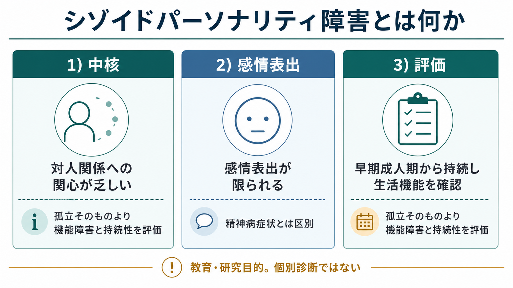
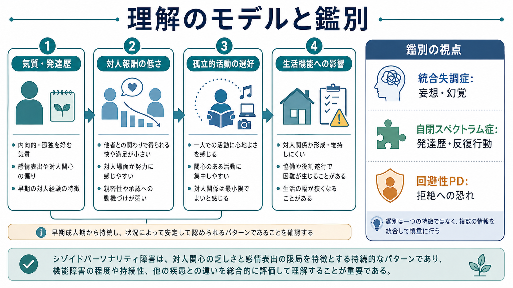

# シゾイドパーソナリティ障害とは何か

## 要点

- シゾイドパーソナリティ障害は、親密な対人関係への関心の乏しさ、孤立的活動の選好、感情表出の限局を中核とする、持続的な対人・感情のパターンである[1][3]。
- 単なる内向性、孤独好き、少人数志向とは異なり、早期成人期から複数の状況で持続し、対人関係・学業・仕事・生活機能にどの程度影響しているかを評価する[1][3]。
- 妄想や幻覚などの精神病症状は中核ではない。[[統合失調症とは何か]]、[[統合失調症の陰性症状とは何か]]、[[統合失調型パーソナリティ障害とは何か]]、[[自閉スペクトラム症とは何か]]、[[回避性パーソナリティ障害とは何か]]との鑑別が重要である[3][4]。
- ICD-11 では従来型の個別パーソナリティ障害名よりも、パーソナリティ機能の重症度と「離隔 detachment」などの特性ドメインで記述する方向が強い[2]。
- 支援では、本人が苦痛としていない孤立を無理に矯正するより、本人の目標、併存症、生活の安定、対人摩擦の低減を中心に考える[3][4]。

## この記事で答える問い

1. シゾイドパーソナリティ障害は、どのような対人・感情のパターンなのか。
2. 「人付き合いが少ない」「内向的」と、臨床的な障害はどこが違うのか。
3. 統合失調症、自閉スペクトラム症、回避性パーソナリティ障害とはどう鑑別するのか。
4. 研究・臨床では、診断名だけでなく何を評価すべきか。

## まず結論

シゾイドパーソナリティ障害は、「人が嫌い」という単純な状態ではない。中心にあるのは、対人関係から得られる満足や動機づけが低く、感情表出が少なく見え、孤立的活動が自然な選択になりやすいという、長期にわたるパターンである[1][3]。

ただし、孤立していること自体が直ちに病理ではない。診断的に重要なのは、本人の文化的背景、発達歴、対人経験、現在の生活機能、併存する抑うつ・不安・精神病症状・神経発達症の有無を合わせて、持続的で広範な機能障害があるかをみる点である[1][4]。この意味で、[[精神科診断における除外診断とは何か]]や[[鑑別診断とは何か]]の考え方が基盤になる。

## 背景

DSM-5-TR では、シゾイドパーソナリティ障害はパーソナリティ障害のうち Cluster A、すなわち「奇妙・風変わり」に見えやすい群に位置づけられる[1]。同じ Cluster A には、[[妄想性パーソナリティ障害とは何か]]と[[統合失調型パーソナリティ障害とは何か]]が含まれる。

一方、ICD-11 は個別カテゴリを並べるより、パーソナリティ機能の障害の程度と、顕著な特性ドメインを組み合わせて記述する。そこでシゾイド的な臨床像は、しばしば「離隔 detachment」、すなわち社会的距離と情緒的距離を保つ傾向として理解される[2]。この変化は、[[カテゴリ診断と次元診断は何が違うのか]]を考えるうえでもよい例である。

疫学研究では、シゾイドパーソナリティ障害の頻度推定は研究方法によりばらつく。米国の大規模疫学研究をもとにした臨床解説では中央値 0.9%、研究によっては 3% 程度までの推定が示される[3][6]。ただし、この障害単独を対象にした実証研究は多くなく、診断の信頼性、併存症、機能障害、文化差にはなお不確実性が残る[5][7]。

## 基本概念

DSM-5-TR 系の説明では、シゾイドパーソナリティ障害は、親密な関係への欲求や楽しみの乏しさ、孤立的活動の選好、他者からの称賛や批判への無関心、情緒的冷淡さや平板な感情表出などで特徴づけられる[1][3]。これらは単独の癖ではなく、複数の生活場面にまたがる持続的パターンとして評価される。

臨床上は、次の三つを分けると理解しやすい。

| 観点 | シゾイド的特徴 | 評価で見る点 |
|---|---|---|
| 対人関心 | 親密な関係や集団参加への関心が乏しい | 望まない孤立か、本人にとって自然な選好か |
| 感情表出 | 喜び、怒り、親密さの表出が少なく見える | 抑うつ、薬剤、神経疾患、文化差で説明できないか |
| 生活機能 | 学業、仕事、家族関係、支援利用が狭まりやすい | どの程度の困難・損失・リスクがあるか |

ここで重要なのは、外から見える「冷たさ」と本人の内的体験が一致するとは限らない点である。臨床解説では、まれに安心できる場面では対人場面の痛みや困難を語ることがあるとされる[3]。そのため、[[精神科診断面接で尺度をどう使うか]]だけでなく、生活史と文脈を丁寧に扱う必要がある。

## 仕組み

シゾイドパーソナリティ障害の機序は、単一の脳部位や単一の心理要因では説明できない。現在は、気質、遺伝的脆弱性、発達歴、養育環境、対人学習、社会的報酬への感受性、併存症が重なって、対人関係への動機づけや感情表出のパターンを形成すると考えるのが妥当である[4][5]。この見方は、[[生物心理社会モデルとは何か]]に近い。

研究レビューでは、Cluster A パーソナリティ障害には統合失調症スペクトラムとの連続性を示唆する議論がある一方、シゾイドパーソナリティ障害そのものについては研究量が少ない[5][7]。したがって、「統合失調症の軽い形」と短絡するのは不正確である。妄想・幻覚・思考の解体が前景に出る場合は、[[統合失調症の陽性症状とは何か]]や精神病性障害の評価を優先する[3][4]。

## 図解

1枚目の図は、シゾイドパーソナリティ障害を「対人関係への関心」「感情表出」「評価」の三つに分けている。孤立そのものではなく、持続性、生活機能、除外診断を総合してみる点が要点である。

2枚目の図は、気質・発達歴、対人報酬の低さ、孤立的活動の選好、生活機能への影響を連続的に示している。右側の鑑別欄にあるように、統合失調症では妄想・幻覚、自閉スペクトラム症では発達歴と反復行動、回避性パーソナリティ障害では拒絶への恐れを丁寧に確認する。

## 臨床・研究との接続

臨床評価では、まず「本人が困っているか」だけでなく、「周囲だけが困っているのか」「本人は困っていないが生活機能が狭まっているのか」「二次的な抑うつや不安が出ているのか」を分ける必要がある[3][4]。パーソナリティ障害では、本人にとってそのあり方が自然で、問題として自覚されにくいことがある。

治療研究は限られており、シゾイドパーソナリティ障害に対する薬物療法や心理療法の確立した単独プロトコルは乏しい[3][5]。実践上は、併存する[[うつ病とは何か]]、不安症、物質使用、精神病症状、自殺リスク、生活困窮などを評価し、本人が望む目標に沿って支援を組む。無理に親密な関係を増やすのではなく、本人が耐えられる距離感のなかで、生活の安定、対人摩擦の減少、必要な支援への接続を目指す。

研究面では、診断カテゴリだけでなく、社会的報酬、感情表出、孤立、生活機能、QOL を次元的に測ることが重要である。人口研究では、パーソナリティ障害が生活の質の低下と関連することが示されており、シゾイド的特徴も単なる性格記述ではなく、機能とウェルビーイングの観点から検討する必要がある[8]。

## よくある誤解

**誤解1: 人付き合いが苦手ならシゾイドパーソナリティ障害である。**  
そうではない。内向性、少人数志向、文化的背景、職業上の生活様式、発達特性、一時的なストレス反応だけでは診断できない。持続性、広がり、機能障害、除外診断を確認する[1][3]。

**誤解2: シゾイドパーソナリティ障害は統合失調症と同じである。**  
同じではない。シゾイドパーソナリティ障害では、妄想や幻覚、著しい思考解体は中核ではない。これらがある場合は精神病性障害を評価する[3][4]。

**誤解3: 本人が孤独を訴えないなら支援はいらない。**  
必ずしもそうではない。本人が孤独を苦痛としていなくても、住居、就労、身体疾患、家族関係、併存症、安全確保に問題があれば支援対象になる[3][8]。

**誤解4: 社交訓練を強く行えばよい。**  
強制的に対人接触を増やすことは、かえって治療関係を損なうことがある。本人の境界を尊重し、非侵襲的で予測可能な関わりを保つことが重視される[3][4]。

## 関連ノート

- [[DSMとICDは何が違うのか]]
- [[カテゴリ診断と次元診断は何が違うのか]]
- [[操作的診断とは何か]]
- [[精神科診断における除外診断とは何か]]
- [[鑑別診断とは何か]]
- [[統合失調症とは何か]]
- [[統合失調症の陰性症状とは何か]]
- [[統合失調型パーソナリティ障害とは何か]]
- [[妄想性パーソナリティ障害とは何か]]
- [[回避性パーソナリティ障害とは何か]]
- [[自閉スペクトラム症とは何か]]
- [[精神科におけるスティグマをどう扱うか]]

## 理解チェック

1. シゾイドパーソナリティ障害と単なる内向性を分ける評価ポイントは何か。
2. 統合失調症との鑑別で、まず確認すべき症状は何か。
3. 回避性パーソナリティ障害との違いを、「対人関係への欲求」と「拒絶への恐れ」から説明できるか。
4. ICD-11 の「離隔 detachment」は、従来の診断名理解に何を加えるか。
5. 支援で「孤立を減らす」ことだけを目標にすると、どのような問題が起こりうるか。

## 関連ノート候補

- パーソナリティ障害とは何か
- 離隔 detachment とは何か
- 対人報酬とは何か
- パーソナリティ障害の次元モデルとは何か
- シゾイド性と社会的孤立はどう違うのか

## MOC更新候補

- `content/00_MOC/` 配下の精神医学 MOC またはパーソナリティ障害 MOC がある場合、本記事を「パーソナリティ障害」「統合失調症スペクトラムとの鑑別」「精神科診断」の項目に追加する。
- 並列ジョブとの競合を避けるため、このタスクでは MOC 本体は更新しない。

## 未解決問題

- シゾイドパーソナリティ障害単独を対象にした縦断研究・治療研究は少なく、診断カテゴリとしての安定性と臨床的有用性には検討余地がある[5][7]。
- 文化的背景、孤立を許容する生活様式、オンライン活動、神経発達症との境界をどう評価するかは、今後の実践上の課題である。
- 本人の苦痛が少ない場合に、どの程度まで支援を提案するべきかは、機能障害、リスク、本人の価値観を合わせて考える必要がある。

## 参考文献

[1] American Psychiatric Association. (2022). *Diagnostic and Statistical Manual of Mental Disorders, Fifth Edition, Text Revision (DSM-5-TR).* American Psychiatric Association Publishing. https://doi.org/10.1176/appi.books.9780890425787

[2] World Health Organization. (2026). *ICD-11 for Mortality and Morbidity Statistics: Personality disorder and Detachment in personality disorder or personality difficulty.* https://icd.who.int/browse/releases/mms/en

[3] Zimmerman, M. (2026). Schizoid Personality Disorder (ScPD). *Merck Manual Professional Edition.* Reviewed/Revised Sept 2023; Modified Jan 2026. https://www.merckmanuals.com/professional/psychiatric-disorders/personality-disorders/schizoid-personality-disorder-scpd

[4] Torrico, T. J., & Madhanagopal, N. (2024). Schizoid Personality Disorder. In *StatPearls.* StatPearls Publishing. PMID: 32644660. https://www.ncbi.nlm.nih.gov/books/NBK559234/

[5] Triebwasser, J., Chemerinski, E., Roussos, P., & Siever, L. J. (2012). Schizoid personality disorder. *Journal of Personality Disorders, 26*(6), 919-926. https://doi.org/10.1521/pedi.2012.26.6.919

[6] Grant, B. F., Hasin, D. S., Stinson, F. S., Dawson, D. A., Chou, S. P., Ruan, W. J., & Pickering, R. P. (2004). Prevalence, correlates, and disability of personality disorders in the United States: Results from the National Epidemiologic Survey on Alcohol and Related Conditions. *Journal of Clinical Psychiatry, 65*(7), 948-958. https://doi.org/10.4088/JCP.v65n0711

[7] Esterberg, M. L., Goulding, S. M., & Walker, E. F. (2010). Cluster A Personality Disorders: Schizotypal, Schizoid and Paranoid Personality Disorders in Childhood and Adolescence. *Journal of Psychopathology and Behavioral Assessment, 32*(4), 515-528. https://doi.org/10.1007/s10862-010-9183-8

[8] Cramer, V., Torgersen, S., & Kringlen, E. (2006). Personality disorders and quality of life. A population study. *Comprehensive Psychiatry, 47*(3), 178-184. https://doi.org/10.1016/j.comppsych.2005.06.002
