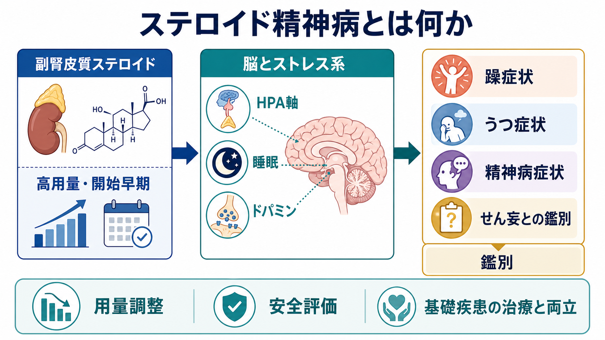
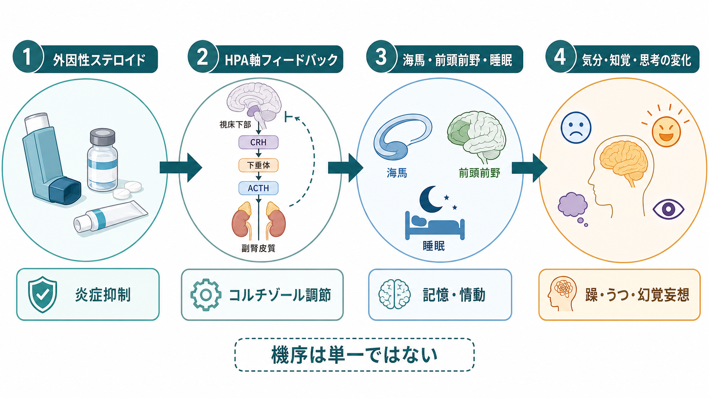
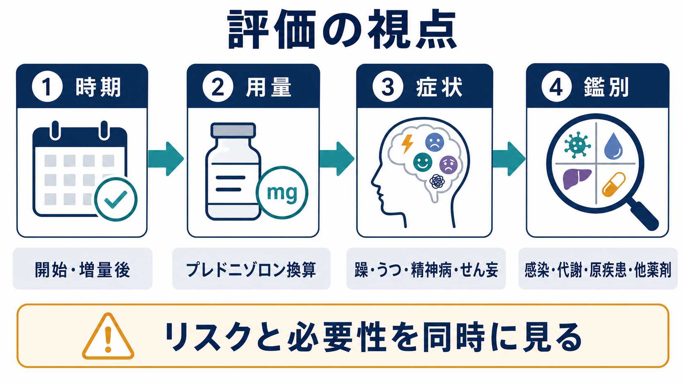

# ステロイド精神病とは何か

## 要点

- ステロイド精神病は、副腎皮質ステロイド、特に全身性グルココルチコイドの使用中または使用後に出現する精神症状を指す臨床的な総称である。実際には「精神病症状」だけでなく、躁症状、うつ症状、不安、不眠、認知変化、せん妄を含めて考える必要がある[1][2]。
- 短期投与では多幸感、活動性亢進、軽躁・躁症状が目立ちやすく、長期投与や減量・中止の文脈ではうつ症状や認知・行動面の変化が問題になりやすい[1][5]。
- リスクは用量と関連するが、発症時期、重症度、持続期間を用量だけで予測することは難しい。プレドニゾンまたはプレドニゾロン換算で 40 mg/日を超える高用量では注意が必要で、80 mg/日超では報告上の頻度がさらに高まる[1][4]。
- 評価では「ステロイドが原因か」だけでなく、感染、代謝異常、原疾患の中枢神経病変、他薬剤、[[不眠障害とは何か|不眠]]、[[うつ病とは何か|うつ病]]、[[双極性障害とは何か|双極性障害]]、せん妄との鑑別を同時に見る[3][5]。
- 本稿は教育・研究目的の整理であり、個別の診断や治療指示ではない。実臨床では原疾患の治療上の必要性と精神症状の安全評価を並行して判断する。

## この記事で答える問い

1. ステロイド精神病という名前は、どこまでの症状を含めて理解すべきか。
2. どのような時期・用量・患者背景で注意が必要か。
3. HPA軸、海馬、前頭前野、睡眠、ドパミン系はどのように関係しうるか。
4. 臨床・研究では、躁症状、うつ症状、精神病症状、せん妄をどう整理するとよいか。

## まず結論

「ステロイド精神病」という語は有名だが、狭い意味の妄想・幻覚だけを指す名前として使うと実態を取り逃がす。副腎皮質ステロイドに伴う精神症状は、軽躁・躁、うつ、不安、不眠、焦燥、認知変化、せん妄、精神病症状が連続的に現れる薬剤性の神経精神症候群として考える方が実用的である[1][2][5]。

重要なのは、症状名だけでなく「いつ出たか」「どのくらいの用量か」「開始・増量・減量・中止のどの局面か」「原疾患や他薬剤で説明できるか」を時系列で見ることである。ステロイドの減量・中止で改善することは多いが、原疾患の治療上すぐに減量できない場合や、自傷他害、重い不眠、興奮、せん妄、強い妄想・幻覚を伴う場合には、医学的な安全評価と精神科的介入が必要になる[1][4]。

## 背景

副腎皮質ステロイドは、膠原病、喘息、皮膚疾患、血液疾患、神経疾患、移植、悪性腫瘍関連治療など、炎症と免疫を抑える目的で広く使われる。強力で有用な薬剤である一方、全身投与では骨粗鬆症、糖代謝異常、感染、消化器症状、HPA軸抑制などと並んで、精神症状が重要な副作用になる[8]。

古典的レビューでは、重い精神反応はステロイド治療を受けた患者のおよそ 5% 前後に起こるとされ、気分症状と精神病症状がしばしば重なっていた[2]。Mayo Clinic Proceedings のレビューでは、重度の反応が約 6%、軽度から中等度の反応が約 28% と整理されている[1]。ただし、研究ごとに対象疾患、用量、投与期間、評価尺度、症状定義が異なるため、これらの数字は固定的な発生率ではなく、臨床的な注意喚起として読むのがよい。

## 基本概念

### 「精神病」だけではない

ステロイド精神病という語は、妄想や幻覚を伴う急性の精神病状態を想起させる。しかし実際には、次のような症状が同じ薬剤性スペクトラムの中で見られる。

| 症状群 | 典型的な現れ方 | 見落としやすい点 |
|---|---|---|
| 躁・軽躁症状 | 多幸感、活動性亢進、睡眠欲求低下、易刺激性、浪費、攻撃性 | 「元気になった」「治療に前向き」と誤認されることがある |
| うつ症状 | 抑うつ気分、意欲低下、不安、希死念慮、疲労感 | 原疾患の負担や入院ストレスだけで説明されやすい |
| 精神病症状 | 妄想、幻覚、被害的解釈、まとまりにくい思考 | [[双極性障害とは何か|双極性障害]]や一次性精神病との鑑別が必要になる |
| 認知・せん妄様症状 | 注意障害、見当識障害、混乱、睡眠覚醒リズムの乱れ | 感染、電解質異常、肝腎機能、低酸素、他薬剤の評価が不可欠 |
| 睡眠・不安症状 | 入眠困難、中途覚醒、焦燥、パニック様症状 | 後続の躁・せん妄・うつの早期サインになる場合がある |

このため、[[DSMとICDは何が違うのか|DSM/ICD]] の診断名だけに急いで当てはめるより、薬剤曝露と時間経過、症状の質、基礎疾患、身体状態を統合して見る必要がある。

### 発症時期

精神症状は開始または増量後の早期に目立つことが多い。レビューやケースシリーズでは、数日から 2 週間程度の発症がよく報告されるが、長期使用中、減量時、中止後に症状が前景化することもある[1][2][4]。したがって「開始直後でなければステロイドと無関係」とは言えない。

### 用量

用量はもっとも再現性のあるリスク因子の一つである。古典的な Boston Collaborative Drug Surveillance Program のデータは、プレドニゾン 40 mg/日超で精神症状が増え、80 mg/日超でさらに高くなるという用量反応関係を示したものとして引用される[4]。ただし、低用量や局所投与でも症例報告はあり、用量が低いことだけで否定はできない[6]。

## 仕組み

ステロイド精神症状の機序は単一ではない。薬剤そのもの、HPA軸、脳内受容体、神経伝達、睡眠、免疫炎症状態、原疾患、心理社会的ストレスが重なって起こると考えるのが妥当である[5][7]。

### HPA軸とフィードバック

外因性ステロイドは、視床下部、下垂体、副腎からなる [[HPA軸は精神疾患にどう関わるのか|HPA軸]] のフィードバックに介入する。内因性コルチゾールの調節系に外から強いグルココルチコイド信号が入ることで、ストレス応答、覚醒、代謝、免疫反応が変化し、気分や認知に影響しうる[5][8]。

### 海馬・前頭前野・記憶

海馬や前頭前野は、グルココルチコイド受容体の影響を受けやすい領域であり、記憶、文脈処理、情動調整に関わる。グルココルチコイド薬が記憶、認知、行動に影響することは臨床的にも研究的にも示されており、長期使用や高用量では認知面の訴えが重要になる[5][7]。

### ドパミン・睡眠・炎症

ステロイド精神病の精神病症状については、ドパミン系変化との関連が仮説として論じられてきた[4]。また、睡眠欲求低下や不眠は躁症状、焦燥、せん妄を悪化させる土台になる。炎症性疾患そのもの、疼痛、入院、感染、代謝異常も同じ方向に働きうるため、薬剤単独の線形モデルでは不十分である。

## 図解

ステロイド精神症状を評価するときは、次の 4 つを同時に見ると整理しやすい。

| 観点 | 確認すること | 研究・臨床上の意味 |
|---|---|---|
| 時期 | 開始、増量、パルス療法、減量、中止との時間関係 | 薬剤性の可能性を時系列で評価する |
| 用量 | プレドニゾン/プレドニゾロン換算量、累積量、投与経路 | 用量反応関係と安全性判断に関わる |
| 症状 | 躁、うつ、不安、不眠、精神病、認知変化、せん妄 | 単一診断名ではなく症状群として記録する |
| 鑑別 | 感染、代謝、低酸素、原疾患、他薬剤、物質使用 | 「ステロイドだけ」と決めつけないための軸になる |

## 臨床・研究との接続

### 臨床での接続

実臨床では、まず安全性を見る。具体的には、自傷他害のリスク、重い不眠、興奮、衝動性、見当識障害、転倒リスク、服薬中断、原疾患治療の中断リスクを確認する。ステロイドが原因と考えられる場合でも、自己判断で急に中止すると副腎不全や原疾患悪化につながるため、減量・中止は原疾患を担当する診療科と連携して判断する必要がある[1][8]。

精神病症状や強い躁症状がある場合、ケースレビューではステロイドの減量・中止に加えて抗精神病薬や気分安定薬が使われ、改善した症例が報告されている[4]。ただし、根拠の多くはケースレポートやケースシリーズであり、標準化された治療アルゴリズムとして読めるほど強いエビデンスではない。

### 研究での接続

研究上は、少なくとも次の情報を分けて記録する必要がある。

- 投与薬剤、投与経路、プレドニゾン/プレドニゾロン換算量、累積量
- 症状の初発日、ピーク、改善日、減量・中止との対応
- 原疾患、炎症活動性、感染、代謝異常、睡眠、疼痛、他薬剤
- 既往の気分エピソード、精神病症状、家族歴、過去のステロイド反応
- 評価尺度、診断基準、せん妄評価、認知評価

Fardet らのプライマリケアデータベース研究は、経口グルココルチコイド処方後にうつ、躁、せん妄、パニック、自殺関連行動といった重い神経精神アウトカムを疫学的に検討した点で重要である[3]。この視点は、「精神病」だけに注目するのではなく、より広い精神・行動アウトカムを測る必要性を示している。

## よくある誤解

### 誤解1: ステロイド精神病は幻覚や妄想だけである

実際には、軽躁・躁症状、うつ症状、不安、不眠、認知変化、せん妄が含まれる。精神病症状だけを待っていると、睡眠低下、焦燥、衝動性、うつ悪化といった早期の問題を見逃す[1][2][5]。

### 誤解2: 高用量でなければ起こらない

高用量ほどリスクは高いが、低用量や局所投与後の症例報告もある。用量は重要なリスク軸だが、否定のための単独条件にはならない[4][6]。

### 誤解3: 精神科既往がなければ安心である

精神科既往はリスク評価に有用だが、既往がない人にも起こる。Mayo Clinic Proceedings のレビューは、過去に反応がなかったことや、逆に過去に反応があったことだけで、次回反応を確実に予測できるわけではないと整理している[1]。

### 誤解4: すぐにステロイドを止めればよい

原疾患によってはステロイドが生命・臓器予後に関わる。急な中止は危険な場合があるため、精神症状のリスクとステロイド継続の必要性を同時に評価する。これは個別治療指示ではなく、教育的な安全原則である[1][8]。

## 関連ノート

- [[HPA軸は精神疾患にどう関わるのか]]
- [[双極性障害とは何か]]
- [[うつ病とは何か]]
- [[不眠障害とは何か]]
- [[振戦せん妄とは何か|せん妄の鑑別]]
- [[DSMとICDは何が違うのか]]

MOC更新候補: 精神医学MOC、薬剤性精神症状MOC、気分障害MOC、精神病症状MOC。並列ジョブとの競合を避けるため、この作業では MOC 本体は更新しない。

今後の作成候補: 薬剤性精神病とは何か、副腎皮質ステロイドの精神症状評価、ステロイド減量時のうつ症状、ステロイドと睡眠障害、せん妄と薬剤性精神症状の鑑別。

## 理解チェック

1. 「ステロイド精神病」という名前だけで捉えると、どのような症状を見落としやすいか。
2. ステロイド精神症状の評価で、開始・増量・減量・中止との時間関係を確認する理由は何か。
3. 用量が重要である一方、用量だけで発症を否定できない理由は何か。
4. せん妄、感染、代謝異常、原疾患、他薬剤を同時に評価する必要があるのはなぜか。
5. ステロイドの減量・中止を、精神症状だけで単純に決められない理由は何か。

## 参考文献

[1] Warrington TP, Bostwick JM. (2006). Psychiatric adverse effects of corticosteroids. *Mayo Clinic Proceedings*, 81(10), 1361-1367. https://doi.org/10.4065/81.10.1361

[2] Lewis DA, Smith RE. (1983). Steroid-induced psychiatric syndromes: A report of 14 cases and a review of the literature. *Journal of Affective Disorders*, 5(4), 319-332. https://doi.org/10.1016/0165-0327(83)90022-8

[3] Fardet L, Petersen I, Nazareth I. (2012). Suicidal behavior and severe neuropsychiatric disorders following glucocorticoid therapy in primary care. *American Journal of Psychiatry*, 169(5), 491-497. https://doi.org/10.1176/appi.ajp.2011.11071009

[4] Huynh G, Reinert JP. (2021). Pharmacological management of steroid-induced psychosis: A review of patient cases. *Journal of Pharmacy Technology*, 37(2), 120-126. https://doi.org/10.1177/8755122520978534

[5] Judd LL, Schettler PJ, Brown ES, et al. (2014). Adverse consequences of glucocorticoid medication: Psychological, cognitive, and behavioral effects. *American Journal of Psychiatry*, 171(10), 1045-1051. https://doi.org/10.1176/appi.ajp.2014.13091264

[6] Sirois F. (2003). Steroid psychosis: A review. *General Hospital Psychiatry*, 25(1), 27-33. https://doi.org/10.1016/S0163-8343(02)00241-4

[7] Kenna HA, Poon AW, de los Angeles CP, Koran LM. (2011). Psychiatric complications of treatment with corticosteroids: Review with case report. *Psychiatry and Clinical Neurosciences*, 65(6), 549-560. https://doi.org/10.1111/j.1440-1819.2011.02260.x

[8] Yasir M, Goyal A, Sonthalia S. Corticosteroids. *StatPearls*. NCBI Bookshelf. https://www.ncbi.nlm.nih.gov/books/NBK554612/

## 未解決問題

- 個人ごとの発症リスクを予測できる実用的なバイオマーカーはまだ確立していない。
- 精神症状の予防目的でどの介入を誰に行うべきかについて、比較試験の根拠は限られている。
- 原疾患の炎症活動性、入院ストレス、睡眠障害、ステロイド用量の寄与をどう分離して測定するかは、研究デザイン上の難問である。
- 長期使用後の認知・気分変化がどの程度可逆的か、どの患者で持続しやすいかはさらに検討が必要である。
