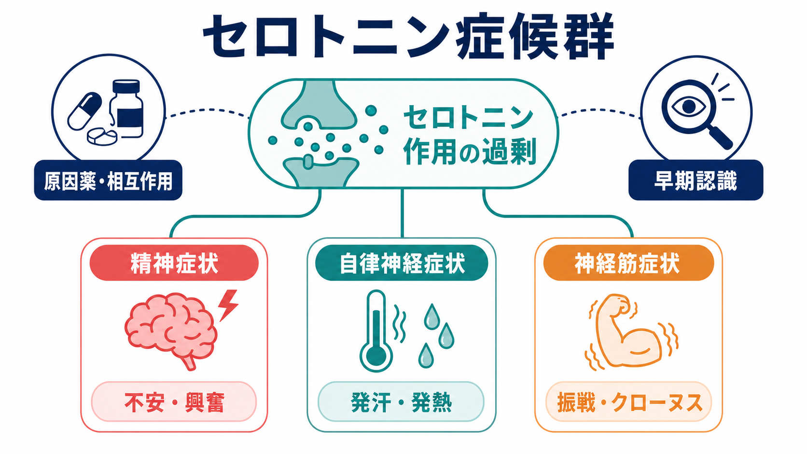
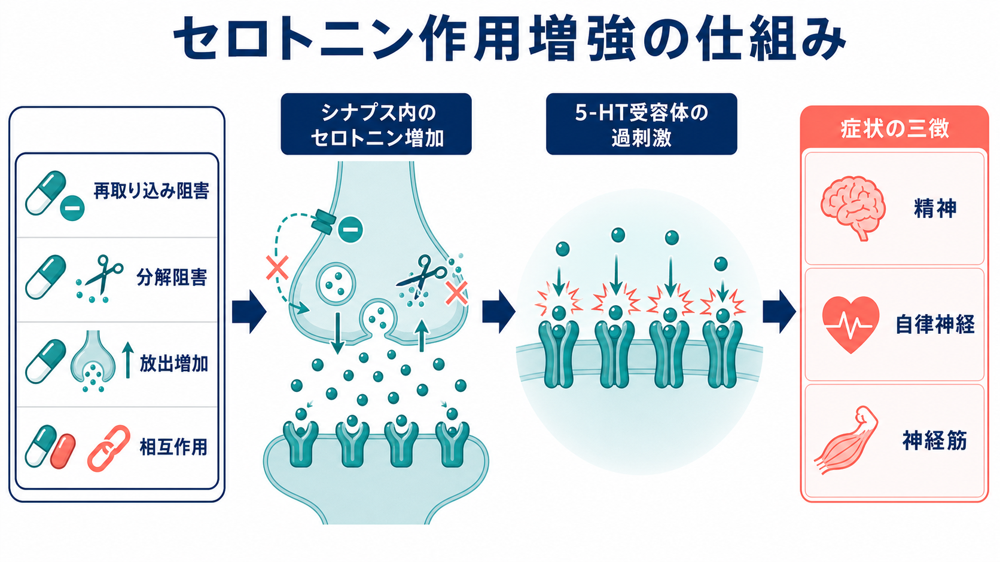
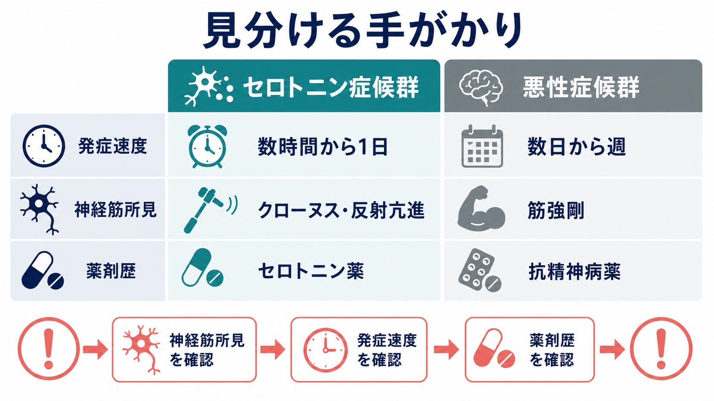

# セロトニン症候群とは何か

## 要点

- セロトニン症候群は、薬剤・相互作用・過量服薬などによりセロトニン作動性が過剰になり、精神症状、自律神経症状、神経筋症状が組み合わさって現れる中毒性の状態である[1][2]。
- 典型的には、セロトニン作動薬の開始、増量、併用、代謝阻害、過量服薬のあと、数時間から 24 時間以内に出現しやすい[1][4][5]。
- 診断の鍵は「セロトニン薬を使っているか」だけではなく、クローヌス、反射亢進、振戦、発汗、興奮、高体温などの組み合わせを確認することである。Hunter 基準は Sternbach 基準より簡潔で特異度が高いと報告された[3]。
- 重症例は高体温、筋強剛、横紋筋融解、痙攣、多臓器障害に進むことがあり、教育目的の知識としても「早期認識」が重要である[2][4]。
- この記事は教育・研究目的の整理であり、個別の診断、服薬変更、治療指示ではない。症状が疑われる場合は医療者・救急医療に相談する必要がある。

## この記事で答える問い

1. セロトニン症候群では、なぜ精神症状・自律神経症状・神経筋症状が同時に問題になるのか。
2. どのような薬剤作用や相互作用が、セロトニン作用の過剰につながるのか。
3. 悪性症候群、抗コリン中毒、離脱、感染症などとは、どの点で見分けるのか。
4. 精神医学・神経科学・薬理学の学習では、この症候群をどのように位置づけるとよいのか。

## まず結論

セロトニン症候群は、単に「セロトニンが多い」という抽象的な状態ではなく、薬剤歴と時間経過を背景に、神経筋過活動、自律神経亢進、精神状態変化が同時に立ち上がる臨床的パターンである。特に重要なのは、クローヌス、反射亢進、振戦といった神経筋所見である。発熱や興奮だけを見ると感染症、せん妄、悪性症候群、抗コリン中毒などと紛れやすいが、セロトニン症候群では「急速な発症」と「下肢優位の反射亢進・クローヌス」が手がかりになりやすい[1][3][4]。

また、セロトニン症候群は [[薬物療法は神経回路にどう作用するのか]] という大きな問いの中で、薬剤が神経伝達を調整するだけでなく、過剰なシナプス作用や相互作用によって急性の中毒性ネットワーク状態を作りうる例として理解できる。[[うつ病とは何か]] や不安症への SSRI/SNRI 使用、疼痛や咳嗽に対する一部薬剤、抗菌薬の linezolid などが、同じ「セロトニン作動性」という軸で接続される点が学習上重要である[5][6][8]。

## 背景

セロトニンは中枢神経系では気分、覚醒、注意、疼痛、体温調節、運動制御などに関わり、末梢では消化管運動や血管反応などにも関与する。セロトニン症候群では、こうした広い作用系が薬理学的に過剰刺激されるため、精神症状だけでも身体症状だけでも説明しきれない複合的な状態になる[1][6]。

原因としてよく整理されるのは、次のような機序である。第一に SSRI、SNRI、一部三環系抗うつ薬、tramadol、dextromethorphan などによる再取り込み阻害。第二に MAO 阻害薬や linezolid などによる分解阻害。第三に MDMA、amphetamine などによる放出増加。第四に複数薬剤の併用や CYP 代謝阻害による血中濃度上昇である[1][5][6]。

精神科診療の文脈では、抗うつ薬の開始・増量・切り替え、他科処方薬、市販薬、サプリメント、違法薬物、救急場面の過量服薬が交差するところで問題になりやすい。したがって、[[物質使用歴はどのように聞くべきか]] や [[器質性精神障害を見逃さないためには何を見るべきか]] とも関連する。

## 基本概念

### 症状の三徴

セロトニン症候群の古典的な三徴は、精神症状、自律神経症状、神経筋症状である[1][2]。

| 領域 | 代表的な所見 | 読み取り方 |
|---|---|---|
| 精神症状 | 不安、焦燥、興奮、混乱、せん妄 | [[精神状態診察MSEとは何か]] で観察する意識、注意、行動、思考過程の急性変化として捉える。 |
| 自律神経症状 | 発汗、頻脈、血圧上昇、散瞳、下痢、発熱 | 体温調節、交感神経亢進、消化管運動亢進として現れる。 |
| 神経筋症状 | 振戦、反射亢進、ミオクローヌス、眼球クローヌス、誘発クローヌス、筋緊張亢進 | 鑑別上もっとも重視される。特にクローヌスと反射亢進が手がかりになる[3][4]。 |

軽症では不安、振戦、発汗、下痢、散瞳などにとどまることがある。中等症では興奮、反射亢進、クローヌス、頻脈、高血圧が目立ち、重症では高体温、筋強剛、痙攣、横紋筋融解、多臓器障害に進みうる[4][5]。

### Hunter 基準

Hunter Serotonin Toxicity Criteria は、セロトニン作動薬への曝露を前提に、クローヌス、興奮、発汗、振戦、反射亢進、高体温、筋緊張亢進を組み合わせて判断する基準である。原著では、臨床毒性学者の診断を基準にした場合、Hunter 基準は Sternbach 基準より感度・特異度が高いと報告された[3]。

学習上は、基準を丸暗記するよりも「セロトニン薬 + 急速な発症 + 神経筋過活動」という骨格を先に押さえると理解しやすい。実際の診療では、検査値だけで確定する疾患ではなく、薬剤歴、時間経過、身体診察、鑑別除外を総合する[1][3]。

## 仕組み

セロトニン作動性シナプスでは、セロトニンが放出され、受容体を刺激し、SERT によって再取り込みされ、MAO によって代謝される。薬剤はこの流れの複数の点に介入する。再取り込みを止めればシナプス間隙のセロトニンは増えやすくなり、分解を止めれば細胞内外のセロトニン処理が滞り、放出を増やせば受容体刺激が急に高まる[1][6]。

重症例で特に危険なのは、異なる機序の薬剤が組み合わさる場合である。たとえば MAO 阻害と再取り込み阻害が重なると、セロトニンの除去経路が複数方向から妨げられる。レビューでは、重症セロトニン毒性は MAO 阻害薬とセロトニン再取り込み阻害薬の組み合わせで問題になりやすいと整理されている[4][5]。

一方で、すべての「セロトニンに関係する薬」が同じ強さでセロトニン症候群を起こすわけではない。受容体を遮断する薬、弱い作用しか持たない薬、症例報告の質が低い薬剤群もあるため、薬剤名だけで機械的に危険度を判断するのではなく、薬理機序、用量、併用、代謝、時間経過を合わせて評価する必要がある[5]。

## 図解

1 枚目は、セロトニン症候群を「原因薬・相互作用」「セロトニン作用過剰」「精神・自律神経・神経筋の三徴」「早期認識」という流れで整理した概念図である。

2 枚目は、再取り込み阻害、分解阻害、放出増加、相互作用がシナプス内セロトニン増加と受容体過刺激に合流することを示している。ここでは、機序を単一薬剤ではなく「セロトニン処理系のどこが詰まるか」として読む。

3 枚目は、悪性症候群との比較を中心に、発症速度、神経筋所見、薬剤歴を並べたものである。鑑別では「どの薬が、いつ、どう変わったか」と「筋強剛なのか、クローヌス・反射亢進なのか」を分けて考える。

## 臨床・研究との接続

### 鑑別診断

セロトニン症候群と混同されやすい状態には、悪性症候群、抗コリン中毒、悪性高熱、感染症、髄膜炎・脳炎、アルコール・ベンゾジアゼピン離脱、薬物中毒、せん妄などがある[1][4][5]。

悪性症候群は、主に抗精神病薬やドパミン遮断に関連し、発症は数日から週単位で比較的遅い。典型的には鉛管様筋強剛、寡動、意識障害、発熱、自律神経症状が問題になる。これに対してセロトニン症候群は、数時間から 1 日程度で急速に出現し、クローヌス、反射亢進、振戦が目立ちやすい[1][4]。

抗コリン中毒では発熱、せん妄、散瞳が重なるが、皮膚や口腔粘膜の乾燥、尿閉、腸蠕動低下が手がかりになる。セロトニン症候群では発汗、下痢、腸蠕動亢進が見られやすい点が対照的である[5]。[[アルコール離脱とは何か]] も振戦、発汗、頻脈、せん妄を起こしうるため、物質使用歴と時間経過の確認が重要になる。

### 薬剤安全性

FDA は opioid 鎮痛薬と抗うつ薬・片頭痛薬との相互作用としてセロトニン症候群のリスクを添付文書上の警告に含めている[7]。ただし、薬剤群ごとのリスクは一様ではない。Foong らのレビューは、triptan や ondansetron など一部薬剤について、警告や相互作用データベース上の扱いと、薬理学的・症例報告上の根拠との間にずれがある可能性を指摘している[5]。

linezolid は抗菌薬でありながら弱い可逆的 MAO 阻害作用を持つため、セロトニン作動薬との併用で注意されてきた。近年の大規模観察研究では、抗うつ薬併用中の高齢患者における linezolid 関連セロトニン症候群はまれだったと報告されているが、これは「危険がない」という意味ではなく、感染症の重症度、代替薬、併用薬、観察体制を踏まえたリスク評価が必要であることを示す[8]。

### 研究上の論点

セロトニン症候群は、精神薬理学における「受容体作用」「トランスポーター」「代謝酵素」「薬物相互作用」を、臨床症候として観察できる例である。分子レベルでは 5-HT 受容体、SERT、MAO、CYP 代謝が関係し、臨床レベルでは発症速度、身体診察、意識状態、薬剤歴が問題になる[1][6]。

研究上の難しさは、発生頻度が低く、軽症例は見逃されやすく、重症例は過量服薬や多剤併用が絡みやすい点である。そのため、症例報告だけでは薬剤ごとの因果関係を過大評価しやすい。Hunter 基準のような臨床基準、薬理機序、薬剤疫学、ファーマコビジランスを組み合わせて読む必要がある[3][5][8]。

## よくある誤解

### 「SSRI を飲んでいればセロトニン症候群になる」

SSRI は代表的なセロトニン再取り込み阻害薬だが、治療量の単剤使用で重症セロトニン症候群が頻発するわけではない。リスクは、開始・増量・過量服薬・相互作用・代謝阻害・複数薬剤併用で高まりやすい[1][5]。

### 「発熱と興奮があればセロトニン症候群である」

発熱と興奮は非特異的で、感染症、せん妄、悪性症候群、離脱、中毒でも起こる。セロトニン症候群らしさは、薬剤歴と時間経過に加え、クローヌス、反射亢進、振戦などの神経筋過活動を合わせて見ることで高まる[3][4]。

### 「悪性症候群とセロトニン症候群は同じような薬剤性発熱である」

両者は発熱、自律神経症状、意識変容を共有するが、薬理学的背景と神経筋所見が異なる。悪性症候群はドパミン遮断・抗精神病薬と関連し、数日から週単位で進むことが多い。セロトニン症候群はセロトニン作動性変化のあと急速に現れ、クローヌスや反射亢進が目立ちやすい[1][4]。

## 関連ノート

- [[薬物療法は神経回路にどう作用するのか]]
- [[うつ病とは何か]]
- [[オピオイド使用障害とは何か]]
- [[器質性精神障害を見逃さないためには何を見るべきか]]
- [[精神状態診察MSEとは何か]]
- [[アルコール離脱とは何か]]

### 関連ノート候補

- セロトニンとは何か
- SSRIとは何か
- SNRIとは何か
- 悪性症候群とは何か
- 抗コリン中毒とは何か
- 薬物相互作用とは何か

## 理解チェック

1. セロトニン症候群の三徴は何か。
2. Hunter 基準で特に重要な神経筋所見は何か。
3. 悪性症候群と比較したとき、発症速度と筋所見はどう異なるか。
4. MAO 阻害薬と再取り込み阻害薬の併用が危険になりやすい理由は何か。
5. 薬剤名だけでなく、用量、開始・増量時期、代謝阻害、過量服薬、市販薬・サプリメントを確認する理由は何か。

## 参考文献

[1] Simon LV, Torrico TJ, Keenaghan M. Serotonin Syndrome. *StatPearls*. Last update: 2024-03-02. NCBI Bookshelf. https://www.ncbi.nlm.nih.gov/books/NBK482377/

[2] Boyer EW, Shannon M. The serotonin syndrome. *New England Journal of Medicine*. 2005;352(11):1112-1120. https://doi.org/10.1056/NEJMra041867

[3] Dunkley EJC, Isbister GK, Sibbritt D, Dawson AH, Whyte IM. The Hunter Serotonin Toxicity Criteria: simple and accurate diagnostic decision rules for serotonin toxicity. *QJM*. 2003;96(9):635-642. https://doi.org/10.1093/qjmed/hcg109

[4] Isbister GK, Buckley NA, Whyte IM. Serotonin toxicity: a practical approach to diagnosis and treatment. *Medical Journal of Australia*. 2007;187(6):361-365. https://doi.org/10.5694/j.1326-5377.2007.tb01282.x

[5] Foong AL, Grindrod KA, Patel T, Kellar J. Demystifying serotonin syndrome (or serotonin toxicity). *Canadian Family Physician*. 2018;64(10):720-727. https://pmc.ncbi.nlm.nih.gov/articles/PMC6184959/

[6] Francescangeli J, Karamchandani K, Powell M, Bonavia A. The Serotonin Syndrome: From Molecular Mechanisms to Clinical Practice. *International Journal of Molecular Sciences*. 2019;20(9):2288. https://doi.org/10.3390/ijms20092288

[7] U.S. Food and Drug Administration. FDA Drug Safety Communication: FDA warns about several safety issues with opioid pain medicines; requires label changes. 2016-03-22. https://www.fda.gov/media/96472/download

[8] Bai AD, McKenna S, Wise H, et al. Association of Linezolid With Risk of Serotonin Syndrome in Patients Receiving Antidepressants. *JAMA Network Open*. 2022;5(12):e2247426. https://doi.org/10.1001/jamanetworkopen.2022.47426

## 未解決問題

- 薬剤ごとの真の発生頻度は、軽症例の見逃しと症例報告バイアスのため、なお推定が難しい。
- 相互作用データベースの警告を、薬理学的妥当性、症例の質、臨床的重症度に応じてどう階層化するかは実務上の課題である。
- セロトニン毒性を予測する個人差、たとえば代謝酵素、トランスポーター、受容体多型、併存症、多剤併用の寄与は、今後も研究が必要である。
