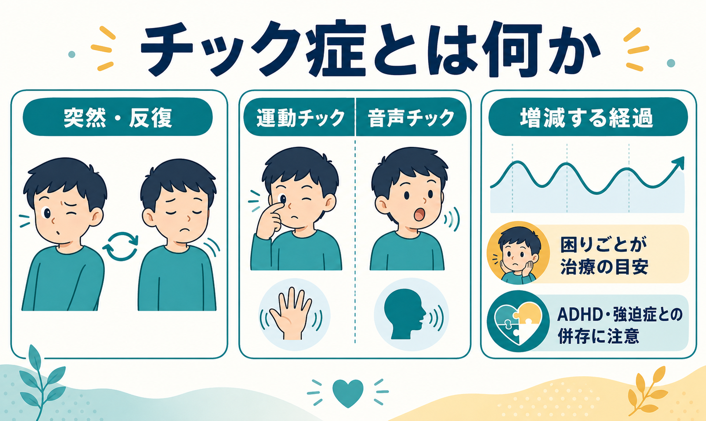
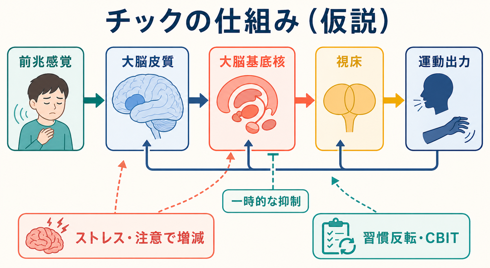
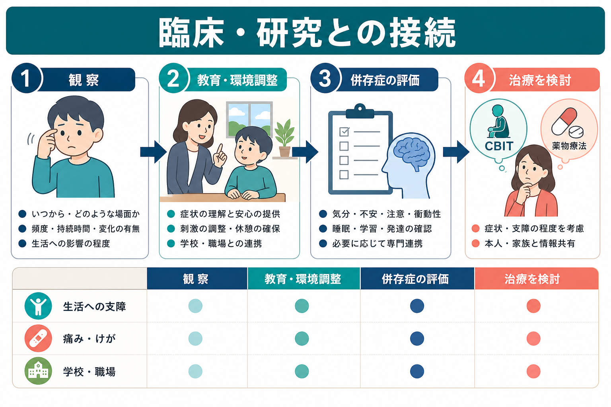

# チック症とは何か

## 要点

- チック症は、突然・急速・反復的で、完全には随意的に止めにくい運動または音声のチックを中心とする疾患群である。
- DSM-5-TR では、トゥレット症、持続性運動または音声チック症、暫定的チック症に分けて考える[1]。
- 多くは小児期に始まり、強さや種類が「増えたり減ったり」しながら変化する。青年期以降に軽くなる人もいるが、生活への支障が残る人もいる[2][4]。
- 支援の目標は、チックをゼロにすることではなく、痛み、けが、学校・職場での困難、心理的苦痛を減らすことである[3][4]。
- ADHD、[[強迫症とは何か]]、不安、気分症状、睡眠や学習の困難を併存しやすく、チックだけでなく生活全体を評価する必要がある[2][4]。

## この記事で答える問い

1. チック症とはどのような症状を指すのか。
2. トゥレット症、持続性チック症、暫定的チック症はどう違うのか。
3. チックは「癖」「わざと」「しつけの問題」とどう違うのか。
4. 脳・神経回路の観点から、どのような仕組みが想定されているのか。
5. 臨床や研究では、どのように評価し支援につなげるのか。

## まず結論

チック症は、単なる癖や注意不足ではなく、発達期に始まりやすい神経発達症群の一つである。まばたき、顔しかめ、首振り、肩すくめ、咳払い、鼻鳴らし、短い発声などが、突然・反復的に現れる。本人は一時的に抑えられることがあるが、その抑制は努力を要し、前兆感覚や緊張感が高まって後で出やすくなる場合がある[1][2]。

診断上は、運動チックと音声チックの組み合わせ、持続期間、発症年齢、薬物や他の神経疾患で説明できないことを確認する。チックがあっても生活への支障が少ない場合は、教育的説明と経過観察で十分なことがある。一方、痛み、けが、対人関係の困難、学校・仕事への支障、強い苦痛がある場合は、包括的行動療法である CBIT や薬物療法などを検討する[3][4]。

## 背景

チックは、外から見ると「変な動き」「音を出す癖」に見えやすい。そのため、本人がふざけている、注意を引こうとしている、親のしつけが悪い、という誤解を受けることがある。しかし、チック症では、運動や発声の制御、感覚の違和感、注意、ストレス、環境刺激が複雑に関わる[2][7]。

CDC は、チック症を「突然で反復的な動きや音声を生じる状態」と説明している。診断では症状の種類と持続期間が重要で、トゥレット症では複数の運動チックと少なくとも一つの音声チックが 1 年以上続く[1]。ただし、チックの出方は一定ではない。日によって、場面によって、また年齢によって目立ち方が変わる。

## 基本概念

### チックとは何か

チックは、突然、急速、反復的、非律動的に出る運動または音声である[2]。典型例は次のように整理できる。

| 種類 | 例 | 説明 |
|---|---|---|
| 単純運動チック | まばたき、顔しかめ、首振り、肩すくめ | 一つまたは少数の筋群が短く動く |
| 複雑運動チック | 触る、跳ねる、同じ姿勢を繰り返す | 目的ある動作のように見えることがある |
| 単純音声チック | 咳払い、鼻鳴らし、うなり声 | 言葉ではない音が反復する |
| 複雑音声チック | 単語や短い語句の反復 | まれに社会的に不適切な語が含まれることがある |

「音声チック」は、必ずしも言葉を話すことだけではない。咳払い、鼻を鳴らす、喉を鳴らすなど、空気が鼻・口・咽頭を通ることで生じる音も含まれる[2]。

### 診断分類

DSM-5-TR に基づく実用的な分類は、次の 3 つである[1]。

| 診断名 | チックの種類 | 持続期間 | 重要な条件 |
|---|---|---|---|
| トゥレット症 | 複数の運動チックと 1 つ以上の音声チック | 1 年以上 | 18 歳前に始まる |
| 持続性運動または音声チック症 | 運動または音声のどちらか | 1 年以上 | トゥレット症ではない |
| 暫定的チック症 | 運動、音声、または両方 | 1 年未満 | まだ慢性型とは判断しない |

この分類は、本人の価値や重症度を決めるラベルではない。臨床上は、チックの頻度だけでなく、痛み、けが、疲労、いじめ、授業・仕事への影響、家族の負担、併存症状を含めて評価する[2][4]。

### 前兆感覚と抑制

チックの前に、むずむず感、圧迫感、違和感、「出さないと落ち着かない」感じが生じることがある。チックを出すと一時的に楽になるため、本人には「したくてしている」ように見える場合がある。しかし、これは自由な選択というより、強い身体感覚と運動出力の間に生じる制御困難として理解したほうがよい[5][7]。

## 仕組み

チック症の原因は一つではない。現在の理解では、遺伝的脆弱性、発達、感覚運動処理、注意、ストレス、併存症、学習された反応が重なって症状が出ると考えられている。神経回路としては、大脳皮質、大脳基底核、視床を結ぶ皮質-線条体-淡蒼球-視床-皮質ループ、さらに小脳を含む広いネットワークが関与するという仮説が有力である[7][8]。

大脳基底核は、不要な運動を抑え、必要な運動を選択する回路に関わる。チック症では、この「不要な運動パターンを抑える」働きや、感覚違和感から運動出力へ至る調整が不安定になり、特定の運動・音声が反復的に出やすくなると考えられている[7][8]。ただし、これは単純な「脳の一部が壊れている」という説明ではない。症状は疲労、緊張、注目、安心できる環境、集中している活動などで変化し、神経回路と環境の相互作用として現れる。

## 図解

上の 1 枚目は、チック症の全体像を「突然・反復」「運動チック」「音声チック」「増減する経過」「支援の目安」としてまとめた図である。2 枚目は、前兆感覚、皮質-大脳基底核-視床回路、運動出力、一時的抑制、CBIT との関係を示す。3 枚目は、臨床・研究での評価と支援の流れをまとめる。

## 臨床・研究との接続

### 評価で見ること

チック症の評価では、まず、どのチックが、いつ、どの場面で、どの程度出るかを確認する。さらに、生活への支障、本人の苦痛、家族や学校・職場での困りごとを聞く。欧州ガイドラインでは、チックだけでなく、OCD、ADHD、不安、気分症状、睡眠、学習、神経心理学的側面を含めた評価が推奨されている[2]。

研究や専門診療では、Yale Global Tic Severity Scale（YGTSS）などの尺度が用いられる。尺度は、チックの数だけではなく、頻度、強さ、複雑さ、妨害度、生活への影響を見積もるために使われる[2][4]。

### 支援と治療

治療を急ぐかどうかは、チックの存在そのものではなく、生活への支障で判断する。AAN ガイドラインは、機能障害がない場合には経過観察が受け入れられる一方、治療が必要な場合は本人・家族・臨床家が利益と不利益を話し合って決めることを強調している[4]。

CBIT（Comprehensive Behavioral Intervention for Tics）は、チックの教育、気づきの訓練、習慣反転、環境調整、リラクセーションなどを組み合わせる行動療法である。小児・青年を対象にしたランダム化比較試験では、支持的治療と教育に比べてチック重症度の改善が大きく、成人を対象にした試験でも有効性が示されている[5][6]。薬物療法は、痛み、けが、学校・仕事への支障、強い苦痛があり、行動療法だけでは不十分な場合などに検討されるが、副作用と併存症を含めた個別判断が必要である[3][4]。

## よくある誤解

### 「わざとやっている」のではない

チックは一時的に抑えられることがあるため、周囲からは「できるなら止めればよい」と見えやすい。しかし、抑制には大きな努力を要し、長時間続けると疲労や反動が出ることがある。本人の意思の弱さとして扱うと、羞恥、緊張、二次的な不安が強まりやすい。

### 「叱れば治る」ものではない

注意や叱責は、症状への注目や緊張を高め、かえってチックを目立たせることがある。教育的説明、安心できる環境、休憩、刺激の調整、学校・職場との連携が役立つ場合がある[3][4]。

### 「汚言症が必ずある」わけではない

トゥレット症というと、不適切な言葉を突然言う症状だけが強調されがちである。しかし、汚言症は一部の人に見られる症状であり、チック症の中心は多様な運動チックと音声チックである[2]。

### 「チックだけ見ればよい」わけではない

生活上の困難は、チックそのものよりも、ADHD、[[強迫症とは何か]]、[[不安症群とは何か]]、気分症状、睡眠、学習困難、対人ストレスから生じることがある。評価と支援では、どの問題が本人にとって最も困っているかを一緒に整理する必要がある[2][4]。

## 関連ノート

- [[強迫症とは何か]]
- [[不安症群とは何か]]
- [[大うつ病性障害とは何か]]
- 今後の作成候補: ADHDとは何か、神経発達症群とは何か、CBITとは何か、大脳基底核とは何か、前兆感覚とは何か
- MOC 更新候補: 精神医学、神経発達症、疾患・症候群、認知行動療法

## 理解チェック

1. チック症を「癖」だけで説明すると、どのような点を見落とすか。
2. トゥレット症と持続性運動または音声チック症の違いは何か。
3. チックの治療を検討する目安は、チックの有無ではなく何か。
4. CBIT はチックを直接「我慢させる」方法ではなく、どのような要素を組み合わせる支援か。
5. チック症の評価で、OCD、ADHD、不安、気分症状、睡眠、学習を確認する理由は何か。

## 未解決問題

- チックの発生を、前兆感覚、注意、運動抑制、報酬学習、社会的文脈を含めて統一的に説明するモデルはまだ発展途上である。
- どの人に CBIT、薬物療法、併存症治療、学校・職場調整をどの順序で組み合わせるとよいかは、個別性が大きい。
- 思春期以降に自然軽快する人と、成人期まで生活上の支障が続く人を早期に見分ける予測因子は、さらに研究が必要である。

## 参考文献

[1] Centers for Disease Control and Prevention. (2025). *Diagnosing Tic Disorders*. https://www.cdc.gov/tourette-syndrome/diagnosis/index.html

[2] Müller-Vahl, K. R., Cath, D. C., Cavanna, A. E., et al. (2022). European clinical guidelines for Tourette syndrome and other tic disorders: Version 2.0. Part I: Assessment. *European Child & Adolescent Psychiatry*, 31, 383-402. https://pmc.ncbi.nlm.nih.gov/articles/PMC8521086/

[3] Centers for Disease Control and Prevention. (2026). *Treatment of Tourette Syndrome*. https://www.cdc.gov/tourette-syndrome/treatment/index.html

[4] Pringsheim, T., Okun, M. S., Müller-Vahl, K., et al. (2019). Practice guideline recommendations summary: Treatment of tics in people with Tourette syndrome and chronic tic disorders. *Neurology*, 92(19), 896-906. https://doi.org/10.1212/WNL.0000000000007466

[5] Piacentini, J., Woods, D. W., Scahill, L., et al. (2010). Behavior therapy for children with Tourette disorder: A randomized controlled trial. *JAMA*, 303(19), 1929-1937. https://doi.org/10.1001/jama.2010.607

[6] Wilhelm, S., Peterson, A. L., Piacentini, J., et al. (2012). Randomized trial of behavior therapy for adults with Tourette syndrome. *Archives of General Psychiatry*, 69(8), 795-803. https://doi.org/10.1001/archgenpsychiatry.2011.1528

[7] Ganos, C., & Martino, D. (2015). Tics and Tourette syndrome. *Neurologic Clinics*, 33(1), 115-136. https://doi.org/10.1016/j.ncl.2014.09.008

[8] Caligiore, D., Mannella, F., Arbib, M. A., & Baldassarre, G. (2017). Dysfunctions of the basal ganglia-cerebellar-thalamo-cortical system produce motor tics in Tourette syndrome. *PLOS Computational Biology*, 13(3), e1005395. https://doi.org/10.1371/journal.pcbi.1005395
