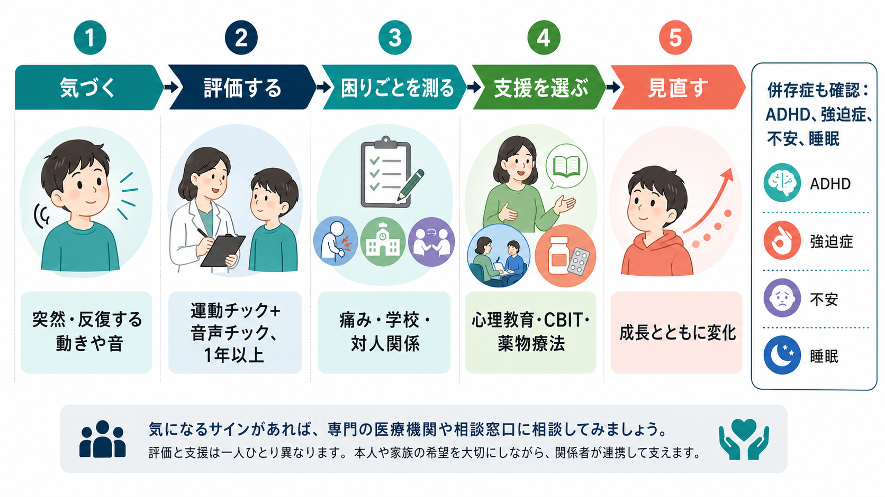
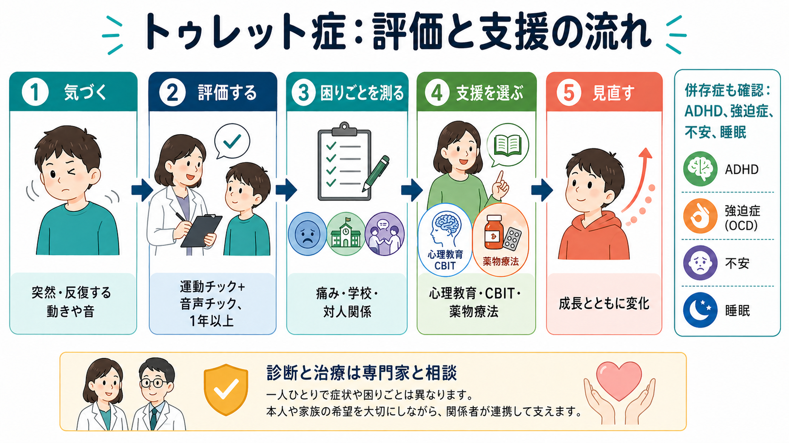

# トゥレット症とは何か

## 要点

- トゥレット症は、複数の運動チックと少なくとも1つの音声チックが、増減しながら1年以上続くチック症である[1][2]。
- チックは「癖」や「わざと」ではなく、突然・反復して起こる動きや発声であり、多くの場合は小児期に始まる[1][2]。
- 背景には、皮質-線条体-視床-皮質回路、運動抑制、感覚前駆衝動、ドパミン系などが関わると考えられるが、単一原因で説明できる疾患ではない[3][4]。
- ADHD、強迫症、不安、睡眠問題などが併存しやすく、チックそのものより併存症や周囲の反応が生活上の困難を大きくすることもある[3][5]。
- 支援は、心理教育、環境調整、包括的行動介入 CBIT、必要に応じた薬物療法を、本人の困りごとに合わせて選ぶ[6][7][8]。

## この記事で答える問い

1. トゥレット症は、通常の癖や一過性のチックと何が違うのか。
2. 運動チックと音声チックは、どのように現れるのか。
3. 脳の仕組みとして、どのような回路や抑制制御が関わるのか。
4. 臨床では何を評価し、どのような支援につなげるのか。
5. よくある誤解をどう避ければよいのか。

## まず結論

トゥレット症は、本人の意思やしつけの問題ではなく、チックが発達の経過の中で持続する神経発達症である。診断上は、18歳未満に始まり、複数の運動チックと1つ以上の音声チックが、症状のない期間を挟みながらも1年以上続くことが中心になる[1][2]。

ただし、臨床的に重要なのは「チックがあるか」だけではない。痛み、疲労、学校や職場での目立ちやすさ、からかい、自己評価の低下、家族の巻き込まれ、併存する[[ADHDとは何か]]や[[強迫症とは何か]]、[[不安症群とは何か]]、[[不眠障害とは何か]]が、生活上の困難を形づくる[3][5][8]。そのため評価と支援は、チックの種類だけでなく、本人が何に困っているのかを中心に組み立てる。

## 背景

チックは、突然に、速く、反復して起こる運動または発声である。まばたき、顔をしかめる、首を振る、肩をすくめる、咳払い、鼻を鳴らす、短い声を出すなどが典型例である[1][2]。症状は日によって変わり、緊張、疲労、注目される状況で増えることもあれば、集中していると目立ちにくくなることもある。

多くの人はチックの前に、むずむずする、圧が高まる、出さないと落ち着かないといった感覚前駆衝動を経験する。チックを一時的に抑えることは可能な場合があるが、強い努力を要し、あとで反動的に増えることもある[3][4]。このため「我慢できるなら意図的だ」と判断するのは誤りである。

疫学的には、トゥレット症は小児期に多く、男児で多く報告される。症状は一般に児童期から思春期前半に強まり、その後に軽くなる例が多いが、成人期まで支援を要する人もいる[3][5]。経過には個人差が大きいため、年齢だけで楽観視したり、逆に一生変わらないと決めつけたりしない。

## 基本概念

### 運動チック

運動チックは、身体の一部または複数部位に起こる反復的な動きである。単純運動チックには、まばたき、顔しかめ、首振り、肩すくめなどがある。複雑運動チックには、触る、跳ぶ、特定の身振りを繰り返す、動作の連鎖として見えるものなどが含まれる[1][2]。

### 音声チック

音声チックは、発声や呼吸・喉の動きとして現れるチックである。咳払い、鼻すすり、短い声、うなり声、言葉や句の反復などがある[1][2]。一般には「汚言症」が有名だが、これは全員に起こるわけではなく、トゥレット症を汚言だけで理解すると実態を大きく誤る[3]。

### 診断概念

CDC の説明では、トゥレット症は、2つ以上の運動チックと少なくとも1つの音声チックがあり、チックが1年以上続き、18歳未満に始まり、薬物や他の医学的状態だけでは説明されない場合に診断される[1]。DSM 系の診断概念でも、複数の運動チックと1つ以上の音声チック、18歳前発症、1年以上の持続が中核である[2]。

## 仕組み

トゥレット症の神経科学では、皮質-線条体-視床-皮質 cortico-striato-thalamo-cortical: CSTC 回路が重要視されてきた。この回路は、運動の選択、開始、停止、習慣化、報酬学習、抑制制御に関わる[3][4]。チックは、この回路における運動プログラムの選択と抑制のゆらぎとして理解されることが多い。

ただし、CSTC 回路だけで全てを説明できるわけではない。感覚前駆衝動、注意、情動、ストレス、学習、環境からのフィードバック、併存症が、チックの頻度や困りごとに影響する[3][4][5]。ドパミン系の関与は、抗ドパミン作用をもつ薬剤が一部のチックに有効であることとも整合するが、これは「ドパミンだけが原因」という意味ではない[7][8]。

## 図解

下の図は、トゥレット症を「気づく、評価する、困りごとを測る、支援を選ぶ、見直す」という臨床的な流れで整理したものである。チックの有無だけでなく、痛み、学校、対人関係、併存症を同時に見ることが重要である。

メカニズム図は画像生成で正確な日本語ラベルを安定して再現できなかったため、本文では文章として整理する。図解案としては、中央に「CSTC回路」、周囲に「大脳皮質」「線条体」「淡蒼球」「視床」「補足運動野」を置き、下段に「感覚前駆衝動」「一時的な抑制」「ドパミン調節」を添える構成が適している。注記として「単一原因ではなく複数回路が関与」を明示すると、過度に単純化しにくい。

## 臨床・研究との接続

臨床評価では、チックの種類、頻度、強さ、持続期間だけでなく、本人がどの場面で困るのかを確認する。学校でからかわれる、試験中に抑えようとして疲れる、首振りで痛みが出る、咳払いが感染症や反抗と誤解される、といった文脈が支援の焦点になる。

治療・支援の第一歩は心理教育である。本人、家族、学校が、チックを「わざと」や「悪い癖」とみなさないだけでも、叱責、過剰な注目、回避の固定化を減らせる。AAN の診療ガイドラインは、チックが機能障害をもたらす場合、CBIT を利用可能なら初期介入として考慮することを推奨している[6]。CBIT は、チックへの気づき、拮抗反応、環境調整を含む行動療法である。

薬物療法は、症状が強く、行動介入だけでは不十分な場合や、痛み・学業・対人関係への影響が大きい場合に検討される。欧州ガイドラインでは、α2アドレナリン作動薬、抗精神病薬、その他の薬物療法が、症状、併存症、副作用、本人と家族の希望に応じて選択される[7][8]。本記事は教育・研究目的の概説であり、個別の診断や治療指示ではない。

研究面では、トゥレット症は運動制御だけでなく、発達、抑制、感覚処理、習慣、情動調整が交差する領域として重要である。チックの可変性は、症状を固定した「出力」として見るより、神経回路、身体感覚、社会環境、学習の相互作用として見る必要を示している[3][4]。

## よくある誤解

### 誤解1: トゥレット症は汚い言葉を叫ぶ病気である

汚言症は有名だが、全員に起こるわけではない。多くの音声チックは咳払い、鼻すすり、短い声などである[1][3]。汚言だけを強調すると、本人の困りごとや多様な症状が見えにくくなる。

### 誤解2: 注意すれば治る

注意や叱責は、短期的にはチックを抑えさせることがあっても、緊張や自己意識を高め、結果的に負担を増やすことがある。支援では、本人の努力不足を責めるのではなく、困る場面を減らし、必要に応じてCBITや薬物療法につなげる[6][7]。

### 誤解3: チックがあるなら必ず治療が必要である

チックが軽く、本人が困っていない場合は、経過観察と心理教育で十分なこともある[6]。逆に、チックが目立たなくても、強い抑制努力、痛み、いじめ、不登校、併存症があれば支援が必要になる。

### 誤解4: 家庭環境だけが原因である

家庭や学校の環境はチックの現れ方や困りごとに影響するが、トゥレット症を家庭環境だけで説明するのは不正確である。遺伝・発達要因、神経回路、感覚前駆衝動、注意や情動の調整が相互に関わる[3][4]。

## 関連ノート

既存ノート:

- [[ADHDとは何か]]
- [[強迫症とは何か]]
- [[不安症群とは何か]]
- [[不眠障害とは何か]]

今後の作成候補:

- チック症とは何か
- CBITとは何か
- 感覚前駆衝動とは何か
- 皮質-線条体-視床-皮質回路とは何か
- 小児期発症の神経発達症をどう評価するのか

MOC更新候補:

- `content/00_MOC/` 配下の精神医学または神経発達症関連MOCに、本記事を「チック症・神経発達症」の項目として追加する。
- 神経科学MOCがある場合、CSTC回路、基底核、抑制制御の関連ノートから相互参照する。

## 理解チェック

1. トゥレット症の診断概念で、運動チックと音声チックはどのように扱われるか。
2. チックを「わざと」と判断してはいけない理由は何か。
3. 感覚前駆衝動と一時的な抑制は、本人の体験をどう説明するか。
4. チックそのもの以外に、臨床評価で確認すべき困りごとは何か。
5. CBIT は、どのような考え方でチックへの支援を行うか。

## 参考文献

[1] Centers for Disease Control and Prevention. (2024). *Diagnosing Tic Disorders*. https://www.cdc.gov/tourette-syndrome/diagnosis/index.html

[2] National Institute of Neurological Disorders and Stroke. (2024). *Tourette Syndrome*. https://www.ninds.nih.gov/health-information/disorders/tourette-syndrome

[3] Robertson, M. M., Eapen, V., & Cavanna, A. E. (2009). The international prevalence, epidemiology, and clinical phenomenology of Tourette syndrome: A cross-cultural perspective. *Journal of Psychosomatic Research, 67*(6), 475-483. https://doi.org/10.1016/j.jpsychores.2009.07.010

[4] Ganos, C., & Martino, D. (2015). Tics and Tourette syndrome. *Neurologic Clinics, 33*(1), 115-136. https://doi.org/10.1016/j.ncl.2014.09.008

[5] Scharf, J. M., Miller, L. L., Gauvin, C. A., Alabiso, J., Mathews, C. A., & Ben-Shlomo, Y. (2015). Population prevalence of Tourette syndrome: A systematic review and meta-analysis. *Movement Disorders, 30*(2), 221-228. https://doi.org/10.1002/mds.26089

[6] Pringsheim, T., Okun, M. S., Müller-Vahl, K., Martino, D., Jankovic, J., Cavanna, A. E., Woods, D. W., Robinson, M., Jarvie, E., Roessner, V., Oskoui, M., & Holler-Managan, Y. (2019). Practice guideline recommendations summary: Treatment of tics in people with Tourette syndrome and chronic tic disorders. *Neurology, 92*(19), 896-906. https://doi.org/10.1212/WNL.0000000000007466

[7] Andrén, P., Jakubovski, E., Murphy, T. L., Woitecki, K., Tarnok, Z., Zimmerman-Brenner, S., van de Griendt, J., Debes, N. M. M. M., Viefhaus, P., Robinson, S., Roessner, V., Ganos, C., Müller-Vahl, K., Cath, D., & Verdellen, C. (2022). European clinical guidelines for Tourette syndrome and other tic disorders-version 2.0. Part II: Psychological interventions. *European Child & Adolescent Psychiatry, 31*, 403-423. https://doi.org/10.1007/s00787-021-01845-z

[8] Roessner, V., Eichele, H., Stern, J. S., Skov, L., Rizzo, R., Debes, N. M. M. M., Nagy, P., Cavanna, A. E., Termine, C., Ganos, C., Münchau, A., Müller-Vahl, K., & the ESSTS Guidelines Group. (2022). European clinical guidelines for Tourette syndrome and other tic disorders-version 2.0. Part III: Pharmacological treatment. *European Child & Adolescent Psychiatry, 31*, 425-441. https://doi.org/10.1007/s00787-021-01899-z
