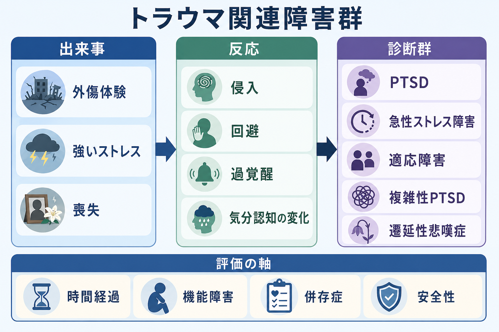
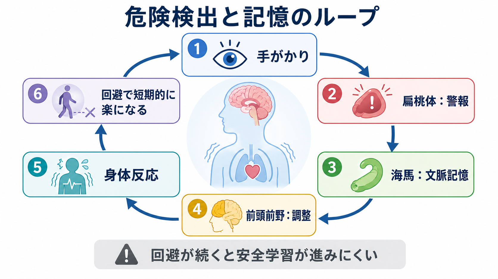
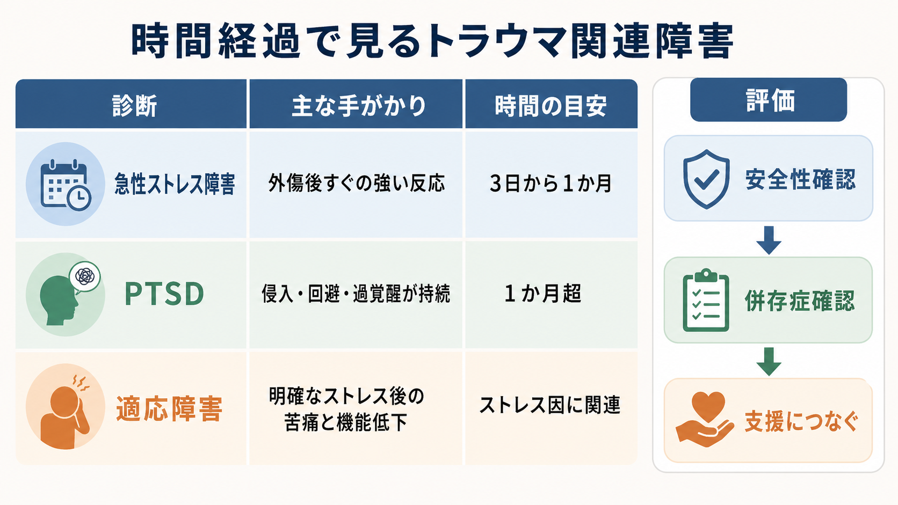

# トラウマ関連障害群とは何か

## 要点

- トラウマ関連障害群は、外傷体験や強いストレス因の後に生じる反応を、症状の型・時間経過・機能障害から整理する診断群である。DSM-5-TRでは「外傷およびストレス因関連障害群」として、[[PTSDとは何か|PTSD]]、急性ストレス障害、適応障害、反応性アタッチメント障害、脱抑制型対人交流障害、遷延性悲嘆症などを含む[1][2]。
- ICD-11では「ストレスに特異的に関連する障害群」として、PTSD、複雑性PTSD、遷延性悲嘆症、適応障害などが整理される。共通点は「同定できるストレス因が必要だが、それだけでは十分ではない」ことであり、症状の型・持続・生活機能への影響が診断上重要になる[3]。
- PTSDや急性ストレス障害では、侵入、回避、過覚醒、否定的な認知・気分の変化、解離などが焦点になる。一方、適応障害では外傷性出来事に限らず、離婚、病気、職場・家庭の葛藤などの心理社会的ストレス因に対する持続的な苦痛と機能低下が中心になる[3][4]。
- 本記事は教育・研究目的の整理であり、個別の診断や治療指示ではない。症状が生活を強く妨げる場合、自傷・自殺の危険がある場合、暴力や虐待が続いている場合は、専門職や地域の緊急支援につなぐ必要がある。

## この記事で答える問い

1. トラウマ関連障害群は、単なる「つらい記憶」と何が違うのか。
2. PTSD、急性ストレス障害、適応障害、複雑性PTSD、遷延性悲嘆症はどのように区別されるのか。
3. 外傷体験の後に、なぜ侵入、回避、過覚醒、解離、気分の変化が持続しうるのか。
4. 臨床・研究では、どのような評価軸で支援や研究仮説につなげるのか。

## まず結論

トラウマ関連障害群は、「強い出来事があったか」だけで決まる分類ではない。むしろ、出来事の後にどのような反応が生じ、それがどのくらい続き、本人の安全・生活・対人関係・学業や仕事をどの程度妨げているかを見る枠組みである[1][3]。

たとえば、外傷体験後すぐに眠れない、怖い場面が浮かぶ、音に過敏になる、避けたくなる、といった反応は珍しくない。多くは時間、保護的環境、社会的支援のなかで弱まる。しかし、反応が強く、生活機能を妨げ、特定の症状パターンとして持続すると、急性ストレス障害やPTSDとして評価されることがある[4][5]。適応障害では、出来事が「生命の危険を伴う外傷」でなくても、明確な心理社会的ストレス因に対する苦痛と適応困難が中心になる[3]。

## 背景

以前はPTSDが不安症の近くで理解されることが多かった。しかしDSM-5以降、PTSDは「外傷およびストレス因関連障害群」に移された。これは、PTSDが不安だけでなく、怒り、罪悪感、麻痺感、解離、睡眠障害、物質使用、対人困難などを伴いうるためである[2]。Merck Manualも、この診断群は通常の症状クラスターではなく、外傷性またはストレス性の出来事という見かけ上の病因によってまとめられる点で特徴的だと説明している[2]。

ICD-11では、PTSDを比較的絞った中核症状で定義し、複雑性PTSDをPTSD中核症状に加えて感情調整、否定的自己概念、対人関係の困難を伴う状態として整理する[3][7]。DSM-5-TRとICD-11は同じ対象を完全に同じ切り方で分類しているわけではないため、研究や臨床記録では、どの分類体系を使っているかを明示することが重要である。

## 基本概念

### 外傷体験とストレス因

PTSDや急性ストレス障害では、実際の死、死の危険、重傷、性的暴力への直接体験、目撃、近親者や親しい人に起きた外傷性出来事を知ること、または職務上の反復的な詳細曝露などが診断上の入り口になる[4]。一方、適応障害や遷延性悲嘆症では、ストレス因はより広い。離婚、病気、失業、家族・職場の葛藤、死別など、生活史上の重大な変化が焦点になりうる[3]。

重要なのは、出来事の「客観的な大きさ」だけで反応を決めつけないことである。同じ出来事でも、年齢、過去の外傷歴、社会的支援、身体的安全、文化的背景、併存する[[うつ病とは何か|うつ病]]や[[パニック症とは何か|パニック症]]、物質使用、睡眠、慢性疼痛などによって反応は変わる[5][6]。

### 主な診断群の見取り図

| 診断・概念 | 中心となる手がかり | 時間の目安 | 注意点 |
|---|---|---|---|
| 急性ストレス障害 | 外傷後の侵入、回避、過覚醒、解離など | 外傷後3日から1か月 | PTSDの単純な予測因子ではなく、急性期の苦痛と機能障害を評価する枠組み[5] |
| PTSD | 侵入、回避、否定的認知・気分、過覚醒が持続 | 1か月超 | DSM-5-TRでは成人PTSD基準はDSM-5から大きく変わっていない[4] |
| 複雑性PTSD | PTSD中核症状に加え、感情調整、自己概念、対人関係の障害 | ICD-11で明確化 | [[パーソナリティ障害と複雑性PTSDはどう関係するのか|パーソナリティ障害との鑑別]]が臨床的に重要 |
| 適応障害 | 明確なストレス因への過度なとらわれ、反すう、適応困難 | 通常ストレス因後1か月以内に出現し、ストレス因が続かなければ6か月以内に軽快しやすい | 外傷性出来事に限定されない[3] |
| 遷延性悲嘆症 | 死別後の強い yearning、故人への持続的没頭、機能障害 | DSM-5-TRでは成人で死別後12か月以上、小児・青年で6か月以上が目安 | 文化的・宗教的文脈を踏まえる必要がある[1] |

## 仕組み

### 危険検出と記憶の結びつき

トラウマ後反応の中心には、「過去の危険」が「現在の危険」として再活性化される過程がある。扁桃体は脅威検出に、海馬は文脈記憶に、前頭前野は情動反応の調整に関わるとされ、PTSD研究ではこれらの回路の機能的変化が繰り返し議論されてきた[6][7]。

この説明は、単純に「扁桃体が強すぎる」「前頭前野が弱い」という一方向の図式では不十分である。実際には、外傷の種類、発達段階、性差、遺伝・エピジェネティクス、睡眠、疼痛、社会的安全、併存症などが絡む[6]。そのため、神経生物学的知見は、個人を診断する単独指標というより、症状がなぜ固定化しうるのかを理解する補助線として使うのが妥当である。

### 回避の短期的利益と長期的コスト

回避は、本人の弱さではなく、危険を避けるための適応的反応として始まることが多い。トラウマを思い出す場所、人、会話、ニュース、匂い、身体感覚を避けると、その瞬間の苦痛は下がる。しかし、回避が続くと「今は安全である」と学び直す機会が減り、手がかりへの恐怖や身体反応が保たれやすくなる[4][6]。

このため、トラウマ焦点化心理療法では、安全確保と安定化を前提に、記憶、感情、身体反応、意味づけ、回避行動を段階的に扱う。NICEはPTSDの認識・評価・治療について、トラウマ焦点化CBTやEMDRなどを含む推奨を示しているが、実際の選択は年齢、症状、併存症、本人の希望、文化的背景、利用可能性を踏まえて行われる[8]。

### 解離と身体反応

急性ストレス障害では、周囲が現実でない感じ、自分が自分でない感じ、出来事の一部を思い出せない感じなど、解離症状が目立つことがある[5]。解離は苦痛から距離を取る反応として理解できる一方、記憶の統合、対人関係、安全確認を難しくする場合がある。PTSDでも解離性のサブタイプが問題になることがあり、評価では「思い出すかどうか」だけでなく、身体感覚、時間感覚、現実感、自己感の変化を丁寧に見る必要がある。

## 図解

上の3枚の図は、診断名を機械的に振り分けるためではなく、評価で見る軸を整理するための図である。

1枚目は、出来事、反応、診断群、評価軸の全体地図である。外傷体験の有無だけでなく、症状の型、時間経過、機能障害、安全性、併存症を同時に見る必要がある。

2枚目は、危険検出、文脈記憶、前頭前野による調整、身体反応、回避が循環しうることを示している。これはPTSDを「記憶の失敗」だけでなく、脅威予測と安全学習の問題として理解するための図である。

3枚目は、急性ストレス障害、PTSD、適応障害を時間経過で比較する図である。時間だけで診断が決まるわけではないが、急性期、1か月以降、ストレス因の持続、機能障害の程度は重要な評価軸になる[3][5]。

## 臨床・研究との接続

臨床評価では、最初に安全性を確認する。現在も暴力・虐待・搾取・災害・住居喪失が続いている場合、心理療法の技法以前に安全確保と生活支援が優先される。自殺念慮、自傷、他害、重い物質使用、精神病症状、重い解離、重度の不眠がある場合も、早期の専門的評価が必要である。

次に、症状の束を確認する。侵入、回避、過覚醒、否定的な認知・気分、解離、悲嘆、反すう、抑うつ、不安、怒り、罪悪感、身体症状、睡眠、対人関係を分けて見る。[[PTSDとうつ病はどう併存するのか|PTSDとうつ病の併存]]のように、トラウマ関連症状と気分症状は重なりやすく、どちらか一方だけで説明しようとすると見落としが生じる。

研究では、DSM-5-TRとICD-11の分類差、急性期反応から慢性化への予測、複雑性PTSDとパーソナリティ機能の区別、文化差、治療反応、神経回路・内分泌・免疫指標の位置づけが主要な論点になる[6][7]。ただし、バイオマーカー研究は有望であっても、現時点で個人の診断や治療選択を単独で決めるものではない。

## よくある誤解

### 誤解1: トラウマ関連障害は「弱い人」がなる

トラウマ後反応は、危険を検出し、回避し、身体を警戒状態に置くという防御システムと関係する。問題は、その反応が安全な現在にも残り、生活を狭めることである。性格の弱さや努力不足として説明すると、支援へのアクセスを妨げる。

### 誤解2: つらい出来事を経験したら必ずPTSDになる

外傷体験後の一時的な反応は多いが、多くの人は時間と支援のなかで回復する。PTSDや急性ストレス障害は、症状の型、持続、苦痛、機能障害を満たす場合に検討される[4][5]。

### 誤解3: 忘れれば治る

治療の目標は、出来事を消すことではなく、現在の安全、身体反応、記憶の意味づけ、回避、対人関係を扱いやすくすることである。無理に思い出させることも、完全に避け続けることも、どちらも単純な解決ではない。

### 誤解4: 適応障害は軽い問題である

適応障害は、ストレス因への反応が生活機能を大きく妨げる場合に重要な診断になる。PTSDほど外傷基準が狭くないため軽視されやすいが、うつ、不安、自殺リスク、休職・退学、対人関係の破綻とつながることがある[3]。

## 関連ノート

- [[PTSDとは何か]]
- [[PTSDとうつ病はどう併存するのか]]
- [[パーソナリティ障害と複雑性PTSDはどう関係するのか]]
- [[うつ病とは何か]]
- [[パニック症とは何か]]

今後の作成候補: 急性ストレス障害とは何か、適応障害とは何か、複雑性PTSDとは何か、遷延性悲嘆症とは何か、トラウマ焦点化認知行動療法とは何か、EMDRとは何か、解離症状とは何か。

MOC更新候補: `content/00_MOC/` 配下の精神医学、疾患・症候群、臨床実践、心理療法、トラウマ関連のMOC。並列生成ジョブとの競合を避けるため、本記事ではMOC本体は更新しない。

## 理解チェック

1. PTSDと急性ストレス障害は、症状の重なりに加えて、どの時間軸で区別されるか。
2. 適応障害がPTSDと異なる点を、ストレス因と症状の中心から説明できるか。
3. 回避が短期的には役に立つ一方で、長期的には症状を保ちうる理由を説明できるか。
4. DSM-5-TRとICD-11で、複雑性PTSDや遷延性悲嘆症の扱いがどう異なるかを確認できるか。
5. 個別診断ではなく教育・研究目的の記事として、どのような安全上の留意点を添えるべきか。

## 未解決問題

- 急性期のどの反応が慢性化を最もよく予測するのかは、外傷の種類、発達段階、社会的支援、併存症によって異なり、単純な予測式にはしにくい。
- 複雑性PTSD、境界性パーソナリティ障害、解離症、発達性トラウマをどの分類体系で整理するかは、臨床実践と研究でなお議論がある。
- 神経画像、内分泌、免疫、睡眠、デジタル行動指標を、個人の支援計画にどこまで統合できるかは今後の課題である。
- 文化的文脈、災害、戦争、移民・難民経験、ジェンダーに基づく暴力などを、標準化尺度と個別の語りの両方でどう扱うかが重要である。

## 参考文献

[1] American Psychiatric Association. (2022). *Diagnostic and Statistical Manual of Mental Disorders, Fifth Edition, Text Revision (DSM-5-TR)*. American Psychiatric Association Publishing. https://doi.org/10.1176/appi.books.9780890425787

[2] Barnhill, J. W. (2026, modified). *Overview of Trauma- and Stressor-Related Disorders*. Merck Manual Professional Edition. https://www.merckmanuals.com/professional/psychiatric-disorders/anxiety-and-trauma-and-stressor-related-disorders/overview-of-trauma-and-stressor-related-disorders

[3] World Health Organization. (2025). *ICD-11 for Mortality and Morbidity Statistics: Disorders specifically associated with stress*. https://icd.who.int/browse/2025-01/mms/en#991786158

[4] National Center for PTSD. (2025). *PTSD and DSM-5*. U.S. Department of Veterans Affairs. https://www.ptsd.va.gov/professional/treat/essentials/dsm5_ptsd.asp

[5] National Center for PTSD. (2026). *Acute Stress Disorder*. U.S. Department of Veterans Affairs. https://www.ptsd.va.gov/understand/related/acute_stress.asp

[6] Yehuda, R., Hoge, C. W., McFarlane, A. C., Vermetten, E., Lanius, R. A., Nievergelt, C. M., Hobfoll, S. E., Koenen, K. C., Neylan, T. C., & Hyman, S. E. (2015). Post-traumatic stress disorder. *Nature Reviews Disease Primers, 1*, 15057. https://doi.org/10.1038/nrdp.2015.57

[7] Karatzias, T., Knefel, M., Maercker, A., Cloitre, M., Reed, G., Bryant, R. A., Ben-Ezra, M., Kazlauskas, E., Jowett, S., Shevlin, M., & Hyland, P. (2022). The network structure of ICD-11 disorders specifically associated with stress: Adjustment disorder, prolonged grief disorder, posttraumatic stress disorder, and complex posttraumatic stress disorder. *Psychopathology, 55*(3-4), 226-234. https://doi.org/10.1159/000523825

[8] National Institute for Health and Care Excellence. (2018, last reviewed 2025). *Post-traumatic stress disorder* (NICE guideline NG116). https://www.nice.org.uk/guidance/ng116
