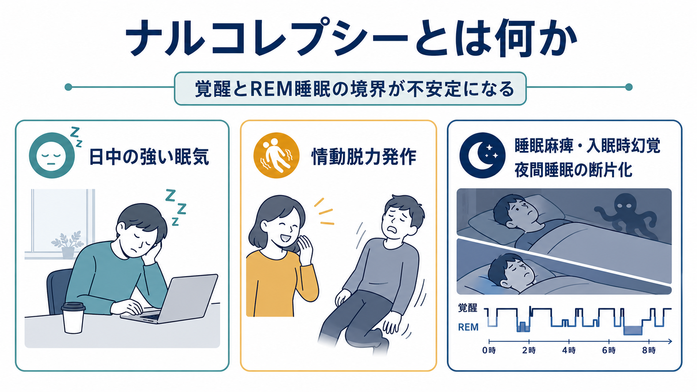
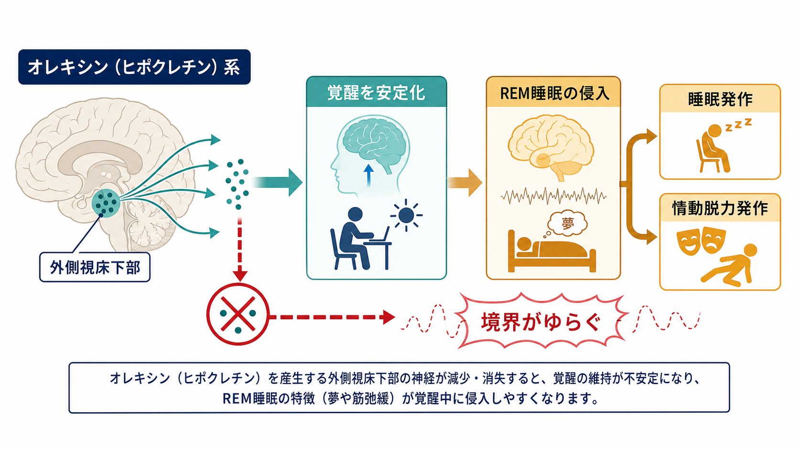
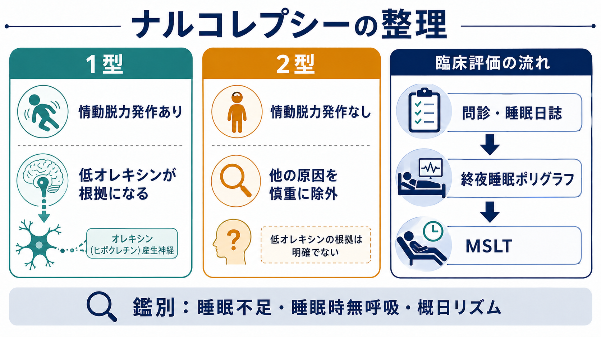

# ナルコレプシーとは何か

## 要点

- ナルコレプシーは、単に「よく眠る」状態ではなく、覚醒とREM睡眠の境界が不安定になる[[睡眠障害とは何か|睡眠・覚醒調節]]の障害である。
- 中核症状は、日中の強い眠気、反復する睡眠発作、情動脱力発作、睡眠麻痺、入眠時または出眠時幻覚、夜間睡眠の断片化である[1][2]。
- 1型ナルコレプシーでは、外側視床下部のオレキシン、別名ヒポクレチンを産生する神経系の欠乏が重要で、情動脱力発作または髄液オレキシン低値が診断上の手がかりになる[3][4]。
- 2型ナルコレプシーは、情動脱力発作がなく、他の[[過眠障害とは何か|過眠障害]]、睡眠不足、睡眠時無呼吸、概日リズム睡眠・覚醒障害、薬剤・物質、精神疾患などを慎重に除外して考える[2][5]。
- 本記事は教育・研究目的の概説であり、個別の診断や治療方針を示すものではない。

## この記事で答える問い

1. ナルコレプシーでは、なぜ「起きていたい場面で眠ってしまう」のか。
2. 情動脱力発作、睡眠麻痺、入眠時幻覚は、同じ仕組みで理解できるのか。
3. 1型と2型は何が違い、診断では何を確認するのか。
4. 精神医学・神経科学・臨床評価では、どこに注意して読むべきか。

## まず結論

ナルコレプシーは、睡眠時間が長すぎる病気というより、覚醒を安定して保つシステムが弱くなり、REM睡眠に特徴的な現象が覚醒中または入眠直後に入り込みやすくなる状態である。したがって、日中の眠気だけでなく、笑う・驚くなどの感情で筋力が抜ける情動脱力発作、目が覚めているのに体が動かない睡眠麻痺、夢のような知覚体験、夜間睡眠の断片化を合わせて見る必要がある[1][2]。

## 背景

[[過眠とは何か|過眠]]の訴えは、睡眠不足、交代勤務、睡眠時無呼吸、うつ病、薬剤、物質使用、神経疾患など多くの原因で起こる。ナルコレプシーはその中でも、日中の眠気に加えてREM睡眠関連現象が目立つ点が特徴である[1][5]。

歴史的には、情動脱力発作を伴う典型例が「ナルコレプシー」として認識されてきた。現在は、情動脱力発作または髄液オレキシン低値を伴う1型と、情動脱力発作を伴わない2型に分けて整理される[2][6]。ただし2型は、将来1型として再分類される例や、他の過眠原因が後から明らかになる例もあり、診断名を固定的なラベルとして扱いすぎないことが重要である[2][5]。

## 基本概念

### 日中の強い眠気と睡眠発作

中核は、毎日のように生じる耐えがたい眠気である。会議、授業、読書、乗り物の中など単調な場面で目立ちやすいが、重い場合には会話や食事中にも眠気が入り込む。短い仮眠で一時的にすっきりすることがある点は、他の過眠状態との比較で重要になる[1][5]。

### 情動脱力発作

情動脱力発作は、笑い、驚き、怒り、喜びなどの感情をきっかけに、意識は保たれたまま、顔、頸部、膝、全身の筋緊張が数秒から数分ほど抜ける現象である。これは1型ナルコレプシーを強く示唆する症状であり、てんかん、失神、転倒発作、機能性神経症状などとの鑑別が必要になる[1][2]。

### 睡眠麻痺と入眠時・出眠時幻覚

睡眠麻痺は、入眠時または覚醒直後に意識はあるのに身体を動かしにくい状態である。入眠時幻覚・出眠時幻覚は、眠りに入る時または目覚める時に生じる夢様の視覚・聴覚・体性感覚体験である。これらは一般人口にも起こりうるが、日中の強い眠気や情動脱力発作と組み合わさると、ナルコレプシーの評価で重要になる[1][2]。

### 夜間睡眠の断片化

ナルコレプシーでは「日中眠いのだから夜はよく眠れる」とは限らない。夜間睡眠が途切れやすく、浅い眠り、頻回覚醒、鮮明な夢、REM睡眠関連症状が目立つことがある[1][6]。

## 仕組み

1型ナルコレプシーの中心には、外側視床下部にあるオレキシン、またはヒポクレチンを産生する神経細胞の選択的な減少・機能低下がある。オレキシン系は、脳幹・視床下部・大脳皮質に広く作用し、[[脳幹網様体は覚醒ネットワークで何をしているのか|覚醒ネットワーク]]を安定化し、睡眠と覚醒の切り替わりをはっきり保つ役割をもつ[3][4]。

オレキシン系が弱くなると、覚醒状態を維持する力が低下するだけでなく、REM睡眠で通常みられる筋緊張低下や夢様体験が、覚醒中または入眠直後に入り込みやすくなる。情動脱力発作は、覚醒中にREM睡眠様の筋弛緩が情動刺激によって誘発される現象として理解できる[2][6]。

免疫学的には、1型ナルコレプシーはHLA-DQB1*06:02との関連が強く、感染などの環境因子と遺伝的素因が相互作用し、オレキシン神経に対する免疫介在性の障害を起こすという仮説が有力である。ただし、全例を一つの自己抗体だけで説明できる段階にはなく、発症機序には未解決の部分が残る[7]。

## 図解

ナルコレプシーを理解する時は、症状をばらばらに覚えるよりも、次の3層で整理するとよい。

| 層 | 見るもの | 例 |
|---|---|---|
| 症状 | 日常で何が起きるか | 日中の眠気、睡眠発作、情動脱力発作、睡眠麻痺 |
| 機序 | 何が不安定になるか | 覚醒維持、REM睡眠の境界、筋緊張制御 |
| 評価 | 何を除外・確認するか | 睡眠不足、睡眠時無呼吸、概日リズム、薬剤、MSLT |

## 臨床・研究との接続

診断評価では、まず睡眠不足や不規則な睡眠スケジュールを確認する。AASMのMSLTプロトコルでは、検査前に睡眠日誌、可能ならアクチグラフィで2週間程度の睡眠を確認し、薬剤・物質、カフェイン、既存の睡眠障害の影響を整理することが重視される[5]。

標準的には、終夜睡眠ポリグラフで睡眠時無呼吸などを評価し、その翌日にMSLTを行う。MSLTでは、平均睡眠潜時が短いか、入眠時REM睡眠期が複数回みられるかを確認する。ただし、慢性的な睡眠不足、交代勤務、概日リズムのずれ、未治療の睡眠時無呼吸、薬剤の中止・影響でも偽陽性・偽陰性が起こりうる[1][5]。

治療は、規則的な睡眠、短時間の計画的仮眠、学業・職場での配慮、安全運転の評価、薬物療法を組み合わせる。AASMの治療ガイドラインは、成人・小児の中枢性過眠症に対して複数の薬物療法を推奨または条件付き推奨として整理しているが、適応、禁忌、副作用、併存症を含めて睡眠医療の専門的評価が必要である[8]。

研究面では、オレキシン神経の喪失がどのように起きるのか、2型ナルコレプシーの生物学的実体は何か、免疫介入やオレキシン受容体作動薬がどの段階で有効になりうるかが重要な課題である[6][7]。

## よくある誤解

### 「眠気が強いならナルコレプシーである」

眠気はナルコレプシーの中核症状だが、眠気だけでは診断できない。睡眠不足、[[不眠障害とは何か|不眠]]、睡眠時無呼吸、[[概日リズムの乱れは精神疾患にどう関わるのか|概日リズムの乱れ]]、うつ病、薬剤、物質などの方が頻度としてはよくみられる[1][5]。

### 「情動脱力発作は失神である」

情動脱力発作では、典型的には意識が保たれる。倒れることはあっても、意識消失を主徴とする失神や発作とは評価の観点が異なる[2][6]。

### 「夜に眠れないならナルコレプシーではない」

ナルコレプシーでは夜間睡眠が断片化しうる。日中の眠気と夜間の睡眠の質は、単純な反比例ではなく、睡眠・覚醒状態の安定性として捉える必要がある[1][2]。

### 「2型は軽い1型である」

2型は情動脱力発作がなく、髄液オレキシンが低値でないことが多い。1型と連続する例もあるが、診断上は除外診断の性格が強く、病態はまだ不明な部分が大きい[2][6]。

## 関連ノート

- [[過眠障害とは何か]]
- [[過眠とは何か]]
- [[睡眠障害とは何か]]
- [[不眠障害とは何か]]
- [[睡眠障害は脳機能にどのような影響を与えるのか]]
- [[脳幹網様体は覚醒ネットワークで何をしているのか]]
- [[覚醒と意識内容は何が違うのか]]
- [[概日リズムの乱れは精神疾患にどう関わるのか]]
- [[精神科診察で睡眠をどう評価するか]]

## 理解チェック

1. ナルコレプシーの眠気を、単なる睡眠時間の不足ではなく「状態境界の不安定性」として説明するとどうなるか。
2. 情動脱力発作と睡眠麻痺は、どちらもREM睡眠関連現象としてどのように結びつくか。
3. 2型ナルコレプシーを考える前に、どのような過眠原因を除外する必要があるか。
4. MSLTの結果を読む時、睡眠不足や概日リズムのずれはなぜ問題になるか。

## 参考文献

[1] Slowik JM, Collen JF, Yow AG. Narcolepsy. *StatPearls*. Last Update: 2023-06-12. https://www.ncbi.nlm.nih.gov/books/NBK459236/

[2] Scammell TE. Narcolepsy. *New England Journal of Medicine*. 2015;373(27):2654-2662. https://doi.org/10.1056/NEJMra1500587

[3] Peyron C, Faraco J, Rogers W, et al. A mutation in a case of early onset narcolepsy and a generalized absence of hypocretin peptides in human narcoleptic brains. *Nature Medicine*. 2000;6(9):991-997. https://doi.org/10.1038/79690

[4] Nishino S, Ripley B, Overeem S, Lammers GJ, Mignot E. Hypocretin (orexin) deficiency in human narcolepsy. *The Lancet*. 2000;355(9197):39-40. https://doi.org/10.1016/S0140-6736(99)05582-8

[5] Krahn LE, Arand DL, Avidan AY, et al. Recommended protocols for the Multiple Sleep Latency Test and Maintenance of Wakefulness Test in adults: guidance from the American Academy of Sleep Medicine. *Journal of Clinical Sleep Medicine*. 2021;17(12):2489-2498. https://doi.org/10.5664/jcsm.9620

[6] Bassetti CLA, Adamantidis A, Burdakov D, et al. Narcolepsy - clinical spectrum, aetiopathophysiology, diagnosis and treatment. *Nature Reviews Neurology*. 2019;15(9):519-539. https://doi.org/10.1038/s41582-019-0226-9

[7] Liblau RS, Latorre D, Kornum BR, Dauvilliers Y, Mignot EJ. The immunopathogenesis of narcolepsy type 1. *Nature Reviews Immunology*. 2024;24(1):33-48. https://doi.org/10.1038/s41577-023-00902-9

[8] Maski K, Trotti LM, Kotagal S, et al. Treatment of central disorders of hypersomnolence: an American Academy of Sleep Medicine clinical practice guideline. *Journal of Clinical Sleep Medicine*. 2021;17(9):1881-1893. https://doi.org/10.5664/jcsm.9328

## 未解決問題

- 1型ナルコレプシーでオレキシン神経が選択的に障害される直接機序は、どこまで免疫学的に説明できるのか。
- 2型ナルコレプシーは単一の疾患単位なのか、それとも異なる過眠病態の集合なのか。
- オレキシン受容体作動薬や免疫介入は、症状緩和だけでなく病態修飾に結びつくのか。
- 日常生活、学業、就労、運転安全をどう評価し、過度な制限とリスク軽視の両方を避けるか。

## MOC更新候補

- `content/00_MOC/` 配下の精神医学、睡眠障害、神経科学関連MOCに追加候補。
- 並列生成ジョブとの衝突を避けるため、本タスクではMOC本体は更新しない。
