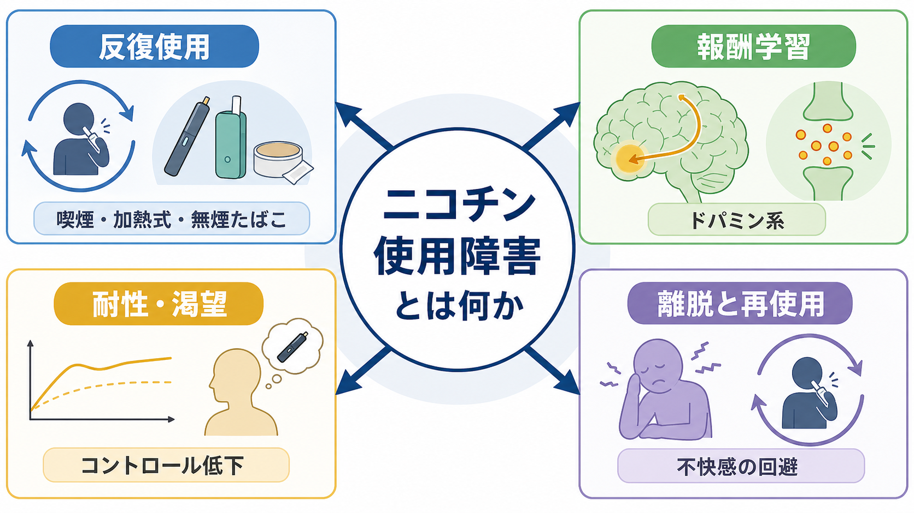
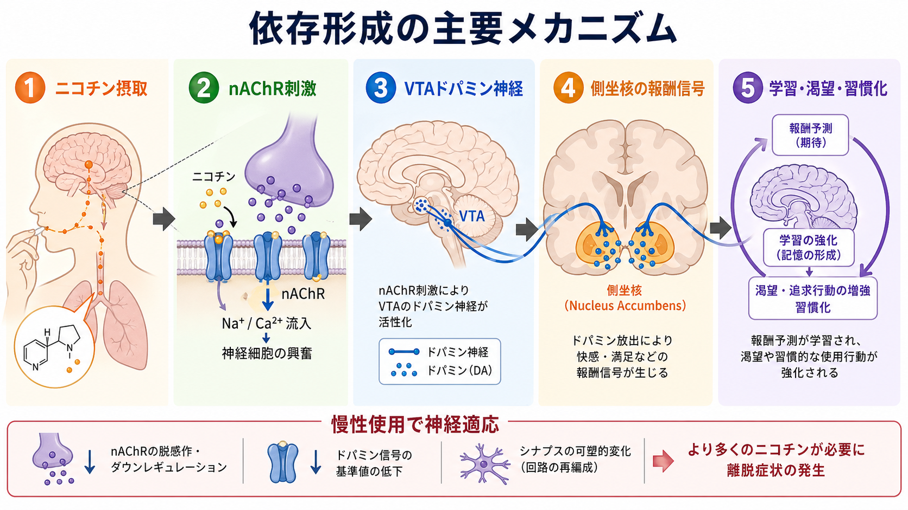
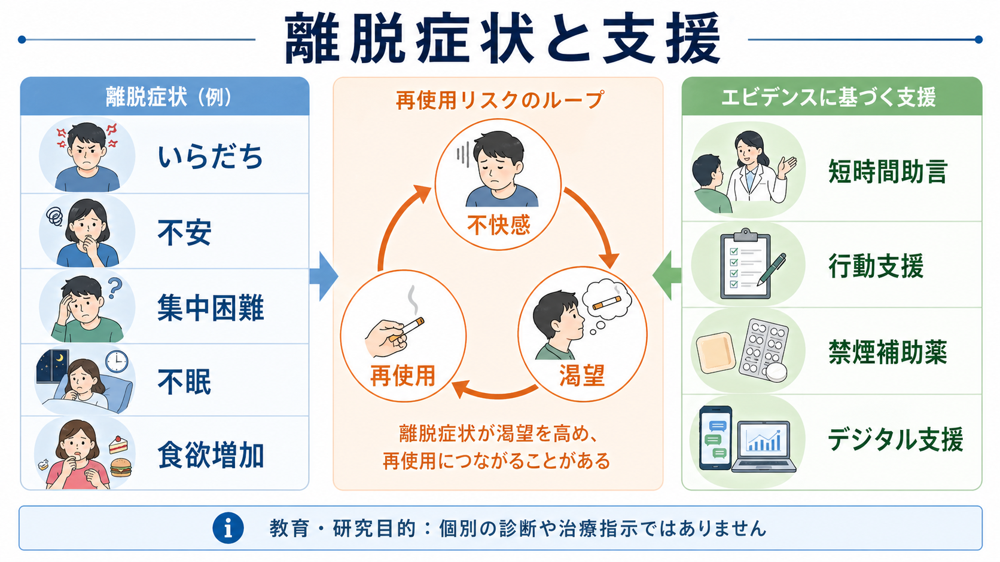

# ニコチン使用障害とは何か

## 要点

- ニコチン使用障害は、紙巻きたばこ、加熱式たばこ、無煙たばこ、電子ニコチン送達製品などを通じたニコチン摂取が、健康・生活・対人関係・役割機能に明らかな不利益をもたらしても制御しにくくなる状態として理解できる。
- DSM-5-TRの物質使用障害の枠組みでは、使用量や期間の制御困難、やめたいのにやめられない、渇望、役割障害、有害な使用継続、耐性、離脱などを、12か月間の症状数で重症度評価する[1]。
- ニコチンはニコチン性アセチルコリン受容体（nAChR）に作用し、VTAから側坐核へ向かう中脳辺縁系ドパミン経路を含む報酬・学習回路を変化させる。慢性使用では受容体脱感作・アップレギュレーション、手がかり反応性、離脱回避が重なり、再使用が起こりやすくなる[3][4][5]。
- 離脱症状には、いらだち、不安、集中困難、落ち着かなさ、抑うつ気分、不眠、食欲増加、強い渇望などがあり、最後の喫煙から数時間で始まり、数日でピークに達し、数週間続くことが多い[3][6]。
- 支援は「意志を強くする」だけではなく、行動支援、短時間助言、デジタル支援、禁煙補助薬、再使用時の再評価を組み合わせる。WHOは2024年の成人向け禁煙治療ガイドラインで、短時間助言、集中的行動支援、デジタル介入、NRT・バレニクリン・ブプロピオン・シチシンなどを推奨している[7]。

## この記事で答える問い

1. ニコチン使用障害は、単なる「喫煙習慣」や「意志の弱さ」と何が違うのか。
2. ニコチンはどのように報酬系、学習、渇望、離脱に関わるのか。
3. 離脱症状はなぜ再使用につながりやすいのか。
4. 臨床・研究では、どのような評価と支援の観点が重要になるのか。

## まず結論

ニコチン使用障害は、ニコチンを含む製品を使う行動が「快感を得る行動」から、「渇望や不快感を避けるために繰り返される行動」へ変化していく障害である。初期には覚醒感、集中しやすさ、気分の一時的改善、社会的場面の手がかりなどが使用を強める。反復されると、脳はニコチンがある状態を前提に調整され、ニコチンが切れたときの不快感や渇望が次の使用を押し出す。

この過程は、[[物質使用障害とは何か]]で扱う一般的な依存の枠組みと重なるが、ニコチンには独特の特徴がある。肺から急速に吸収される喫煙では、ニコチンが短時間で脳へ到達し、効果も比較的早く薄れるため、摂取と効果低下のサイクルが高頻度で繰り返される[3]。そのため、本人にとっては「強い酩酊」よりも、「日常の一部になっているのに、やめると強くつらい」という形で問題化しやすい。

## 背景

ニコチンは、たばこ製品の依存形成に中心的に関わるアルカロイドである。紙巻きたばこだけでなく、加熱式たばこ、無煙たばこ、ニコチンパウチ、電子ニコチン送達製品など、摂取経路は多様化している。製品や経路が違っても、依存形成の中核には、ニコチンの薬理作用、摂取パターン、環境手がかり、離脱症状の回避がある。

DSM-5-TRの枠組みでは、物質使用障害は「病的な使用パターン」によって、機能障害や苦痛が生じる状態として整理される。MSD ManualのDSM-5-TR解説では、基準は大きく制御困難、社会的障害、危険な使用、薬理学的特徴に分類され、12か月間に2項目以上を満たす場合に物質使用障害と考える[1]。ニコチンの場合も、量だけでなく、やめる試みの失敗、渇望、朝起きてすぐ使う、使用できない状況での強い不快感、生活上の影響を合わせて見る必要がある。

ニコチン使用障害は、公衆衛生上も大きな課題である。WHOは、たばこ使用が世界で年間800万人以上の死亡に関わる重大な健康リスクであり、禁煙支援を包括的なたばこ対策の中核に位置づけている[7]。ただし本稿は教育・研究目的の整理であり、個別の診断や治療指示ではない。

## 基本概念

### ニコチン使用、ニコチン依存、ニコチン使用障害

「ニコチン使用」は、ニコチンを含む製品を使う行動そのものを指す。使用があるだけでは、ただちに障害とはいえない。問題になるのは、使用が本人の健康、学業・仕事、家庭、対人関係、経済、事故リスク、身体疾患の悪化などに不利益をもたらしても、使用調整が難しくなる場合である。

「依存」は、日常語では広く使われるが、臨床では制御困難、渇望、耐性、離脱、生活機能への影響を含む多面的な概念である。Bakerらは、たばこ依存の評価では、強い渇望、離脱症状、起床後どれくらい早く喫煙するか、喫煙本数などが重要な依存指標になると整理している[2]。

### 耐性と離脱

耐性とは、同じ効果を得るためにより多くのニコチンが必要になる、または同じ量では効果が弱くなる現象である。離脱とは、反復使用後にニコチンが減ったり止まったりしたときに生じる不快な精神・身体症状である。

ニコチン離脱では、いらだち、怒りっぽさ、不安、集中困難、落ち着かなさ、抑うつ気分、不眠、食欲増加、体重増加、渇望などが目立つ[2][3]。これらは「やめる意味がない」という証拠ではなく、脳と身体がニコチンのない状態へ再調整している途中に起こる症状として理解できる。

### 渇望と手がかり

渇望は、単なる「欲しい気持ち」ではなく、環境手がかり、身体状態、気分、記憶、予測が結びついた強い使用衝動である。NIDAは、たばこに関連する匂い、視覚、手で扱う行為、喫煙の儀式などが、報酬系のドパミン反応と結びつき、禁煙中の渇望を強めることがあると説明している[3]。

この点は、[[依存症は報酬学習の病態としてどう理解できるのか]]や[[報酬系とは何か]]と接続する。ニコチンそのものの薬理作用だけでなく、「朝のコーヒー」「休憩時間」「ストレス後」「飲酒場面」「特定の人間関係」といった手がかりが、次の使用を引き出す学習刺激になる。

## 仕組み

### nAChRからドパミン系へ

ニコチンは脳内のニコチン性アセチルコリン受容体（nAChR）に作用する。特に、VTAのドパミン神経やその入力にあるnAChRが刺激されると、側坐核や前頭前野へ向かうドパミン信号が変化し、報酬、動機づけ、注意、学習に影響する[4][5]。この経路は、[[ドパミンは報酬だけの物質なのか]]で扱うように、単純な快楽物質ではなく、予測、学習、行動選択を支える信号として働く。

### 慢性使用による神経適応

ニコチンは内因性アセチルコリンと異なり、受容体周辺で長く作用しやすい。慢性使用では、nAChRの脱感作やアップレギュレーション、グルタミン酸・GABA・ドパミン系のバランス変化などが起こり、ニコチンがない状態で不快感や報酬低下が生じやすくなる[4][5]。

この神経適応は、使用を「快感の追求」だけで説明しにくくする。時間が経つほど、使用は快感を増やすためだけでなく、離脱による不快感を下げるための負の強化として維持される。つまり、ニコチンを使うことで一時的に「普通に戻る」感覚が生じ、その経験が次の使用を強化する。

### 高頻度の自己投与サイクル

喫煙では、吸入後にニコチンが急速に血中へ入り、短時間で脳へ到達する。NIDAは、紙巻きたばこの喫煙ではニコチン濃度が吸入後およそ10秒で脳に達し、急性効果が比較的早く薄れるため、効果維持と離脱回避のために反復摂取が起こりやすいと説明している[3]。

この速い立ち上がりと低下は、[[報酬予測誤差とは何か]]で扱う学習信号と相性がよい。短い間隔で「摂取する」「少し楽になる」「また切れる」が繰り返されるため、手がかりと行動の結びつきが強化される。

## 図解

図1は、ニコチン使用障害を、反復使用、報酬学習、耐性・渇望、離脱と再使用の循環として整理したものである。図2は、nAChR刺激からVTAドパミン神経、側坐核、学習・渇望・習慣化へ至る主要メカニズムを示している。

図3は、離脱症状と支援の接続を示す。離脱症状は再使用を促すリスクになるが、短時間助言、行動支援、禁煙補助薬、デジタル支援などを組み合わせることで、再使用を「失敗」として固定せず、次の計画修正につなげられる。

## 臨床・研究との接続

### 評価では製品名だけでなくパターンを見る

評価では、「紙巻きか加熱式か」だけでなく、使用開始年齢、使用頻度、1日の量、起床後最初の使用までの時間、使用できないときの症状、過去の禁煙試行、再使用のきっかけ、併用物質、身体疾患、精神症状、生活環境を確認する。[[物質使用歴はどのように聞くべきか]]で扱うように、物質使用歴は非難ではなく、健康・安全・支援計画のための情報として聞く必要がある。

特に、ニコチン使用障害では「朝起きてすぐ使う」「使用できない場所で強く落ち着かない」「禁煙後の数日で再使用する」「ストレスや飲酒場面で戻る」といった情報が重要になる。Bakerらが示すように、起床後の喫煙潜時、使用量、渇望、離脱症状は、たばこ依存の実用的な評価指標になりうる[2]。

### 支援は行動支援と薬物療法を組み合わせる

CDCは、たばこ使用と依存を慢性・再発性の状態として扱い、反復的な介入と長期的支援が必要になりうると説明している[6]。WHOの2024年ガイドラインは、成人の禁煙支援として、医療者による30秒から3分程度の短時間助言、より集中的な個別・集団・電話カウンセリング、デジタル介入、NRT・バレニクリン・ブプロピオン・シチシンなどの薬物療法を推奨している[7]。

ただし、どの支援が適切かは、年齢、妊娠、併存疾患、使用製品、併用薬、精神症状、本人の希望、過去の副作用などによって変わる。この記事は教育・研究目的の整理であり、個別の禁煙補助薬の選択や用量調整は医療専門職の判断が必要である。

### 研究では「依存の単一原因」ではなく多層モデルで見る

研究では、薬理作用、受容体変化、ドパミン信号、手がかり反応性、ストレス、睡眠、認知制御、社会環境を分けて考える必要がある。たとえば、同じニコチン量でも、摂取速度、製品デザイン、社会的受容、使用場面、ストレス負荷、併存する不安や抑うつによって、渇望や再使用リスクは変わる。

このため、ニコチン使用障害は[[依存は学習の病態として説明できるのか]]、[[報酬系とは何か]]、[[ドパミンは報酬だけの物質なのか]]、[[物質使用障害とは何か]]を接続する具体例として有用である。

## よくある誤解

### 誤解1: ニコチン使用障害は「意志が弱い人」の問題である

誤りである。本人の選択や価値観は重要だが、ニコチン使用障害では薬理作用、学習、離脱、ストレス、環境手がかり、社会的条件が重なる。道徳的非難は、問題の理解と支援へのアクセスを妨げる。

### 誤解2: 軽い製品なら依存は起こらない

誤りである。依存リスクは製品名だけでは決まらない。ニコチン濃度、摂取速度、使用頻度、使用できないときの症状、若年開始、精神症状、社会環境が関わる。紙巻きたばこ以外の製品でも、ニコチン依存と離脱は問題になりうる[7]。

### 誤解3: 禁煙後に再使用したら支援は失敗である

誤りである。再使用は重要な情報であり、どの手がかり、症状、場面、支援不足が関わったかを見直す機会になる。慢性・再発性の状態として扱うなら、再使用後の再評価、薬物療法の調整、行動計画の修正、周囲の支援設計が重要になる[6][7]。

### 誤解4: 離脱症状は危険だから急にやめてはいけない

ニコチン離脱はつらいが、多くの場合は生命を脅かす離脱ではない。ただし、強い抑うつ、不眠、妊娠、重い身体疾患、精神疾患、他の物質使用、薬剤との相互作用がある場合は、専門職と相談しながら計画するほうが安全である。

## 関連ノート

### 既存ノート

- [[物質使用障害とは何か]]
- [[物質使用歴はどのように聞くべきか]]
- [[依存症は報酬学習の病態としてどう理解できるのか]]
- [[依存は学習の病態として説明できるのか]]
- [[報酬系とは何か]]
- [[報酬予測誤差とは何か]]
- [[ドパミンは報酬だけの物質なのか]]

### MOC更新候補

- `content/00_MOC/` 配下の精神医学、物質使用、依存、報酬学習に関するMOCへ、本記事へのリンクを追加する候補。
- 並列生成ジョブとの競合を避けるため、このタスクではMOC本体は更新しない。

### 今後の作成候補

- ニコチン離脱症状とは何か
- 禁煙補助薬とは何か
- たばこ使用と精神疾患の併存をどう考えるか
- 加熱式たばこと電子ニコチン送達製品をどう評価するか

## 理解チェック

1. ニコチン使用障害を、使用量だけでなく制御困難・機能障害・耐性・離脱から見る必要があるのはなぜか。
2. nAChR、VTA、側坐核、ドパミン系は、依存形成のどの段階に関わるか。
3. 離脱症状が再使用を促す仕組みを、負の強化として説明するとどうなるか。
4. 起床後すぐの使用や禁煙後数日の再使用は、評価上どのような意味を持つか。
5. 短時間助言、行動支援、禁煙補助薬、デジタル支援を組み合わせる理由は何か。

## 参考文献

[1] MSD Manual Professional Edition. *Substance Use Disorders*. DSM-5-TR criteria overview. https://www.msdmanuals.com/professional/psychiatric-disorders/substance-related-disorders/substance-use-disorders

[2] Baker TB, Breslau N, Covey L, Shiffman S. DSM criteria for tobacco use disorder and tobacco withdrawal: a critique and proposed revisions for DSM-5. *Addiction*. 2012;107(2):263-275. https://doi.org/10.1111/j.1360-0443.2011.03657.x

[3] National Institute on Drug Abuse. *Is nicotine addictive?* https://nida.nih.gov/publications/research-reports/tobacco/nicotine-addictive

[4] De Biasi M, Salas R. Influence of neuronal nicotinic receptors over nicotine addiction and withdrawal. *Experimental Biology and Medicine*. 2008;233(8):917-929. https://pmc.ncbi.nlm.nih.gov/articles/PMC2607327/

[5] Leslie FM. Neurobiology of nicotine dependence. *Handbook of Experimental Pharmacology*. 2009;192:335-362. https://pmc.ncbi.nlm.nih.gov/articles/PMC3312002/

[6] Centers for Disease Control and Prevention. *Clinical Interventions to Treat Tobacco Use and Dependence Among Adults*. May 15, 2024. https://www.cdc.gov/tobacco/hcp/patient-care-settings/clinical.html

[7] World Health Organization. *WHO clinical treatment guideline for tobacco cessation in adults*. Geneva: World Health Organization; 2024. https://www.ncbi.nlm.nih.gov/books/n/who377825/

## 未解決問題

- 加熱式たばこ、電子ニコチン送達製品、ニコチンパウチなどの新しい製品で、依存形成・離脱・禁煙支援の最適設計がどこまで紙巻きたばこと共通するか。
- 精神疾患を併存する人で、ニコチン使用が症状、睡眠、薬物動態、社会機能にどのように影響するか。
- 手がかり反応性、睡眠、ストレス、認知制御を組み合わせた個別化支援を、臨床現場でどこまで実装できるか。
- 再使用を早期に検出し、非難ではなく支援計画の更新につなげるデジタル介入をどう設計するか。
