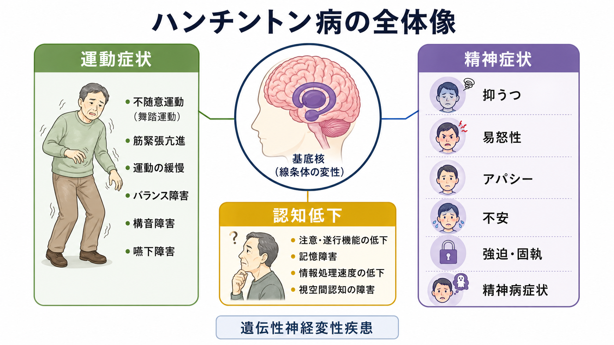
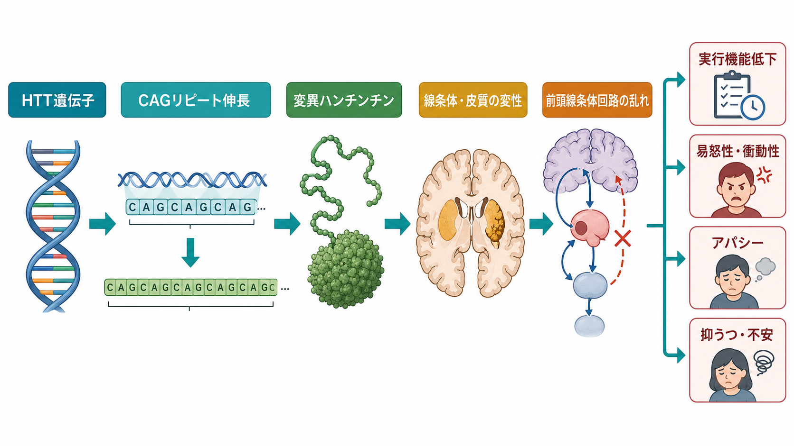
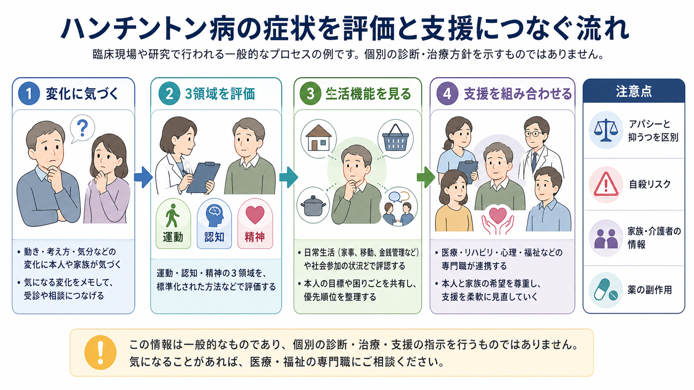

# ハンチントン病に伴う精神症状とは何か

## 要点

- ハンチントン病は、`HTT` 遺伝子の CAG リピート伸長によって生じる常染色体顕性遺伝の神経変性疾患であり、舞踏運動だけでなく、認知低下と精神症状が中核に含まれる[1][2]。
- 精神症状には、抑うつ、易怒性、アパシー、不安、脱抑制、強迫・固執、睡眠障害、まれな精神病症状が含まれる[1][4]。
- これらは「病気への心理的反応」だけではなく、線条体・皮質変性と前頭線条体回路の障害に支えられる神経精神症状として理解する必要がある[2][8]。
- アパシーと抑うつ、易怒性と躁状態、固執と[[強迫症とは何か]]、精神病症状と[[器質性精神病とは何か]]を丁寧に区別することが重要である。
- 本稿は教育・研究目的の概説であり、個別の診断や治療指示ではない。

## この記事で答える問い

1. ハンチントン病では、なぜ運動症状だけでなく精神症状が問題になるのか。
2. どのような精神症状が、どの時期に、どのような生活上の困難として現れやすいのか。
3. 前頭線条体回路、認知低下、気分症状をどう結びつけて理解すればよいのか。
4. 臨床・研究では、本人だけでなく家族・介護者の情報をなぜ重視するのか。

## まず結論

ハンチントン病に伴う精神症状は、「舞踏運動に付随する二次的な気分の問題」ではない。疾患そのものが、線条体、皮質、前頭線条体回路、認知制御、情動調整、行動開始の仕組みに影響するため、運動症状・認知症状・精神症状が互いに重なりながら進行する[1][2][3]。

そのため、抑うつだけを見て[[大うつ病性障害とは何か]]として扱う、易怒性だけを見て性格の問題とみなす、アパシーだけを見て意欲のなさと決めつける、といった理解は不十分である。ハンチントン病では、症状の内容だけでなく、発症時期、家族歴、運動所見、認知低下、生活機能、服薬、副作用、家族・介護者から見た変化を合わせて考える必要がある[1][4]。

## 背景

ハンチントン病は、成人期に発症することが多い進行性の神経変性疾患である。典型的には、舞踏運動、協調運動の低下、眼球運動の異常、構音・嚥下の問題などが注目される。しかし GeneReviews は、臨床像を「運動・認知・精神症状を伴う進行性疾患」と整理し、初期から抑うつ気分や易怒性、計画困難が現れうることを強調している[1]。

精神症状は、患者本人の苦痛だけでなく、家族関係、介護負担、仕事、金銭管理、意思決定、安全性に影響する。古典的研究でも、ハンチントン病患者の神経精神症状は高頻度であり、気分不快、焦燥、易怒性、アパシー、不安が目立つと報告されている[8]。この領域は、[[神経科学は精神疾患をどのように説明できるのか]]、[[前頭側頭型認知症はなぜ人格や行動を変えるのか]]、[[レビー小体型認知症は神経回路にどのような影響を与えるのか]]とも接続する。

## 基本概念

### 運動・認知・精神の三領域

ハンチントン病では、舞踏運動が目立つため「運動疾患」として理解されがちである。しかし実際には、注意、処理速度、実行機能、計画、抑制、柔軟性の低下が早期から問題になりうる[1]。これらは[[認知機能障害は統合失調症でなぜ重要なのか]]で扱う認知機能の臨床的重みとも共通する。

精神症状としては、抑うつ、不安、易怒性、衝動性、脱抑制、強迫的・固執的行動、睡眠障害、アパシーが重要である。妄想や幻覚などの精神病症状も起こりうるが、頻度や時期には個人差がある[1][4]。

### アパシーと抑うつは同じではない

アパシーは、単なる「気分の落ち込み」ではなく、行動開始、関心、情動反応の低下として現れる。抑うつでは悲哀感、罪責感、希死念慮、否定的思考が目立つことがあるのに対し、アパシーでは「悲しいというより動き出せない」「関心が薄い」「促されないと行動しない」という形を取りやすい[4][6]。この区別は、[[報酬系の異常はうつ病をどう説明するのか]]や[[陰性症状は報酬系や認知制御の障害と関係するのか]]を読むと理解しやすい。

2023年のメタ分析では、成人発症ハンチントン病において、抑うつとアパシーはいずれも機能低下と関連し、遺伝子陽性例に限定すると生涯頻度はアパシーが48%、抑うつが43%と推定された[5]。ただし、研究ごとに評価尺度、疾患段階、サンプルの偏りが異なるため、単一の頻度として過度に一般化しない方がよい。

## 仕組み

### CAGリピートから前頭線条体回路へ

ハンチントン病の原因は、`HTT` 遺伝子の CAG リピート伸長である。変異ハンチンチンは、タンパク質の処理、転写、ミトコンドリア機能、シナプス機能、炎症、細胞内輸送など複数の経路に影響し、線条体と大脳皮質を中心とする神経変性へつながる[2][3]。

線条体は、運動だけでなく、行動選択、報酬、習慣、抑制、情動調整に関わる。したがって線条体と前頭葉を結ぶ回路が乱れると、舞踏運動だけでなく、衝動性、固執、易怒性、実行機能低下、アパシーとして表面化しうる。これは[[強迫症では皮質線条体視床回路に何が起きているのか]]や[[ドパミンは報酬だけの物質なのか]]と接続して理解できる。

### 症状は単一原因ではない

精神症状は、神経変性だけで説明し切れるわけではない。本人が遺伝性疾患を知ることによる心理的負担、家族歴、将来不安、運動機能低下、仕事や役割の変化、睡眠障害、疼痛、薬剤の副作用、周囲の環境が重なり合う[4]。たとえば、舞踏運動に対する薬剤が、場合によっては抑うつ、アパシー、パーキンソニズム、認知処理の遅さと区別しにくい変化を生むこともある[4][7]。

このため、精神症状を「脳だけ」または「心理だけ」に還元せず、神経変性、認知機能、生活文脈、家族システムを同時に見る必要がある。ここでは[[家族システムとは何か]]や[[心理測定と臨床判断はどう組み合わせるべきか]]の視点が役立つ。

## 図解

1枚目の図は、ハンチントン病を運動症状・認知低下・精神症状の三領域として整理している。2枚目の図は、`HTT` 遺伝子変異から線条体・皮質変性、前頭線条体回路の乱れ、実行機能低下や情動・行動症状へ至る流れを示している。

3枚目の図は、臨床・研究での見方を「変化に気づく」「三領域を評価する」「生活機能を見る」「支援を組み合わせる」という流れでまとめたものである。これは個別の診断・治療方針を示すものではなく、観察と評価の枠組みを説明する図である。

## 臨床・研究との接続

### 評価では本人と周囲の情報を合わせる

ハンチントン病では、本人が自分の変化に気づきにくいことがある。したがって、本人の訴えだけでなく、家族・介護者から見た易怒性、金銭管理、運転、服薬、睡眠、食事、社会参加、危険行動、希死念慮を確認することが重要である[1][4]。

GeneReviews は、各受診時に舞踏運動、固縮、歩行、微細運動、認知低下、機能、気分・行動変化、睡眠、家族・社会的支援を評価することを挙げている[1]。これは[[精神症状の横断的評価とは何か]]が未作成であれば、今後の関連ノート候補になる。

### 精神症状の支援は「ひとつの薬」で完結しない

神経精神症状に対する専門家コンセンサスは、興奮、不安、アパシー、精神病症状、睡眠障害について、併存症、痛み、環境要因、介護者からの情報、薬剤副作用、ポリファーマシーを考慮することを勧めている[4]。非薬物的な環境調整、活動の構造化、心理社会的支援、家族教育と、必要に応じた薬物療法を組み合わせる発想が必要である。

ただし、これは一般的な教育的整理であり、個別の薬剤選択や中止を指示するものではない。舞踏運動に対する薬物療法にも、抑うつ、自殺リスク、パーキンソニズム、肝機能などの注意点があるため、[[薬物療法は神経回路にどう作用するのか]]と同様、効果と副作用を同時に見る必要がある[7]。

### 研究上の論点

研究では、精神症状を単独の診断名として扱うだけでなく、疾患段階、CAGリピート長、脳画像、認知検査、生活機能、家族・介護者評価を統合する方向に進んでいる[1][3]。アパシー研究では、前駆期から症状が高まりうること、顕性期ではより強くなること、皮質・皮質下領域の関与が示唆されている[6]。

一方で、抑うつ、アパシー、易怒性、不安、睡眠障害の頻度推定は、評価尺度や対象集団によって大きく変わる。したがって「ハンチントン病では必ず抑うつになる」「舞踏運動が重いほど精神症状も重い」といった単純化は避けるべきである[5][8]。

## よくある誤解

### 「ハンチントン病は舞踏運動の病気である」

不十分である。舞踏運動は代表的だが、認知低下と精神症状も中核的である。初期から抑うつ、易怒性、アパシー、不安、脱抑制が現れることがある[1]。

### 「精神症状は病気を知ったショックだけで説明できる」

不十分である。心理的反応は重要だが、線条体・皮質の神経変性、前頭線条体回路、認知制御、薬剤、睡眠、生活環境も関与する[2][3][4]。

### 「アパシーは本人のやる気の問題である」

誤りである。アパシーは、行動開始、関心、情動反応の低下として現れる神経精神症状であり、抑うつや運動開始困難、認知処理速度低下と区別して評価する必要がある[4][6]。

### 「精神病症状があれば統合失調症と同じである」

誤りである。妄想や幻覚がある場合でも、神経変性疾患、薬剤、せん妄、睡眠障害、認知低下、家族歴、経過を含めて評価する必要がある。これは[[器質性精神病とは何か]]の考え方に近い。

## 関連ノート

- [[大うつ病性障害とは何か]]
- [[不安症群とは何か]]
- [[強迫症とは何か]]
- [[不眠障害とは何か]]
- [[双極性障害とは何か]]
- [[器質性精神病とは何か]]
- [[ドパミンは報酬だけの物質なのか]]
- [[強迫症では皮質線条体視床回路に何が起きているのか]]
- [[前頭側頭型認知症はなぜ人格や行動を変えるのか]]
- [[レビー小体型認知症は神経回路にどのような影響を与えるのか]]
- [[心理測定と臨床判断はどう組み合わせるべきか]]
- [[家族システムとは何か]]

### MOC更新候補

- [[MOC｜神経科学と精神疾患]]
- [[MOC｜脳・神経科学]]
- [[MOC｜認知機能]]
- 精神医学の疾患・症候群MOCがある場合は、本ノートを神経認知障害・神経精神医学の項目に追加する。

## 理解チェック

1. ハンチントン病に伴う精神症状を、舞踏運動の二次的反応だけで説明しにくい理由は何か。
2. アパシーと抑うつは、臨床的にどのような点で区別されるか。
3. 前頭線条体回路の障害は、易怒性、固執、実行機能低下とどのように関係しうるか。
4. 本人の訴えだけでなく、家族・介護者からの情報が重要になるのはなぜか。

## 未解決問題

- 抑うつ、アパシー、不安、易怒性のどれが疾患進行の予測因子として最も有用なのかは、評価尺度と疾患段階をそろえた研究がさらに必要である。
- 精神症状を、神経変性、心理的反応、薬剤副作用、社会的ストレスにどこまで分解できるかは未解決である。
- 疾患修飾療法やハンチンチン低下療法が、運動症状だけでなく精神症状・認知機能にどの程度影響するかは、今後の重要な研究課題である。

## 参考文献

[1] Brás IC, Dawson J, Kay C, Caron NS, Hayden MR. *Huntington Disease*. GeneReviews®. Last update: 2026-02-12. https://www.ncbi.nlm.nih.gov/books/NBK1305/

[2] Bates GP, Dorsey R, Gusella JF, et al. Huntington disease. *Nature Reviews Disease Primers*. 2015;1:15005. https://doi.org/10.1038/nrdp.2015.5

[3] Tabrizi SJ, Flower MD, Ross CA, Wild EJ. Huntington disease: new insights into molecular pathogenesis and therapeutic opportunities. *Nature Reviews Neurology*. 2020;16:529-546. https://doi.org/10.1038/s41582-020-0389-4

[4] Anderson KE, van Duijn E, Craufurd D, et al. Clinical management of neuropsychiatric symptoms of Huntington disease: expert-based consensus guidelines on agitation, anxiety, apathy, psychosis and sleep disorders. *Journal of Huntington's Disease*. 2018;7(3):355-366. https://doi.org/10.3233/JHD-180293

[5] Clark ML, Abimanyi-Ochom J, Le H, Long B, Orr C, Le LKD. A systematic review and meta-analysis of depression and apathy frequency in adult-onset Huntington's disease. *Neuroscience & Biobehavioral Reviews*. 2023;149:105166. https://doi.org/10.1016/j.neubiorev.2023.105166

[6] Abdollah Zadegan S, Coco HM, Reddy KS, Anderson KM, Teixeira AL, Furr Stimming E. Frequency and pathophysiology of apathy in Huntington disease: a systematic review and meta-analysis. *The Journal of Neuropsychiatry and Clinical Neurosciences*. 2023;35(2):121-132. https://doi.org/10.1176/appi.neuropsych.20220033

[7] Armstrong MJ, Miyasaki JM. Evidence-based guideline: pharmacologic treatment of chorea in Huntington disease. *Neurology*. 2012;79(6):597-603. https://doi.org/10.1212/WNL.0b013e318263c443

[8] Paulsen JS, Ready RE, Hamilton JM, Mega MS, Cummings JL. Neuropsychiatric aspects of Huntington's disease. *Journal of Neurology, Neurosurgery & Psychiatry*. 2001;71(3):310-314. https://doi.org/10.1136/jnnp.71.3.310
