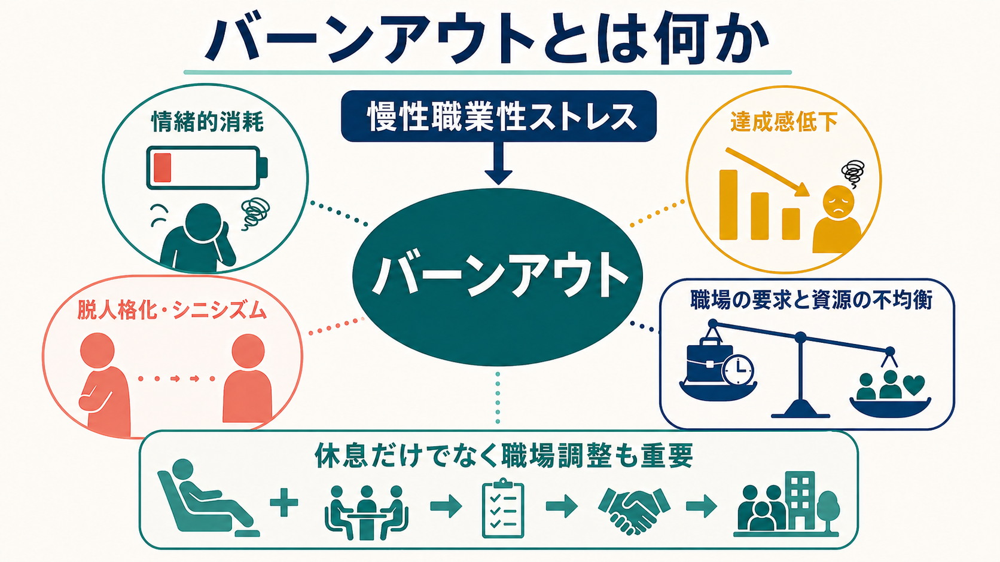
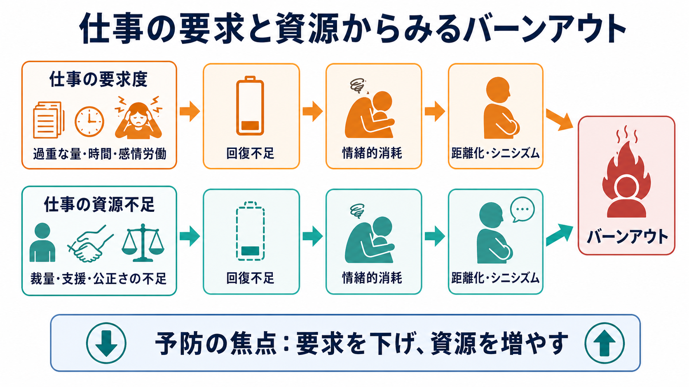

# バーンアウトとは何か

## 要点

- バーンアウトは、うまく管理されなかった慢性の職業性ストレスから生じる状態像として整理され、ICD-11 では疾患そのものではなく「健康状態や保健サービス利用に影響する要因」に分類される[1]。
- 中核は、情緒的消耗、脱人格化・シニシズム、専門的達成感の低下という三次元で理解されることが多い[2][3]。
- 個人の弱さだけでは説明できず、仕事の要求度、裁量、支援、公正さ、報酬、価値観の不一致など、職場システムとの相互作用として見る必要がある[3][4]。
- [[うつ病とは何か|うつ病]]、[[不眠障害とは何か|不眠障害]]、[[不安症群とは何か|不安症]]、身体疾患、物質使用とは重なりうるため、診断名の代わりとして安易に使わない。

## この記事で答える問い

1. バーンアウトは医学的な「病名」なのか、それとも職場ストレスに関する状態像なのか。
2. 情緒的消耗、脱人格化・シニシズム、達成感低下はどのように関係するのか。
3. 職場要因と個人要因をどのように分けて考えるべきか。
4. うつ病や通常の疲労とどこが重なり、どこを慎重に見分ける必要があるのか。

## まず結論

バーンアウトは「働く人が疲れた状態」というより、仕事に結びついた慢性的な負荷と回復不足のなかで、エネルギーが枯渇し、仕事や相手への距離化が進み、自分の仕事の有効性を感じにくくなる状態像である。ICD-11 は、これを職業文脈に限定して扱い、生活全般のストレス反応や精神疾患そのものとは区別している[1]。

したがって、バーンアウトを理解するときは、本人の睡眠、身体疾患、抑うつ、不安、物質使用を確認しつつ、同時に仕事量、時間圧、感情労働、裁量の少なさ、支援不足、公正さの欠如、役割葛藤を評価する必要がある[3][4]。教育・研究上は有用な概念だが、個別の診断や治療方針は専門家による評価に委ねる。

## 背景

バーンアウト研究は、対人援助職、医療、教育、福祉など、強い対人責任と感情労働を伴う職種で発展してきた。Maslach Burnout Inventory は、情緒的消耗、脱人格化、個人的達成感の低下を測る代表的尺度として広く用いられた[2]。その後、バーンアウトは対人援助職に限らず、仕事要求度が高く、回復や裁量や支援が乏しい職場で生じる心理社会的リスクとして扱われるようになった[3][4]。

WHO の職場メンタルヘルス指針も、職場の心理社会的リスクを同定し、予防・組織的介入・復職支援を組み合わせる重要性を示している[5]。つまり、バーンアウトは「個人が耐えるべき問題」ではなく、労働環境、組織文化、管理、業務設計、支援体制の問題でもある。

## 基本概念

### 情緒的消耗

情緒的消耗は、仕事に向ける心理的エネルギーが枯渇した感覚である。疲労、回復しにくさ、朝から仕事に向かう負担感、対人対応への余力低下として現れやすい。バーンアウト研究では、もっとも中心的な次元とされることが多い[3]。

### 脱人格化・シニシズム

脱人格化は、患者、利用者、同僚、顧客を一人の人として感じにくくなり、冷淡さ、皮肉、機械的対応が増える状態である。一般職では「シニシズム」とも表現され、仕事や組織に対する距離化として現れる[3]。これは単なる性格変化ではなく、消耗から自分を守るための防衛的な距離化として理解できる。

### 達成感低下

達成感低下は、自分の仕事が役に立っている、成長している、うまく貢献できているという感覚が弱まることである[2][3]。ただし、達成感低下は、実際の能力低下だけでなく、過剰な要求、曖昧な役割、不公平な評価、支援不足によっても生じる。

## 仕組み

仕事要求度・資源モデルでは、バーンアウトは「要求が高い」ことだけではなく、「要求に対応する資源が足りない」ことから生じると考える[4]。要求には、仕事量、時間圧、感情労働、夜勤、対人葛藤、責任の重さが含まれる。資源には、裁量、上司・同僚の支援、公正な評価、明確な役割、十分な休息、学習機会、心理的安全性が含まれる。

このモデルの実用的な価値は、介入点を個人の努力だけに閉じない点にある。睡眠や休息、セルフケアは重要だが、過重な要求、慢性的な人員不足、裁量の欠如、公正さの問題が残る場合、個人側の対処だけでは再発しやすい[4][5]。

## 図解

図 1 は、バーンアウトを「慢性職業性ストレス」から三つの次元へ広がる状態像として示している。重要なのは、消耗だけでなく、対人距離化と達成感低下まで含めて見ることである。

図 2 は、仕事要求度と仕事資源の不均衡としてバーンアウトを読む図である。仕事量や感情労働が高いほどリスクは上がるが、裁量、支援、公正さ、明確な役割があれば、同じ負荷でも意味づけや回復可能性は変わる。

## 臨床・研究との接続

臨床的には、バーンアウトという言葉だけで評価を終えないことが重要である。抑うつ気分、興味・喜びの低下、希死念慮、睡眠・食欲変化、集中困難、精神運動制止、身体疾患、薬剤、アルコールなどを確認し、[[うつ病とは何か|うつ病]]、[[適応障害とは何か|適応障害]]、[[不眠障害とは何か|不眠障害]]、[[全般不安症とは何か|全般不安症]]などとの重なりを検討する。バーンアウトとうつ病は症状が重なり、研究上も両者の境界には議論がある[6]。

研究では、バーンアウトは尺度で測定されることが多い。MBI は代表的だが、尺度得点は診断名そのものではない[2]。[[心理測定とは何か]]、[[信頼性とは何か]]、[[妥当性とは何か]]の観点から、測定対象、カットオフ、文化差、職種差、縦断的変化を検討する必要がある。

介入研究では、個人向け介入だけでなく、勤務設計、チーム運営、業務量調整、リーダーシップ、医療安全・品質改善と結びついた組織介入が重視される。医師バーンアウトへの介入を扱ったメタ分析では、個人向け介入と組織介入の双方に効果が示されるが、職場条件を変える視点が不可欠である[7]。医療者バーンアウトについては、National Academies もシステムアプローチを強調している[8]。

## よくある誤解

### 「バーンアウトはただの疲れである」

通常の疲労は休息で回復しやすいが、バーンアウトでは仕事に向かうエネルギー、対人態度、達成感が慢性的に変化する。休めば一時的に楽になっても、職場の要求と資源の不均衡が続けば再燃しうる。

### 「本人のストレス耐性が低いだけである」

誤りである。個人差はあるが、研究上は仕事量、裁量、報酬、公正さ、共同体感覚、価値観の一致といった職場要因が重要である[3][4]。個人だけを変えようとすると、問題の構造が温存される。

### 「バーンアウトとうつ病は完全に別物である」

完全に分離できるとは限らない。バーンアウトは職業文脈に結びつく概念だが、抑うつ、睡眠障害、不安、認知機能低下と重なりうる[6]。特に希死念慮、生活全般の興味低下、重い睡眠・食欲変化がある場合は、バーンアウトという説明で済ませない。

### 「尺度で高得点なら診断が確定する」

尺度は状態を測る道具であり、診断そのものではない。職種、文化、測定時期、業務状況、併存症状によって得点は変わる。研究では有用だが、個別支援では面接と生活機能評価を組み合わせる必要がある。

## 関連ノート

- [[うつ病とは何か]]
- [[不眠障害とは何か]]
- [[全般不安症とは何か]]
- [[認知機能障害とは何か]]
- [[心理測定とは何か]]
- [[信頼性とは何か]]
- [[妥当性とは何か]]

### 関連ノート候補

- 職業性ストレスとは何か
- 感情労働とは何か
- 仕事要求度・資源モデルとは何か
- 医療者バーンアウトとは何か
- 復職支援とは何か

### MOC 更新候補

- `content/00_MOC/` 配下の精神医学、症候学、産業保健・職場メンタルヘルス関連 MOC に追加候補。並列ジョブとの競合を避けるため、本記事では MOC 本体は更新しない。

## 理解チェック

1. ICD-11 でバーンアウトは、疾患そのものとしてではなく、どのような文脈の状態像として整理されているか。
2. バーンアウトの三次元を、情緒的消耗、脱人格化・シニシズム、達成感低下の観点から説明できるか。
3. 仕事要求度・資源モデルでいう「要求」と「資源」には何が含まれるか。
4. バーンアウトとうつ病が重なりうるとき、どの症状やリスクを確認すべきか。
5. 個人向けセルフケアだけでなく、職場調整が必要になる理由を説明できるか。

## 未解決問題

- バーンアウトとうつ病の境界を、症状、職業文脈、縦断経過、生物学的指標でどこまで分けられるか。
- 職種や文化によって、脱人格化・シニシズムや達成感低下の意味がどの程度変わるか。
- 個人向け介入、チーム介入、組織介入をどの順序・組み合わせで行うと、再発予防と職場改善につながるか。
- 尺度得点を、診断ではなく支援計画や組織改善にどう活用するか。

## 参考文献

[1] World Health Organization. ICD-11: QD85 Burn-out. https://icd.who.int/browse/2024-01/mms/en#129180281

[2] Maslach, C., & Jackson, S. E. (1981). The measurement of experienced burnout. *Journal of Occupational Behaviour*, 2(2), 99-113. https://doi.org/10.1002/job.4030020205

[3] Maslach, C., Schaufeli, W. B., & Leiter, M. P. (2001). Job burnout. *Annual Review of Psychology*, 52, 397-422. https://doi.org/10.1146/annurev.psych.52.1.397

[4] Demerouti, E., Bakker, A. B., Nachreiner, F., & Schaufeli, W. B. (2001). The job demands-resources model of burnout. *Journal of Applied Psychology*, 86(3), 499-512. https://doi.org/10.1037/0021-9010.86.3.499

[5] World Health Organization. (2022). *WHO guidelines on mental health at work*. https://www.who.int/publications/i/item/9789240053052

[6] Bianchi, R., Schonfeld, I. S., & Laurent, E. (2015). Burnout-depression overlap: A review. *Clinical Psychology Review*, 36, 28-41. https://doi.org/10.1016/j.cpr.2015.01.004

[7] Panagioti, M., Panagopoulou, E., Bower, P., et al. (2017). Controlled interventions to reduce burnout in physicians: A systematic review and meta-analysis. *JAMA Internal Medicine*, 177(2), 195-205. https://doi.org/10.1001/jamainternmed.2016.7674

[8] National Academies of Sciences, Engineering, and Medicine. (2019). *Taking Action Against Clinician Burnout: A Systems Approach to Professional Well-Being*. National Academies Press. https://doi.org/10.17226/25521
