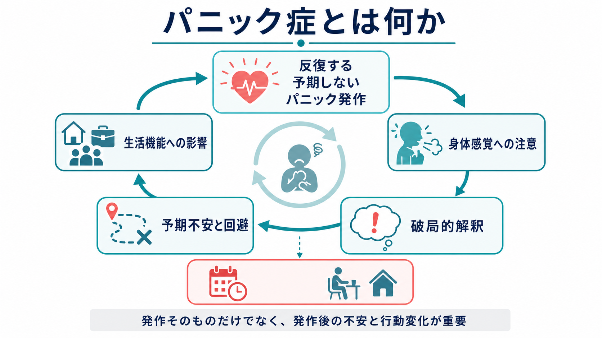
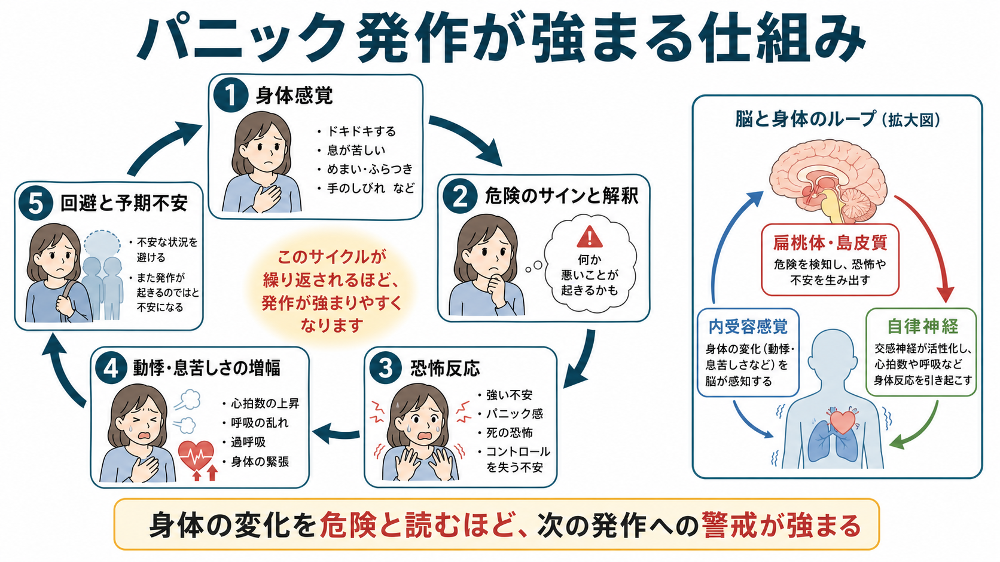
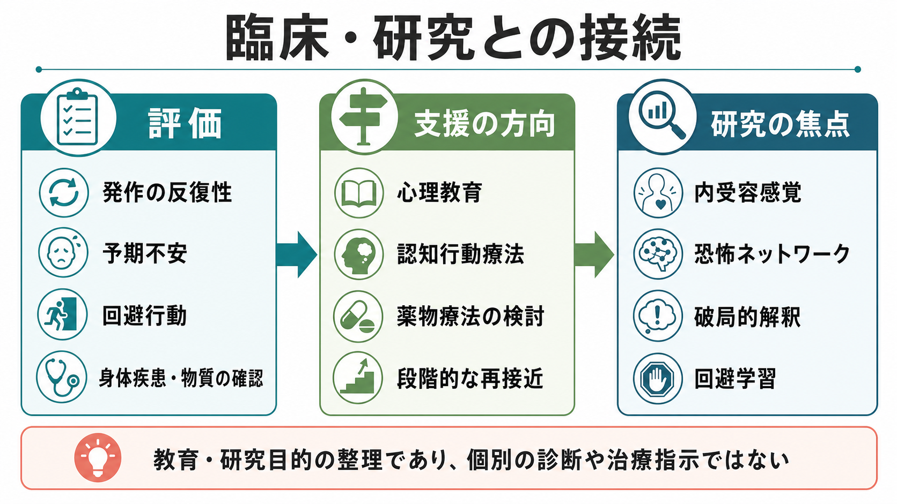

# パニック症とは何か

## 要点

- パニック症は、反復する予期しない[[パニック発作とは何か|パニック発作]]に加えて、次の発作やその結果への持続的な心配、または発作を避けるための不適応な行動変化が続く状態である[1][2]。
- 発作そのものは数分から長くても比較的短時間でピークを迎えやすいが、疾患として重要なのは発作後に残る[[予期不安とは何か|予期不安]]、身体感覚への過注意、[[回避行動とは何か|回避行動]]である[2][3]。
- 動悸、息苦しさ、めまい、胸部不快感などの身体感覚が「心臓発作」「窒息」「制御不能」のサインとして破局的に解釈されると、恐怖反応と自律神経反応がさらに強まり、悪循環が生じる[5][6]。
- 治療研究では、認知行動療法、曝露、とくに身体感覚を安全に経験し直す内受容感覚曝露、薬物療法、セルフヘルプなどが検討されている[3][7][8]。
- 本記事は教育・研究目的の整理であり、個別の診断や治療指示ではない。胸痛、失神、強い呼吸困難など身体疾患が疑われる症状は、心理的要因だけで説明しない。

## この記事で答える問い

1. パニック発作とパニック症は何が違うのか。
2. なぜ「発作がない時間」の不安や回避が疾患理解で重要なのか。
3. 身体感覚、恐怖反応、破局的解釈、回避はどのように循環するのか。
4. 臨床評価や治療研究では、どの点が重視されるのか。

## まず結論

パニック症は「急に怖くなる人」という性格記述ではない。中核にあるのは、予期しない強い[[パニック発作とは何か|パニック発作]]を経験した後に、身体感覚や場所、状況が「また発作が起こるかもしれない」という予測と結びつき、[[予期不安とは何か|予期不安]]と[[回避行動とは何か|回避行動]]が生活を狭めていく過程である[1][2]。

発作は、動悸、発汗、震え、息苦しさ、胸部不快感、めまい、しびれ、現実感の変化、死や制御不能への恐怖などを伴うことがある[2]。ただし、パニック発作はパニック症だけに固有ではない。うつ病、PTSD、社交不安、物質使用、甲状腺疾患、循環器・呼吸器疾患などでも似た体験が起こりうるため、臨床では心理的説明に飛びつかず、身体疾患や物質の影響を含めて評価する[2][3]。

## 背景

NIMH は、パニック症を「頻繁で予期しないパニック発作」と、次の発作への強い心配や生活上の回避を伴う状態として説明している[2]。NICE の成人パニック症ガイドラインも、発作そのものの有無だけでなく、発作後の心配、行動変化、機能障害、身体疾患の除外を評価の中心に置いている[3]。

疫学研究では、孤立したパニック発作は比較的多く経験される一方、パニック症や広場恐怖を伴う群では重症度、併存症、生活機能障害が大きくなりやすいことが報告されている[4]。この差は、「発作が一度あったか」よりも、発作後にどの程度の予期不安、回避、生活上の制限が形成されたかが重要であることを示している。

## 基本概念

### パニック発作

[[パニック発作とは何か|パニック発作]]は、強い恐怖または不快感が急激に高まり、身体症状と認知症状がまとまって現れるエピソードである。代表的には、動悸、発汗、震え、息苦しさ、胸痛、吐き気、めまい、しびれ、寒気または熱感、非現実感、死や制御不能への恐怖などが含まれる[1][2]。

ただし、発作は診断名ではない。単発の発作、明確な誘因に結びついた発作、身体疾患や物質による発作、他の精神疾患の文脈で起こる発作もある。したがって、パニック発作があることと、パニック症であることは同じではない。

### パニック症

パニック症では、予期しないパニック発作が反復し、その後少なくとも一定期間、次の発作への持続的な心配、発作の意味や結果への恐怖、または発作を避けるための不適応な行動変化が続く[1][2]。ここでいう行動変化には、電車や人混みを避ける、運動を避ける、外出時に必ず同伴者を求める、出口の近くに座る、身体感覚を過剰に確認する、カフェインや入浴などを極端に避ける、といった形が含まれうる。

### 予期不安と回避

[[予期不安とは何か|予期不安]]は、「また発作が起きるのではないか」「倒れるのではないか」「逃げられないのではないか」という未来志向の不安である。[[回避行動とは何か|回避行動]]は短期的には安心をもたらすが、長期的には「避けたから無事だった」という学習を強め、発作が起きても対処できるという経験を妨げる[6][7]。

## 仕組み

### 身体感覚の破局的解釈

認知モデルでは、パニック発作は身体感覚の破局的解釈によって強まりやすいと考える。たとえば、通常の動悸が「心臓発作の前兆」と読まれ、息苦しさが「窒息するサイン」と読まれると、恐怖が増幅し、交感神経反応がさらに強まる[5]。この反応で動悸や息苦しさが増えると、本人には「やはり危険だ」と感じられ、悪循環が閉じる。

### 内受容感覚と恐怖ネットワーク

パニック症では、心拍、呼吸、めまい、胸部感覚、腹部感覚など、身体内部の変化を読む[[不安とは何か|不安]]システムが重要になる。島皮質、扁桃体、前頭前野、自律神経系などは、身体感覚の検出、脅威評価、恐怖反応、調整に関わるネットワークとして研究されている[6]。ただし、単一の脳部位だけでパニック症を説明することはできない。身体感覚、認知的解釈、行動、環境、学習歴が相互作用する現象として見る方が実践的である。

### 回避による維持

発作の後、本人は「発作を起こさないこと」を最優先にしやすい。運動、入浴、人混み、電車、会議、外食、長距離移動などを避けると、その場の不安は下がる。しかし、避けることで「実際には何が起きたのか」を検証できず、危険予測は修正されにくい。これが、予期不安と回避の維持ループである[3][7]。

## 図解

3枚目の図は、臨床・研究で確認される主要な接点を整理している。評価では発作の反復性、予期不安、回避、身体疾患・物質の影響を分けて見る。支援の方向としては、心理教育、認知行動療法、薬物療法の検討、段階的な再接近があり、研究上は内受容感覚、恐怖ネットワーク、破局的解釈、回避学習が焦点になる。

## 臨床・研究との接続

### 評価で見ること

臨床評価では、発作の頻度だけでなく、発作が予期されたものか、予期しないものか、発作後に何を恐れているか、何を避けているか、どの程度生活が狭まっているかを見る[2][3]。胸痛、失神、動悸、呼吸困難、甲状腺機能、薬物・カフェイン・アルコール、離脱症状など、身体医学的・物質関連の要因も確認する必要がある[3]。

### 治療研究との接続

NICE は、パニック症への対応として心理療法、薬物療法、セルフヘルプをエビデンスのある選択肢として整理し、本人の評価と共同意思決定に基づく選択を重視している[3]。CBT では、身体感覚を危険と読む解釈を検討し、避けてきた感覚や状況へ段階的に近づき、予測と結果のずれを学習する[7]。

薬物療法については、抗うつ薬がプラセボより有効である可能性が示される一方、忍容性や短期アウトカム中心の限界も指摘されている[8]。したがって、薬物療法を考える場合も、症状、併存症、希望、副作用、生活状況を含めた専門的判断が必要である。

### 研究での焦点

研究上は、次のような問いが重要になる。どの身体感覚が発作予測に結びつきやすいのか。破局的解釈はパニック症にどの程度特異的なのか。回避学習はどの条件で固定化し、どの条件で修正されるのか。神経画像、心理生理、行動課題、日常生活データを組み合わせることで、診断カテゴリーを越えた不安・恐怖のメカニズム理解が進む可能性がある[6][7]。

## よくある誤解

### 誤解1: パニック症は「気の持ちよう」で起こる

パニック症では、身体感覚、自律神経反応、注意、解釈、回避学習が相互に関わる。本人の意思の弱さだけで説明すると、発作がなぜ身体的に強烈に感じられるのか、なぜ避けるほど不安が残るのかを見落とす。

### 誤解2: パニック発作があれば必ずパニック症である

パニック発作は、パニック症以外でも起こる。診断上は、発作の反復性、予期しない性質、発作後の持続的な心配、行動変化、身体疾患や物質の影響、他の精神疾患との関係を確認する必要がある[1][2]。

### 誤解3: 身体検査で異常がなければ「何も起きていない」

身体疾患が否定的であっても、本人が経験する動悸、息苦しさ、めまい、胸部不快感は実際の身体感覚である。重要なのは、それらを「危険の証拠」と読む循環を理解し、必要に応じて安全な形で再学習することである[5][7]。

### 誤解4: 回避はすぐやめればよい

回避を急にやめることが常に適切とは限らない。回避が生活を狭めている場合でも、本人の安全、身体疾患、併存症、支援体制を見ながら、段階的に再接近する設計が必要になる[3][7]。

## 関連ノート

- [[パニック発作とは何か]]
- [[予期不安とは何か]]
- [[回避行動とは何か]]
- [[不安とは何か]]

今後の作成候補: パニック症の認知行動療法とは何か、内受容感覚曝露とは何か、広場恐怖とは何か、身体疾患とパニック発作の鑑別、破局的解釈とは何か。

MOC 更新候補: `content/00_MOC/` 配下の精神医学、症候学、不安症、認知行動療法関連 MOC。並列生成ジョブとの競合を避けるため、本記事では MOC 本体を更新しない。

## 理解チェック

1. パニック発作とパニック症の違いを、「発作後の予期不安・行動変化」という観点から説明できるか。
2. 動悸や息苦しさが、どのように恐怖反応をさらに強めるのか説明できるか。
3. 回避行動が短期的に安心をもたらしながら、長期的には予期不安を維持しうる理由を説明できるか。
4. パニック症の評価で、身体疾患や物質の影響を確認する必要がある理由を説明できるか。
5. CBT や内受容感覚曝露が、単なる「我慢」ではなく再学習の手続きとして位置づけられる理由を説明できるか。

## 未解決問題

- パニック症の個人差を、内受容感覚、呼吸調節、破局的解釈、回避学習、生活ストレスの組み合わせとしてどこまで予測できるか。
- ウェアラブルデータや日常生活データは、発作予測や再発予防にどこまで役立つか。
- どの患者群で心理療法、薬物療法、併用療法、セルフヘルプのどれが最も適するかを、実臨床でどう判定するか。
- 「予期しない発作」と「状況依存的な発作」は、神経生理・学習過程としてどこまで異なるのか。

## 参考文献

[1] American Psychiatric Association. (2022). *Diagnostic and Statistical Manual of Mental Disorders, Fifth Edition, Text Revision (DSM-5-TR)*. American Psychiatric Association Publishing. https://doi.org/10.1176/appi.books.9780890425787

[2] National Institute of Mental Health. (2025). *Panic Disorder: What You Need to Know*. https://www.nimh.nih.gov/health/publications/panic-disorder-when-fear-overwhelms

[3] National Institute for Health and Care Excellence. (2011, updated). *Generalised anxiety disorder and panic disorder in adults: management* (CG113). https://www.nice.org.uk/guidance/cg113

[4] Kessler, R. C., Chiu, W. T., Jin, R., Ruscio, A. M., Shear, K., & Walters, E. E. (2006). The epidemiology of panic attacks, panic disorder, and agoraphobia in the National Comorbidity Survey Replication. *Archives of General Psychiatry, 63*(4), 415-424. https://doi.org/10.1001/archpsyc.63.4.415

[5] Clark, D. M. (1986). A cognitive approach to panic. *Behaviour Research and Therapy, 24*(4), 461-470. https://doi.org/10.1016/0005-7967(86)90011-2

[6] Craske, M. G., Stein, M. B., Eley, T. C., Milad, M. R., Holmes, A., Rapee, R. M., & Wittchen, H.-U. (2017). Anxiety disorders. *Nature Reviews Disease Primers, 3*, 17024. https://doi.org/10.1038/nrdp.2017.24

[7] Papola, D., Ostuzzi, G., Tedeschi, F., Gastaldon, C., Purgato, M., Del Giovane, C., Pompoli, A., Pauley, D., Karyotaki, E., Sijbrandij, M., Furukawa, T. A., Cuijpers, P., & Barbui, C. (2023). CBT treatment delivery formats for panic disorder: A systematic review and network meta-analysis of randomised controlled trials. *Psychological Medicine, 53*(3), 614-624. https://doi.org/10.1017/S0033291722003683

[8] Bighelli, I., Castellazzi, M., Cipriani, A., Girlanda, F., Guaiana, G., Koesters, M., Turrini, G., Furukawa, T. A., & Barbui, C. (2018). Antidepressants versus placebo for panic disorder in adults. *Cochrane Database of Systematic Reviews*, CD010676. https://doi.org/10.1002/14651858.CD010676.pub2
