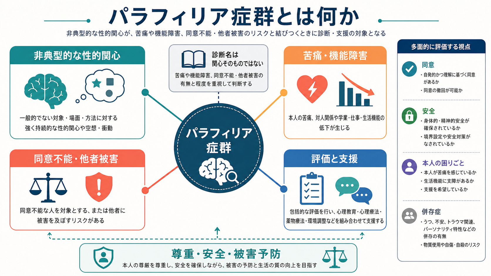
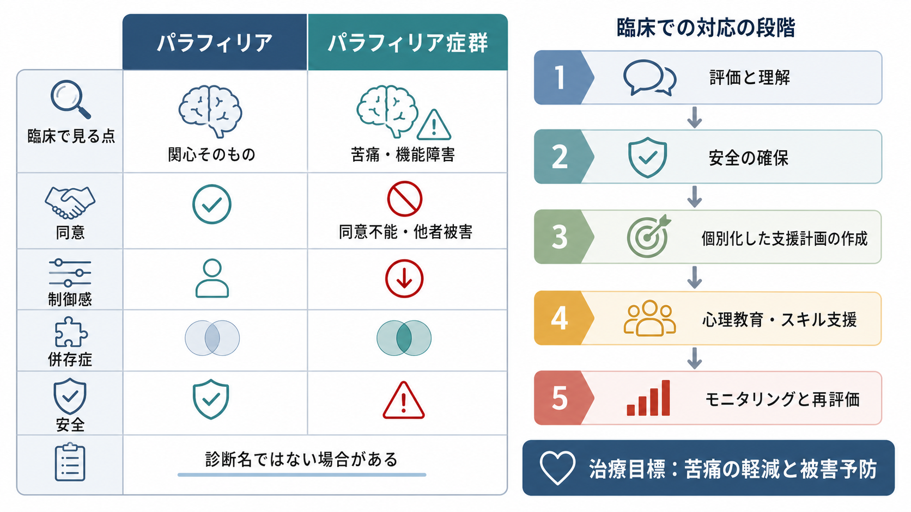
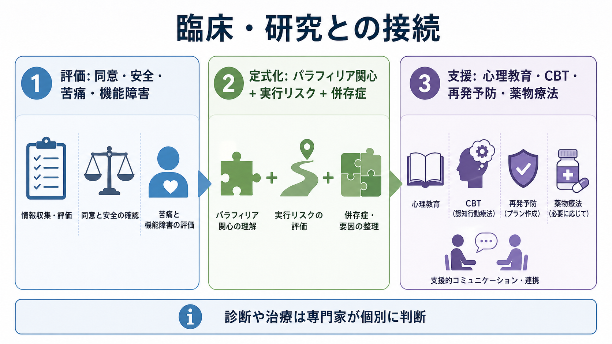

# パラフィリア症群とは何か

## 要点

- パラフィリア症群は、非典型的な性的関心そのものを広く病理化する概念ではなく、その関心が強く持続し、本人の苦痛・機能障害、または同意不能な対象への行動や他者被害のリスクと結びつく場合に問題となる診断群である[1][2]。
- DSM-5以降は「パラフィリア」と「パラフィリア症群」を区別し、非典型的な性的関心があるだけでは精神疾患とはみなさない方向が明確化された[1][4]。
- ICD-11でも、同意不能な他者を対象とする場合、または単独行動・同意ある成人間の行動であっても、著しい苦痛や重大な傷害・死亡リスクがある場合に診断対象となる[2][3]。
- 臨床では、道徳的評価ではなく、同意、強度と持続性、制御感、苦痛、生活機能、併存症、他害・自傷リスクを多面的に評価する[5][7]。
- 治療と支援の目標は、本人の尊厳を保ちながら苦痛を減らし、生活機能を回復し、被害を予防することである。心理教育、認知行動療法、再発予防、環境調整、必要時の薬物療法が検討される[5][6]。

## この記事で答える問い

1. パラフィリアとパラフィリア症群は何が違うのか。
2. なぜ「非典型的な関心」だけでは診断にならないのか。
3. 臨床では何を評価し、どのような支援につなげるのか。

## まず結論

パラフィリア症群は、「珍しい性的関心を持つ人」を分類するための診断名ではない。中心にあるのは、強く持続する性的関心が、本人の苦痛や生活上の支障、同意不能な対象への行動、または他者の安全を脅かすリスクと結びついているかである[1][2]。

したがって評価では、[[DSMとICDは何が違うのか]]で扱うような分類体系の違いを踏まえつつ、単に「何に関心があるか」ではなく、「その関心が本人と他者の安全・機能・権利にどう関係しているか」を見る。これは[[カテゴリ診断と次元診断は何が違うのか]]とも関係する。診断名だけでは重症度やリスクは決まらず、頻度、切迫感、制御可能性、併存症、環境要因を含めて次元的に把握する必要がある。

## 背景

精神医学では長い間、性的関心の非典型性が「逸脱」や「倒錯」として扱われやすかった。しかし現代の診断分類では、同意ある成人間の多様な性的関心を、それだけで精神疾患とみなすことは避けられている。DSM-5の改訂では、非典型的な性的関心を意味する「パラフィリア」と、臨床的問題を伴う「パラフィリア症群」を区別する方針が明示された[1][4]。

ICD-11でも、ICD-10の「性嗜好障害」から、同意不能な他者を対象とするパターン、または著しい苦痛・重大な傷害リスクを伴うパターンに焦点を絞る方向へ再編された[2][3]。この変更は、病理化の範囲を広げるためではなく、医療・公衆衛生・司法領域で必要なリスク評価と支援をより明確にするためのものと理解できる。

## 基本概念

### パラフィリア

パラフィリアとは、典型的な成人間の性的相互作用とは異なる対象・状況・行為に対する、強く持続する性的関心を指す。ここで重要なのは、パラフィリアは記述的な概念であり、それだけで病気を意味しないという点である[1][7]。

### パラフィリア症群

パラフィリア症群は、パラフィリア的関心が次のいずれかと結びつく場合に問題となる。

- 本人がその関心により著しい苦痛を感じている。
- 対人関係、学業、仕事、生活機能に支障が出ている。
- 同意できない人、同意不能な人、または傷つけられる可能性のある対象を巻き込む。
- 行動化により他者の心理的・身体的安全を損なうリスクがある。
- 単独行動や同意ある成人間の行動であっても、重大な傷害や死亡のリスクがある[2][3]。

この区別は、[[性機能や月経歴はなぜ精神科で重要なのか]]で扱うような性に関する医療面接にも関係する。臨床家は、性に関する話題を道徳的に裁くのではなく、本人の困りごと、安全、同意、生活機能、支援ニーズを丁寧に確認する必要がある。

## 仕組み

パラフィリア症群の発生機序は単一ではない。学習、反復する空想、情動調整、報酬学習、衝動制御、対人関係、発達歴、トラウマ、併存する精神疾患などが複合的に関わると考えられる[7][8]。

一部の人では、特定の刺激や状況が性的興奮と結びつき、反復する空想や行動を通じて強化される。これは[[依存症は報酬学習の病態としてどう理解できるのか]]や[[依存症における渇望とは何か]]で扱う報酬学習と似た側面を持つ。ただし、パラフィリア症群を単純に依存症と同一視してよいわけではない。関心の対象、同意、リスク、本人の価値観、併存症を含めた個別評価が必要である。

また、衝動をどの程度抑制できるか、危険な状況を避けられるか、援助を求められるかには、[[前頭前野は情動制御にどう関わるのか]]で扱うような認知制御や情動調整も関係する。臨床的には、性的関心を「消す」ことだけを目標にするのではなく、行動化を防ぐ計画、ストレス時の対処、孤立の軽減、安全な環境づくりを具体化する。

## 図解

上の図は、評価・定式化・支援の流れを示している。実際の面接では、次のような観点を分けて確認する。

| 観点 | 確認すること | 臨床的な意味 |
|---|---|---|
| 関心の性質 | 対象、状況、持続性、強度 | パラフィリア的関心の記述 |
| 苦痛 | 本人がどの程度困っているか | 支援ニーズの把握 |
| 機能障害 | 仕事、学業、家族、対人関係への影響 | 診断と重症度 |
| 同意 | 相手が自由で十分な同意を与えられるか | 他者の権利と安全 |
| 行動化 | 空想にとどまるか、実行歴があるか | リスク評価 |
| 併存症 | うつ、不安、物質使用、強迫症状、人格特性など | 鑑別と治療計画 |
| 保護因子 | 援助希求、治療動機、監督、生活構造 | 被害予防と再発予防 |

## 臨床・研究との接続

臨床ではまず、本人が安全に話せる関係を作る。強い羞恥や恐怖のために、性的関心や行動化のリスクは隠されやすい。評価では、[[他害リスク評価では何を見るべきか]]と同様に、過去の行動、現在の切迫感、対象への接近可能性、物質使用、孤立、ストレス、治療協力性を具体的に確認する。

鑑別では、[[強迫症とは何か]]にみられる侵入思考、躁病エピソード、物質使用、認知症や前頭側頭型認知症などの神経認知障害、精神病症状、パーソナリティ特性、単なる同意ある性的嗜好を分けて考える[7][8]。たとえば、本人が望まない性的な侵入思考に強い不安を抱いている場合、それはパラフィリア症群ではなく強迫症状として理解した方が適切なことがある。

治療はリスクと本人の困りごとに応じて段階的に考える。心理教育、認知行動療法、再発予防、衝動管理、対人スキル、生活リズム調整、支援者との連携が基本となる[5][6]。成人男性の重症例や他者への危険性が高い場合には、専門的評価のもとでSSRIや抗アンドロゲン薬、GnRHアナログなどの薬物療法が検討されることがあるが、適応、副作用、同意、法的文脈を慎重に扱う必要がある[5]。青年期では発達段階や副作用への配慮がさらに重要であり、家族支援や心理社会的介入が大きな比重を持つ[6]。

## よくある誤解

### 誤解1: 非典型的な性的関心はすべて病気である

そうではない。診断上の焦点は、関心そのものではなく、苦痛、機能障害、同意不能な対象への行動、または被害リスクである[1][2]。

### 誤解2: 診断名がつけば危険人物だと判断できる

診断名だけではリスクは決まらない。実行歴、現在の切迫感、対象への接近可能性、併存症、治療協力性、保護因子を評価する必要がある。これは[[反社会性パーソナリティ障害とは何か]]や[[物質使用障害とは何か]]を併存評価する場合にも重要である。

### 誤解3: 道徳的に不快なら診断してよい

ICD-11は、社会的拒否や恐れだけに由来する苦痛を診断根拠にしない方向を示している[2][3]。臨床判断は、価値判断ではなく、本人と他者の安全、機能、権利、支援ニーズに基づく。

### 誤解4: 治療は性的関心を完全になくすことだけを目指す

現実的な治療目標は、苦痛の軽減、生活機能の回復、危険な状況の回避、行動化の予防、支援につながり続けることを含む。重症度やリスクに応じて目標は個別化される[5][6]。

## 関連ノート

- [[DSMとICDは何が違うのか]]
- [[カテゴリ診断と次元診断は何が違うのか]]
- [[性機能や月経歴はなぜ精神科で重要なのか]]
- [[他害リスク評価では何を見るべきか]]
- [[強迫症とは何か]]
- [[依存症における渇望とは何か]]
- [[依存症は報酬学習の病態としてどう理解できるのか]]
- [[前頭前野は情動制御にどう関わるのか]]

## MOC更新候補

- `content/00_MOC/` 配下の精神医学、診断分類、臨床リスク評価、性の健康に関するMOCがあれば、本記事へのリンクを追加候補とする。
- 並列ジョブとの競合を避けるため、本タスクではMOCファイル自体は更新しない。

## 理解チェック

1. パラフィリアとパラフィリア症群の違いを一文で説明できるか。
2. 同意ある成人間の非典型的な性的関心が、なぜただちに精神疾患とはいえないのか。
3. パラフィリア症群の評価で、同意・苦痛・機能障害・他害リスクを分けて考える理由は何か。
4. 強迫症状や物質使用、神経認知障害との鑑別が重要になるのはどのような場合か。
5. 治療目標を「関心を消すこと」だけにしない理由は何か。

## 未解決問題

- パラフィリア的関心がどのような学習・発達・神経認知要因から形成されるかは、個人差が大きく、単一モデルでは説明しにくい。
- 法的文脈と医療的支援が交差するため、診断の偽陽性・過剰診断・スティグマを避けながら、被害予防をどう両立するかが課題である[4]。
- 薬物療法のエビデンスは重症度や対象集団に偏りがあり、心理社会的介入との組み合わせ、長期転帰、副作用、同意のあり方について慎重な検討が必要である[5][6]。

## 参考文献

[1] American Psychiatric Association. (2013). *Paraphilic Disorders*. DSM-5 Fact Sheets. https://www.psychiatry.org/File%20Library/Psychiatrists/Practice/DSM/APA_DSM-5-Paraphilic-Disorders.pdf

[2] World Health Organization. (2026). *ICD-11 for Mortality and Morbidity Statistics: Paraphilic disorders (6D30-6D3Z)*. https://icd.who.int/browse/2026-01/mms/en#2110604642

[3] Krueger, R. B., Reed, G. M., First, M. B., Marais, A., Kismödi, E., & Briken, P. (2017). Proposals for Paraphilic Disorders in the International Classification of Diseases and Related Health Problems, Eleventh Revision (ICD-11). *Archives of Sexual Behavior, 46*(5), 1529-1545. https://pmc.ncbi.nlm.nih.gov/articles/PMC5487931/

[4] First, M. B. (2014). DSM-5 and paraphilic disorders. *Journal of the American Academy of Psychiatry and the Law, 42*(2), 191-201. https://jaapl.org/content/42/2/191

[5] Thibaut, F., Cosyns, P., Fedoroff, J. P., Briken, P., Goethals, K., Bradford, J. M. W., & WFSBP Task Force on Paraphilias. (2020). The World Federation of Societies of Biological Psychiatry (WFSBP) 2020 guidelines for the pharmacological treatment of paraphilic disorders. *The World Journal of Biological Psychiatry, 21*(6), 412-490. https://pubmed.ncbi.nlm.nih.gov/32452729/

[6] Thibaut, F., Bradford, J. M. W., Briken, P., De La Barra, F., Häßler, F., Cosyns, P., & WFSBP Task Force on Sexual Disorders. (2016). The World Federation of Societies of Biological Psychiatry (WFSBP) guidelines for the treatment of adolescent sexual offenders with paraphilic disorders. *The World Journal of Biological Psychiatry, 17*(1), 2-38. https://pmc.ncbi.nlm.nih.gov/articles/PMC4743592/

[7] MSD Manual Professional Edition. (2025). *Overview of Paraphilias and Paraphilic Disorders*. https://www.msdmanuals.com/professional/psychiatric-disorders/paraphilias-and-paraphilic-disorders/overview-of-paraphilias-and-paraphilic-disorders

[8] Fisher, K. A., & Marwaha, R. (2023). *Paraphilia*. StatPearls. National Library of Medicine. https://www.ncbi.nlm.nih.gov/books/NBK554425/
