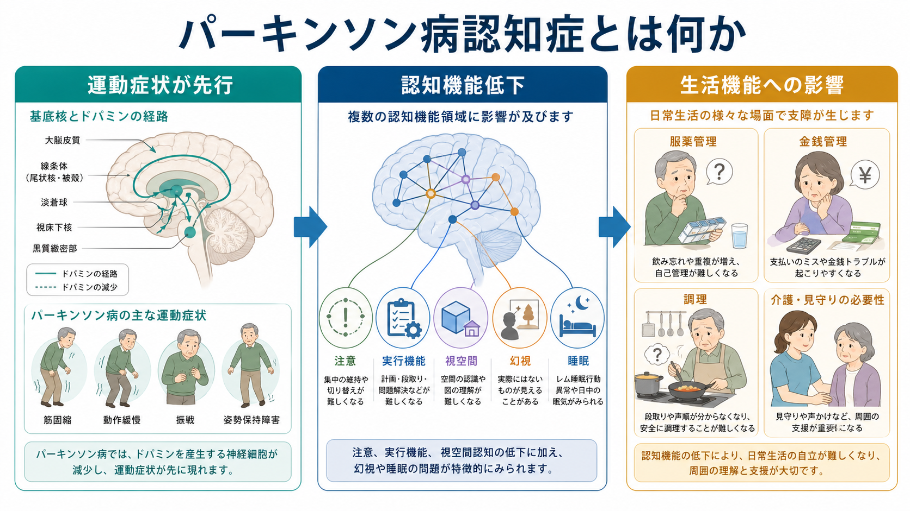
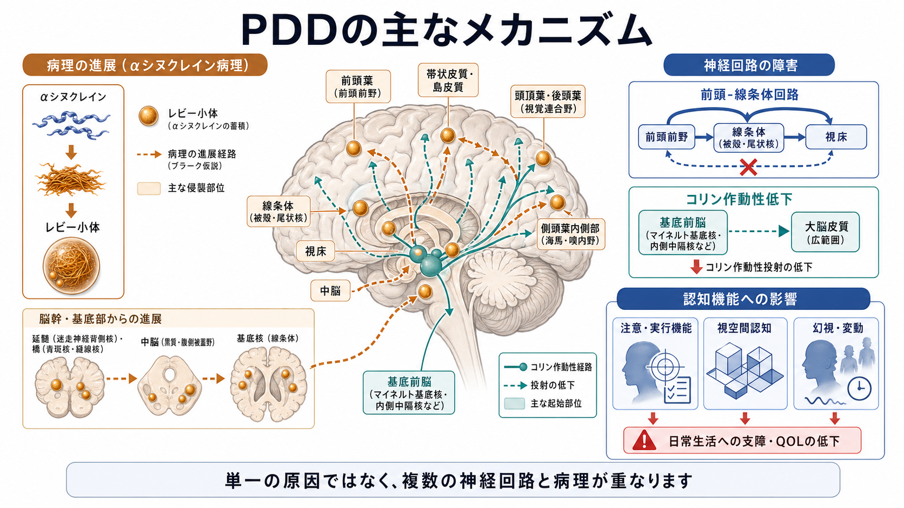
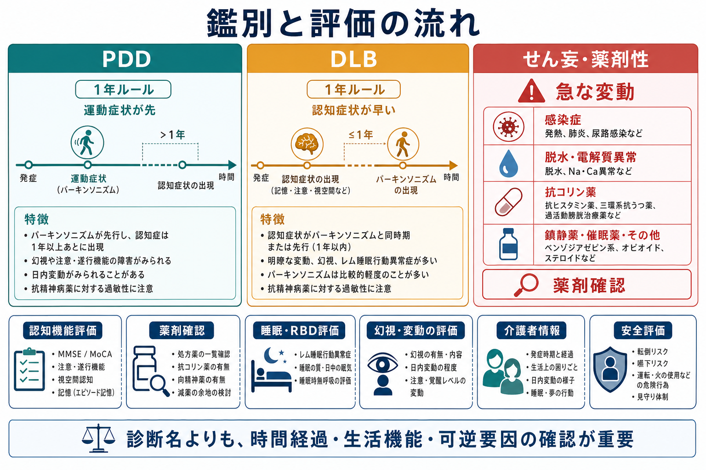

# パーキンソン病認知症とは何か

## 要点

- パーキンソン病認知症（Parkinson's disease dementia: PDD）は、確立したパーキンソン病の経過中に、注意、実行機能、視空間認知、記憶などの低下が進み、日常生活機能に支障を来す状態である[1][2]。
- 典型的には運動症状が先行し、後から認知症水準の[[認知機能障害とは何か|認知機能障害]]が目立つ。認知症とパーキンソニズムの時間関係が、[[レビー小体型認知症とは何か|レビー小体型認知症]]との鑑別で重要になる[3]。
- 認知プロフィールは、アルツハイマー病のような記銘障害だけでなく、注意の変動、[[実行機能障害とは何か|実行機能障害]]、視空間認知の障害、[[幻視とは何か|幻視]]、日中の眠気や[[レム睡眠行動障害とは何か|レム睡眠行動障害]]などを伴いやすい[1][4]。
- 病態は単一ではない。αシヌクレイン病理、レビー小体病理、前頭-線条体回路、コリン作動性系、アルツハイマー病理の併存などが重なって、症状の多様性を生む[1][5]。
- 治療や支援では、薬剤性・せん妄・睡眠障害などの可逆要因を確認し、生活機能、安全、介護者情報を合わせて評価する。薬物療法ではコリンエステラーゼ阻害薬が中心的選択肢として扱われるが、個別の治療判断は専門的評価に基づく[6][7]。

## この記事で答える問い

1. PDDは、通常のパーキンソン病の物忘れや加齢変化と何が違うのか。
2. どのような認知機能が障害されやすいのか。
3. レビー小体型認知症、[[せん妄とは何か|せん妄]]、薬剤性の認知変化とどう区別して考えるのか。
4. 臨床と研究では、どのような評価軸が重要になるのか。

## まず結論

PDDは「パーキンソン病の人に物忘れがある」という一症状ではなく、運動症状、認知機能、精神症状、睡眠、自律神経症状、生活機能が重なった臨床状態である。MDSの診断基準では、まずパーキンソン病があり、その経過中に認知症が出現し、複数の認知領域の障害と日常生活機能の低下が認められることが重視される[2][4]。

このとき「記憶だけ」を見ると見落としやすい。PDDでは、話の流れを追う、予定を組む、注意を切り替える、空間関係を判断する、薬を管理する、調理や金銭管理を行う、といった複合的な生活場面で困難が現れやすい。したがって評価では、[[認知機能検査は何を測っているのか|認知機能検査]]の点数だけでなく、本人と介護者から見た日常生活の変化を合わせて読む必要がある[2][4]。

## 背景

パーキンソン病は運動症状の疾患として理解されがちだが、経過中には非運動症状が広く出現する。認知機能障害はその代表であり、軽度認知障害の段階から認知症水準まで連続的に変化する[1]。古典的な疫学研究では、パーキンソン病患者の認知症リスクは同年代対照より高く、長期経過では多くの患者が認知症を経験しうることが示されてきた[8]。

重要なのは、PDDを「避けられない末期像」とだけ見ないことである。認知症の有無は、転倒、服薬管理、意思決定、介護負担、施設入所、QOLに関わる。さらに、幻視、日中変動、睡眠障害、うつ、アパシー、抗コリン薬や鎮静薬の影響など、評価と介入の余地がある要因も多い[1][6]。

## 基本概念

### PDDの診断軸

PDDの診断では、次の3点を分けて考える。

| 観点 | 確認すること |
|---|---|
| 時間経過 | まずパーキンソン病があり、その後に認知症水準の低下が出てきたか |
| 認知領域 | 注意、[[実行機能とは何か|実行機能]]、視空間認知、記憶、言語など複数領域が障害されているか |
| 生活機能 | 服薬、金銭管理、調理、外出、安全判断、社会参加に支障があるか |

MDSの診断手続きでは、簡便な臨床評価としてのLevel Iと、神経心理検査を含む詳細評価としてのLevel IIが提案されている[4]。研究では詳細なドメイン評価が必要になるが、臨床では「生活のどこで困っているか」を聞き落とさないことが同じくらい重要である。

### 「1年ルール」

PDDとレビー小体型認知症（dementia with Lewy bodies: DLB）は、病理や症状が大きく重なる。臨床分類では、認知症がパーキンソニズムより先に出る、またはパーキンソニズムの発症から1年以内に認知症が出る場合はDLB、確立したパーキンソン病の経過中に後から認知症が出る場合はPDDとして扱う、という「1年ルール」が用いられる[3]。

ただし、これは生物学的に完全に別疾患だという意味ではない。臨床研究や治療選択のために時間経過で分類している面があり、実際にはレビー小体病理、睡眠障害、幻視、注意変動などを共有する連続体として理解する方が現実的である[1][3]。

## 仕組み

PDDの認知障害は、黒質ドーパミン神経の脱落だけでは説明できない。初期から関わる前頭-線条体回路の変化は、注意、処理速度、計画、柔軟な切り替えに影響する。さらに、前脳基底部から大脳皮質へ広がる[[アセチルコリンは注意や記憶にどう関わるのか|コリン作動性系]]の低下は、注意の維持、覚醒、記憶の符号化、幻視や認知変動と関係する[1][5]。

病理学的には、αシヌクレインの凝集とレビー小体病理が脳幹、辺縁系、大脳皮質へ広がることが重要である。加えて、一部の患者ではアミロイドβやタウなどアルツハイマー病理が併存し、記憶障害や進行速度に影響しうる[1][5]。このため、PDDは「ドーパミン不足による認知症」ではなく、複数の神経伝達系とネットワーク病理が重なった状態として捉える必要がある。

## 図解

上の図は、PDDを3層で読むための模式図である。

1. 病理の層: αシヌクレイン病理とレビー小体病理が、脳幹・皮質下・辺縁系・大脳皮質に関わる。
2. 神経回路の層: 前頭-線条体回路、視空間ネットワーク、コリン作動性投射が変化する。
3. 生活機能の層: 注意、計画、空間認知、幻視、眠気、変動が、服薬管理、金銭管理、調理、安全判断に現れる。

この3層を分けると、本人の「できない」を性格や努力不足として見ず、どの認知ドメインと環境負荷がかみ合って困難が起きているのかを考えやすくなる。

## 臨床・研究との接続

### 評価で見るべきこと

PDDの評価では、診断名を急いで固定するより、時間経過、生活機能、可逆要因、安全を確認する。急な意識変容、発熱、脱水、感染、代謝異常、便秘、睡眠不足、疼痛、環境変化がある場合は、まず[[せん妄とは何か|せん妄]]を考える。抗コリン薬、鎮静薬、睡眠薬、オピオイド、ドパミン作動薬の過量や相互作用も、認知変動や幻視を悪化させうるため、[[薬剤性精神症状とは何か|薬剤性精神症状]]として検討する。

認知検査では、MMSEだけでなくMoCAのように実行機能・注意・視空間課題を含む検査が役立つことがある。ただし、検査点だけで重症度や意思決定能力を決めるのではなく、運動障害、視覚障害、教育歴、疲労、言語、気分、眠気の影響を読む必要がある[2][4]。

### 治療と支援

NICEのパーキンソン病ガイドラインでは、軽度から中等度のPDDに対してコリンエステラーゼ阻害薬を提示し、重度でも検討しうるとしている。メマンチンは、コリンエステラーゼ阻害薬が忍容できない、または禁忌の場合に検討する位置づけである[6]。大規模ランダム化試験では、リバスチグミンがPDDの認知・全般評価に有益性を示した一方、悪心、嘔吐、振戦などの副作用にも注意が必要である[7]。

非薬物的には、環境調整、服薬支援、カレンダーやチェックリスト、転倒予防、視覚的手がかり、睡眠と日中活動の調整、介護者支援が重要になる。幻視がある場合も、すぐに抗精神病薬へ進むのではなく、本人がどの程度苦痛を感じているか、照明や視覚刺激、薬剤、感染、睡眠の影響がないかを確認する。抗精神病薬はパーキンソニズム悪化や過敏性の問題があるため、専門的判断が必要である[1][3]。

## よくある誤解

### 誤解1: PDDは物忘れが中心である

PDDでは記憶障害も起こるが、注意、実行機能、視空間認知の障害が目立つことが多い。会話の途中で混乱する、段取りが組めない、空間関係を誤る、幻視がある、日によって明瞭さが変わる、といった変化を含めて見る必要がある[1][2]。

### 誤解2: パーキンソン病なら認知症は仕方がない

リスクは高いが、すべての変化を不可逆的な認知症として扱うのは危険である。せん妄、薬剤、感染、睡眠、うつ、感覚障害、環境変化は悪化要因になりうる。可逆要因の評価は、PDDがある人にも必要である。

### 誤解3: PDDとDLBは完全に別物である

臨床分類では1年ルールで区別するが、レビー小体病理、幻視、注意変動、RBD、コリン作動性低下などは重なる。分類は有用だが、症状と支援の設計では連続性を意識する方がよい[1][3]。

## 関連ノート

- [[認知機能障害とは何か]]
- [[実行機能障害とは何か]]
- [[認知機能検査は何を測っているのか]]
- [[幻視とは何か]]
- [[せん妄とは何か]]
- [[薬剤性精神症状とは何か]]
- [[レム睡眠行動障害とは何か]]
- [[アセチルコリンは注意や記憶にどう関わるのか]]

MOC更新候補: [[MOC｜精神医学]]、[[MOC｜症候学]]、[[MOC｜脳・神経科学]]。並列ジョブとの競合を避けるため、本記事からの大規模なMOC更新は行わない。

## 理解チェック

1. PDDとDLBを臨床的に区別する「1年ルール」とは何か。
2. PDDで、記憶以外に評価すべき認知ドメインを3つ挙げよ。
3. 急に認知機能が悪化したパーキンソン病患者で、PDDの進行と決める前に確認すべき可逆要因は何か。
4. PDDの病態を、ドーパミン不足だけで説明しにくい理由は何か。

## 未解決問題

- PDDへ進行しやすい人を、臨床症状、画像、髄液・血液バイオマーカー、睡眠指標からどこまで予測できるか。
- αシヌクレイン病理、アルツハイマー病理、血管性変化が重なる症例を、臨床上どのように層別化するか。
- コリンエステラーゼ阻害薬以外の治療、認知リハビリテーション、介護者介入、デジタルモニタリングが生活機能をどこまで改善するか。

## 参考文献

[1] Aarsland, D., Batzu, L., Halliday, G. M., Geurtsen, G. J., Ballard, C., Ray Chaudhuri, K., & Weintraub, D. (2021). Parkinson disease-associated cognitive impairment. *Nature Reviews Disease Primers*, 7, 47. https://doi.org/10.1038/s41572-021-00280-3

[2] Emre, M., Aarsland, D., Brown, R., Burn, D. J., Duyckaerts, C., Mizuno, Y., et al. (2007). Clinical diagnostic criteria for dementia associated with Parkinson's disease. *Movement Disorders*, 22(12), 1689-1707. https://doi.org/10.1002/mds.21507

[3] McKeith, I. G., Boeve, B. F., Dickson, D. W., Halliday, G., Taylor, J.-P., Weintraub, D., et al. (2017). Diagnosis and management of dementia with Lewy bodies: Fourth consensus report of the DLB Consortium. *Neurology*, 89(1), 88-100. https://doi.org/10.1212/WNL.0000000000004058

[4] Dubois, B., Burn, D., Goetz, C., Aarsland, D., Brown, R. G., Broe, G. A., et al. (2007). Diagnostic procedures for Parkinson's disease dementia: Recommendations from the Movement Disorder Society Task Force. *Movement Disorders*, 22(16), 2314-2324. https://doi.org/10.1002/mds.21844

[5] Irwin, D. J., Lee, V. M.-Y., & Trojanowski, J. Q. (2013). Parkinson's disease dementia: Convergence of α-synuclein, tau and amyloid-β pathologies. *Nature Reviews Neuroscience*, 14(9), 626-636. https://doi.org/10.1038/nrn3549

[6] National Institute for Health and Care Excellence. (2017). *Parkinson's disease in adults: diagnosis and management. Pharmacological management of dementia associated with Parkinson's disease*. NICE guideline NG71. https://www.ncbi.nlm.nih.gov/books/n/niceng71/ch8/

[7] Emre, M., Aarsland, D., Albanese, A., Byrne, E. J., Deuschl, G., De Deyn, P. P., et al. (2004). Rivastigmine for dementia associated with Parkinson's disease. *New England Journal of Medicine*, 351(24), 2509-2518. https://doi.org/10.1056/NEJMoa041470

[8] Aarsland, D., Andersen, K., Larsen, J. P., Lolk, A., & Kragh-Sørensen, P. (2003). Prevalence and characteristics of dementia in Parkinson disease: An 8-year prospective study. *Archives of Neurology*, 60(3), 387-392. https://doi.org/10.1001/archneur.60.3.387
