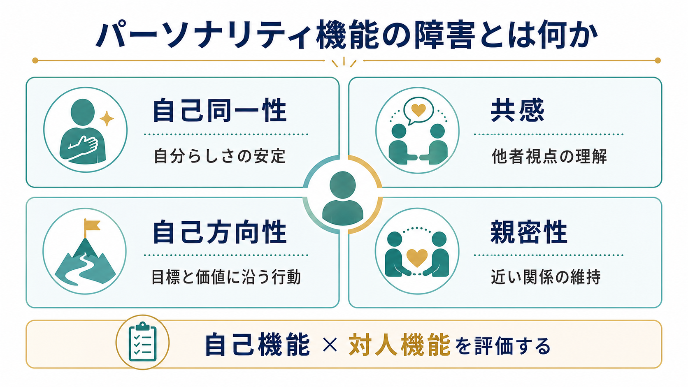
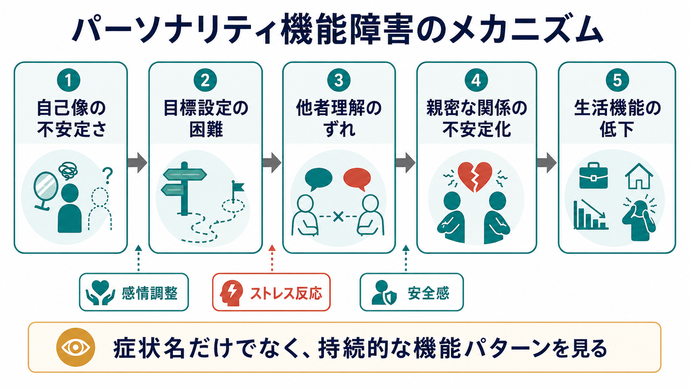

# パーソナリティ機能の障害とは何か

## 要点

- パーソナリティ機能の障害とは、単なる「性格の問題」ではなく、自己を安定して保ち、目標に沿って行動し、他者を理解し、近い関係を維持する機能の持続的な困難である。
- DSM-5 の代替モデルでは、パーソナリティ病理の中核を「自己同一性」「自己方向性」「共感」「親密性」の4領域で評価する[1][2]。
- ICD-11 では、特定の診断型を細かく並べるよりも、パーソナリティ障害の重症度と特性修飾子を中心に記述する方向へ移行している[4][5]。
- 臨床では、診断名だけでなく、生活機能、安全性、対人関係、併存症、文化的背景を含めて評価する必要がある[4][6]。

## この記事で答える問い

1. パーソナリティ機能の障害とは、何が障害されている状態なのか。
2. 自己同一性・自己方向性・共感・親密性は、それぞれ何を意味するのか。
3. DSM-5 AMPD と ICD-11 は、パーソナリティ病理をどのように捉え直しているのか。
4. 臨床や研究では、この概念をどのように使うとよいのか。

## まず結論

パーソナリティ機能の障害は、「その人の性格が悪い」という評価ではない。より正確には、自己と他者をどのように理解し、人生の方向づけや関係性の調整をどの程度安定して行えるか、という機能の水準をみる概念である。

DSM-5 の Alternative Model for Personality Disorders、略して AMPD では、パーソナリティ障害を評価するときに、まず Criterion A として「人格機能の水準」を評価する。ここには自己機能としての自己同一性と自己方向性、対人機能としての共感と親密性が含まれる[1][2]。この考え方は、[[パーソナリティ障害群とは何か]]を「固定された人格タイプ」ではなく、機能障害のパターンとして理解するための土台になる。

ICD-11 も同じ方向を共有している。ICD-11 では、多数のパーソナリティ障害カテゴリーを並べる方式から、軽度・中等度・重度という重症度評価と、否定的感情性、離隔性、非社会性、脱抑制、強迫性などの特性修飾子を組み合わせる方式へ大きく移行した[4][5]。これは[[カテゴリ診断と次元診断は何が違うのか]]という問題に対する、精神医学分類上の重要な応答でもある。

## 背景

従来のパーソナリティ障害診断では、境界性、自己愛性、回避性、強迫性などのカテゴリーが中心だった。しかし臨床現場では、複数のカテゴリーにまたがる特徴がみられる、診断カテゴリー間の境界が曖昧である、同じ診断名でも重症度や生活上の困難が大きく異なる、といった問題が繰り返し指摘されてきた[3][5]。

そこで近年の分類では、「どの型か」だけでなく、「どの程度、自己と対人関係の機能が障害されているか」を見る方向が強まっている。これは、[[DSMとICDは何が違うのか]]で扱われる分類体系の差を越えて、DSM-5 AMPD と ICD-11 の双方に共通する大きな流れである[3][5]。

この発想の利点は、診断名を人に貼るためではなく、支援計画を立てるために使いやすい点にある。たとえば同じ「境界性パーソナリティ障害」という診断名でも、主な困難が自己像の不安定さなのか、親密な関係の破綻なのか、衝動性なのか、慢性的な空虚感なのかによって、評価と支援の焦点は変わる。

## 基本概念

### 自己同一性

自己同一性とは、「自分はどのような人間か」という感覚が、時間や状況を越えてある程度まとまっていることである。障害が強い場合、自己評価が極端に上下する、自分の感情や欲求がわからない、他者からの評価に自己像が大きく左右される、空虚感が持続する、といった形で表れる[1][2]。

ここでいう自己同一性は、哲学的な[[自己とは何か]]や心理学的な[[自己概念とは何か]]と重なるが、臨床評価では「本人の生活機能や苦痛にどう影響しているか」を重視する。

### 自己方向性

自己方向性とは、現実的で意味のある目標を設定し、自分の価値に沿って行動を調整する力である。障害が強い場合、長期的な目標を保ちにくい、短期的な感情や対人反応に行動が左右される、失敗や批判の後に目標が極端に変わる、という形をとる[1][2]。

自己方向性は、[[自己決定理論とは何か]]で扱われる自律性や価値づけとも接続する。ただし、ここでは動機づけの一般理論ではなく、パーソナリティ病理の重症度を評価する臨床概念として扱う。

### 共感

共感とは、他者の経験、感情、意図、視点を理解し、自分の視点と区別できる能力である。障害があると、相手の反応を過度に拒絶や攻撃として読む、逆に相手の困りごとに気づきにくい、自分の苦痛で相手の視点が見えにくくなる、といった形で現れる[1][2]。

共感は単なる「優しさ」ではない。[[共感は認知機能としてどう理解できるのか]]で扱われるように、情動的共感、認知的共感、自己と他者の区別、感情調整が組み合わさる複合機能である。

### 親密性

親密性とは、相互性のある近い関係をつくり、維持し、修復する能力である。障害が強い場合、関係が理想化と失望の間で揺れる、見捨てられ不安や支配・服従のパターンが反復する、距離が近づくほど不安定になる、孤立しやすい、といった形でみられる[1][2]。

この意味での親密性は、恋愛関係だけではない。家族、友人、支援者、職場や学校の関係も含む。[[親密性はどのように形成されるのか]]で扱われる発達・愛着・社会的学習の問題とも関係する。

## 仕組み

パーソナリティ機能の障害は、単一の原因で説明できるものではない。発達歴、愛着関係、気質、トラウマ、慢性的ストレス、社会的環境、神経認知的な脆弱性、文化的期待が重なり、自己と対人関係のパターンとして固定化していくと考えられる[3][7]。

臨床的には、次のような連鎖として理解しやすい。

1. 自己像が不安定になる。
2. 目標や価値の軸が揺れやすくなる。
3. 他者の言動を脅威、拒絶、軽視として読みやすくなる。
4. 近い関係で過剰な接近、回避、試し行動、怒り、撤退が起こりやすくなる。
5. 仕事、学業、家庭、治療関係などの生活機能に影響が出る。

重要なのは、この連鎖を「本人の意志が弱い」と説明しないことである。機能障害として見ると、本人の努力不足ではなく、どの場面で自己調整と対人調整が破綻しやすいかを評価できる。これは[[ケースフォーミュレーションとは何か]]の実践にも近い。

## 図解

| 領域 | 主な問い | 障害が強いときの例 |
|---|---|---|
| 自己同一性 | 自分はどのような人間だと感じているか | 自己評価の激しい揺れ、空虚感、他者評価への過依存 |
| 自己方向性 | 何を大切にし、どこへ向かうか | 目標が保てない、価値と行動がつながらない |
| 共感 | 他者の視点をどの程度理解できるか | 拒絶や攻撃として読みやすい、相手の事情が見えにくい |
| 親密性 | 近い関係を相互的に維持できるか | 理想化と失望の揺れ、距離の調整困難、孤立 |

この表は診断チェックリストではない。実際の評価では、持続期間、発達段階、文化的背景、物質使用、気分症状、精神病症状、神経発達特性、身体疾患などを合わせて考える必要がある[4][6]。

## 臨床・研究との接続

臨床評価では、パーソナリティ機能の障害を、診断名よりも一段深い「支援の焦点」として使うと役に立つ。たとえば、自己同一性の障害が強い人には、感情や価値の言語化、自己理解、安定した治療関係が重要になる。自己方向性の障害が強い人には、目標設定、生活構造、短期的感情と長期的価値の区別が支援課題になる。

共感や親密性の困難が中心であれば、対人場面で何を脅威として読みやすいか、どの距離で関係が不安定化するか、修復可能なコミュニケーションをどう作るかが焦点になる。これは、[[GAFやWHODASは何を評価するのか]]で扱われる生活機能評価とも接続する。

研究では、AMPD や ICD-11 の方向性により、パーソナリティ病理をカテゴリーだけでなく重症度と次元で扱いやすくなった。レビューでは、人格機能の水準は従来カテゴリーの併存や異質性を整理し、特性次元と組み合わせることで臨床的記述を精密化できる可能性が示されている[3][5][8]。

ただし、評価尺度だけで十分ではない。本人の語り、観察、家族や支援者からの情報、生活上の実際の困難、文化的文脈を合わせて読む必要がある[4][6]。

## よくある誤解

### 誤解1: パーソナリティ機能の障害は「性格が悪い」という意味である

そうではない。これは道徳評価ではなく、自己と対人関係を調整する機能の評価である。教育・研究・臨床の文脈では、診断名を非難や烙印として使わず、支援計画の入口として使う必要がある。

### 誤解2: パーソナリティ障害の診断型が不要になった

完全に不要になったわけではない。DSM-5-TR では従来カテゴリーも残っており、AMPD は代替モデルとして提示されている[1]。ICD-11 では重症度と特性修飾子が中心になったが、境界型パターン修飾子など、臨床的に有用な記述も残されている[4][5]。

### 誤解3: 4領域のどれか1つだけを見れば診断できる

できない。自己同一性、自己方向性、共感、親密性は互いに関連している。さらに、症状の持続性、発達段階、文化的背景、併存症、生活機能、安全性を総合して評価する必要がある[4][6]。

### 誤解4: パーソナリティ機能は一度障害されると変わらない

固定的に考えるべきではない。評価は「今どのような支援が必要か」を明らかにするために使う。治療関係、心理療法、社会的支援、環境調整、危機対応によって、自己理解や対人調整のパターンは変化しうる。

## 関連ノート

既存ノート:

- [[パーソナリティ障害群とは何か]]
- [[統合失調型パーソナリティ障害とは何か]]
- [[DSMとICDは何が違うのか]]
- [[カテゴリ診断と次元診断は何が違うのか]]
- [[ケースフォーミュレーションとは何か]]
- [[GAFやWHODASは何を評価するのか]]
- [[自己とは何か]]
- [[自己概念とは何か]]
- [[共感は認知機能としてどう理解できるのか]]
- [[親密性はどのように形成されるのか]]

関連ノート候補:

- 人格機能水準尺度とは何か
- DSM-5 AMPDとは何か
- ICD-11のパーソナリティ障害分類とは何か
- 境界型パターン修飾子とは何か
- パーソナリティ特性修飾子とは何か

MOC更新候補:

- `content/00_MOC/` 配下の精神医学、診断・面接、臨床精神医学関連MOC

## 理解チェック

1. パーソナリティ機能の障害を、性格評価ではなく機能評価として説明するとどうなるか。
2. 自己同一性と自己方向性は、どちらも自己機能だが何が違うか。
3. 共感と親密性の障害は、対人関係でどのように現れやすいか。
4. DSM-5 AMPD と ICD-11 は、従来のカテゴリー診断のどの問題に対応しようとしているか。
5. 臨床で診断名だけに依存すると、どのような見落としが起こりうるか。

## 参考文献

[1] American Psychiatric Association. (2022). *Diagnostic and Statistical Manual of Mental Disorders, Fifth Edition, Text Revision (DSM-5-TR)*. American Psychiatric Association Publishing. https://doi.org/10.1176/appi.books.9780890425787

[2] Bender, D. S., Morey, L. C., & Skodol, A. E. (2011). Toward a model for assessing level of personality functioning in DSM-5, Part I: A review of theory and methods. *Journal of Personality Disorders, 25*(2), 143-160. https://doi.org/10.1521/pedi.2011.25.2.143

[3] Zimmermann, J., Kerber, A., Rek, K., Hopwood, C. J., & Krueger, R. F. (2019). A brief but comprehensive review of research on the Alternative DSM-5 Model for Personality Disorders. *Current Psychiatry Reports, 21*, 92. https://doi.org/10.1007/s11920-019-1079-z

[4] World Health Organization. (2024). *Clinical descriptions and diagnostic requirements for ICD-11 mental, behavioural and neurodevelopmental disorders*. https://www.who.int/publications/i/item/9789240077263

[5] Tyrer, P., Mulder, R., Kim, Y.-R., & Crawford, M. J. (2019). The development of the ICD-11 classification of personality disorders: An amalgam of science, pragmatism, and politics. *World Psychiatry, 18*(3), 288-296. https://doi.org/10.1002/wps.20607

[6] Bach, B., & First, M. B. (2018). Application of the ICD-11 classification of personality disorders. *BMC Psychiatry, 18*, 351. https://doi.org/10.1186/s12888-018-1908-3

[7] Livesley, W. J. (2018). Integrated modular treatment for borderline personality disorder: A practical guide to combining effective treatment methods. *Cambridge University Press*. https://doi.org/10.1017/9781108164497

[8] Morey, L. C. (2017). Development and initial evaluation of a self-report form of the DSM-5 Level of Personality Functioning Scale. *Psychological Assessment, 29*(10), 1302-1308. https://doi.org/10.1037/pas0000450
