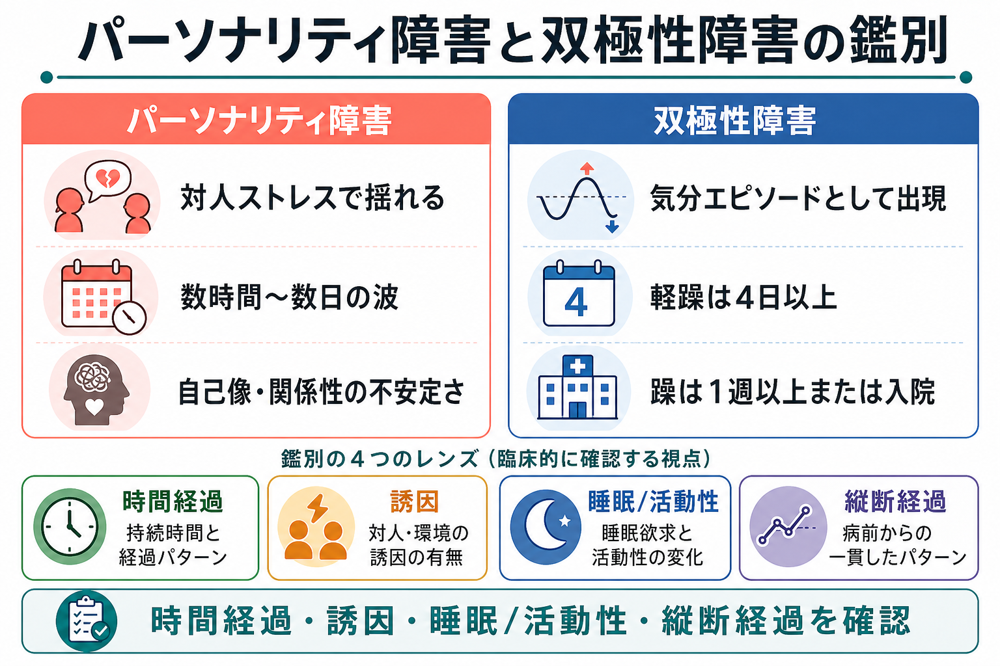
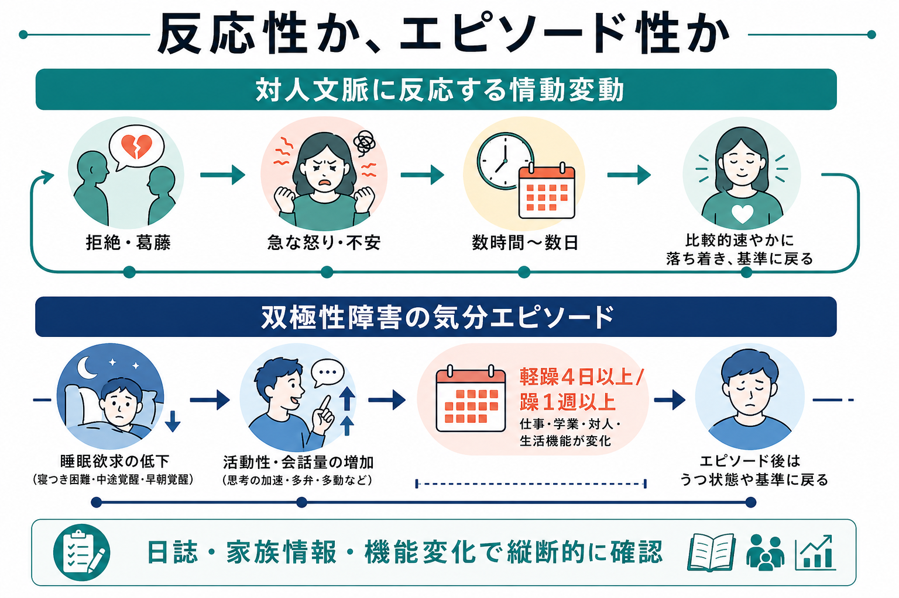
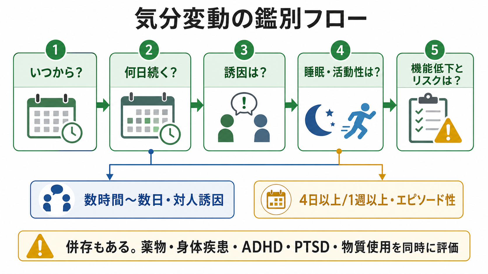

# パーソナリティ障害と双極性障害はどう鑑別するのか

## 要点

- 鑑別の中心は、「気分が変わるか」ではなく、**どのくらい続くか、何に反応するか、睡眠・活動性が変わるか、本人の基準状態からどれだけ離れるか**である。
- 双極性障害では、躁・軽躁・抑うつが比較的まとまった気分エピソードとして現れる。NICE は躁を7日以上または重度の機能障害・精神病症状、軽躁を4日以上の持続として説明している[1]。
- 境界性パーソナリティ障害を含むパーソナリティ障害では、対人関係、見捨てられ不安、自己像の揺れに伴う情動変動が目立ち、変動は数時間から数日で変わりやすい[2][3]。
- ただし、両者は併存しうる。片方の診断名で他方を除外せず、[[ADHDとは何か]]、[[PTSDとは何か]]、[[物質使用障害とは何か]]、身体疾患・薬剤性の気分症状も同時に評価する[1][4]。

## この記事で答える問い

「気分の波が激しい」という訴えだけでは、パーソナリティ障害、[[双極性障害とは何か]]、[[気分循環性障害とは何か]]、[[大うつ病性障害とは何か]]、トラウマ関連症状、発達特性、物質・薬剤の影響を区別できない。この記事では、特にパーソナリティ障害と双極性障害を、診断名の印象ではなく臨床的に観察できる時間構造から比較する。

## まず結論

最も実用的な問いは、「その気分変動は**反応性**か、それとも**エピソード性**か」である。

パーソナリティ障害では、気分の揺れはしばしば対人関係の出来事に強く結びつく。拒絶された、軽視された、見捨てられそうだと感じた、といった文脈で怒り、不安、空虚感、自己破壊衝動が急に高まり、比較的短い時間で変化する[2][3]。一方、双極性障害では、普段の本人とは異なる気分・活動性・睡眠の変化が、数日から週単位のまとまりとして現れる[1][5]。

## 背景

両者は、怒り、衝動性、自傷・自殺リスク、対人機能の低下、気分不安定性を共有するため、横断面の面接だけでは誤診が起こりやすい[4][6]。境界性パーソナリティ障害が双極性障害と見なされることもあれば、双極II型障害の軽躁が「性格の問題」と見なされることもある。

この混乱を減らすには、単一時点の症状リストよりも、縦断経過の再構成が重要である。本人の語り、家族・同居者からの情報、睡眠記録、服薬・物質使用、生活機能の変化を組み合わせて、いつから、何日続き、何をきっかけに、どの程度普段から離れたのかを確認する[1][5]。

## 基本概念

### 双極性障害で見るポイント

[[双極I型障害とは何か]]では躁病エピソードが、[[双極II型障害とは何か]]では軽躁病エピソードと抑うつエピソードが診断の軸になる。躁・軽躁では、気分の高揚または易怒性だけでなく、活動性・エネルギーの増加、睡眠欲求の低下、多弁、観念奔逸、注意散漫、目標志向活動の増加、危険な行動がまとまって出現する[5]。

重要なのは「眠れない」ではなく「寝なくても平気に見える」ことである。抑うつや不安では不眠で疲弊することが多いが、躁・軽躁では睡眠欲求そのものが低下し、活動量が上がることがある。

### パーソナリティ障害で見るポイント

パーソナリティ障害では、自己機能と対人機能の持続的な困難を評価する。ICD-11 のパーソナリティ障害モデルも、重症度、自己・対人機能、特性領域、境界性パターンを組み合わせて記述する方向にある[7]。

境界性パーソナリティ障害の文脈では、対人関係、自己像、感情、衝動性の不安定さが中心になる。NICE は、見捨てられ不安、拒絶への敏感さ、急速な自信から絶望への変動、自傷・自殺念慮の傾向を特徴として挙げている[2]。これは「気分エピソード」というより、対人文脈と自己評価の変動に埋め込まれた情動調整の困難として理解しやすい。

## 仕組み

鑑別を難しくするのは、どちらにも[[気分不安定性とは何か]]があることだ。しかし、不安定性の形は異なる。

双極性障害では、気分・活動性・睡眠・認知速度・社会的行動が同じ方向にまとまって変化しやすい。たとえば「寝ない」「話し続ける」「企画を急に増やす」「金銭・性的・職業的なリスクが増える」が数日以上続き、周囲から見ても普段と違う状態になる[5][8]。

パーソナリティ障害では、対人刺激に対する反応性が目立つ。怒りや不安は強くても、背景には拒絶感、孤立感、自己像の急な崩れ、関係性の不安定さがあることが多い。気分の上昇よりも、苦痛、空虚感、怒り、自己破壊衝動が中心になりやすい[2][3]。

## 図解

| 観点 | パーソナリティ障害で示唆されやすい所見 | 双極性障害で示唆されやすい所見 |
|---|---|---|
| 時間経過 | 数時間から数日の揺れ。対人文脈で急に変わる | 軽躁は4日以上、躁は1週以上または入院を要する重症度 |
| 誘因 | 拒絶、葛藤、見捨てられ不安、孤立感 | 明確な誘因がなくてもエピソード化しうる |
| 睡眠 | 不眠は苦痛や不安と結びつきやすい | 睡眠欲求の低下と活動性増加がまとまる |
| 気分の質 | 怒り、不安、空虚感、自己嫌悪 | 高揚、易怒性、誇大性、思考・行動の加速 |
| 機能変化 | 関係性や自己調整の困難が持続 | エピソード中に仕事・学業・家庭機能が普段から変化 |
| 診断上の注意 | ラベル化や人格批判を避ける | 抑うつだけの受診では軽躁歴を見落としやすい |

## 臨床・研究との接続

臨床では、スクリーニング尺度を「診断の代用」にしないことが重要である。MDQ と MSI-BPD を比較した入院患者研究では、MDQ は双極性障害に対して特異度が比較的高く、MSI-BPD も境界性パーソナリティ障害の検出に一定の有用性を示した。しかし、いずれも感度・陽性的中率には限界があり、構造化面接や縦断情報を置き換えるものではない[8]。

研究上は、両者を完全に別の箱として扱うよりも、情動調整、衝動性、報酬系、対人感受性、睡眠・概日リズムのどの成分がどの時間スケールで変動するかを分けて考える方が有用である。たとえば[[混合性特徴とは何か]]や[[急速交代型双極性障害とは何か]]では、双極性障害の内部でも気分の形が複雑になる。

## よくある誤解

### 「気分が変わりやすいなら双極性障害である」

違う。気分変動は多くの状態で起こる。双極性障害を示唆するのは、気分変化だけでなく、睡眠欲求、活動性、会話量、思考速度、リスク行動、機能変化がエピソードとしてまとまることである[1][5]。

### 「対人トラブルが多いならパーソナリティ障害である」

これも短絡である。対人トラブルは躁状態、うつ状態、[[PTSDとは何か]]、発達特性、物質使用、生活環境のストレスでも生じる。パーソナリティ障害の評価では、長期にわたる自己・対人機能のパターンと苦痛・障害の程度を見る[2][7]。

### 「併存は考えなくてよい」

併存はありうる。双極性障害の人が境界性パーソナリティ特性をもつことも、パーソナリティ障害の人が明確な躁・軽躁エピソードをもつこともある[3][6]。診断名を一つに絞るより、現在のリスク、睡眠・活動性、衝動性、対人危機、抑うつ、自殺念慮を分けて評価する方が臨床的に役立つ。

## 関連ノート

- [[双極性障害とは何か]]
- [[双極I型障害とは何か]]
- [[双極II型障害とは何か]]
- [[気分循環性障害とは何か]]
- [[急速交代型双極性障害とは何か]]
- [[混合性特徴とは何か]]
- [[気分不安定性とは何か]]
- [[大うつ病性障害とは何か]]
- [[ADHDとは何か]]
- [[PTSDとは何か]]
- [[物質使用障害とは何か]]
- [[身体疾患による気分障害とは何か]]
- [[統合失調型パーソナリティ障害とは何か]]

## 理解チェック

1. 「気分の波が激しい」という訴えを聞いたとき、最初に確認すべき時間経過は何か。
2. 軽躁・躁を疑うとき、単なる不眠ではなく何を確認する必要があるか。
3. パーソナリティ障害を疑う場合、対人関係以外にどの自己機能を評価するか。
4. スクリーニング尺度の陽性結果だけで診断を確定してはいけない理由は何か。

## 参考文献

[1] National Institute for Health and Care Excellence. (2025). *Bipolar disorder: assessment and management* (NICE Clinical Guideline No. 185). https://www.ncbi.nlm.nih.gov/books/NBK547001/

[2] National Institute for Health and Care Excellence. (2009). *Borderline personality disorder: recognition and management* (NICE Clinical Guideline No. 78). https://www.nice.org.uk/guidance/cg78

[3] Sanches, M. (2019). The limits between bipolar disorder and borderline personality disorder: A review of the evidence. *Diseases, 7*(3), 49. https://doi.org/10.3390/diseases7030049

[4] Ruggero, C. J., Zimmerman, M., Chelminski, I., & Young, D. (2010). Borderline personality disorder and the misdiagnosis of bipolar disorder. *Journal of Psychiatric Research, 44*(6), 405-408. https://doi.org/10.1016/j.jpsychires.2009.09.011

[5] Yatham, L. N., Kennedy, S. H., Parikh, S. V., et al. (2018). Canadian Network for Mood and Anxiety Treatments and International Society for Bipolar Disorders 2018 guidelines for the management of patients with bipolar disorder. *Bipolar Disorders, 20*(2), 97-170. https://doi.org/10.1111/bdi.12609

[6] Bayes, A. J., McClure, G., Fletcher, K., et al. (2016). Differentiating the bipolar disorders from borderline personality disorder. *Acta Psychiatrica Scandinavica, 133*(3), 187-195. https://doi.org/10.1111/acps.12509

[7] Bach, B., & First, M. B. (2018). Application of the ICD-11 classification of personality disorders. *BMC Psychiatry, 18*, 351. https://doi.org/10.1186/s12888-018-1908-3

[8] Palmer, B. A., Pahwa, M., Geske, J. R., et al. (2021). Self-report screening instruments differentiate bipolar disorder and borderline personality disorder. *Brain and Behavior, 11*(7), e02201. https://doi.org/10.1002/brb3.2201

## 未解決問題

- 双極II型障害、気分循環性障害、境界性パーソナリティ特性が重なる場合、どの時間スケールの情動変動が治療反応を最もよく予測するか。
- 日誌、スマートフォン行動データ、睡眠計測を組み合わせた縦断評価が、通常面接より鑑別精度を高めるか。
- 診断名によるスティグマを避けながら、リスク評価と治療選択に必要な情報をどう共有するか。

## MOC更新候補

- `content/00_MOC/` の精神医学・気分障害・パーソナリティ障害関連 MOC に、本記事へのリンクを追加候補とする。
