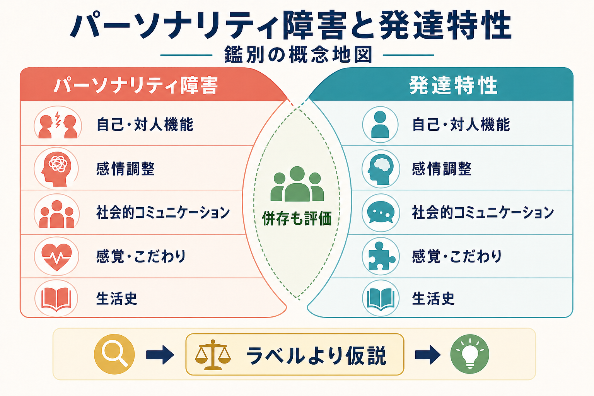
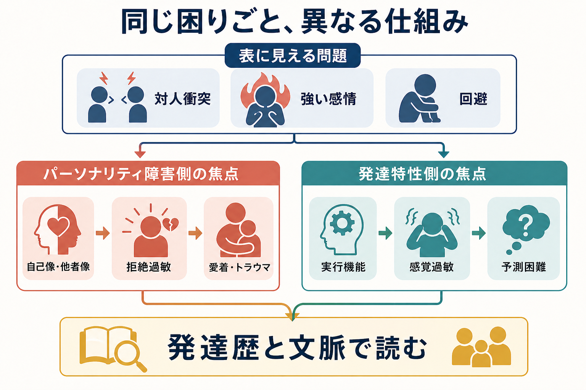

# パーソナリティ障害と発達特性はどう鑑別するのか

## 要点

- パーソナリティ障害と発達特性は、対人困難、感情調整困難、衝動性、回避、孤立、自己評価の揺れとして似て見えることがある。
- 鑑別の中心は「ラベル当て」ではなく、発達早期からの持続性、自己・対人機能、社会的コミュニケーション、感覚特性、実行機能、トラウマや愛着経験、現在の環境負荷を統合して見立てることである[1][2]。
- [[境界性パーソナリティ障害とは何か]] と [[ASDは脳ネットワークの違いとして理解できるのか]] は、どちらも対人関係の不安定さや感情の強さを伴いうるが、症状を生む仕組みは同じとは限らない[3][6]。
- 発達特性とパーソナリティ障害は排他的ではない。[[ADHDとは何か]]、ASD、[[PTSDとは何か]]、うつ病、不安症、物質使用、睡眠問題などの併存を同時に評価する必要がある[3][5][7]。
- 本記事は教育・研究目的の整理であり、個別の診断や治療指示ではない。

## この記事で答える問い

1. パーソナリティ障害と発達特性は、なぜ似て見えるのか。
2. 鑑別では、症状の「形」ではなく何を見るべきか。
3. 併存や二次的な心理反応をどう扱うべきか。
4. 臨床・研究で、この区別はどのように役立つのか。

## まず結論

パーソナリティ障害と発達特性の鑑別では、「対人関係が苦手」「感情が激しい」「衝動的」「孤立している」といった表面の症状だけでは不十分である。見るべきなのは、困難がいつから、どの場面で、どのような発達史・関係史・環境負荷のなかで現れ、本人の自己理解や生活機能にどう影響しているかである。

パーソナリティ障害では、自己像、他者像、親密さ、見捨てられ不安、拒絶への反応、持続的な対人パターンが重要になる。ICD-11 では、パーソナリティ障害は自己機能と対人機能の障害、および重症度を中心に整理される[2][8]。一方、ASD や ADHD などの発達特性では、発達早期からみられる社会的コミュニケーション、感覚過敏、反復的パターン、注意・実行機能、環境調整との相互作用が重要になる[1][3][5]。

## 背景

成人の精神科・心理臨床では、長年「性格の問題」と見なされていた困難が、実は発達特性、慢性的な環境不適合、トラウマ反応、二次的な抑うつ・不安で説明できることがある。逆に、発達特性だけでは説明しきれない対人パターン、自己像の不安定さ、強い見捨てられ不安、自傷リスク、関係の急激な理想化と脱価が前景化することもある。

このため、鑑別は「どちらか一方を選ぶ作業」ではない。重要なのは、生活史のなかで複数の説明仮説を並べ、どの仮説がどの困難を最もよく説明するかを検討することである。NICE の成人ASD評価でも、発達歴、現在の機能、併存する精神疾患、学習歴、家族や支援者からの情報が重視される[3]。

## 基本概念

### パーソナリティ障害

パーソナリティ障害は、単に「性格が悪い」「対人トラブルが多い」という意味ではない。DSM-5-TR では、内的経験と行動の持続的パターンが文化的期待から著しく偏り、認知、感情、対人機能、衝動制御などに現れ、苦痛や機能障害をもたらす状態として整理される[1]。ICD-11 では、カテゴリー名よりも、自己機能・対人機能の障害と重症度、必要に応じた特性ドメインで記述する方向に移行している[2][8]。

たとえば [[境界性パーソナリティ障害とは何か]] では、感情の急変、見捨てられ不安、自己像の揺れ、衝動性、自傷リスクが臨床上の焦点になりやすい。ただし、これらは本人の「意志の弱さ」ではなく、長期的な脆弱性、関係性、ストレス、学習、併存症が絡んだ機能的な問題として理解する必要がある[4]。

### 発達特性

発達特性は、発達早期からみられる認知・感覚・社会的情報処理・注意制御・行動調整の個人差である。ASD では、社会的コミュニケーションの違い、相互性の難しさ、感覚特性、反復的な行動や関心、予測可能性への強いニーズが重要になる[1][3]。ADHD では、不注意、多動性、衝動性、実行機能、報酬遅延への弱さ、生活構造との相互作用が問題になりやすい[5]。

発達特性そのものが必ず障害になるわけではない。困難は、本人の特性と、学校・職場・家庭・対人関係の要求水準が合わないときに顕在化しやすい。したがって、診断名だけでなく、環境調整、支援資源、疲労、睡眠、感覚負荷、対人要求を評価することが重要である。

## 仕組み

### 似て見える理由

パーソナリティ障害と発達特性が似て見えるのは、表面に現れる困りごとが重なるからである。たとえば、会話の行き違い、拒絶への強い反応、急な怒り、突然の離脱、予定変更への混乱、孤立、対人関係の断絶は、複数の経路から生じうる。

発達特性では、暗黙の社会的ルールの読み取りにくさ、感覚過敏、予測困難、実行機能の負荷が、結果として対人衝突や回避を生むことがある。パーソナリティ障害では、自己像・他者像の不安定さ、見捨てられ不安、親密さへの葛藤、拒絶への過敏さが、同じような対人問題として表れることがある[4][6]。

### 鑑別で見る軸

| 見る軸 | パーソナリティ障害で重視する点 | 発達特性で重視する点 |
|---|---|---|
| 発達歴 | 思春期以降から明確化する自己・対人パターン、長期の関係性の特徴 | 幼少期からの社会的コミュニケーション、感覚特性、注意・実行機能 |
| 対人困難 | 親密さ、拒絶、見捨てられ不安、理想化と脱価 | 暗黙のルール、会話の相互性、視線・表情・比喩の理解 |
| 感情調整 | 関係性の脅威に反応した急激な感情変動 | 過負荷、予測困難、感覚刺激、実行機能負荷による崩れ |
| 持続性 | 状況を越えて繰り返される対人パターン | 発達早期からの一貫した特性と環境依存の増減 |
| 評価情報 | 本人の語り、関係史、リスク、機能障害 | 家族・学校・職場情報、発達歴、感覚・認知プロファイル |
| 併存 | 抑うつ、不安、PTSD、物質使用、自傷リスク | ADHD、ASD、学習症、睡眠問題、二次的な抑うつ・不安 |

### 併存と二次的反応

発達特性をもつ人が、長期にわたり叱責、いじめ、孤立、誤解、過剰適応を経験すると、二次的に不安、抑うつ、怒り、自己否定、対人警戒が強まることがある。これがパーソナリティ障害のように見える場合がある。一方で、発達特性の有無にかかわらず、自己・対人機能の持続的な障害が臨床的に重要な場合もある[6][7]。

したがって、「発達特性があるからパーソナリティ障害ではない」「パーソナリティ障害だから発達特性ではない」とは言えない。併存、二次障害、環境不適合を含めた層状の見立てが必要である。

## 図解

1枚目は、パーソナリティ障害と発達特性を対立概念としてではなく、自己・対人機能、感情調整、社会的コミュニケーション、感覚・こだわり、生活史の軸で比較する概念地図である。中央の「併存も評価」は、鑑別が単純な二分法ではないことを示す。

2枚目は、同じ対人衝突や強い感情が、パーソナリティ障害側では自己像・他者像、拒絶過敏、愛着・トラウマの問題として、発達特性側では実行機能、感覚過敏、予測困難の問題として生じうることを示している。

## 臨床・研究との接続

臨床では、鑑別は支援方針を変える。発達特性が主な背景であれば、環境調整、予測可能性の向上、感覚負荷の低減、具体的なコミュニケーション、タスク分解、睡眠と生活リズムの整理が重要になる。パーソナリティ障害が主な背景であれば、安全性、自己・対人機能、感情調整、危機対応、治療関係の安定化、スキルトレーニングが焦点になりやすい[4]。

研究では、ASD と境界性パーソナリティ障害の重なりが議論されており、自己報告尺度だけでは十分に区別できない可能性がある[6]。また、成人ASDでは不安、気分症、ADHDなどの精神疾患併存が多く、単一診断だけで困難を説明しない姿勢が必要である[7]。

## よくある誤解

### 「人間関係が不安定ならパーソナリティ障害である」

そうとは限らない。ASD の社会的相互性の違い、ADHD の衝動性や忘れやすさ、感覚過敏、疲労、睡眠不足、[[PTSDとは何か|PTSD]] による警戒反応などでも、対人関係は不安定に見える。

### 「発達特性があればパーソナリティ障害は除外できる」

除外できない。発達特性とパーソナリティ障害は併存しうる。評価では、発達早期からの特性と、思春期以降に形成された自己・対人パターンを分けて考える。

### 「本人の話だけで鑑別できる」

本人の語りは中心的な情報だが、それだけでは足りないことがある。発達歴、家族や学校・職場からの情報、過去の記録、現在の生活機能、併存症、リスクを合わせて検討する[3][5]。

### 「診断名が決まれば支援方針も自動的に決まる」

診断名は出発点であり、支援方針そのものではない。実際には、本人がどの場面で困っているか、何が引き金になっているか、何が保護因子になるかを機能分析する必要がある。

## 関連ノート

- [[境界性パーソナリティ障害とは何か]]
- [[反社会性パーソナリティ障害とは何か]]
- [[統合失調型パーソナリティ障害とは何か]]
- [[ADHDとは何か]]
- [[ASDは脳ネットワークの違いとして理解できるのか]]
- [[PTSDとは何か]]
- [[うつ病とは何か]]
- [[不安症群とは何か]]

## 理解チェック

1. パーソナリティ障害と発達特性が似て見える代表的な表面症状を3つ挙げられるか。
2. 「いつから」「どの場面で」「どの機能が障害されているか」を分けて説明できるか。
3. ASD、ADHD、PTSD、パーソナリティ障害が併存しうる理由を説明できるか。
4. 診断名よりも機能分析が重要になる場面を具体例で説明できるか。

## 関連ノート候補

- 「ASDとは何か」
- 「発達歴とは何か」
- 「感情調整とは何か」
- 「パーソナリティ機能とは何か」
- 「拒絶過敏とは何か」
- 「精神科鑑別診断の考え方」

## MOC更新候補

- `content/00_MOC/` 配下の精神医学・発達症・パーソナリティ障害関連 MOC に追加候補。
- 並列ジョブとの競合を避けるため、本記事では MOC 本体は更新しない。

## 未解決問題

- ASD と境界性パーソナリティ障害の境界は、尺度・面接・発達歴の取り方によって変わりうる。
- 成人期に初めて発達特性が疑われる場合、幼少期情報が乏しく、鑑別の不確実性が残りやすい。
- パーソナリティ障害の重症度モデルと発達症の次元的理解を、臨床でどう統合するかは今後も検討が必要である。

## 参考文献

[1] American Psychiatric Association. (2022). *Diagnostic and Statistical Manual of Mental Disorders, Fifth Edition, Text Revision (DSM-5-TR).* https://www.psychiatry.org/psychiatrists/practice/dsm

[2] World Health Organization. (2024). *ICD-11 for Mortality and Morbidity Statistics.* Personality disorder / Autism spectrum disorder. https://icd.who.int/browse/2024-01/mms/en

[3] National Institute for Health and Care Excellence. (2012, updated). *Autism spectrum disorder in adults: diagnosis and management (CG142).* https://www.nice.org.uk/guidance/cg142/chapter/recommendations

[4] National Institute for Health and Care Excellence. (2009, updated). *Borderline personality disorder: recognition and management (CG78).* https://www.nice.org.uk/guidance/cg78/chapter/1-Guidance

[5] National Institute for Health and Care Excellence. (2018, updated). *Attention deficit hyperactivity disorder: diagnosis and management (NG87).* https://www.nice.org.uk/guidance/ng87/chapter/recommendations

[6] Dudas, R. B., Lovejoy, C., Cassidy, S., Allison, C., Smith, P., & Baron-Cohen, S. (2017). The overlap between autistic spectrum conditions and borderline personality disorder. *PLOS ONE, 12*(9), e0184447. https://doi.org/10.1371/journal.pone.0184447

[7] Lugo-Marín, J., Magán-Maganto, M., Rivero-Santana, A., et al. (2019). Prevalence of psychiatric disorders in adults with autism spectrum disorder: a systematic review and meta-analysis. *The Lancet Psychiatry, 6*(10), 819-829. https://doi.org/10.1016/S2215-0366(19)30267-6

[8] Bach, B., & First, M. B. (2018). Application of the ICD-11 classification of personality disorders. *BMC Psychiatry, 18*, 351. https://doi.org/10.1186/s12888-018-1908-3
