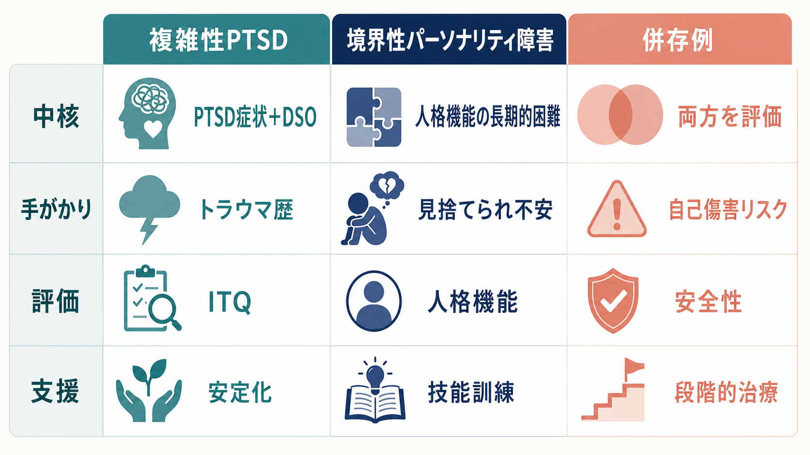

# パーソナリティ障害と複雑性PTSDはどう関係するのか

## 要点

- [[複雑性PTSDとは何か|複雑性PTSD]]は、ICD-11では[[PTSDとは何か|PTSD]]中核症状に加えて、情動調整困難、否定的自己概念、対人関係の困難からなる「自己組織化の障害（disturbances in self-organization; DSO）」を伴う診断概念である[1][4]。
- パーソナリティ障害、とくに境界性パーソナリティ障害と複雑性PTSDは、情動調整困難、対人不安定、解離、自傷リスク、恥や自己否定が重なりやすい[3][5]。
- ただし、両者は同じものではない。複雑性PTSDはPTSD中核症状とDSOの組み合わせを中心に見るのに対し、パーソナリティ障害は自己機能・対人機能の長期的な障害と特性パターンを中心に見る[3][6]。
- トラウマ歴は重要な手がかりだが、トラウマ歴だけで複雑性PTSDともパーソナリティ障害とも決まらない。現在の症状構造、機能障害、安全性、併存、生活文脈を分けて評価する必要がある[2][3]。
- 支援では、診断名の貼り替えよりも、危機対応、安全確保、情動調整技能、対人技能、トラウマ焦点化治療の適切な順序づけが重要になる[2][7][8]。

## この記事で答える問い

1. パーソナリティ障害と複雑性PTSDは、なぜ似て見えるのか。
2. 情動調整困難や対人問題を、トラウマ歴とどう関連づけて理解すればよいのか。
3. 境界性パーソナリティ障害と複雑性PTSDを、臨床・研究ではどこで区別するのか。
4. 併存が疑われるとき、評価と支援では何を優先するのか。

## まず結論

複雑性PTSDとパーソナリティ障害は、重なりうるが、同義ではない。複雑性PTSDは「トラウマ後に生じるPTSD中核症状」と「自己組織化の障害」を組み合わせて捉える概念であり、パーソナリティ障害は「自己と対人関係の機能が長期的に障害され、柔軟性を失ったパターンとして生活全体に現れる」ことを中心に捉える概念である[1][6]。

したがって、情動調整困難や対人問題を見たときに、「これは性格の問題か、トラウマの問題か」と二分するよりも、次の三層に分けて考えるほうが実用的である。

| 見る層 | 主な問い | 代表的な手がかり |
|---|---|---|
| PTSD中核症状 | 外傷記憶が現在に侵入しているか | 再体験、回避、現在の脅威感 |
| DSO | トラウマ後の自己・感情・関係の組織化が崩れているか | 情動調整困難、否定的自己概念、対人困難 |
| 人格機能 | 自己機能・対人機能の長期的パターンが障害されているか | 同一性、自己方向づけ、親密性、共感、衝動性、関係の反復パターン |

この三層は排他的ではない。ある人は複雑性PTSDのみを満たすことも、パーソナリティ障害のみを満たすことも、両方を満たすこともある[3]。臨床的には、どの診断名が「正しいか」を急いで決めるよりも、今どの症状が生活機能と安全性を最も損なっているかを評価することが優先される。

## 背景

長期的な対人トラウマ、たとえば幼少期からの虐待、ネグレクト、家庭内暴力、支配的関係、性的暴力、組織的暴力などは、単発の恐怖記憶だけでなく、感情の立ち上がり方、人を信頼する感覚、自己価値感、身体感覚、境界設定の仕方に影響しうる[2][3]。そのため、臨床現場では「対人関係が安定しない」「怒りや不安が急激に高まる」「自分を価値のない存在と感じる」「見捨てられ不安や孤立感が強い」といった問題が、パーソナリティ障害としても、複雑性PTSDとしても理解されうる。

この重なりには歴史的背景もある。複雑性PTSDは、長期反復性のトラウマを経験した人の症状を、境界性パーソナリティ障害だけで説明してよいのかという問題意識から発展してきた[3]。一方で、境界性パーソナリティ障害にもトラウマ歴、解離、情動調整困難、自傷リスクが高頻度にみられるため、両者の境界は単純ではない[3][5]。

NICEのPTSDガイドラインは、複雑性PTSDを含むPTSDでは、再体験、回避、過覚醒だけでなく、解離、情動調整困難、対人関係の問題、否定的自己知覚などにも注意するよう述べている[2]。これは、臨床評価が「過去に何があったか」だけでなく、「現在どのような反応パターンが生活を妨げているか」を見る必要があることを示している。

## 基本概念

### 複雑性PTSD

ICD-11の複雑性PTSDは、PTSD中核症状に加えて、自己組織化の障害を伴う状態として整理される[1][4]。PTSD中核症状には、現在に起きているような再体験、外傷関連刺激の回避、持続的な脅威感が含まれる。DSOには、強い感情が急激に高まり収まりにくい、または感情が麻痺するような情動調整困難、自分を壊れている・無価値だと感じる否定的自己概念、親密さや信頼が難しい対人関係の困難が含まれる[4]。

重要なのは、複雑性PTSDが「つらい経験をたくさんした人」という意味ではなく、PTSD中核症状とDSOが持続し、機能障害をもたらしている状態を指す点である[4]。

### パーソナリティ障害

ICD-11のパーソナリティ障害分類は、従来の細かなタイプ分けよりも、自己機能と対人機能の障害の重症度を中心に置く[6]。自己機能には、同一性、自己価値感、自己方向づけ、感情や衝動の調整が関わる。対人機能には、他者の視点を理解する力、親密な関係を維持する力、葛藤を扱う力、境界を調整する力が含まれる。

ICD-11では、重症度に加えて、否定的感情性、離隔、脱抑制、非社会性、強迫性などの特性ドメイン、さらに境界性パターン指定子を用いて臨床像を記述できる[6]。境界性パターンでは、感情・対人関係・自己像の不安定さ、衝動性、自傷や自殺関連リスク、見捨てられ不安、強い怒り、ストレス下の解離や一過性の精神病様体験などが問題になりやすい[5][6]。

### 境界性パーソナリティ障害との重なり

複雑性PTSDと特に重なりやすいのは、境界性パーソナリティ障害である。どちらにも、強い情動、対人関係の不安定さ、自己否定、解離、自傷リスクが現れうる[3][5]。しかし、複雑性PTSDではPTSD中核症状とDSOの組み合わせが中心であり、境界性パーソナリティ障害では見捨てられ不安、関係の急激な理想化と失望、衝動性、自己像の変動、慢性的空虚感などの広いパターンが中心になる[3][5]。

この区別は、本人の苦痛を軽く見るためではなく、支援の焦点を見誤らないために必要である。たとえば、再体験と回避が中心ならトラウマ焦点化治療の適応を検討しやすい。一方、危機の反復、自傷リスク、関係内の急激な不安定化が強い場合は、安全計画、危機対応、情動調整技能、対人技能の安定した枠組みが先に必要になることがある[2][7]。

## 仕組み

長期的な対人トラウマでは、危険を検出するシステムが過敏になりやすい。相手の表情、声の調子、沈黙、返信の遅れ、距離感の変化が「また傷つけられるかもしれない」という手がかりとして処理されると、身体は現在の安全な場面でも脅威反応を起こしやすくなる[2][3]。

この反応は、本人の意思の弱さではなく、過去の環境に適応するために形成された学習の名残として理解できる。危険な環境では、相手の機嫌を素早く読むこと、怒りや恐怖を強く感じること、接近を避けること、感情を切り離すことが生存に役立つ場合がある。しかし環境が変わった後も同じ反応が残ると、親密な関係、仕事、学習、治療関係のなかで困難を生む。

この仕組みは、複雑性PTSDにもパーソナリティ障害にも関わりうる。ただし、複雑性PTSDでは「トラウマ関連刺激に結びついた再体験・回避・脅威感」と「DSO」のまとまりを見る。パーソナリティ障害では、より広い時間軸で、自己と対人関係のパターンがどの程度固定化し、生活領域を横断して機能障害を生んでいるかを見る[3][6]。

## 図解

下の比較は、診断名を機械的に分けるための表ではない。評価でどの軸を確認するかを整理するための作業表である。

| 観点 | 複雑性PTSDで特に見る点 | パーソナリティ障害で特に見る点 |
|---|---|---|
| 中核 | PTSD中核症状とDSO | 自己機能・対人機能の長期的障害 |
| トラウマ歴 | 反復性・対人性トラウマが多いが、歴だけでは診断しない | トラウマ歴は多いが、必須条件ではない |
| 情動調整 | トラウマ後の過覚醒、感情麻痺、怒りや恐怖の制御困難 | 感情の急激な変動、衝動性、関係内での不安定化 |
| 自己概念 | 罪悪感、恥、敗北感、無価値感 | 同一性の不安定さ、空虚感、自己像の揺れ |
| 対人関係 | 親密さの回避、信頼困難、孤立 | 見捨てられ不安、理想化と失望、境界の不安定さ |
| 評価 | ITQなどでICD-11 PTSD/CPTSD構造を確認 | 人格機能、重症度、特性、リスクを評価 |

## 臨床・研究との接続

### 評価

評価では、まず安全性を確認する。自傷・自殺リスク、他害リスク、暴力や搾取への継続曝露、物質使用、解離、睡眠、身体疾患、生活基盤を把握する。NICEは、PTSD評価では心理・身体・社会的ニーズとリスクを含めた包括的評価を勧めている[2]。

次に、症状を層に分ける。PTSD中核症状、DSO、人格機能、気分症状、不安症状、解離症状、物質使用、発達特性を分けて見る。ITQはICD-11のPTSDと複雑性PTSDを評価する自己記入尺度として開発され、PTSD中核症状、機能障害、DSO、DSO関連機能障害を測る[4]。ただし、尺度は診断を置き換えるものではなく、面接と臨床判断を補助する道具である。

### 支援

複雑性PTSDやパーソナリティ障害が疑われる場合、最初から詳細な外傷記憶処理へ進むことが常に最善とは限らない。治療関係、生活の安全、睡眠、危機対応、情動調整、対人技能が不安定な場合には、安定化と技能訓練が重要になる[2][7]。

STAIRは、幼少期虐待などに関連するPTSDの人に、感情管理と対人技能を提供するために開発された治療アプローチであり、トラウマ焦点化治療の前段階としても用いられてきた[7]。近年のESTAIRは、ICD-11複雑性PTSDの症状領域に合わせ、情動調整、対人関係、否定的自己概念、PTSD症状をモジュールとして扱う試みである[8]。

パーソナリティ障害が併存する場合も、トラウマを無視する必要はない。むしろ、トラウマ歴、現在の関係パターン、自己傷害リスク、解離、信頼形成の困難を、本人を責めない言葉で共有することが重要になる。診断名は支援の入口であって、本人の人格全体を説明するラベルではない。

### 研究

研究上は、複雑性PTSD、PTSD、境界性パーソナリティ障害を区別するために、潜在クラス分析、確認的因子分析、尺度開発、併存率の検討が行われてきた[3][4]。現時点のレビューでは、PTSD、複雑性PTSD、境界性パーソナリティ障害は併存しうるが、区別可能な症候群として扱うのが妥当とされる[3]。

ただし、区別が常に明瞭とは限らない。幼少期逆境、解離、自己傷害、感情調整、社会的支援、治療アクセス、文化的背景が複雑に絡むため、研究結果を個別ケースへ単純に当てはめることはできない。

## よくある誤解

### 誤解1: 複雑性PTSDは、境界性パーソナリティ障害の別名である

別名ではない。重なる症状はあるが、複雑性PTSDはPTSD中核症状とDSOを中心に定義される。境界性パーソナリティ障害は、感情・自己像・対人関係・衝動性の広いパターンを中心に見る[3][5]。

### 誤解2: トラウマ歴があれば、パーソナリティ障害ではない

そうは言えない。トラウマ歴は重要な背景だが、パーソナリティ障害と複雑性PTSDは併存しうる[3]。また、パーソナリティ障害という診断があるからといって、トラウマの影響を軽視してよいわけでもない。

### 誤解3: パーソナリティ障害は「性格が悪い」という意味である

これは臨床的にも倫理的にも誤りである。パーソナリティ障害は、自己機能と対人機能の持続的な困難を記述する診断概念であり、道徳的評価ではない[6]。スティグマを避けるには、「人格の欠陥」ではなく「関係と自己調整の困難」として説明するほうがよい。

### 誤解4: 治療では、必ず外傷記憶を詳しく話す必要がある

必ずしもそうではない。トラウマ焦点化治療が有効な場合はあるが、タイミング、方法、安全性、本人の準備性が重要である[2][7]。情動調整や対人技能、危機対応を先に扱うことで、外傷記憶処理が安全に行いやすくなる場合がある。

## 関連ノート

- [[PTSDとは何か]]
- [[複雑性PTSDとは何か]]
- [[解離症群とは何か]]
- [[解離性同一性症とは何か]]
- [[自閉スペクトラム症とは何か]]
- [[双極性障害とは何か]]
- [[物質使用障害とは何か]]
- [[気分障害における自殺リスクとは何か]]
- [[不安症群とは何か]]

### 今後の作成候補

- 境界性パーソナリティ障害とは何か
- パーソナリティ障害とは何か
- トラウマインフォームドケアとは何か
- 情動調整とは何か
- STAIRとは何か
- International Trauma Questionnaireとは何か

### MOC更新候補

- `content/00_MOC/` 配下の精神医学・トラウマ関連MOCに本記事を追加する。
- 並列生成ジョブとの競合を避けるため、この作業ではMOC本体は更新しない。

## 理解チェック

1. 複雑性PTSDで、PTSD中核症状に加えて評価するDSOの3領域は何か。
2. 境界性パーソナリティ障害と複雑性PTSDが重なって見える症状を3つ挙げられるか。
3. トラウマ歴だけで診断を決められない理由を説明できるか。
4. 併存が疑われるとき、最初に確認すべき安全性・生活機能の項目は何か。
5. 外傷記憶処理の前に、情動調整技能や対人技能が必要になるのはどのような場合か。

## 参考文献

[1] World Health Organization. ICD-11 for Mortality and Morbidity Statistics, releases page and ICD-11 browser. https://icd.who.int/browse/releases/mms/en

[2] National Institute for Health and Care Excellence. Post-traumatic stress disorder: NICE guideline NG116. Published 2018. https://www.nice.org.uk/guidance/ng116

[3] Ford JD, Courtois CA. Complex PTSD and borderline personality disorder. *Borderline Personality Disorder and Emotion Dysregulation*. 2021;8:16. https://doi.org/10.1186/s40479-021-00155-9

[4] Cloitre M, Shevlin M, Brewin CR, Bisson JI, Roberts NP, Maercker A, Karatzias T, Hyland P. The International Trauma Questionnaire: development of a self-report measure of ICD-11 PTSD and complex PTSD. *Acta Psychiatrica Scandinavica*. 2018;138(6):536-546. https://doi.org/10.1111/acps.12956

[5] National Institute for Health and Care Excellence. Borderline personality disorder: recognition and management. Clinical guideline CG78. Published 2009; last reviewed 2024. https://www.nice.org.uk/guidance/cg78

[6] Bach B, First MB. Application of the ICD-11 classification of personality disorders. *BMC Psychiatry*. 2018;18:351. https://doi.org/10.1186/s12888-018-1908-3

[7] International Society for Traumatic Stress Studies. Clinician's Corner: Skills Training in Affective and Interpersonal Regulation (STAIR). https://istss.org/clinicians-corner-skills-training-in-affective-and-interpersonal-regulation-stair-marylene-cloitre-phd/

[8] Karatzias T, Shevlin M, Cloitre M, Busuttil W, Graham K, Hendrikx L, Hyland P, Biscoe N, Murphy D. Enhanced Skills Training in Affective and Interpersonal Regulation versus Treatment as Usual for ICD-11 Complex PTSD: A Pilot Randomised Controlled Trial. *Psychotherapy and Psychosomatics*. 2024;93(3):203-215. https://doi.org/10.1159/000538428
