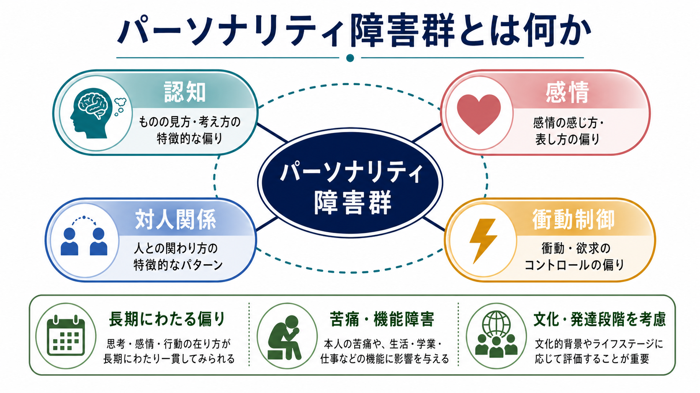
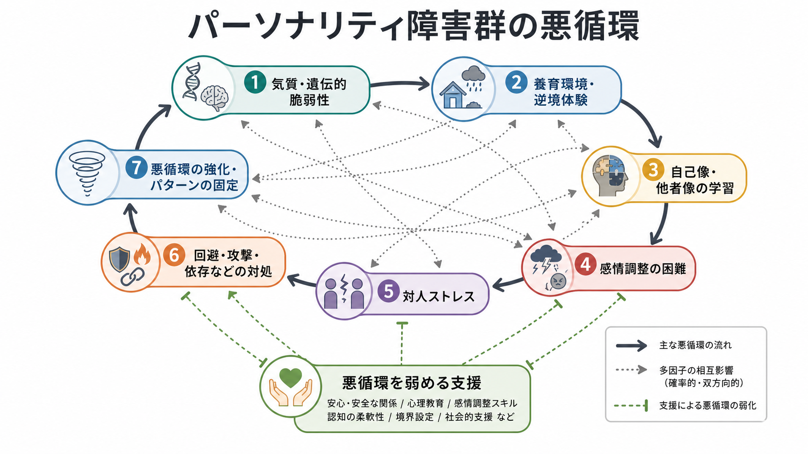
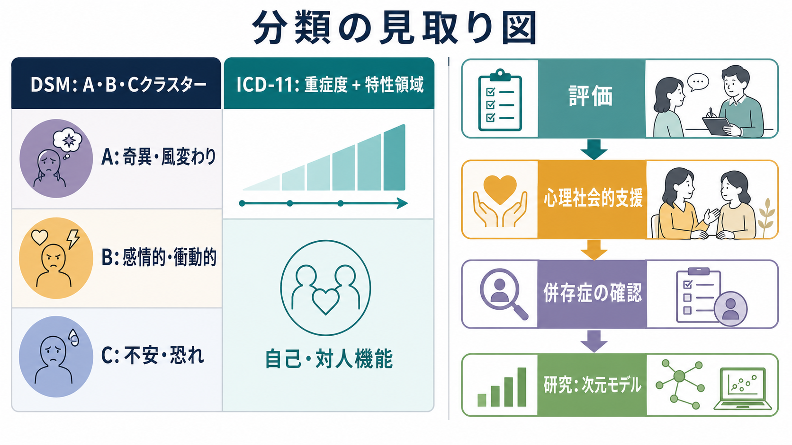

# パーソナリティ障害群とは何か

## 要点

- パーソナリティ障害群は、単なる「性格の悪さ」ではなく、認知、感情、対人関係、衝動制御にわたる長期的で柔軟性の低いパターンが、苦痛や機能障害につながる状態である [1]。
- DSM-5-TR は伝統的なカテゴリー分類を維持しつつ、ICD-11 は「重症度」と「特性領域」で把握する次元モデルへ大きく寄せている [1][2]。
- 背景には、気質・遺伝的脆弱性、発達環境、逆境体験、対人学習、感情調整、社会的文脈が重なり合う。単一原因で説明するより、多因子の悪循環として理解する方が臨床的に有用である [5][6]。
- 評価では、[[うつ病とは何か]]、[[双極性障害とは何か]]、[[PTSDとは何か]]、[[物質使用障害とは何か]]、神経発達症、身体疾患、文化的背景との鑑別が重要である。
- 支援の中心は、ラベル貼りではなく、本人の苦痛と生活機能を見立て、心理教育、危機対応、心理療法、併存症への治療、環境調整を組み合わせることである [7][8]。

## この記事で答える問い

この記事では、パーソナリティ障害群を「どのような診断名の集合か」だけでなく、「なぜ認知・感情・対人関係・衝動制御の偏りとして理解されるのか」という観点から整理する。個別の診断や治療方針を決めるための記事ではなく、教育・研究目的の概観である。

## まず結論

パーソナリティ障害群とは、自己や他者の捉え方、感情の起こり方と表し方、対人関係の作り方、衝動や行動の調整の仕方に、長期にわたる偏りがあり、それが本人の苦痛や社会的・職業的・学業的機能の障害につながる状態を指す [1][2]。重要なのは、「その人の人格そのものが悪い」という意味ではない点である。むしろ、ある状況では本人を守ってきた対処様式が、別の状況では硬くなりすぎ、関係性や生活を狭めてしまう状態として理解できる。

## 背景

DSM 系の診断では、パーソナリティ障害は伝統的に複数のカテゴリーに分けられ、A クラスター、B クラスター、C クラスターという大まかなまとまりで説明されてきた。A クラスターは奇異・風変わり、B クラスターは感情的・衝動的、C クラスターは不安・恐れを中心とする臨床像として教科書的に整理される [1]。ただし、実際の臨床では複数カテゴリーの特徴が重なり、他の精神疾患との併存も多いため、カテゴリーだけで全体像を説明するには限界がある [3]。

ICD-11 はこの問題を踏まえ、個別の型を中心に並べるよりも、まずパーソナリティ機能の障害の重症度を評価し、必要に応じて否定的感情、離隔、非社会性、脱抑制、強迫性などの特性領域で記述する方向へ移った [2][3]。これは、[[DSMとICDは何が違うのか]]で扱う分類体系の違いとも接続する。

疫学的には、地域一般人口における何らかのパーソナリティ障害の推定有病率は、研究方法や地域によって幅があるが、メタ解析では世界全体でおよそ 7.8% と報告されている [4]。ただし、この数字は診断面接、質問紙、文化差、医療アクセス、研究対象年齢によって変動するため、「誰にでも簡単に当てはめられる割合」として読むべきではない。

## 基本概念

### 4つの領域

パーソナリティ障害群の理解では、少なくとも次の4領域を見る。

| 領域 | 見るポイント | 関連する既存ノート |
|---|---|---|
| 認知 | 自分・他者・出来事をどう解釈するか。被害的解釈、理想化と失望、硬い信念など | [[認知バイアスとは何か]]、[[社会的認知とは何か]] |
| 感情 | 感情の強さ、変動、持続、表現、空虚感、怒り、不安など | [[情動と認知は分けられるのか]]、[[身体と感情はどのようにつながるのか]] |
| 対人関係 | 親密さ、距離の取り方、信頼、依存、回避、境界設定、葛藤への反応 | [[共感は認知機能としてどう理解できるのか]] |
| 衝動制御 | 行動化、自己破壊的行動、攻撃性、浪費、物質使用、リスク行動など | [[衝動性とは何か]]、[[依存は学習の病態として説明できるのか]] |

これらは独立した箱ではなく、互いに増幅し合う。たとえば「相手は自分を見捨てる」という解釈が強まると、不安や怒りが高まり、確認行動や回避が増え、結果として関係が不安定になることがある。逆に、対人関係の失敗が重なることで、自己像や他者像がさらに硬くなることもある。

### 診断名と人格の混同を避ける

「パーソナリティ」という言葉は誤解を招きやすい。診断で問題にするのは、その人の価値ではなく、生活の中で繰り返される機能的な困難である [1][2]。したがって、診断名は相手を非難するラベルではなく、困りごとの型を見立て、支援の焦点を定めるための道具でなければならない。

## 仕組み

パーソナリティ障害群は、単一の脳部位、単一の遺伝子、単一の養育体験だけで説明できない。研究上は、気質や遺伝的傾向、幼少期の逆境、養育環境、愛着、トラウマ、社会的学習、感情調整、衝動性、対人ストレスが相互作用するモデルがよく用いられる [5][6]。これは [[トラウマは発達にどう影響するのか]] や [[内受容感覚は感情にどう関わるのか]] とも接続する。

境界性パーソナリティ障害の研究では、生物学的な情動反応性や衝動性と、感情を受け止めにくい環境との相互作用を重視する生物社会的発達モデルが提案されてきた [6]。ただし、このモデルは境界性パーソナリティ障害に関する説明であり、すべてのパーソナリティ障害をそのまま説明する万能モデルではない。広くは、「脆弱性」と「環境」と「学習された対処」が循環するという形で読むとよい。

悪循環は、次のように整理できる。

1. 気質や発達上の脆弱性が、感情の強さ、注意の向きやすさ、衝動性に影響する。
2. 逆境体験、慢性的ストレス、対人関係の不安定さが、自己像・他者像の学習に影響する。
3. ストレス下で、解釈の偏りや感情調整の困難が強まり、回避、攻撃、依存、過剰確認などの対処が起こる。
4. その対処が短期的には安心をもたらしても、長期的には関係や生活機能を損ない、さらにストレスを増やす。

この理解は、本人を責めるためではなく、介入点を増やすためにある。自己理解、感情調整スキル、対人スキル、危機時の安全確保、社会的支援、併存症の治療は、悪循環の異なる場所に働きかける。

## 図解

DSM と ICD-11 の違いは、パーソナリティ障害群を理解するうえで特に重要である。DSM のクラスター分類は臨床像を素早く把握する補助線になる一方、ICD-11 の重症度・特性領域モデルは、連続的な困難や複数特徴の重なりを記述しやすい [2][3]。

## 臨床・研究との接続

臨床では、まずリスク、苦痛、生活機能、対人関係、併存症を評価する。たとえば、気分の波が主訴であっても、[[双極性障害とは何か]]、[[うつ病とは何か]]、物質使用、睡眠問題、発達特性、トラウマ関連症状を確認しなければ、パーソナリティ障害の特徴だけに早く収束してしまう危険がある。

支援では、心理教育、危機対応計画、家族・支援者との連携、心理療法、社会的支援を組み合わせる。境界性パーソナリティ障害については、弁証法的行動療法、メンタライゼーションに基づく治療、スキーマ療法、転移焦点化精神療法などが研究されており、Cochrane レビューでは、心理療法が通常治療に比べて症状や心理社会的機能に一定の利益をもたらす可能性が示されている。ただし、エビデンスの確実性には限界があり、効果の大きさや適応は個別に考える必要がある [8]。

NICE の境界性パーソナリティ障害ガイドラインも、本人の尊厳、協働的な意思決定、継続的な関係性、危機時対応、薬物療法に過度に依存しないことを重視している [7]。これは、パーソナリティ障害群を「治らない性格」と見るのではなく、「長期的な支援で変化しうる対人・感情・行動パターン」と見る実践的な姿勢と一致する。

研究面では、カテゴリー診断と次元モデルの統合、発達軌跡、文化差、スティグマ、併存症、心理療法の作用機序が重要な課題である。特に、自己・対人機能、感情調整、メンタライジング、社会的認知、衝動性を測定可能な次元として扱う研究は、診断名を超えた理解につながる。

## よくある誤解

### 「性格が悪い人」という意味ではない

パーソナリティ障害群は道徳的評価ではない。臨床的に見るべきなのは、本人と周囲にどのような苦痛や機能障害が起きているか、そのパターンがどれほど持続し、どれほど柔軟性を失っているかである [1][2]。

### 「一生変わらない」という意味ではない

長期にわたる傾向であることは確かだが、症状や機能は変化しうる。年齢、環境、対人関係、心理療法、社会的支援、併存症の改善によって、危機の頻度や関係の安定性が変わることがある [3][8]。

### 「診断名が分かれば対応が決まる」わけではない

同じ診断名でも、困っている場面、危機のパターン、併存症、支援資源、文化的背景は大きく異なる。診断名は出発点であり、支援計画そのものではない。

### 「本人だけの問題」ではない

パーソナリティ障害群は、個人内の特性だけでなく、関係性や環境との相互作用として現れる。対人関係の安全性、予測可能性、境界設定、支援者側の一貫性も重要である。

## 関連ノート

- [[DSMとICDは何が違うのか]]
- [[衝動性とは何か]]
- [[認知バイアスとは何か]]
- [[社会的認知とは何か]]
- [[共感は認知機能としてどう理解できるのか]]
- [[トラウマは発達にどう影響するのか]]
- [[PTSDとは何か]]
- [[うつ病とは何か]]
- [[双極性障害とは何か]]
- [[物質使用障害とは何か]]

MOC 更新候補: `content/00_MOC/` 配下の精神医学、臨床心理、精神病理、疾患・症候群関連の MOC に追加候補。並列編集を避けるため、このジョブでは MOC 本体は更新しない。

## 理解チェック

1. パーソナリティ障害群を「性格の悪さ」と説明すると、どのような臨床的問題が起こるか。
2. DSM のクラスター分類と ICD-11 の重症度・特性領域モデルは、それぞれ何を見やすくするか。
3. 認知、感情、対人関係、衝動制御は、どのように悪循環を作りうるか。
4. パーソナリティ障害群を評価するとき、併存症や鑑別診断を確認する必要があるのはなぜか。
5. 支援の目的を「性格を変える」ではなく「機能と苦痛を改善する」と表現する利点は何か。

## 参考文献

[1] American Psychiatric Association. (2022). *Diagnostic and Statistical Manual of Mental Disorders, Fifth Edition, Text Revision (DSM-5-TR).* American Psychiatric Association Publishing. https://doi.org/10.1176/appi.books.9780890425787

[2] World Health Organization. (2024). *ICD-11 for Mortality and Morbidity Statistics: 6D10 Personality disorder.* https://icd.who.int/browse/2024-01/mms/en#941859884

[3] Tyrer, P., Reed, G. M., & Crawford, M. J. (2015). Classification, assessment, prevalence, and effect of personality disorder. *The Lancet, 385*(9969), 717-726. https://doi.org/10.1016/S0140-6736(14)61995-4

[4] Winsper, C., Bilgin, A., Thompson, A., Marwaha, S., Chanen, A. M., Singh, S. P., Wang, A., & Furtado, V. (2020). The prevalence of personality disorders in the community: A global systematic review and meta-analysis. *The British Journal of Psychiatry, 216*(2), 69-78. https://doi.org/10.1192/bjp.2019.166

[5] Carpenter, R. W., Tomko, R. L., Trull, T. J., & Boomsma, D. I. (2013). Gene-environment studies and borderline personality disorder: A review. *Current Psychiatry Reports, 15*, 336. https://doi.org/10.1007/s11920-012-0336-1

[6] Crowell, S. E., Beauchaine, T. P., & Linehan, M. M. (2009). A biosocial developmental model of borderline personality: Elaborating and extending Linehan's theory. *Psychological Bulletin, 135*(3), 495-510. https://doi.org/10.1037/a0015616

[7] National Institute for Health and Care Excellence. (2009, updated 2024). *Borderline personality disorder: recognition and management (CG78).* https://www.nice.org.uk/guidance/cg78

[8] Storebø, O. J., Stoffers-Winterling, J. M., Völlm, B. A., Kongerslev, M. T., Mattivi, J. T., Jørgensen, M. S., Faltinsen, E., Todorovac, A., Sales, C. P., Callesen, H. E., Lieb, K., & Simonsen, E. (2020). Psychological therapies for people with borderline personality disorder. *Cochrane Database of Systematic Reviews*, 2020(5), CD012955. https://doi.org/10.1002/14651858.CD012955.pub2

## 未解決問題

- ICD-11 の次元モデルが、日常臨床でどの程度使いやすく、治療選択や予後予測を改善するか。
- パーソナリティ障害群の特徴と、発達特性、トラウマ関連症状、気分障害、物質使用の境界をどのように評価するか。
- スティグマを減らしながら、リスク評価と継続支援を両立する説明方法をどう整備するか。
- 心理療法のどの要素が、どの患者群に、どの時期に有効なのか。
