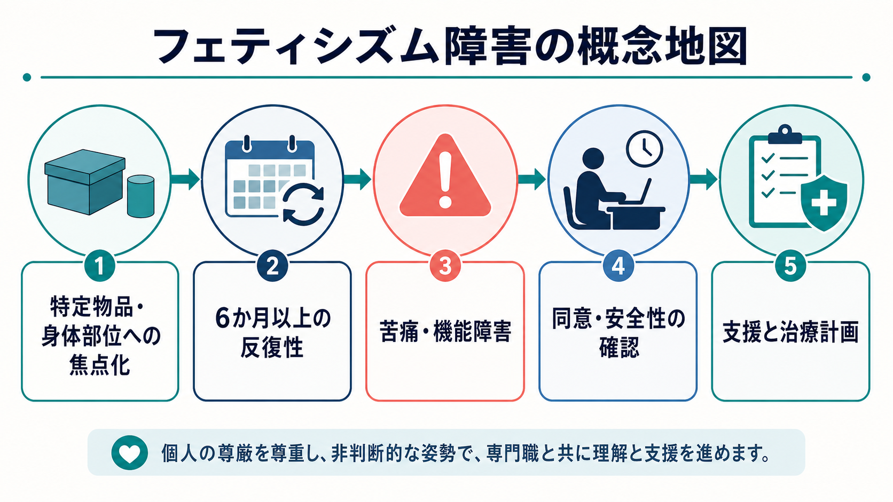
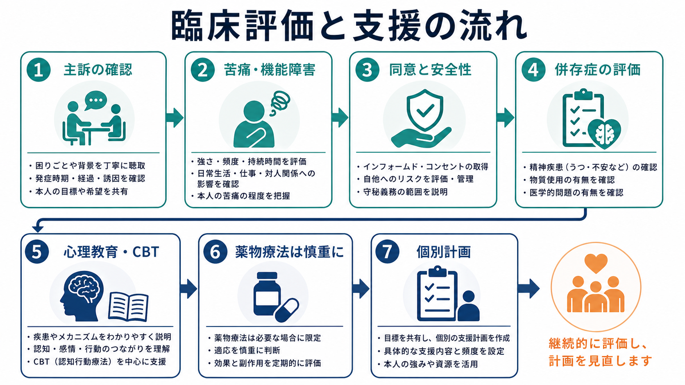

# フェティシズム障害とは何か

> このノートは教育・研究目的の整理であり、個別の診断や治療指示ではない。性的関心そのものを病理化するのではなく、本人の苦痛、生活機能への影響、同意と安全性を分けて考える。

## 要点

- フェティシズム障害は、無生物の物品、または性器以外の身体部位への強い性的焦点化が反復し、それが臨床的に意味のある苦痛や社会・職業・対人機能の障害を生む場合に問題となるパラフィリア障害である[1][4]。
- 「フェティシズム」と「フェティシズム障害」は同じではない。合意ある成人間で、本人にも他者にも重大な苦痛や害がない性的嗜好は、それだけでは精神疾患ではない[2][5]。
- DSM-5-TR では、少なくとも6か月以上続く反復的で強い性的興奮、臨床的苦痛または機能障害、そして異性装や性器刺激用具だけに限定されないことが診断上の要点になる[1][4]。
- ICD-11 では、合意ある成人や単独行動に関わる非典型的な性的興奮パターンは、それ自体では障害とされにくく、本人がその興奮パターンの性質に著しく苦痛を感じる場合、または重大な傷害・死亡リスクを伴う場合に診断上の焦点となる[3]。
- 臨床評価では、性的興奮の内容だけでなく、同意、安全性、強迫性、回避、羞恥、併存する[[強迫症とは何か]]、[[物質使用障害とは何か]]、気分・不安症状、対人関係への影響を統合してみる必要がある[4][8]。

## この記事で答える問い

1. フェティシズム障害は、単なる性的嗜好やフェティシズムとどう違うのか。
2. DSM-5-TR と ICD-11 では、どこに診断上の重心が置かれているのか。
3. 特定の物品や身体部位への焦点化は、どのような学習・注意・強化の仕組みで固定化しうるのか。
4. 臨床評価と支援では、何を確認し、何を避けるべきか。

## まず結論

フェティシズム障害を理解する中心は、「何に性的興奮するか」ではなく、「その性的焦点化が、本人の苦痛、生活機能、対人関係、同意と安全性にどのような影響を与えているか」である。DSM-5-TR は、無生物や性器以外の身体部位への反復的で強い性的興奮が6か月以上続き、本人に臨床的苦痛や機能障害を生む場合を診断の骨格に置く[1]。Merck Manual も、フェティシズムそのものはパラフィリアの一形態だが、多くの人はフェティシズム障害の基準を満たさないと説明している[4]。

したがって、フェティシズム障害は「変わった性的嗜好を持つ人」というラベルではない。合意ある成人間の性的実践は、それだけで病理化されるべきではない。一方で、特定対象がないと性的活動が著しく困難になる、強迫的に時間や金銭を費やす、対人関係や仕事に支障が出る、強い羞恥や不安で孤立する、安全性や同意の確認が崩れる、といった場合には臨床的支援の対象になる[2][4][8]。

## 背景

パラフィリア障害の診断枠組みは、歴史的に「非典型的な性的関心」を精神疾患として過剰に扱う危険と、本人または他者への害を見逃す危険の間で調整されてきた。DSM-5 以降の議論では、パラフィリアとパラフィリア障害を区別し、非典型的な性的関心そのものではなく、苦痛・機能障害・他者への害に注目する方向が明確化された[2][5]。

一般人口調査では、非典型的な性的関心や経験は臨床サンプルだけに限られない。Joyal と Carpentier の一般人口調査は、パラフィリア的関心や行動の一部が一般集団にもみられることを示し、「稀な関心があること」と「精神疾患であること」を混同しない必要を示している[6]。Dawson らの非臨床サンプル研究でも、パラフィリア的関心の性差や性欲との関連が検討されており、関心の有無だけで障害を推定することの限界が示唆される[7]。

## 基本概念

### フェティシズム

フェティシズムとは、典型的には無生物、衣類、素材、または性器以外の身体部位が性的興奮の重要な手がかりになる状態を指す。ここで重要なのは、それが「好み」や「性的脚本の一部」として存在するだけなら、必ずしも臨床上の障害ではないという点である[4]。

### フェティシズム障害

フェティシズム障害では、その焦点化が反復的で強く、本人の苦痛や生活機能障害につながる。DSM-5-TR の枠組みでは、無生物または性器以外の身体部位への性的興奮が6か月以上続くこと、苦痛・機能障害があること、対象が異性装に用いる衣類や性器刺激用具だけに限定されないことが要点になる[1][4]。

臨床的には、次のような問いが重要になる。

| 評価軸 | 確認すること | 障害化を考える手がかり |
|---|---|---|
| 持続性 | いつから、どの程度反復しているか | 6か月以上続き、生活全体に入り込む |
| 強さ | 興奮や衝動の強度 | 本人が制御困難と感じる |
| 機能障害 | 仕事、学業、対人関係、パートナー関係 | 遅刻、回避、孤立、関係悪化がある |
| 苦痛 | 羞恥、不安、抑うつ、自己嫌悪 | 性的関心そのものに圧倒される |
| 同意・安全 | 相手の同意、境界、法的・身体的安全 | 非同意、秘密裏の行動、危険行動がある |

### ICD-11 での位置づけ

ICD-11 では、「合意ある成人または単独行動に関わるパラフィリア障害」という枠組みの中で、本人が興奮パターンの性質に著しい苦痛を感じること、または行動が重大な傷害・死亡リスクを伴うことが重視される[3]。この考え方は、社会的スティグマや拒絶への恐れだけを理由に病理化しないという点で重要である。

## 仕組み

フェティシズム障害の仕組みは、単一の原因で説明できない。性的興奮の学習、注意の偏り、反復による強化、回避や羞恥、対人関係上の困難、併存症状が複合的に関わると考える方が臨床的には実用的である[4][8]。

1つの理解モデルは、連合学習である。もともと性的意味を持たなかった物品や身体部位が、性的興奮、好奇心、安心、緊張緩和と偶然結びつくと、その対象が興奮の手がかりとして強まることがある。反復されるほど注意が向きやすくなり、興奮や不安軽減が短期的な報酬として働くと、焦点化はさらに固定化しうる[4]。

もう1つのモデルは、回避と強化のループである。本人が「この関心は受け入れられない」と感じるほど、羞恥や不安が強くなり、親密な関係や相談を避けやすくなる。避けることで一時的には楽になるが、長期的には孤立、秘密、強迫的反復が強まり、苦痛や機能障害が増えることがある。この点は、[[強迫症とは何か]]や[[物質使用障害とは何か]]で扱われる反復・渇望・回避の問題とも部分的に重なる。

ただし、これらは理解のためのモデルであり、すべての人に同じ原因があるという意味ではない。一般人口研究で示されるように、非典型的な性的関心は多様であり、関心の有無だけから病態や危険性を推定することはできない[6][7]。

## 図解

上の1枚目は、フェティシズム障害の診断概念を「対象」「持続性」「苦痛・機能障害」「同意・安全性」「支援」に分けて整理した概念地図である。2枚目は、きっかけ、連合学習、注意の偏り、反復・強化が循環し、苦痛や生活障害が加わると臨床的閾値に近づくという見方を示している。

3枚目は、臨床評価と支援の流れである。性的関心の内容だけを聞き出すのではなく、主訴、苦痛・機能障害、同意と安全性、併存症、本人の目標を確認し、心理教育、認知行動療法的支援、必要時の薬物療法を個別に検討する。

## 臨床・研究との接続

### 評価

評価では、本人が何に興奮するかを単独で分類するのではなく、苦痛、機能障害、強迫性、同意、安全性、法的リスク、対人関係、生活上の支障を統合する。自己申告だけでは、恥や恐れによって過小報告されることも、逆に罪悪感によって過大に病理化されることもある。そのため、非判断的な面接、必要に応じた標準化尺度、併存症評価、生活史の把握を組み合わせる[4][8]。

同時に、評価者側の価値判断にも注意が必要である。First は DSM-5 のパラフィリア障害をめぐる議論で、診断基準の変更が法医学的含意を持ち、偽陽性の危険にも配慮すべきだと論じている[5]。この視点は、合意ある性的多様性を不当に病理化しないために重要である。

### 支援

支援の基本は、本人の苦痛と生活障害を減らし、安全で合意ある行動を保つことである。心理教育では、フェティシズムとフェティシズム障害を区別し、羞恥や孤立を減らす。認知行動療法的支援では、衝動のきっかけ、注意の偏り、回避、反復行動、対人関係上の困難を扱う。パートナーがいる場合は、同意、境界、開示の範囲、安全なコミュニケーションを丁寧に扱う必要がある。

薬物療法は、すべてのケースに必要なものではない。WFSBP ガイドラインは、パラフィリア障害の薬物療法を成人男性や性加害リスクの文脈も含めて整理しているが、薬物療法は心理社会的介入やリスク管理から切り離して行うものではなく、重症度、リスク、併存症、本人の同意、副作用を考慮して慎重に検討される[8]。

### 研究上の注意

研究では、一般人口サンプル、臨床サンプル、司法・矯正サンプルが混ざりやすい。司法サンプルの知見を一般人口にそのまま当てはめると、性的多様性を過剰に危険視することになる。一方で、本人や他者への害があるケースを「嗜好の多様性」として見逃すことも問題である。したがって、研究を読むときは、対象集団、測定方法、苦痛・機能障害の扱い、同意と安全性の評価を確認する必要がある[5][6][7]。

## よくある誤解

### 誤解1: フェティシズムはすべて精神疾患である

違う。多くのフェティシズムは、本人や他者に重大な苦痛や機能障害をもたらさない限り、フェティシズム障害ではない。DSM-5 以降の枠組みは、非典型的な性的関心と障害を区別する方向に整理されている[2][5]。

### 誤解2: 特定の物品や身体部位に興奮すれば診断できる

診断できない。診断には、持続性、強さ、本人の苦痛、社会・職業・対人機能への影響、除外事項、同意と安全性の確認が必要である[1][4]。

### 誤解3: 苦痛があれば必ず障害である

苦痛の由来を確認する必要がある。ICD-11 は、社会的拒絶や拒絶への恐れだけから生じる苦痛を、診断の根拠としてそのまま扱わない方向を示している[3]。もちろん、羞恥や孤立が強く生活に支障が出ている場合には支援の対象になりうるが、支援は病理化ではなく、苦痛の軽減と安全な生活の回復を目指す。

### 誤解4: 治療は性的関心を消すことを目的にする

必ずしもそうではない。臨床目標は、本人の苦痛を減らし、機能を回復し、同意と安全性を保ち、反復や回避の悪循環を弱めることである。高リスク例ではリスク管理が必要になるが、合意ある成人間の性的多様性を一律に消去することが目的ではない[4][8]。

## 関連ノート

- [[サディズム障害とは何か]]
- [[小児性愛障害とは何か]]
- [[性機能障害群とは何か]]
- [[DSMとICDは何が違うのか]]
- [[強迫症とは何か]]
- [[物質使用障害とは何か]]
- [[トラウマ歴はどのように聞くべきか]]
- [[性機能や月経歴はなぜ精神科で重要なのか]]

## 関連ノート候補

- パラフィリア障害とは何か
- パラフィリアとパラフィリア障害はどう違うのか
- 性的同意とは何か
- 性的嗜好の多様性と精神医学
- 性的衝動のリスク評価とは何か

## MOC更新候補

- `content/00_MOC/` 配下に精神医学、性とメンタルヘルス、パラフィリア障害、司法精神医学に関するMOCがある場合、本記事へのリンク追加を検討する。
- 並列生成ジョブとの競合を避けるため、このタスクではMOC本体を更新しない。

## 理解チェック

1. フェティシズムとフェティシズム障害を分ける中心的な基準は何か。
2. DSM-5-TR では、フェティシズム障害の持続期間として何が重視されるか。
3. ICD-11 が、社会的拒絶や拒絶への恐れだけによる苦痛を慎重に扱うのはなぜか。
4. 臨床評価で、性的興奮の内容以外に確認すべき要素を3つ挙げられるか。
5. 薬物療法を検討する場合、なぜ心理社会的支援やリスク評価と切り離せないのか。

## 未解決問題

- 非臨床サンプルと臨床サンプルを接続する研究がまだ限られており、どの要因が「関心」から「苦痛・機能障害」への移行を予測するのかは十分に明らかではない。
- フェティシズム障害に特化した治療研究は少なく、パラフィリア障害全体の知見をどこまで一般化できるかには注意が必要である。
- スティグマによる苦痛と、興奮パターンそのものから生じる苦痛を臨床面接でどう区別するかは、実践上も研究上も難しい課題である。
- 性的多様性を尊重しながら、同意・安全性・法的リスクをどう評価するかについて、文化差を含む研究がさらに必要である。

## 参考文献

[1] American Psychiatric Association. (2022). *Diagnostic and Statistical Manual of Mental Disorders, Fifth Edition, Text Revision (DSM-5-TR)*. American Psychiatric Association Publishing. https://doi.org/10.1176/appi.books.9780890425787

[2] American Psychiatric Association. (2013). *Paraphilic Disorders*. DSM-5 Fact Sheet. https://www.psychiatry.org/File%20Library/Psychiatrists/Practice/DSM/APA_DSM-5-Paraphilic-Disorders.pdf

[3] World Health Organization. (2026). *ICD-11 for Mortality and Morbidity Statistics: 6D36 Paraphilic disorder involving solitary behaviour or consenting individuals*. https://icd.who.int/browse/2026-01/mms/en#2055403635

[4] Merck Manual Professional Edition. (2025). *Fetishistic Disorder*. https://www.merckmanuals.com/professional/psychiatric-disorders/paraphilias-and-paraphilic-disorders/fetishistic-disorder

[5] First, M. B. (2014). DSM-5 and Paraphilic Disorders. *Journal of the American Academy of Psychiatry and the Law, 42*(2), 191-201. https://jaapl.org/content/42/2/191

[6] Joyal, C. C., & Carpentier, J. (2017). The Prevalence of Paraphilic Interests and Behaviors in the General Population: A Provincial Survey. *The Journal of Sex Research, 54*(2), 161-171. https://doi.org/10.1080/00224499.2016.1139034

[7] Dawson, S. J., Bannerman, B. A., & Lalumiere, M. L. (2016). Paraphilic Interests: An Examination of Sex Differences in a Nonclinical Sample. *Sexual Abuse, 28*(1), 20-45. https://doi.org/10.1177/1079063214525645

[8] Thibaut, F., Cosyns, P., Fedoroff, J. P., Briken, P., Goethals, K., Bradford, J. M. W., & The WFSBP Task Force on Paraphilias. (2020). The World Federation of Societies of Biological Psychiatry guidelines for the pharmacological treatment of paraphilic disorders. *The World Journal of Biological Psychiatry, 21*(6), 412-490. https://doi.org/10.1080/15622975.2020.1744723
