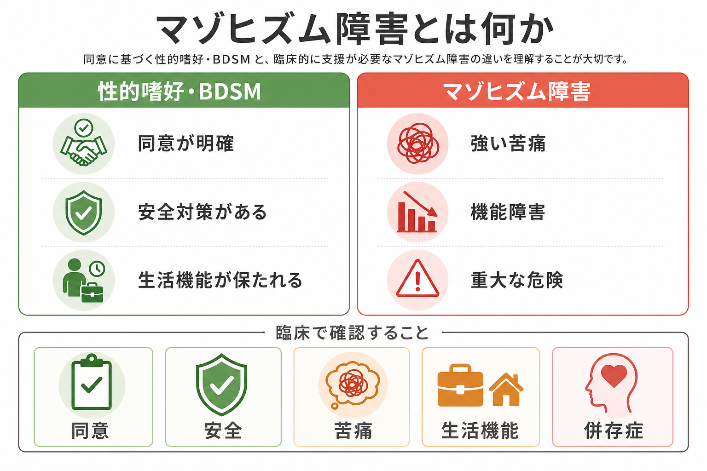
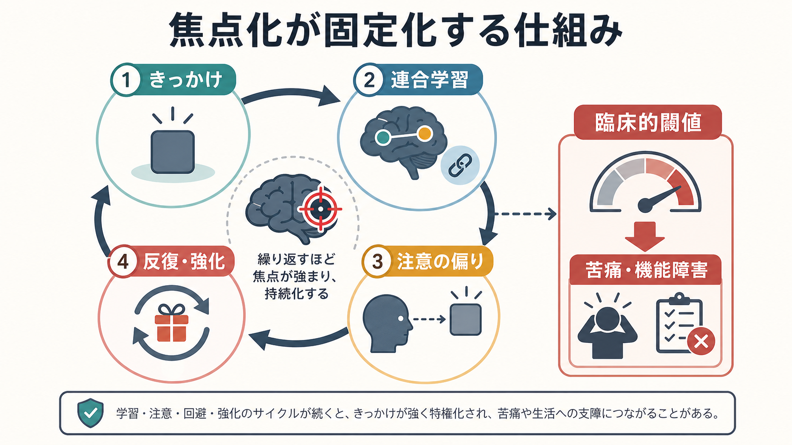

# マゾヒズム障害とは何か

## 要点

- マゾヒズム障害は、苦痛、屈辱、拘束、殴打など「自身が苦しむこと」に関連する反復的で強い性的興奮があり、それが本人の強い苦痛、生活機能の低下、または重大な危険につながる場合に問題となる診断概念である[1][3]。
- 同意ある成人間の性的嗜好やBDSMそのものは、ただちに精神疾患ではない。臨床上の境界は「同意」「安全」「本人の苦痛」「生活機能」「重大な危険」で判断する[2][5]。
- 窒息を伴う行為は、意図が自傷でなくても失神、脳損傷、死亡につながり得るため、特に慎重なリスク評価が必要である[2][3]。
- 治療は嗜好を消すことではなく、本人が困っている苦痛、衝動制御、危険行動、併存する[[うつ病とは何か|うつ病]]・[[不安症群とは何か|不安症]]・トラウマ反応などを評価し、必要に応じて心理療法や薬物療法を組み合わせる[3][7][8]。

## この記事で答える問い

1. マゾヒズム障害は、性的嗜好やBDSMとどこが違うのか。
2. DSM-5-TR と ICD-11 では、どのような境界で「障害」と考えるのか。
3. 臨床では、どのような安全性・同意・併存症の確認が重要か。

## まず結論

マゾヒズム障害を理解する要点は、「行為の内容が一般的かどうか」ではなく、「本人または他者に臨床的な害が生じているか」である。DSM-5-TR では、苦痛や屈辱などを受けることによる反復的で強い性的興奮が6か月以上あり、それが臨床的に有意な苦痛または機能障害をもたらす場合に診断の対象となる[1][3]。ICD-11 では、同意ある成人間または単独行為に関わるパラフィリア的興奮であっても、本人が強く苦痛を感じる、または窒息行為のように重大な傷害・死亡リスクがある場合に、診断対象となり得る[2]。

したがって、同意、境界設定、安全対策があり、本人の生活機能が保たれている成人間のBDSMは、それだけで病理化されるべきではない[5][6]。一方で、本人がやめたいのにやめられない、危険を高めてしまう、仕事・対人関係・睡眠・健康管理が損なわれる、窒息など不可逆的な危険がある場合には、支援の対象になる。

## 背景

マゾヒズム障害は、[[DSMとICDは何が違うのか|DSMとICD]] で扱われるパラフィリア関連の診断概念の一つである。DSM 系列では、パラフィリア的興奮そのものと、臨床的な苦痛・機能障害・害を伴う「パラフィリア障害」を区別する方向が強調されてきた[4]。この区別は、非典型的な性的興味を単に珍しい、道徳的に不快、文化的に少数派という理由で病理化しないために重要である。

同時に、性の領域では「本人が望んでいる」と「安全である」は同じではない。窒息、強い疼痛、事故につながる拘束、薬物・アルコールを伴う判断力低下、同意能力が不明確な状況では、本人の主観的な興奮とは別に臨床的リスクを評価する必要がある[2][3]。

## 基本概念

### 性的マゾヒズムとマゾヒズム障害

性的マゾヒズムとは、苦痛、屈辱、拘束、支配される状況などに性的興奮が結びつく傾向を指す。これ自体は、本人が望み、同意ある成人間で安全に管理され、生活上の支障がない限り、必ずしも疾患ではない[3][5]。

マゾヒズム障害では、次のいずれかが中心になる。

- その興奮パターンや行動によって、本人が強い苦痛を感じている。
- 仕事、学業、対人関係、健康管理などの生活機能が損なわれている。
- 窒息行為など、重大な傷害または死亡につながるリスクがある。
- 同意、境界、安全対策が曖昧になり、危険が増している。

### DSM-5-TR と ICD-11 の見方

DSM-5-TR では、屈辱、殴打、拘束、その他の苦痛を受けることによる反復的で強い性的興奮が、空想、衝動、行動として表れ、6か月以上続き、臨床的に有意な苦痛または機能障害を伴うことが中心に置かれる[1][3]。

ICD-11 では、同意ある成人間または単独行為に関わる非典型的な性的興奮でも、本人の苦痛が単なる社会的拒絶への恐れだけでは説明できない場合、または行動の性質が重大な傷害・死亡リスクを含む場合に診断対象となり得る[2]。この整理は、性的少数派的な実践をむやみに病理化しない一方で、実際の危険を見逃さないための枠組みである。

## 仕組み

マゾヒズム障害について、単一の原因モデルで説明できるほど研究は成熟していない。一般には、性的興奮、情動調整、学習、注意の偏り、対人文脈、身体感覚への意味づけが相互に関わると考えられる。BDSM 研究のスコーピングレビューでも、単純にトラウマや精神病理へ還元する説明には限界があり、興味・実践・心理社会的機能を分けて評価する必要が示されている[5]。

臨床的には、次の循環が問題化しやすい。

1. 特定の苦痛・屈辱・支配状況が性的興奮と結びつく。
2. 緊張、孤独、恥、自己罰感、対人不安などの情動が、行動のきっかけになる。
3. 行動後に一時的な軽減や興奮が得られる。
4. その軽減が学習され、行動の反復や強度上昇につながる。
5. 危険、後悔、秘密保持、生活機能の低下が生じ、さらに苦痛が強まる。

この循環は、[[強迫症とは何か|強迫症]] のような不安低減の循環と同一ではないが、「短期的な軽減が長期的な問題を維持する」という臨床的構造は似ている。評価では、性的興奮そのものだけでなく、回避、自己罰、解離、衝動性、併存する[[PTSDとは何か|PTSD]] や気分症状も確認する。

## 図解

上の1枚目は、同意あるBDSMとマゾヒズム障害を臨床的に区別する視点を示している。重要なのは、「性的嗜好かどうか」ではなく、同意、安全、本人の苦痛、生活機能、重大な危険の有無である。

2枚目は、ある興奮パターンが学習、注意の偏り、反復、強化を通じて固定化し、臨床的閾値を超える場合を模式的に示している。これは確立した単一モデルではなく、臨床評価のための作業仮説として読むのがよい。

### 図解案

追加で図を作るなら、次のような日本語インフォグラフィックが有用である。

> 「マゾヒズム障害の臨床評価フロー」。左から「相談の主訴」「同意の確認」「安全性・窒息リスク」「本人の苦痛」「生活機能」「併存症」「支援方針」へ流れる横長フローチャート。白背景、青緑と灰色を基調、リスク部分だけ控えめな赤。性的・露骨な描写は使わず、チェックリスト、盾、会話、医療記録のアイコンで表す。

## 臨床・研究との接続

### 評価で確認すること

臨床面接では、本人の尊厳とプライバシーを守りながら、以下を具体的に確認する。

| 評価領域 | 確認する内容 |
|---|---|
| 同意 | 相手が成人で、同意能力があり、撤回可能な合意があるか |
| 安全 | 窒息、失神、外傷、薬物・アルコール使用、緊急時対応の有無 |
| 苦痛 | 本人が恥、罪悪感、恐怖、自己嫌悪、やめられなさに困っているか |
| 機能 | 仕事、学業、対人関係、睡眠、健康管理が損なわれているか |
| 併存症 | うつ、不安、PTSD、物質使用、衝動制御、パーソナリティ特性 |
| 法的・倫理的問題 | 非同意、強制、未成年、記録物の扱い、安全配慮義務 |

特に窒息を伴う行為では、本人が「死にたいわけではない」と説明しても、事故として重篤な結果が起こり得る。ICD-11 も、同意ある成人間や単独行為であっても、重大な傷害・死亡リスクがある場合を診断上の重要な境界としている[2]。

### 支援の方向

支援の目標は、性的嗜好を道徳的に裁くことではない。本人が困っている苦痛、危険、衝動、対人関係、併存症を減らし、安全と自己決定を回復することである。心理療法では、リスク場面の同定、行動連鎖分析、情動調整、同意と境界設定、代替行動、恥や自己罰感の扱いが焦点になる。[[精神療法は脳を変えるのか|精神療法]] は、行動と意味づけの反復パターンを変える実践として位置づけられる。

薬物療法については、パラフィリア障害全般に関してWFSBPの薬物療法ガイドラインがあり、リスクの高さ、本人の同意、法的文脈、併存症を踏まえた段階的対応が議論されている[7]。近年のレビューでも、抗アンドロゲン薬やSSRIなどが検討される一方、エビデンスは対象や状況によって限られており、個別のリスク評価と倫理的配慮が不可欠である[8]。

## よくある誤解

### 「BDSMをする人は精神疾患である」

誤りである。BDSM 研究では、実践者を一律に精神病理として扱う見方は支持されにくくなっている[5][6]。同意、安全、生活機能が保たれている場合、それだけで診断対象にはならない。

### 「本人が望んでいるなら危険は問題にならない」

これも誤りである。本人の同意や興奮があっても、窒息、意識消失、重大外傷、薬物併用、同意能力の低下があれば、医療・倫理上のリスク評価が必要になる[2][3]。

### 「診断名はその人の性格を決める」

診断名は人格評価ではなく、支援の必要性を整理するための臨床的ラベルである。本人の価値、同意ある関係性、性の多様性を否定するものではない。

### 「治療は性的興奮をなくすこと」

通常の臨床目標は、苦痛、危険、生活機能の低下を減らすことである。本人の安全、自己決定、対人関係、併存症への支援が中心になる。

## 関連ノート

- [[DSMとICDは何が違うのか]]
- [[精神療法は脳を変えるのか]]
- [[PTSDとは何か]]
- [[不安症群とは何か]]
- [[うつ病とは何か]]
- [[強迫症とは何か]]

### 関連ノート候補

- パラフィリア障害とは何か
- 性的同意と臨床倫理
- BDSMとメンタルヘルス
- 窒息行為と自傷リスクの臨床評価

### MOC更新候補

- `content/00_MOC/` 配下の精神医学・診断・性の健康に関するMOCへ、本記事を追加候補とする。
- 並列ジョブとの競合を避けるため、この作業ではMOC本文を直接更新しない。

## 理解チェック

1. マゾヒズム的な性的興味があっても、どの条件がなければ通常は障害とみなされにくいか。
2. DSM-5-TR の診断で、6か月以上という期間に加えて確認される中心的条件は何か。
3. ICD-11 が、同意ある成人間または単独行為でも診断対象にし得るのはどのような場合か。
4. 窒息行為が、本人の自傷意図とは別に臨床上問題になる理由は何か。
5. 治療目標を「嗜好の否定」ではなく「苦痛・危険・機能障害の軽減」と表現する理由は何か。

## 未解決問題

- マゾヒズム障害だけを対象にした大規模な治療研究は限られており、パラフィリア障害全般の知見を慎重に外挿している部分がある。
- BDSM 実践と臨床的障害の境界は、文化、法制度、スティグマ、相談経路の影響を受けやすい。
- 危険行動の軽減と性の自己決定を両立するための、非スティグマ的な臨床面接技法の研究がさらに必要である。

## 参考文献

[1] American Psychiatric Association. (2022). *Diagnostic and Statistical Manual of Mental Disorders, Fifth Edition, Text Revision (DSM-5-TR)*. American Psychiatric Association Publishing. https://www.appi.org/Products/DSM-Library/Diagnostic-and-Statistical-Manual-of-Mental-Disorders-Fifth-Edition-Text-Revision-DSM-5-TR

[2] World Health Organization. (2024). *Clinical descriptions and diagnostic requirements for ICD-11 mental, behavioural and neurodevelopmental disorders*. WHO. https://iris.who.int/bitstream/handle/10665/375767/9789240077263-eng.pdf

[3] Merck Manual Professional Edition. (2025). Sexual Masochism Disorder. https://www.merckmanuals.com/professional/psychiatric-disorders/paraphilias-and-paraphilic-disorders/sexual-masochism-disorder

[4] Beech, A. R., Miner, M. H., & Thornton, D. (2016). Paraphilias in the DSM-5. *Annual Review of Clinical Psychology, 12*, 383-406. https://doi.org/10.1146/annurev-clinpsy-021815-093330

[5] Brown, A., Barker, E. D., & Rahman, Q. (2020). A systematic scoping review of the prevalence, etiological, psychological, and interpersonal factors associated with BDSM. *The Journal of Sex Research, 57*(6), 781-811. https://doi.org/10.1080/00224499.2019.1665619

[6] Wismeijer, A. A. J., & van Assen, M. A. L. M. (2013). Psychological characteristics of BDSM practitioners. *The Journal of Sexual Medicine, 10*(8), 1943-1952. https://doi.org/10.1111/jsm.12192

[7] Thibaut, F., Cosyns, P., Fedoroff, J. P., et al. (2020). The World Federation of Societies of Biological Psychiatry guidelines for the pharmacological treatment of paraphilic disorders. *The World Journal of Biological Psychiatry, 21*(6), 412-490. https://doi.org/10.1080/15622975.2020.1744723

[8] Culos, C., Di Grazia, M., & Meneguzzo, P. (2024). Pharmacological interventions in paraphilic disorders: systematic review and insights. *Journal of Clinical Medicine, 13*(6), 1524. https://doi.org/10.3390/jcm13061524
