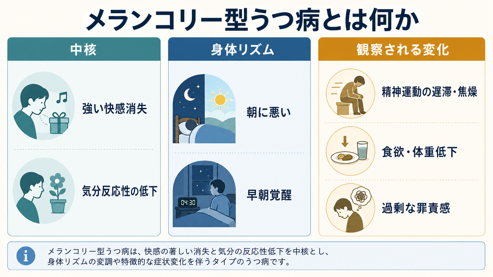
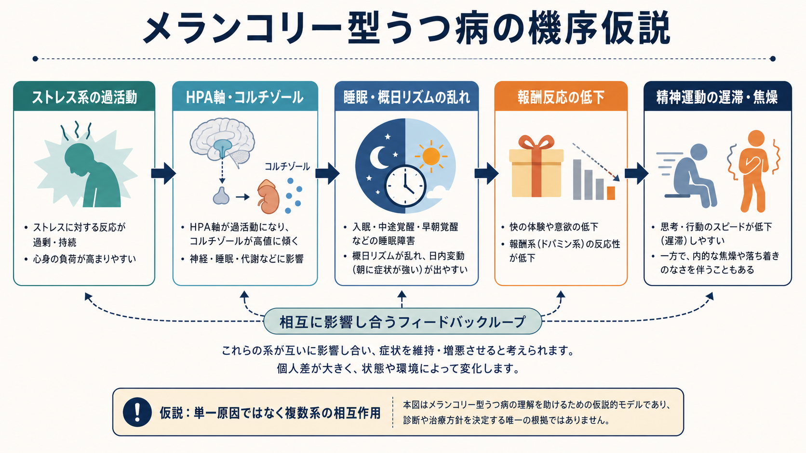
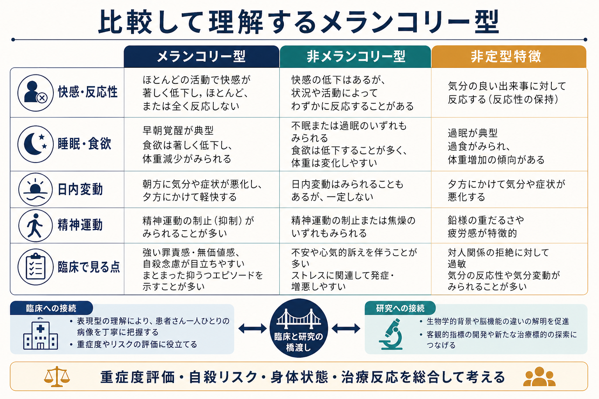

# メランコリー型うつ病とは何か

## 要点

- メランコリー型うつ病は、[[快感消失とは何か|快感消失]]、気分反応性の低下、朝方に悪い日内変動、早朝覚醒、食欲・体重低下、過剰な罪責感、精神運動の遅滞または焦燥が目立つうつ病の特徴指定である。
- DSM-5-TRでは「メランコリー型の特徴を伴う」という specifier として扱われ、ICD-11でも「現在の抑うつエピソードにメランコリーを伴う」追加コードとして位置づけられる[1][2]。
- 単一の原因や検査で決まる病型ではなく、症状のまとまり、重症度、観察される精神運動変化、治療反応、身体リズムの乱れを総合して理解する。
- 教育・研究目的の整理であり、個別の診断や治療選択は専門家による包括的評価を前提とする。

## この記事で答える問い

1. メランコリー型うつ病は、通常の大うつ病エピソードと何が違うのか。
2. なぜ強い快感消失、朝方悪化、精神運動症状が重視されるのか。
3. 臨床評価・治療研究・病態研究では、どのように使われる概念なのか。

## まず結論

メランコリー型うつ病は、「気分が落ち込む」という主観的苦痛だけでなく、喜びへの反応が全般に失われ、身体リズムと行動速度まで変化する抑うつの表現型である。DSM-5-TRの説明では、ほとんどすべての活動で喜びを失う、または通常なら気分が明るくなる出来事にも反応しにくいことが中核に置かれ、早朝覚醒、朝方悪化、著しい精神運動遅滞・焦燥、食欲・体重低下、過剰な罪責感などが伴う[1]。

重要なのは、メランコリー型を「気分の深刻さ」だけで決めないことである。[[抑うつ気分とは何か|抑うつ気分]]の強さに加えて、他者から観察できる動作・表情・発話の変化、生活機能、身体状態、[[希死念慮とは何か|希死念慮]]、双極性障害や薬剤・身体疾患の可能性を合わせて評価する必要がある[1][3]。

## 背景

「メランコリー」は古典的には内因性うつ病、重症うつ病、身体性うつ病に近い意味で使われてきた。現代の診断分類では独立した疾患単位というより、うつ病エピソードの特徴指定として扱う立場が主流である。ただし、精神運動症状や生物学的指標、治療反応から、メランコリーを単なる重症度ではなく比較的まとまりのある病型として捉えるべきだという議論も続いている[4][5]。

DSMとICDの違いを意識すると理解しやすい。[[DSMとICDは何が違うのか|DSMとICD]]はいずれも抑うつエピソードを分類するが、DSM-5-TRは「メランコリー型の特徴を伴う」という記述指定を用い、ICD-11は単回性・反復性の抑うつ性障害に対して 6A80.3「current depressive episode with melancholia」を追加できる形にしている[1][2]。

## 基本概念

### 中核特徴

メランコリー型の中核は、通常の楽しみや好ましい出来事に対する反応が広く失われることである。これは単に「気分転換が少ない」ことではなく、よい知らせ、会話、趣味、食事、対人交流などによっても気分がほとんど持ち上がらない状態を指す[1][2]。

代表的な関連特徴は次の通りである。

| 領域 | 典型的な所見 | 見落としやすい点 |
|---|---|---|
| 快感・反応性 | 強い快感消失、気分反応性の低下 | 本人が「悲しい」より「何も感じない」と訴えることがある |
| 睡眠・日内変動 | [[不眠とは何か|早朝覚醒]]、朝方悪化 | 夕方に少し軽くなるため、重症度が過小評価されることがある |
| 精神運動 | [[精神運動制止とは何か|精神運動制止]]、焦燥、発話量低下 | 主観的な疲労だけでなく、観察される遅さが重要 |
| 身体症状 | 食欲低下、体重低下、性欲低下 | 身体疾患、薬剤、栄養状態との鑑別が必要 |
| 認知・感情 | 過剰な罪責感、無価値感、絶望感 | 妄想的罪責感や自殺リスクの評価が必要 |

### 非定型特徴との対比

非定型うつ病では、よい出来事に対して一時的に気分が明るくなる「気分反応性」が残り、過眠、過食・体重増加、鉛様麻痺、拒絶過敏性が目立つことがある[1]。対照的にメランコリー型では、反応性が乏しく、早朝覚醒、食欲・体重低下、精神運動変化が目立ちやすい。これは「どちらが本物のうつ病か」という区別ではなく、症状のまとまりが異なるという整理である。

## 仕組み

メランコリー型うつ病の病態は、単一の神経伝達物質や脳部位だけで説明できない。研究では、ストレス反応系、睡眠・概日リズム、報酬系、精神運動制御の相互作用として理解されることが多い。

古典的研究では、メランコリー型特徴は短いREM潜時やデキサメタゾン抑制試験でのコルチゾール非抑制と関連することが報告されてきた[4]。これはHPA軸を含むストレス応答系の過活動を示唆するが、個別診断に使える決定的検査ではない。

また、Parkerらは観察可能な精神運動障害をメランコリーの中心特徴として重視した。精神運動遅滞は、姿勢、表情、発話の間、声量、反応開始の遅さ、動作の乏しさとして現れる。一方で、内的には落ち着かず、身体は遅いのに苦痛と焦燥が強い場合もある[5]。

## 図解

下の図は、メランコリー型、非メランコリー型、非定型特徴を比較するための概念図である。実際の臨床では、境界が明瞭に分かれるとは限らず、同じ人のエピソードの中で特徴が変化することもある。

## 臨床・研究との接続

### 臨床評価

NICEの成人うつ病ガイドラインは、うつ病評価を単なる症状数に頼らず、症状の重症度、既往、持続期間、経過、生活機能、併存疾患、双極性障害の既往、薬物・アルコール、社会的背景を含めて包括的に行うことを推奨している[3]。メランコリー型を疑う場合も同じで、特徴指定だけを切り出して診断するのではなく、抑うつエピソード全体の評価の中で位置づける。

特に注意すべきなのは、食欲・体重低下、睡眠障害、強い罪責感、[[希死念慮とは何か|希死念慮]]である。これらは重症度や身体的リスク、自殺リスクと結びつきやすい。高齢者では脱水、低栄養、せん妄、身体疾患、薬剤影響が重なりうるため、精神症状と身体状態を分けずに見る必要がある。

### 治療反応の研究

古くから、メランコリー型は心理療法やプラセボへの反応が低く、抗うつ薬やECTなど身体的治療への反応が比較的よい可能性が議論されてきた[6]。一方で、個人参加者データのメタ解析では、DSM-IVのメランコリー型特徴は抗うつ薬反応の「予測因子」ではあっても、特定の抗うつ薬効果を強く「修飾する」証拠は限定的だった[7]。つまり、メランコリー型だから特定治療が自動的に決まるわけではない。

ECTについても同様である。NICEは重症うつ病で、本人が過去の経験からECTを希望する場合、生命に関わるほど迅速な反応が必要な場合、または他の治療が奏効しない場合に検討するとしている[3]。これは治療選択の一例であり、個別の適応判断、同意、リスク・利益評価、認知機能モニタリングが不可欠である。

## よくある誤解

### 「メランコリー型」は古い言葉なので使わない

歴史的な用語ではあるが、DSM-5-TRとICD-11のいずれにも特徴指定として残っている[1][2]。ただし、独立疾患か、重症度の一部か、精神運動障害を中心に再定義すべきかは研究上の論点である[5]。

### 悲しみが強ければメランコリー型である

メランコリー型で重視されるのは、悲しみの強さだけではない。快感消失、反応性低下、朝方悪化、早朝覚醒、精神運動変化、食欲・体重低下、罪責感のまとまりで見る[1][2]。

### 検査でメランコリー型かどうか決まる

HPA軸や睡眠指標との関連は研究されているが、診断は臨床評価に基づく。コルチゾールや睡眠検査だけで個別にメランコリー型を決めることはできない[4]。

### メランコリー型なら治療は一つに決まる

治療反応の傾向は研究されているが、効果・副作用・希望・既往反応・自殺リスク・身体合併症を含めた個別判断が必要である[3][6][7]。

## 関連ノート

- [[快感消失とは何か]]
- [[抑うつ気分とは何か]]
- [[不眠とは何か]]
- [[精神運動制止とは何か]]
- [[思考制止とは何か]]
- [[希死念慮とは何か]]
- [[DSMとICDは何が違うのか]]

MOC更新候補: `content/00_MOC/` 配下の精神医学・うつ病・症候学関連MOCに、本記事を追加する候補。

## 理解チェック

1. メランコリー型うつ病で「快感消失」と「気分反応性の低下」が中核とされる理由を説明できるか。
2. 朝方悪化、早朝覚醒、食欲・体重低下、精神運動変化がどのようにまとまりを作るか説明できるか。
3. メランコリー型を診断名そのものではなく、抑うつエピソードの特徴指定として扱う意味を説明できるか。
4. 治療反応の研究結果を、個別治療指示として過剰に一般化しない理由を説明できるか。

## 参考文献

[1] Merck Manual Professional Edition. Depressive Disorders. Reviewed/Revised Jan 2026. https://www.merckmanuals.com/professional/psychiatric-disorders/mood-disorders/depressive-disorders

[2] World Health Organization. *Clinical Descriptions and Diagnostic Requirements for ICD-11 Mental, Behavioural or Neurodevelopmental Disorders*. 2024. https://iris.who.int/bitstream/handle/10665/375767/9789240077263-eng.pdf

[3] National Institute for Health and Care Excellence. *Depression in adults: treatment and management* (NICE guideline NG222). 2022; last reviewed 2026. https://www.nice.org.uk/guidance/ng222/chapter/Recommendations

[4] Rush AJ, Weissenburger JE. Melancholic symptom features and DSM-IV. *American Journal of Psychiatry*. 1994;151(4):489-498. https://doi.org/10.1176/ajp.151.4.489

[5] Parker G. Defining melancholia: the primacy of psychomotor disturbance. *Acta Psychiatrica Scandinavica Supplementum*. 2007;(433):21-30. https://doi.org/10.1111/j.1600-0447.2007.00959.x

[6] Brown WA. Treatment response in melancholia. *Acta Psychiatrica Scandinavica Supplementum*. 2007;(433):125-129. https://doi.org/10.1111/j.1600-0447.2007.00970.x

[7] Imai H, Noma H, Furukawa TA. Melancholic features (DSM-IV) predict but do not moderate response to antidepressants in major depression: an individual participant data meta-analysis of 1219 patients. *European Archives of Psychiatry and Clinical Neuroscience*. 2021;271(3):521-526. https://doi.org/10.1007/s00406-020-01173-4

## 未解決問題

- メランコリー型は、独立した病型、重症度の一部、精神運動障害を中心とする次元、あるいは複数要因の混合概念のどれとして扱うのが最も妥当か。
- HPA軸、睡眠、報酬系、精神運動指標を組み合わせた客観的サブタイプ分類は、臨床予後や治療選択をどこまで改善できるか。
- DSM/ICDの特徴指定と、実臨床で観察される重症抑うつの多様性をどのように接続するか。
