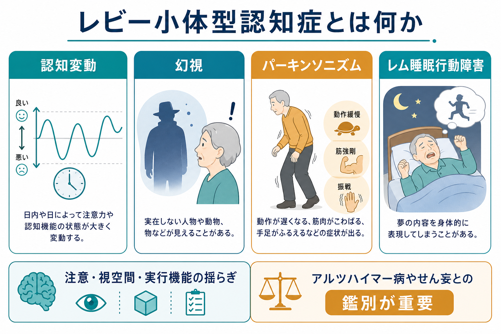
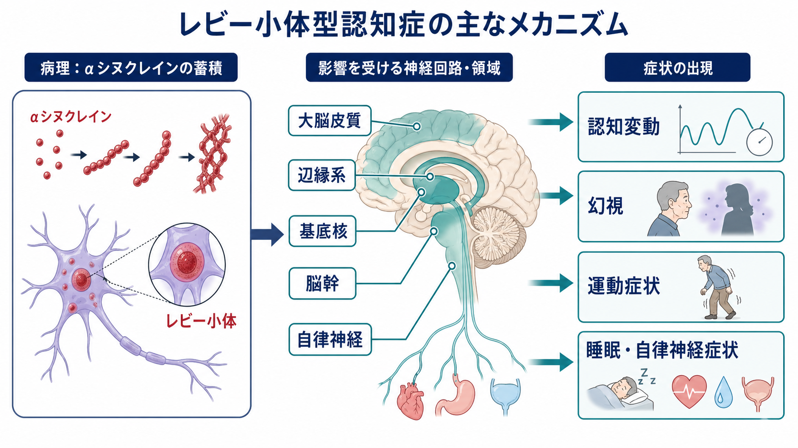
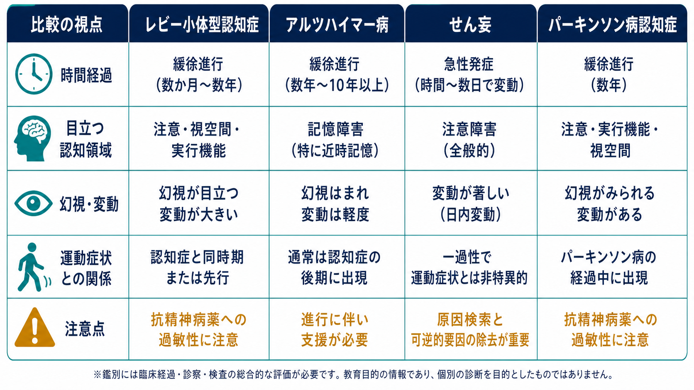

# レビー小体型認知症とは何か

## 要点

- レビー小体型認知症（dementia with Lewy bodies: DLB）は、進行性の認知機能低下に、**認知変動、反復する幻視、パーキンソニズム、レム睡眠行動障害**が重なりやすい神経変性疾患である[1]。
- 病理学的には、αシヌクレインを主成分とするレビー小体病理が大脳皮質、辺縁系、基底核、脳幹、自律神経系などに広がることと関係する[2][3]。
- 初期から記憶障害だけが前景に立つとは限らず、注意、覚醒、視空間認知、実行機能、見え方の異常が目立つことがある[1][3]。
- [[せん妄とは何か|せん妄]]、[[アルツハイマー病では脳内で何が起きているのか|アルツハイマー病]]、パーキンソン病認知症との鑑別が重要で、特に抗精神病薬への過敏性には注意が必要である[4][5]。
- 本稿は教育・研究目的の整理であり、個別の診断や治療方針を決めるものではない。

## この記事で答える問い

1. レビー小体型認知症は、どのような認知症なのか。
2. 認知変動、幻視、パーキンソニズム、レム睡眠行動障害はなぜ重視されるのか。
3. αシヌクレイン、レビー小体、神経回路の変化は症状とどう結びつくのか。
4. アルツハイマー病、せん妄、パーキンソン病認知症とは何が違うのか。
5. 臨床・研究で、どのような点に注意して読むべきか。

## まず結論

レビー小体型認知症は、「物忘れが進む病気」というより、**注意と覚醒の状態が揺れ、視覚世界の解釈が不安定になり、運動・睡眠・自律神経症状も併せて現れる認知症**として理解すると見通しがよい。中心にあるのは、認知機能低下そのものに加えて、日や時間帯によってぼんやりしたり比較的はっきりしたりする認知変動、人物・動物などが見える反復性の[[幻視とは何か|幻視]]、動作緩慢・筋強剛・振戦などの[[パーキンソニズムとは何か|パーキンソニズム]]、夢の内容に一致した動きが出る[[レム睡眠行動障害とは何か|レム睡眠行動障害]]である[1][2]。

DLB では、記憶だけでなく注意、視空間認知、実行機能の障害が早くから目立ちうる。これは、アルツハイマー病の典型例で強調される近時記憶障害とは違う入り口であり、本人や家族からは「日によって別人のように見える」「いるはずのない人や動物が見える」「歩き方が小さく遅くなった」「夢を見ながら動く」と語られることがある[2][3]。

## 背景

レビー小体型認知症は、レビー小体病理を背景にもつ認知症の臨床診断名である。広い意味の「レビー小体型認知症」や「レビー小体病」は、文献によって、DLB とパーキンソン病認知症を含む傘概念として使われることがある。この記事では、主に国際コンセンサス基準でいう dementia with Lewy bodies、つまり認知症の臨床像としての DLB を扱う[1][3]。

DLB が重要なのは、頻度だけではない。アルツハイマー病やせん妄、うつ病、統合失調症圏の精神病症状、薬剤性パーキンソニズムなどと重なって見えるため、誤認されやすい。また、抗精神病薬で運動症状や意識・認知状態が悪化することがあり、通常の「幻覚への対応」をそのまま当てはめると危険な場合がある[4][5]。

## 基本概念

### 中核となる臨床特徴

2017年の DLB Consortium 第4版コンセンサス報告では、中核的臨床特徴として、認知変動、反復する詳細な幻視、レム睡眠行動障害、1つ以上の自発性パーキンソニズムが整理されている[1]。

認知変動とは、記憶力の点数が少し上下することだけではない。覚醒、注意、会話のまとまり、反応速度、周囲への関心が、日や時間帯によって大きく変わる状態である。これは[[せん妄とは何か|せん妄]]とも似るため、急性発症か、身体疾患・薬剤・脱水・感染などの可逆的要因がないかを同時に評価する必要がある[4]。

幻視は、DLB で特に目立つ知覚症状である。人物、子ども、動物、影のような存在などが、比較的詳細に、繰り返し見えることがある。ここで重要なのは、幻視の有無だけで診断を決めるのではなく、認知変動、パーキンソニズム、睡眠、薬剤、視覚障害、せん妄リスクと合わせて見ることである[2][6]。

### DLB とパーキンソン病認知症

DLB とパーキンソン病認知症は、いずれもレビー小体病理と関係するが、臨床研究ではしばしば「1年ルール」で区別される。認知症がパーキンソニズムの前またはほぼ同時に現れる場合は DLB、確立したパーキンソン病の経過中に、運動症状から1年以上たって認知症が明らかになる場合はパーキンソン病認知症として扱う、という実用的な区別である[1][7]。ただし、これは病態が完全に別物だという意味ではなく、臨床経過を整理するための約束である。

## 仕組み

DLB の病態を一言でいえば、αシヌクレインの異常凝集を含むレビー小体病理が、認知、視覚処理、運動、覚醒、睡眠、自律神経に関わる複数のネットワークに影響する状態である。NINDS は、レビー小体が大脳皮質、辺縁皮質、海馬、中脳・基底核、脳幹、嗅覚経路、さらに腸管・心臓などの末梢自律神経系にも影響しうると説明している[3]。

この多領域性が、DLB の症状の幅広さを説明する。大脳皮質や注意ネットワークの変化は認知変動や実行機能障害と結びつき、視覚連合野や辺縁系の関与は幻視の生じやすさと関係する可能性がある。基底核や黒質線条体系の障害は動作緩慢、筋強剛、振戦などの運動症状に、脳幹の睡眠・覚醒系はレム睡眠行動障害や日中の眠気に、自律神経系の関与は便秘、起立性低血圧、発汗、排尿の問題などにつながりうる[1][3]。

神経伝達物質の側からは、コリン作動系、ドパミン作動系、セロトニン・ノルアドレナリン系などの変化が議論される。コリン作動系の低下は注意・認知・幻視と関係しうるため、[[アセチルコリン系は認知症とどう関わるのか|アセチルコリン系]]を含む認知症理解と接続しやすい。一方、ドパミン系の変化は[[大脳基底核ループとは何か|基底核回路]]と運動症状に関わるが、ドパミンを増やせばよいという単純な話ではない。レボドパなどの抗パーキンソン病薬は運動症状を助けることがある一方、幻覚や混乱を悪化させることがあり、臨床判断には慎重さが必要である[5][8]。

## 図解

3枚の図は、同じ疾患を別の粒度で見ている。

1枚目は、DLB の入口になる症状地図である。認知変動、幻視、パーキンソニズム、レム睡眠行動障害を、記憶障害だけでは捉えきれない認知症像としてまとめている。

2枚目は、αシヌクレインとレビー小体病理から、皮質・辺縁系・基底核・脳幹・自律神経系へ影響が広がり、認知・知覚・運動・睡眠・自律神経症状が並行して現れるという機序の概念図である。

3枚目は、臨床で混同しやすい状態との比較である。DLB は、アルツハイマー病、せん妄、パーキンソン病認知症と部分的に似るが、時間経過、認知領域、幻視と変動、運動症状との関係、薬剤感受性を見ると整理しやすい。

## 臨床・研究との接続

### 診断は「単一検査」ではなく総合判断である

DLB は、現時点では臨床経過、神経学的診察、認知機能評価、睡眠情報、薬剤歴、画像・バイオマーカーを組み合わせて診断する。NICE は、認知症サブタイプ診断では国際コンセンサス基準を用いること、診断が不確実で DLB が疑われる場合にはドパミントランスポーター SPECT や MIBG 心筋シンチグラフィを考慮することを推奨している[4]。ただし、正常な検査だけで DLB を除外してよいわけではない[4]。

実務上は、[[認知機能低下はどのように評価するのか|認知機能低下の評価]]に加えて、日内変動、睡眠中の行動、転倒、便秘、起立時のめまい、服薬歴、視力・聴力、感染や代謝異常の有無を確認する必要がある。これは「精神症状か神経症状か」を分ける作業ではなく、症状が出る条件を重ねて見る作業である。

### 治療研究は「症状緩和」と「疾患修飾」の両方で進む

DLB に根治的治療はまだ確立していない。薬物療法では、コリンエステラーゼ阻害薬が認知・行動症状に使われることがあり、薬物療法に関する系統的レビューでも DLB とパーキンソン病認知症を含む介入研究が整理されている[8]。しかし、効果、忍容性、対象症状、併存病理、介護者負担を含め、証拠は一枚岩ではない。

近年のレビューでは、DLB 研究は診断基準、前駆状態、バイオマーカー、臨床試験、症状緩和と疾患修飾標的の両面で進展しているとされる[6]。一方で、αシヌクレイン陽性だけで臨床像を完全に説明することは難しく、アルツハイマー病理や血管病変、睡眠障害、薬剤、身体疾患が併存しうる。したがって、研究知見を読むときも、診断基準、対象集団、バイオマーカー、併存病理、アウトカムの違いを確認する必要がある。

### 抗精神病薬への過敏性

DLB で臨床上特に重要なのは、抗精神病薬への過敏性である。NICE は、DLB またはパーキンソン病認知症では、抗精神病薬が運動症状を悪化させ、重い過敏反応を起こす場合があると注意している[4]。NINDS も、典型抗精神病薬、とくにハロペリドールなどは一般に処方すべきでないとし、混乱、パーキンソニズム、強い眠気、低血圧、場合によっては重篤な反応につながりうると説明している[5]。

ここで重要なのは、「幻視があるからすぐ薬で消す」という発想を避けることである。幻視が本人を苦しめていない場合、環境調整、照明、睡眠、痛み、感染、薬剤、家族の反応の調整が先に有用なことがある。薬物療法が必要な場合でも、リスクと利益を慎重に比較し、専門的評価のもとで最小限に扱うべきである[4][5]。

## よくある誤解

### 誤解1: DLB はアルツハイマー病に幻視が加わっただけである

DLB では、初期から注意、視空間、実行機能、覚醒水準の変動が目立つことがあり、典型的アルツハイマー病で強調される近時記憶障害中心の入り方とは異なる場合がある[1][2]。もちろん混合病理は珍しくないため、両者を完全に排他的に考えるのも誤りである。

### 誤解2: 幻視があれば DLB と決めてよい

幻視は DLB の重要な手がかりだが、せん妄、薬剤、視覚障害、睡眠不足、他の神経疾患、精神病症状でも起こりうる。DLB らしさは、幻視だけでなく、認知変動、パーキンソニズム、レム睡眠行動障害、自律神経症状、経過の組み合わせで評価する[1][4]。

### 誤解3: パーキンソニズムがなければ DLB は否定できる

DLB では運動症状が初期から明らかな場合もあるが、軽微で見逃されることも、後から目立つこともある[3]。診察では、振戦だけでなく、動作緩慢、筋強剛、小刻み歩行、姿勢、転倒、表情、声の変化などを含めて見る必要がある。

### 誤解4: 認知変動は「気分のむら」である

認知変動は、気分だけの問題ではない。注意、覚醒、反応性、思考のまとまりが変わる現象であり、本人の努力不足や性格変化として扱うと見落としやすい。一方で、急な変動はせん妄の可能性もあるため、感染、脱水、薬剤、疼痛、低酸素などの身体要因を確認する必要がある[4]。

## 関連ノート

- [[レム睡眠行動障害とは何か]]
- [[パーキンソニズムとは何か]]
- [[幻視とは何か]]
- [[幻覚とは何か]]
- [[せん妄とは何か]]
- [[アルツハイマー病では脳内で何が起きているのか]]
- [[アセチルコリン系は認知症とどう関わるのか]]
- [[認知機能低下はどのように評価するのか]]
- [[大脳基底核ループとは何か]]

## 理解チェック

1. DLB の中核的臨床特徴を4つ挙げられるか。
2. 認知変動とせん妄を区別するとき、どのような時間経過と身体要因を見るべきか。
3. DLB とパーキンソン病認知症を臨床研究上区別する「1年ルール」とは何か。
4. DLB で抗精神病薬に注意が必要な理由を説明できるか。
5. αシヌクレイン病理だけでは、DLB の臨床像を完全に説明しきれない理由は何か。

## MOC更新候補

- `content/00_MOC/MOC｜精神医学.md`
- `content/00_MOC/MOC｜認知機能.md`
- `content/00_MOC/MOC｜脳・神経科学.md`

並列ジョブとの競合を避けるため、本記事では MOC 本体は更新していない。

## 今後の作成候補

- パーキンソン病認知症とは何か
- αシヌクレイン病理とは何か
- 認知症における幻視とは何か
- 抗精神病薬過敏性とは何か
- MIBG心筋シンチグラフィとは何か
- ドパミントランスポーターSPECTとは何か

## 未解決問題

- DLB の臨床像を、αシヌクレイン病理、アルツハイマー病理、血管病変、睡眠障害、薬剤影響の組み合わせとしてどこまで個別化できるか。
- 前駆期 DLB を、過剰診断を避けながら、どのバイオマーカーと臨床情報で捉えるべきか。
- 幻視、認知変動、睡眠障害、介護者負担を同時に改善する介入を、どのアウトカムで評価するのが適切か。
- 疾患修飾治療の標的として、αシヌクレイン凝集、神経炎症、シナプス機能、ネットワーク変化のどれを、どの病期で狙うべきか。

## 参考文献

[1] McKeith, I. G., Boeve, B. F., Dickson, D. W., et al. (2017). Diagnosis and management of dementia with Lewy bodies: Fourth consensus report of the DLB Consortium. *Neurology, 89*(1), 88-100. https://doi.org/10.1212/WNL.0000000000004058

[2] McKeith, I., Mintzer, J., Aarsland, D., et al. (2004). Dementia with Lewy bodies. *The Lancet Neurology, 3*(1), 19-28. https://doi.org/10.1016/S1474-4422(03)00619-7

[3] National Institute of Neurological Disorders and Stroke. (n.d.). *Lewy body dementia*. https://www.ninds.nih.gov/health-information/disorders/lewy-body-dementia

[4] National Institute for Health and Care Excellence. (2018). *Dementia: assessment, management and support for people living with dementia and their carers* (NICE guideline NG97). https://www.nice.org.uk/guidance/NG97/chapter/recommendations

[5] Mayo Clinic. (2025). *Lewy body dementia: Diagnosis and treatment*. https://www.mayoclinic.org/diseases-conditions/lewy-body-dementia/diagnosis-treatment/drc-20352030

[6] Armstrong, M. J. (2021). Advances in dementia with Lewy bodies. *Therapeutic Advances in Neurological Disorders, 14*, 17562864211057666. https://doi.org/10.1177/17562864211057666

[7] Fu, Y., & Halliday, G. M. (2025). Dementia with Lewy bodies and Parkinson disease dementia: the same or different and is it important? *Nature Reviews Neurology, 21*, 394-403. https://doi.org/10.1038/s41582-025-01090-x

[8] Stinton, C., McKeith, I., Taylor, J.-P., et al. (2015). Pharmacological management of Lewy body dementia: a systematic review and meta-analysis. *American Journal of Psychiatry, 172*(8), 731-742. https://doi.org/10.1176/appi.ajp.2015.14121582
