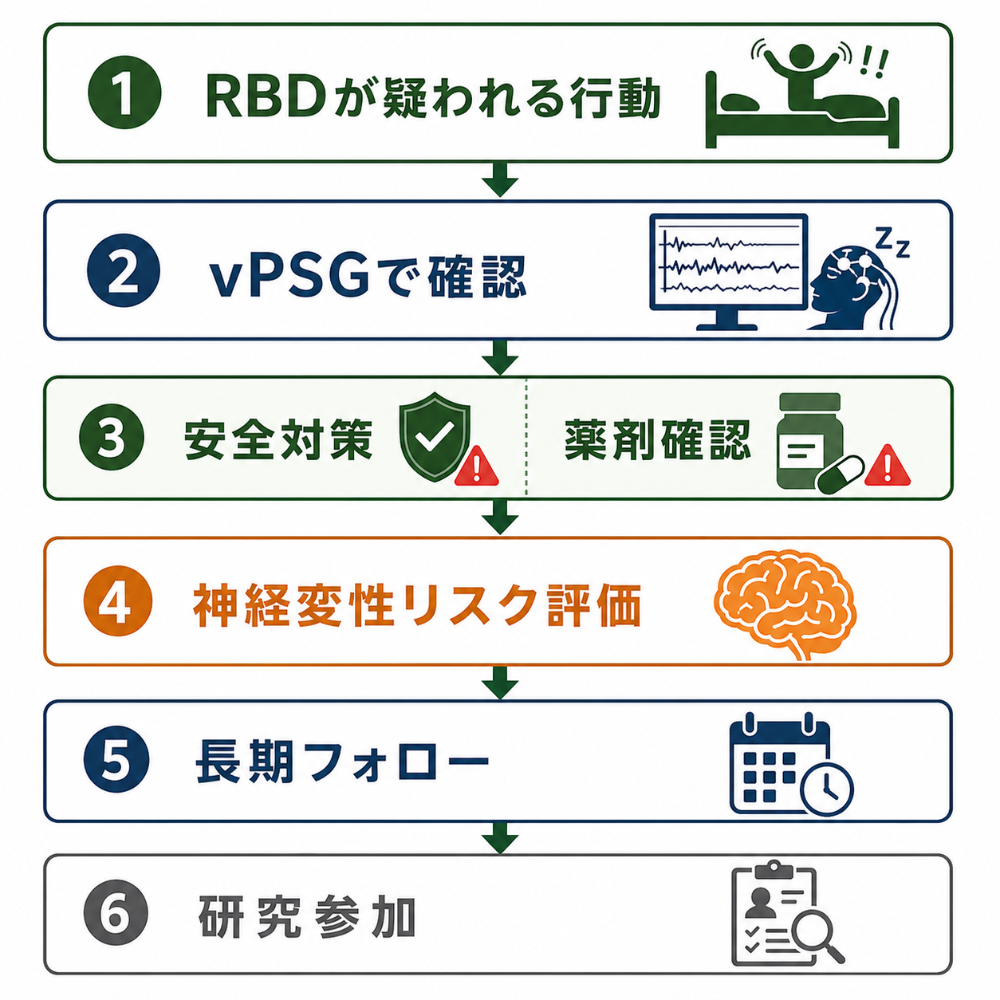
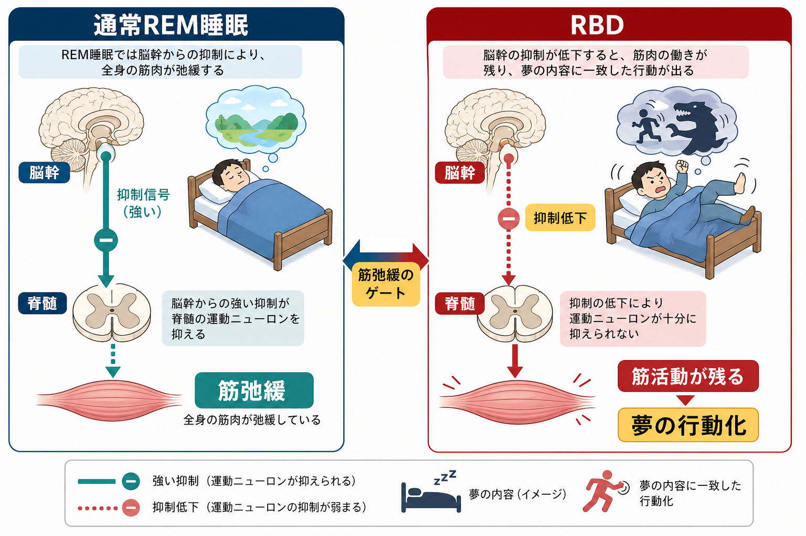

# レム睡眠行動障害とは何か

## 要点

- レム睡眠行動障害（REM sleep behavior disorder: RBD）は、通常ならREM睡眠中に強く抑えられる骨格筋活動が残り、夢の内容に一致した発声・手足の動き・防御行動・攻撃的動作などが出るパラソムニアである[1][2]。
- 確定的な評価では、本人や同居者からの病歴に加え、ビデオ終夜睡眠ポリグラフ検査（video polysomnography: vPSG）でREM sleep without atonia（RSWA）を確認することが重要になる[2][3]。
- 孤発性または孤立性RBDは、パーキンソン病、[[レビー小体型認知症は神経回路にどのような影響を与えるのか|レビー小体型認知症]]、多系統萎縮症などのαシヌクレイン病の前駆状態として研究されている[4][5]。
- 臨床上の第一歩は、診断名を急いで固定することではなく、外傷予防、薬剤・物質・睡眠時無呼吸・てんかん・せん妄などの鑑別、神経症状と認知変化の経過観察を組み合わせることである[6][7]。

## この記事で答える問い

1. RBDは、単なる寝ぼけや悪夢と何が違うのか。
2. REM睡眠中の「筋弛緩」が壊れると、なぜ夢の行動化が起こるのか。
3. RBDはなぜ神経変性疾患、とくにαシヌクレイン病の前駆サインとして重視されるのか。
4. 研究・臨床では、RBDをどのように評価し、どこに注意して解釈するのか。

## まず結論

RBDの核心は、**REM睡眠中の夢見そのものではなく、夢を見ている間に本来なら抑えられる運動出力が残ること**にある。通常のREM睡眠では、脳は活発に夢を生成していても、脳幹から脊髄運動ニューロンへの抑制が働くため、全身の骨格筋は強く弛緩している。RBDではこの抑制が弱まり、叫ぶ、殴る、蹴る、逃げる、手を伸ばすといった行動が睡眠中に出る[1][3]。

もう一つの重要点は、RBDが単なる睡眠中の困った行動にとどまらないことである。とくに中高年以降に明らかなRBDが出る場合、将来のパーキンソン病、レビー小体型認知症、多系統萎縮症などと関連することがあり、神経変性の長い前駆期を観察する窓として研究されている[4][5]。ただし、RBDがあるから必ず特定の疾患になる、と個人レベルで断定することはできない。安全確保と長期的な評価を分けて考える必要がある。

## 背景

睡眠中の異常行動は、[[睡眠障害とは何か|睡眠障害]]の中でも見落とされやすい。本人は出来事を覚えていないことがあり、同居者の目撃情報、寝具の乱れ、けが、録画された動画から初めて問題になることもある。寝言、悪夢、ノンレム睡眠からの覚醒障害、夜間せん妄、てんかん発作、睡眠時無呼吸に伴う覚醒反応、薬剤・アルコールの影響なども似た行動を示しうるため、症状名だけでRBDと決めることはできない[2][8]。

RBDが特に注目される理由は、αシヌクレイン病との結びつきである。αシヌクレイン病にはパーキンソン病、レビー小体型認知症、多系統萎縮症などが含まれる。これらは運動症状や認知症状が明らかになる何年も前から、自律神経症状、嗅覚低下、便秘、抑うつ、睡眠異常などの非運動症状が現れることがある。RBDはその中でも比較的特異性が高い前駆サインとして扱われる[4][5]。

## 基本概念

### RBDとは何か

RBDは、REM睡眠中に起こる反復性の発声または複雑な運動行動と、REM睡眠中の筋弛緩の消失・低下を特徴とする。夢の内容は、追われる、攻撃される、誰かを守る、落ちそうになるなど、脅威や行動を伴うものとして語られることが多い。行動は軽い寝言や手足のぴくつきから、殴る、蹴る、ベッドから落ちる、同床者を傷つける行動まで幅がある[1][2]。

診断上は、病歴だけで「RBDらしい」と考える段階と、vPSGでREM睡眠中のRSWAと行動を確認する段階を分ける。質問紙や家族からの報告はスクリーニングとして有用だが、確定的評価では睡眠時無呼吸、周期性四肢運動、夜間てんかん、薬剤性の変化などを区別する必要がある[2][3]。

### RSWAとは何か

RSWA（REM sleep without atonia）は、REM睡眠中にも顎・四肢などの筋電図活動が過剰に残る所見である。RBDの神経生理学的な基盤として重要だが、RSWAがあるだけで必ず夢の行動化があるとは限らない。抗うつ薬などの薬剤、神経疾患、加齢、睡眠検査条件によっても検出されることがあるため、行動症状と合わせて解釈する[3][8]。

## 仕組み

通常のREM睡眠では、脳幹のREM睡眠制御ネットワークが脊髄運動ニューロンを抑制し、筋緊張を低く保つ。これにより、脳内では夢や情動的イメージが生じても、身体は大きく動かない。RBDではこの「運動出力を止めるゲート」が弱くなり、夢の中の防御・逃避・攻撃・把持のような運動プログラムが実際の筋活動として表に出る[1][3]。

神経変性との接続では、REM睡眠筋弛緩を支える脳幹ネットワークが、αシヌクレイン病の早期病変と重なりうる点が重要である。運動症状としてのパーキンソニズムや認知症が出る前に、睡眠、嗅覚、自律神経、気分、便通などのネットワーク機能が変化するという見方である[4][5]。この視点は、[[運動ネットワークは随意運動をどう生み出すのか]]や[[大脳基底核ループとは何か]]の理解とも接続する。

## 図解

| 観点 | 通常のREM睡眠 | RBD |
|---|---|---|
| 夢見 | 起こりうる | 起こりうる |
| 筋緊張 | 脳幹-脊髄系により強く抑制される | 抑制が不十分で筋活動が残る |
| 行動 | 大きな運動は出にくい | 発声、手足の動き、夢の行動化が出る |
| 危険 | 通常は低い | 転落、打撲、同床者のけがが問題になる |
| 評価 | 病歴だけでは問題になりにくい | 病歴、同居者情報、vPSG、鑑別が重要 |

## 臨床・研究との接続

### 安全確保

RBDで最も実用的に重要なのは、外傷予防である。AASMの臨床実践ガイドラインは、RBDの管理で安全な睡眠環境を整えることを重視している[6]。教育的に言えば、寝室から危険物を減らす、転落や衝突を避ける、同床者の安全を考える、といった環境調整がまず問題になる。ただし、個別の対応は症状の重さ、住環境、併存疾患、薬剤、転倒リスクによって異なるため、この記事は治療指示ではなく概念整理として読む必要がある。

### 鑑別

RBDに似た夜間行動には、ノンレム睡眠からの覚醒障害、悪夢障害、睡眠時無呼吸に伴う覚醒反応、夜間てんかん、アルコール・薬剤・物質、[[せん妄とは何か|せん妄]]、[[器質性精神病とは何か|器質性精神症状]]などがある[2][8]。また、抗うつ薬などがRBD様症状やRSWAに関係する場合もある。薬剤性の可能性を考えるときは、[[薬剤性精神病とは何か]]のように「薬剤だけで説明できるか」と「背景の神経疾患があるか」を分けて検討する。

### 神経変性リスク

Postumaらの国際多施設研究では、PSGで確認された孤立性RBD 1280例を追跡し、明らかな神経変性症候群への移行率を年約6.25%、12年で73.5%と推定した[5]。移行先はパーキンソニズムが先に出る場合と認知症が先に出る場合があり、嗅覚低下、軽度認知障害、運動徴候、自律神経症状、DAT画像異常などが予測因子として検討されている[5]。

この数字は重要だが、個人の未来を機械的に予言するものではない。研究コホートの対象者、年齢、紹介バイアス、PSG確認の有無、追跡期間によってリスク推定は変わる。したがって、RBDは「将来を断定する診断名」ではなく、神経変性リスクを長期的に評価する手がかりとして扱うのが妥当である。

### レビー小体型認知症との関係

2017年のレビー小体型認知症コンソーシアム基準では、RBDは中核的臨床特徴として位置づけられた[7]。これは、RBDが幻視、認知の変動、パーキンソニズムなどと並んで、レビー小体病理を疑う臨床情報になるためである。特に認知症評価では、記憶障害だけでなく、睡眠中行動、注意の変動、視空間機能、幻視、抗精神病薬過敏性、自律神経症状を合わせて見る必要がある。

## よくある誤解

### 「悪夢を見て暴れるなら全部RBDである」

そうではない。悪夢障害では夢の内容は強く不快でも、REM睡眠中の筋弛緩が保たれていればRBDとは異なる。ノンレム睡眠からの覚醒障害では、混乱、歩行、記憶の乏しさが目立つことがあり、発生する睡眠段階も異なる。RBDの評価では、夢内容だけでなく、発生時刻、覚醒後の記憶、けが、同居者情報、vPSG所見を合わせる[2][8]。

### 「RBDがあれば必ずパーキンソン病になる」

RBDはαシヌクレイン病と強く関連するが、個人単位で発症疾患や時期を断定できるわけではない。研究では高い移行率が報告されている一方、移行までの期間、病型、予測因子にはばらつきがある[5]。不安をあおる説明ではなく、経過観察と安全対策、必要に応じた神経学的評価につなげる説明が重要である。

### 「睡眠中の行動だけ見れば診断できる」

睡眠中行動の観察は入口として重要だが、確定的評価にはvPSGが重要である。これは、RBDらしい行動が別の睡眠障害や発作、薬剤、呼吸イベントに由来する場合があるためである[2][3]。

## 関連ノート

- [[睡眠障害とは何か]]
- [[睡眠障害は脳機能にどのような影響を与えるのか]]
- [[レビー小体型認知症は神経回路にどのような影響を与えるのか]]
- [[大脳基底核ループとは何か]]
- [[運動ネットワークは随意運動をどう生み出すのか]]
- [[薬剤性精神病とは何か]]
- [[器質性精神病とは何か]]
- [[せん妄とは何か]]

## MOC更新候補

- `content/00_MOC/MOC｜神経科学と精神疾患.md`
- `content/00_MOC/` 配下に睡眠医学または神経変性疾患のMOCがある場合、本記事を「睡眠障害」「αシヌクレイン病」「認知症鑑別」の接続点として追加する候補になる。

## 理解チェック

1. RBDで「夢を見ること」よりも「REM睡眠中の筋弛緩低下」が重要なのはなぜか。
2. vPSGでRSWAを確認することは、どのような鑑別に役立つか。
3. 孤立性RBDを、パーキンソン病やレビー小体型認知症の前駆サインとして扱うとき、個人への説明で注意すべき点は何か。
4. RBDの臨床対応で、安全確保、薬剤確認、神経変性リスク評価を分けて考える理由は何か。

## 未解決問題

- 孤立性RBDのうち、どの人がパーキンソン病、レビー小体型認知症、多系統萎縮症のどの表現型へ進むのかを、個人レベルでどこまで予測できるか。
- αシヌクレイン病の前駆期に介入する疾患修飾治療が確立した場合、RBDをどのようなスクリーニング・層別化指標として使うべきか。
- 薬剤関連RBD様症状、RSWAのみの所見、軽い夢の行動化を、将来リスクの観点からどこまで同じ連続体として扱えるか。

## 参考文献

[1] Dauvilliers, Y., Schenck, C. H., Postuma, R. B., et al. (2018). REM sleep behaviour disorder. *Nature Reviews Disease Primers*, 4, 19. https://doi.org/10.1038/s41572-018-0016-5

[2] St Louis, E. K., & Boeve, B. F. (2017). REM sleep behavior disorder: diagnosis, clinical implications, and future directions. *Mayo Clinic Proceedings*, 92(11), 1723-1736. https://doi.org/10.1016/j.mayocp.2017.09.007

[3] McCarter, S. J., St Louis, E. K., & Boeve, B. F. (2012). REM sleep behavior disorder and REM sleep without atonia as an early manifestation of degenerative neurological disease. *Current Neurology and Neuroscience Reports*, 12(2), 182-192. https://doi.org/10.1007/s11910-012-0253-z

[4] Högl, B., Stefani, A., & Videnovic, A. (2018). Idiopathic REM sleep behaviour disorder and neurodegeneration - an update. *Nature Reviews Neurology*, 14, 40-55. https://doi.org/10.1038/nrneurol.2017.157

[5] Postuma, R. B., Iranzo, A., Hu, M., et al. (2019). Risk and predictors of dementia and parkinsonism in idiopathic REM sleep behaviour disorder: a multicentre study. *Brain*, 142(3), 744-759. https://doi.org/10.1093/brain/awz030

[6] Howell, M., Avidan, A. Y., Foldvary-Schaefer, N., et al. (2023). Management of REM sleep behavior disorder: an American Academy of Sleep Medicine clinical practice guideline. *Journal of Clinical Sleep Medicine*, 19(4), 759-768. https://doi.org/10.5664/jcsm.10424

[7] McKeith, I. G., Boeve, B. F., Dickson, D. W., et al. (2017). Diagnosis and management of dementia with Lewy bodies: Fourth consensus report of the DLB Consortium. *Neurology*, 89(1), 88-100. https://doi.org/10.1212/WNL.0000000000004058

[8] Sobreira-Neto, M. A., Stelzer, F. G., Gitaí, L. L. G., et al. (2023). REM sleep behavior disorder: update on diagnosis and management. *Arquivos de Neuro-Psiquiatria*, 81(12), 1179-1194. https://doi.org/10.1055/s-0043-1777111
