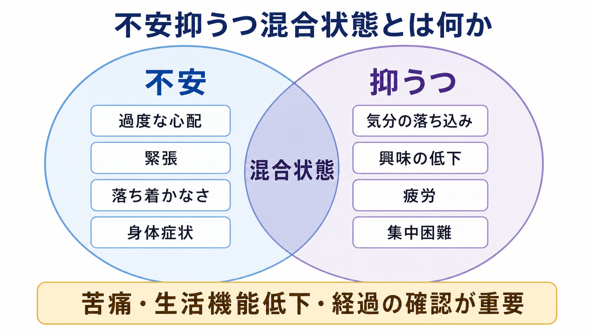
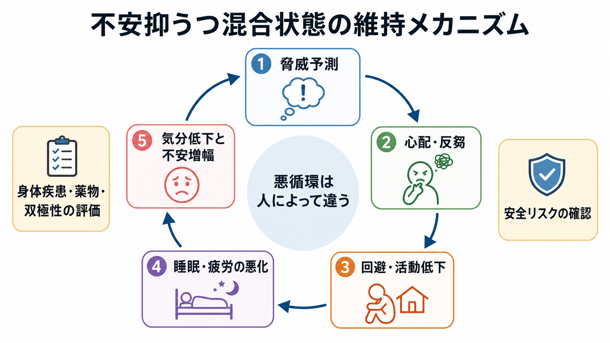
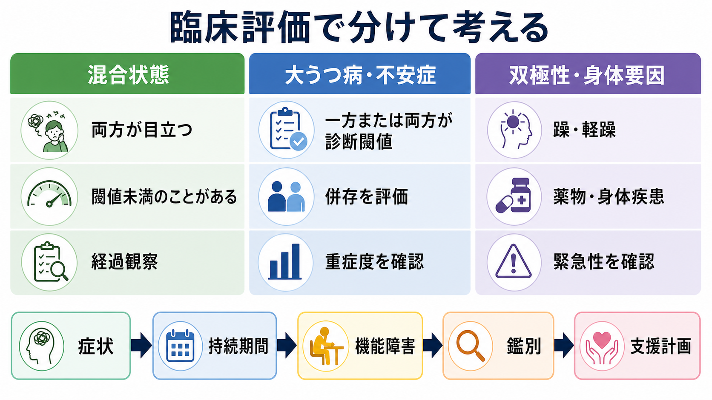

# 不安抑うつ混合状態とは何か

## 要点

- 不安抑うつ混合状態とは、[[不安症群とは何か|不安症状]]と[[うつ病とは何か|抑うつ症状]]が同時に目立ち、苦痛や生活機能低下を生む状態を指す。
- ICD-11 では 6A73 *Mixed depressive and anxiety disorder* として位置づけられ、2週間以上、ほとんどの日に不安症状と抑うつ症状があり、どちらか単独では抑うつ障害や不安・恐怖関連症の診断閾値に達しない場合を想定する[1][2]。
- DSM-5-TR では同名の独立診断は採用されておらず、[[大うつ病性障害とは何か|大うつ病性障害]]の「不安性苦痛」指定、[[全般不安症とは何か|全般不安症]]、抑うつ症状を伴う不安症、または併存症として整理されやすい[3][4]。
- この概念の実用性は議論中である。閾値下でも苦痛と機能障害は大きくなりうる一方、実際のデータでは「閾値下の混合」よりも「不安とうつの高い併存群」として現れることもある[4][5]。
- 臨床では、診断名だけでなく、持続期間、重症度、機能障害、自殺リスク、躁・軽躁、身体疾患、薬物、トラウマ、生活環境を確認する必要がある。

## この記事で答える問い

1. 不安抑うつ混合状態は、単なる「不安とうつの併存」と何が違うのか。
2. ICD-11 と DSM-5-TR では、どのように扱いが違うのか。
3. どのような仕組みで、不安と抑うつが互いに維持されやすいのか。
4. 臨床・研究では、どのような評価と注意点が必要か。

## まず結論

不安抑うつ混合状態は、「不安症か、うつ病か」を二者択一で決めるための言葉ではない。むしろ、不安、落ち込み、興味の低下、疲労、心配、反芻、睡眠不良、身体症状、活動低下が同時に絡み合い、生活上の困難を作っている状態を見落とさないための概念である。

ICD-11 は、この混合状態を独立した診断カテゴリとして置く。ただし、これは「軽いから問題が小さい」という意味ではない。閾値下症状でも、本人の苦痛、仕事・学業・家事・対人関係への影響、身体症状の訴え、受診行動は十分に大きくなりうる[4][5]。一方、DSM-5-TR は独立診断としては採用せず、抑うつ障害の不安性苦痛指定や、うつ病と不安症の併存として整理する[3][4]。したがって、この記事では「分類名」よりも、混合した症状をどう評価し、どう誤解しないかに焦点を置く。

## 背景

不安と抑うつは、臨床でも研究でも強く重なり合う。[[不安症とうつ病はどう併存するのか]]で扱うように、心配、緊張、回避、睡眠不良、疲労、集中困難、悲観、興味の低下は、異なる診断カテゴリにまたがって現れる。プライマリケアでは、身体症状、疲労、不眠、痛み、胃腸症状として相談されることも多く、本人も「不安」「うつ」と明確に名づけていないことがある[6]。

この重なりをどう分類するかは、診断体系によって異なる。ICD-10 には F41.2「混合性不安抑うつ障害」があり、ICD-11 では 6A73「混合性抑うつ不安症」として抑うつ症群の中に整理された[1][2]。一方、DSM-5 では候補として検討された混合性不安抑うつ障害が、信頼性などの問題から正式診断には含まれなかったとレビューで整理されている[4]。この違いは、[[DSMとICDは何が違うのか]]を読むと理解しやすい。

## 基本概念

### ICD-11での位置づけ

ICD-11 の 6A73 は、抑うつ症状と不安症状が2週間以上、ほとんどの日に存在し、それぞれを別々に見ると抑うつエピソード、持続性抑うつ障害、または不安・恐怖関連症の診断要件を満たすほど重く、数が多く、持続的ではない状態を想定する[1][2]。ただし、臨床的に意味のある苦痛や、個人・家庭・社会・学業・職業などの重要領域での機能障害は必要である[1][2]。

ここで重要なのは、「閾値下」と「軽症」を混同しないことである。ある診断カテゴリの症状数や持続期間の閾値を満たさなくても、本人の生活への影響は大きいことがある。たとえば、心配が強く眠れない、落ち込みで活動量が下がる、疲労が増えてさらに不安になる、身体症状を繰り返し心配する、といった循環がある。

### DSM-5-TRでの扱い

DSM-5-TR には、ICD-11 の 6A73 と同じ独立診断は置かれていない[3][4]。その代わり、抑うつ障害の文脈では「不安性苦痛」指定が用いられる。これは、抑うつエピソード中に緊張、落ち着かなさ、心配による集中困難、悪いことが起こる恐怖、自己制御を失う感覚などが目立つ場合に、不安の臨床的意味を明示するための指定である[3]。

したがって DSM 系の記述では、次のように整理されやすい。

| 見方 | 典型的な整理 |
|---|---|
| 抑うつが診断閾値に達し、不安症状も目立つ | 大うつ病性障害、不安性苦痛指定 |
| 不安症が診断閾値に達し、抑うつ症状も伴う | 全般不安症、パニック症、社交不安症などと抑うつ症状 |
| うつ病と不安症の両方が診断閾値に達する | うつ病と不安症の併存 |
| どちらも閾値下だが苦痛・機能障害がある | その他の特定される障害、適応障害、臨床的問題としての定式化などを検討 |

### 併存との違い

不安抑うつ混合状態は、「不安症とうつ病の併存」と完全に同じではない。併存は、たとえば大うつ病性障害と全般不安症の両方が診断要件を満たす状態である。一方、ICD-11 の混合性抑うつ不安症は、両方の症状があるが、別々に見るとどちらも単独診断の閾値には届かない状態を想定する[1][2]。

ただし、研究上はこの境界は単純ではない。一般人口データを用いた研究では、ICD-11 型の「閾値下の混合」クラスよりも、不安症状と抑うつ症状の両方が高い「併存的」クラスが目立ち、機能障害や身体化とも関連した[5]。このことは、分類名を使うときに、実際の症状量と生活機能を別に評価する必要があることを示している。

## 仕組み

不安と抑うつが混ざると、症状は足し算ではなく悪循環になりやすい。代表的には、脅威予測、心配・反芻、回避、活動低下、睡眠不良、疲労、自己評価の低下が互いに維持し合う。

### 脅威予測と心配

不安が強いと、未来の失敗、病気、対人評価、仕事上の不利益などが過大に予測されやすい。心配は一時的には「準備している感じ」を与えるが、長く続くと睡眠、注意、意思決定を消耗させる。心配が止まらないほど、疲労や集中困難が増え、抑うつ的な自己評価が強まりやすい。

### 反芻と抑うつ

抑うつが強いと、過去の失敗、喪失、自責、将来の悲観に注意が向きやすい。反芻は問題解決に見えることがあるが、実際には同じ考えの反復になりやすく、気分を下げ、活動開始を遅らせる。活動が減ると、達成感や対人接触が減り、さらに不安と抑うつが維持される。

### 回避と活動低下

不安では危険を避ける行動が、抑うつでは活動への意欲低下が起こりやすい。両者が重なると、「不安だから避ける」「避けた結果、生活が狭まり落ち込む」「落ち込むのでさらに動けない」という循環が作られる。この点は、[[5Pモデルとは何か]]や[[生物心理社会モデルとは何か]]で扱うケースフォーミュレーションと相性がよい。

### 身体症状と睡眠

不安では動悸、息苦しさ、筋緊張、胃腸症状、めまいなどが目立つことがあり、抑うつでは疲労、睡眠障害、食欲変化、疼痛、身体の重さが目立つことがある。身体症状を「危険な病気の徴候」と解釈すると不安が増し、睡眠不良や活動低下が抑うつを悪化させる。ここでは[[身体症状症とは何か]]、[[身体疾患による気分障害とは何か]]、[[薬剤性うつ症状とは何か]]との鑑別も重要になる。

## 図解

3枚目の図は、臨床評価で混合状態、閾値に達した大うつ病・不安症、双極性や身体要因を分けて見る流れを示す。現実には境界が重なるため、症状名だけでなく、持続期間、機能障害、経過、安全リスク、鑑別、支援計画を順に確認する。

## 臨床・研究との接続

### 評価の入口

評価では、まず「不安」と「抑うつ」を別々に聞くだけでなく、同時にどう絡んでいるかを聞く。たとえば、心配の内容、落ち込みの時間帯、興味の低下、睡眠、疲労、集中、身体症状、回避、仕事や家事への影響、対人関係、希死念慮を確認する。[[精神科初診で何を確認するべきか]]、[[主訴はどのように聞くべきか]]、[[現病歴はどのように構造化するべきか]]と接続して読むとよい。

尺度としては、PHQ-9、GAD-7、HADS などが症状量の把握に役立つことがある。ただし、尺度は診断そのものではない。NICE のうつ病ガイドラインや全般不安症・パニック症ガイドラインでも、症状の重症度だけでなく、機能障害、既往、併存、リスク、本人の希望を含めた評価が重視される[7][8]。

### 鑑別で重要なこと

混合した不安・抑うつを見たときに、少なくとも次の点は確認したい。

| 確認すること | 理由 |
|---|---|
| 躁・軽躁の既往 | [[双極性障害とは何か|双極性障害]]や混合性特徴を見落とすと、治療選択が大きく変わる |
| 自殺リスク | 不安、焦燥、不眠、抑うつが重なると安全評価が重要になる |
| 身体疾患・薬物 | 甲状腺疾患、貧血、疼痛、薬剤、物質使用などが症状を作ることがある |
| トラウマ・喪失・ストレス | [[PTSDとは何か]]、[[複雑性PTSDとは何か]]、[[適応障害とは何か]]との関係を検討する |
| 発症時期と経過 | 急性か慢性か、エピソード性か持続性かで意味が変わる |
| 生活機能 | [[精神科で生活機能をどう評価するか|生活機能]]の低下が支援の必要性を左右する |

### 支援計画

この記事は治療指示ではないが、支援計画を考えるときは、症状名だけでなく悪循環のどこに介入するかを整理する。睡眠、活動量、回避、心配、反芻、身体症状への解釈、対人ストレス、職場・学校環境、家族支援を分けて見る。軽症から中等症では心理教育、セルフモニタリング、問題解決、行動活性化、認知行動療法的介入が検討されることがあり、重症度や併存症によって薬物療法や専門的治療の必要性も変わる[7][8]。

研究では、混合状態をカテゴリとして扱うのか、不安次元と抑うつ次元の連続量として扱うのかが重要になる。ICD-11 に沿ったカテゴリ化は臨床的な言語を与えるが、症状の重なり、身体化、機能障害、併存、治療反応を理解するには、[[カテゴリ診断と次元診断は何が違うのか|カテゴリ診断と次元診断]]の両方が必要である[5][6]。

## よくある誤解

### 誤解1: 不安抑うつ混合状態は「軽い状態」である

診断閾値に届かないことと、困りごとが小さいことは同じではない。閾値下症状でも、苦痛、機能障害、身体症状、受診行動、将来の診断移行リスクと関係しうる[4][5]。

### 誤解2: 不安とうつのどちらか一方だけを診断すれば十分である

不安と抑うつは互いに影響する。抑うつだけを見て心配・回避・身体過覚醒を見落とすと、維持要因が残る。逆に、不安だけを見て興味低下、疲労、自責、希死念慮を見落とすと、安全評価や支援計画が不十分になる。

### 誤解3: DSMにない概念だから臨床的に意味がない

DSM-5-TR に同名の独立診断がないことは、混合した不安・抑うつが臨床的に重要でないという意味ではない。DSM では不安性苦痛指定や併存症として扱い、ICD-11 では独立カテゴリとして扱う、という分類方針の違いである[3][4]。

### 誤解4: 身体症状があるなら精神医学の問題ではない

身体症状は、不安・抑うつの一部としても、身体疾患や薬剤の影響としても現れる。したがって、「精神か身体か」を早く決めるより、身体評価と心理社会的評価を並行して行う必要がある。

## 関連ノート

- [[不安症群とは何か]]
- [[うつ病とは何か]]
- [[不安症とうつ病はどう併存するのか]]
- [[大うつ病性障害とは何か]]
- [[全般不安症とは何か]]
- [[双極性障害とは何か]]
- [[抑うつを伴う適応障害とは何か]]
- [[DSMとICDは何が違うのか]]
- [[カテゴリ診断と次元診断は何が違うのか]]
- [[5Pモデルとは何か]]
- [[精神科で生活機能をどう評価するか]]

今後の作成候補: `混合性抑うつ不安症とは何か`, `不安性苦痛指定とは何か`, `閾値下精神症状とは何か`, `PHQ-9とGAD-7はどう使うのか`。

MOC更新候補: `content/00_MOC/` 配下の精神医学、疾患・症候群、診断・面接関連 MOC に `[[不安抑うつ混合状態とは何か]]` を追加する。ただし並列ジョブとの競合を避けるため、このタスクでは MOC 本体は更新しない。

## 理解チェック

1. ICD-11 の不安抑うつ混合状態では、不安症状と抑うつ症状の「閾値」をどのように考えるか。
2. DSM-5-TR で同名の独立診断がない場合、混合した不安・抑うつはどのように整理されやすいか。
3. 不安と抑うつが相互に維持される悪循環を、心配、反芻、回避、睡眠の語を使って説明できるか。
4. 混合した不安・抑うつを評価するとき、双極性障害、身体疾患、自殺リスクを確認する理由は何か。

## 参考文献

[1] World Health Organization. *ICD-11 for Mortality and Morbidity Statistics: 6A73 Mixed depressive and anxiety disorder*. https://icd.who.int/browse/2025-01/mms/en#314468192

[2] World Health Organization. (2024). *Clinical descriptions and diagnostic requirements for ICD-11 mental, behavioural and neurodevelopmental disorders*. https://www.who.int/publications/i/item/9789240077263

[3] American Psychiatric Association. (2022). *Diagnostic and Statistical Manual of Mental Disorders, Fifth Edition, Text Revision (DSM-5-TR)*. American Psychiatric Association Publishing. https://doi.org/10.1176/appi.books.9780890425787

[4] Möller, H.-J., Bandelow, B., Volz, H.-P., Barnikol, U. B., Seifritz, E., & Kasper, S. (2016). The relevance of 'mixed anxiety and depression' as a diagnostic category in clinical practice. *European Archives of Psychiatry and Clinical Neuroscience, 266*(8), 725-736. https://doi.org/10.1007/s00406-016-0684-7

[5] Shevlin, M., Hyland, P., Nolan, E., Owczarek, M., Ben-Ezra, M., & Karatzias, T. (2022). ICD-11 'mixed depressive and anxiety disorder' is clinical rather than sub-clinical and more common than anxiety and depression in the general population. *British Journal of Clinical Psychology, 61*(1), 18-36. https://doi.org/10.1111/bjc.12321

[6] Goldberg, D. P., Reed, G. M., Robles, R., Minhas, F., Razzaque, B., Fortes, S., Mari, J. J., Lam, T.-P., Garcia, J. A., Gask, L., Dowell, A. C., Rosendal, M., Mbatia, J. K., & Saxena, S. (2017). Screening for anxiety, depression, and anxious depression in primary care: A field study for ICD-11 PHC. *Journal of Affective Disorders, 213*, 199-206. https://doi.org/10.1016/j.jad.2017.02.025

[7] National Institute for Health and Care Excellence. (2022). *Depression in adults: treatment and management* (NICE Guideline NG222). https://www.nice.org.uk/guidance/ng222

[8] National Institute for Health and Care Excellence. (2011, updated 2020). *Generalised anxiety disorder and panic disorder in adults: management* (Clinical guideline CG113). https://www.nice.org.uk/guidance/cg113

## 未解決問題

- ICD-11 の混合性抑うつ不安症が、一般人口・プライマリケア・専門外来で同じような臨床群を捉えるのかは、なお検証が必要である。
- 「閾値下の混合状態」と「高い不安・抑うつ併存」を、尺度、面接、機能障害、治療反応からどう区別するかは研究上の課題である。
- 日本語臨床で「不安抑うつ混合状態」「混合性不安抑うつ」「混合性抑うつ不安症」をどう訳し分け、患者説明に使うかは標準化の余地がある。
