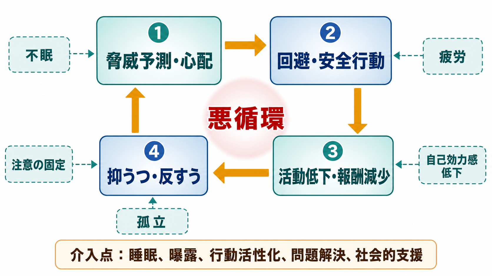
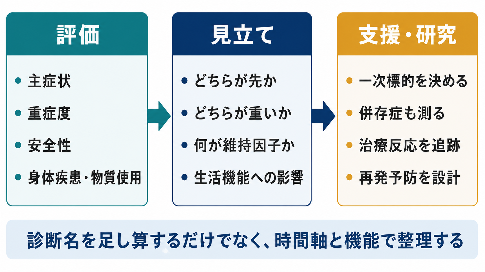

# 不安症とうつ病はどう併存するのか

## 要点

- [[不安症群とは何か|不安症群]]と[[うつ病とは何か|うつ病]]は、別々の診断カテゴリーでありながら、臨床では高頻度に重なり合う。これは単なる「病名の足し算」ではなく、脅威予測、回避、活動低下、反すう、不眠、疲労が相互に維持し合う現象として理解できる[1][2][3]。
- NESDA などの大規模コホートでは、不安症とうつ病の併存は単独の不安症より症状重症度、機能障害、慢性化と関連しやすいことが示されている[4][5]。
- うつ病に強い不安症状が重なる「不安性うつ」では、急性期の抗うつ薬治療に対する寛解率が低く、副作用負担も大きい傾向が STAR*D で報告された[6]。
- 臨床では、どちらの診断名が付くかだけでなく、「どちらが先に始まったか」「現在どちらが重いか」「何が維持因子か」「安全性と生活機能にどう影響しているか」を見る必要がある[5][7]。
- 本稿は教育・研究目的の整理であり、個別の診断や治療指示ではない。自殺念慮、急激な悪化、生活上の危機がある場合は、地域の救急・医療機関・信頼できる支援者につながることが優先される。

## この記事で答える問い

1. 不安症とうつ病は、どのような意味で「併存」するのか。
2. 不安と抑うつは、なぜ互いに悪化しやすいのか。
3. 併存は治療反応や予後の見立てをどう変えるのか。
4. 臨床・研究では、診断名の足し算を超えて何を測るべきか。

## まず結論

不安症とうつ病の併存は、二つの疾患が偶然同時にある状態だけではない。多くの場合、[[不安とは何か|不安]]による脅威予測と回避が生活範囲を狭め、活動や報酬経験が減り、抑うつと反すうが強まる。抑うつ側では、疲労、自己評価低下、集中困難、不眠が不安への対処力を下げる。こうして「心配するから動けない」と「動けないからさらに自信を失う」が循環する。

したがって、臨床的な見立てでは、[[併存症とは何か|併存症]]を「診断名が二つある」と記録するだけでは不十分である。時間軸、重症度、生活機能、安全性、身体疾患・物質使用、睡眠、対人関係、治療反応を合わせて、どこに介入点があるかを整理する必要がある[5][7]。

## 背景

DSM-5-TR では、不安症群と抑うつ障害群は別の章に置かれる。これは、恐怖・不安・回避を中心にする疾患群と、抑うつ気分・興味や喜びの低下を中心にする疾患群を臨床的に区別するためである[1]。一方で、現実の患者像はこの分類ほどきれいに分かれない。

不安症群は、過剰で持続する恐怖・不安、脅威予測、回避、安全行動を特徴とする[2]。うつ病は、抑うつ気分、興味・喜びの低下、睡眠や食欲の変化、疲労、罪責感、集中困難、死についての反復思考などを含む[3]。両者は、睡眠障害、集中困難、易疲労性、身体症状、社会的引きこもりを共有しやすい。

この重なりは診断分類の弱点だけを意味しない。むしろ、精神病理が「内在化問題」と呼ばれる大きな次元の中で近接していることを示す。すなわち、不安、恐怖、抑うつ、反すう、自己批判、回避は、別々の症状でありながら、共通の脆弱性や環境ストレスのもとで一緒に高まりやすい。

## 基本概念

### 併存とは何か

併存とは、同じ人に複数の診断が同時期に成立することである。ただし精神医学では、併存を三つに分けて考えると理解しやすい。

| 型 | 何が起きているか | 例 |
|---|---|---|
| 症状の重なり | 診断基準に共通症状がある | 不眠、疲労、集中困難、身体症状 |
| 時間的連鎖 | 一方がもう一方の発症・悪化条件になる | パニック発作後の回避が活動低下を招く |
| 共通脆弱性 | 同じリスク因子が複数症状を高める | ストレス、神経症傾向、養育逆境、慢性疾患 |

この三つは互いに排他的ではない。たとえば[[全般不安症とは何か|全般不安症]]の心配が不眠を招き、不眠が抑うつを悪化させ、抑うつによる疲労が心配への対処力を下げる、という循環が起こりうる。

### 「不安性うつ」と診断名としての併存

臨床では、うつ病の中に強い不安症状を伴う人がいる。この状態はしばしば「不安性うつ」と呼ばれるが、これは独立した単一疾患というより、うつ病の中の重要な症状次元として扱う方が安全である。STAR*D の解析では、うつ病外来患者の約半数が強い不安症状を伴い、その群では寛解が遅く、急性期の治療成績が悪い傾向があった[6]。

一方で、[[パニック症とは何か|パニック症]]、[[社交不安症とは何か|社交不安症]]、全般不安症などの診断基準を満たす不安症が、[[大うつ病性障害とは何か|大うつ病性障害]]と同時に成立する場合もある。この場合は、抑うつ症状の一部として不安を扱うだけでなく、不安症そのものの対象、回避、安全行動を評価する必要がある。

## 仕組み

### 1. 脅威予測と回避が生活範囲を狭める

不安症では、将来の失敗、身体感覚、対人評価、外出、閉所、健康不安などが過大に脅威として予測される。回避は短期的には安心をもたらすが、危険予測を検証する機会を減らす。すると「避けたから何も起きなかった」という学習が強まり、回避行動が固定化する[2]。

回避が増えると、仕事、学業、趣味、運動、対人交流が減り、報酬経験が乏しくなる。これは抑うつの活動低下や無力感とつながる。[[行動活性化とは何か|行動活性化]]がうつ病治療で重視されるのは、活動と報酬経験の循環を回復する狙いがあるからである[7]。

### 2. 反すうと心配が互いに増幅する

心配は「これから悪いことが起きるのではないか」と未来へ向かう反復思考であり、反すうは「なぜ自分はこうなのか」と過去や自己評価へ向かう反復思考である。方向は違うが、どちらも注意を否定的情報に固定し、問題解決の感覚を弱める。

抑うつが強いと、自己効力感が下がり、不安場面を乗り越える見通しが立ちにくくなる。不安が強いと、失敗予測や身体感覚への警戒が増え、抑うつ的な自己批判が強まりやすい。ここでは[[デフォルトモードネットワークとは何か|自己関連処理]]、注意制御、情動調整の問題が研究対象になるが、個人の診断に直結する単一バイオマーカーが確立しているわけではない[3]。

### 3. 不眠・疲労・身体症状が共通の増幅器になる

不安とうつの併存では、[[不眠障害とは何か|不眠]]、疲労、筋緊張、胃腸症状、動悸、痛み、食欲変化が重要である。これらは「身体症状だから心理と無関係」でも、「心理だけで説明できる」ものでもない。睡眠不足や慢性疲労は、注意制御、情動調整、問題解決、社会参加を弱める。

また、身体疾患、薬剤、物質使用、カフェイン、アルコール、疼痛、内分泌疾患は、不安症状と抑うつ症状の両方を悪化させうる。したがって、併存を評価するときは、精神症状だけでなく身体状態と生活リズムも見る必要がある[7]。

### 4. ストレス応答と報酬系が同じ人の中で交差する

不安症とうつ病には、遺伝的脆弱性、発達上の逆境、慢性ストレス、HPA 軸、ノルアドレナリン系、セロトニン系、炎症、神経可塑性、報酬学習など複数の水準が関わる[2][3]。たとえば、[[HPA軸は精神疾患にどう関わるのか|HPA軸]]や[[ノルアドレナリン系は不安と覚醒にどう関わるのか|ノルアドレナリン系]]は、脅威への備えや覚醒と関係する。一方、報酬予測や行動活性の低下は抑うつと関連する。

ただし、これらは「不安はこの物質、うつはこの物質」という単純な対応ではない。[[セロトニン仮説はうつ病をどこまで説明できるのか|セロトニン仮説]]が単独でうつ病全体を説明しないのと同じように、不安とうつの併存も多因子の相互作用として読む必要がある[3]。

## 図解

1枚目の図は、不安症とうつ病が別々の症状群を持ちながら、睡眠障害、集中困難、身体症状、生活機能低下で重なることを示している。2枚目は、脅威予測、回避、活動低下、抑うつ・反すうが悪循環を作ることを示す。

3枚目は、臨床・研究での整理の流れである。診断名を確認するだけでなく、主症状、重症度、安全性、身体疾患・物質使用を評価し、時間軸と維持因子を見立て、治療反応や再発予防を追跡する。

## 臨床・研究との接続

### 重症度と機能障害

NESDA の大規模データでは、不安症とうつ病の併存は、単独の不安症より症状が重く、機能障害が大きい傾向と関連した[4][5]。特に「不安症同士の併存」と「不安症とうつ病の併存」は同じではない。前者は早期発症や慢性化と関連しやすく、後者は症状重症度や機能障害と強く結びつきやすい[5]。

この知見は、診断名の数だけで重症度を決めるべきだという意味ではない。重要なのは、併存の型によって、生活機能、治療歴、支援ニーズ、再発予防の焦点が変わることである。

### 治療反応

STAR*D では、うつ病に強い不安症状が重なる群は、非不安性のうつ病群より寛解しにくく、寛解まで時間がかかり、副作用負担も大きい傾向があった[6]。これは「不安があるとうつ病治療は効かない」という意味ではない。むしろ、初期評価で不安症状を見落とすと、治療反応の遅さや副作用への感受性を過小評価しやすい、という実践的な意味を持つ。

NICE のうつ病ガイドラインは、重症度、本人の希望、過去の治療反応、リスク、併存症、社会的状況を含めて治療選択を共有意思決定することを重視している[7]。併存例では、薬物療法、心理療法、睡眠への介入、生活リズム、曝露、行動活性化、問題解決、社会的支援を、症例ごとに組み合わせて考える。

### 横断診断的介入

不安症とうつ病が症状次元や維持因子を共有するなら、診断別プロトコルだけでなく、横断診断的な心理療法も理にかなう。うつ病または不安症を対象にした横断診断的心理療法のメタ解析では、短期的には抑うつ・不安の両方に有効性が示されたが、研究間の異質性や長期効果の不確実性も残る[8]。

この点は、研究では特に重要である。単に「うつ病群」と「不安症群」を分けるだけでは、併存例を除外して現実の臨床像から離れることがある。逆に、併存を測定しないまま混ぜると、治療反応のばらつきが解釈しにくくなる。

## よくある誤解

### 誤解1: 不安症とうつ病の併存は、二つの病気が偶然重なっただけである

偶然の重なりもありうるが、多くの場合、共通脆弱性、症状の重なり、時間的連鎖がある。回避、反すう、不眠、疲労、孤立は、両方の症状を同時に維持しやすい。

### 誤解2: どちらか一方を治せば、もう一方も必ず消える

一方の改善が他方を軽くすることはある。しかし、社交不安の回避、パニックへの恐怖、全般的な心配、不眠、身体疾患、物質使用などが残ると、抑うつだけを標的にしても十分に回復しない場合がある。

### 誤解3: 不安が強い人は、うつ病ではない

うつ病では不安、焦燥、身体症状、将来への悲観が前景に出ることがある。逆に、不安症では長期の回避や生活制限から抑うつが二次的に強まることがある。症状の名前ではなく、持続、機能障害、経過、安全性を評価する。

### 誤解4: 併存例はすべて治療抵抗性である

併存は治療を複雑にするが、治療不能を意味しない。むしろ、併存を早く見立てることで、睡眠、回避、活動低下、身体疾患、対人孤立など、介入可能な維持因子が明確になる。[[治療抵抗性うつ病とは何か|治療抵抗性うつ病]]と判断する前に、評価不足の併存症や維持因子がないかを確認する必要がある。

## 関連ノート

- [[不安症群とは何か]]
- [[不安とは何か]]
- [[うつ病とは何か]]
- [[大うつ病性障害とは何か]]
- [[全般不安症とは何か]]
- [[パニック症とは何か]]
- [[社交不安症とは何か]]
- [[併存症とは何か]]
- [[不眠障害とは何か]]
- [[回避行動とは何か]]
- [[行動活性化とは何か]]
- [[気分障害における自殺リスクとは何か]]

## MOC更新候補

- [[MOC｜精神医学]]
- [[MOC｜総論・診断・面接]]
- [[MOC｜臨床実践・治療]]
- [[MOC｜神経科学と精神疾患]]

## 理解チェック

1. 不安症とうつ病の併存を、症状の重なり、時間的連鎖、共通脆弱性に分けて説明できるか。
2. 回避が短期的には安心をもたらしながら、長期的には抑うつを悪化させる理由を説明できるか。
3. 「不安性うつ」で治療反応が悪く見えるとき、どの評価項目を追加で確認すべきか。
4. 併存例を研究するとき、併存症を除外する場合と測定してモデル化する場合の利点と限界を説明できるか。

## 参考文献

[1] American Psychiatric Association. (2022). *Diagnostic and Statistical Manual of Mental Disorders, Fifth Edition, Text Revision (DSM-5-TR)*. https://doi.org/10.1176/appi.books.9780890425787

[2] Craske, M. G., Stein, M. B., Eley, T. C., Milad, M. R., Holmes, A., Rapee, R. M., & Wittchen, H.-U. (2017). Anxiety disorders. *Nature Reviews Disease Primers, 3*, 17024. https://doi.org/10.1038/nrdp.2017.24

[3] Marx, W., Penninx, B. W. J. H., Solmi, M., Furukawa, T. A., Firth, J., Carvalho, A. F., & Berk, M. (2023). Major depressive disorder. *Nature Reviews Disease Primers, 9*, 44. https://doi.org/10.1038/s41572-023-00454-1

[4] Lamers, F., van Oppen, P., Comijs, H. C., Smit, J. H., Spinhoven, P., van Balkom, A. J. L. M., Nolen, W. A., Zitman, F. G., Beekman, A. T. F., & Penninx, B. W. J. H. (2011). Comorbidity patterns of anxiety and depressive disorders in a large cohort study: The Netherlands Study of Depression and Anxiety (NESDA). *The Journal of Clinical Psychiatry, 72*(3), 341-348. https://doi.org/10.4088/JCP.10m06176blu

[5] Klein Hofmeijer-Sevink, M., Batelaan, N. M., van Megen, H. J. G. M., Penninx, B. W., Cath, D. C., van den Hout, M. A., & van Balkom, A. J. L. M. (2012). Clinical relevance of comorbidity in anxiety disorders: A report from the Netherlands Study of Depression and Anxiety (NESDA). *Journal of Affective Disorders, 137*(1-3), 106-112. https://doi.org/10.1016/j.jad.2011.12.008

[6] Fava, M., Rush, A. J., Alpert, J. E., Balasubramani, G. K., Wisniewski, S. R., Carmin, C. N., Biggs, M. M., Zisook, S., Leuchter, A., Howland, R., Warden, D., & Trivedi, M. H. (2008). Difference in treatment outcome in outpatients with anxious versus nonanxious depression: A STAR*D report. *American Journal of Psychiatry, 165*(3), 342-351. https://doi.org/10.1176/appi.ajp.2007.06111868

[7] National Institute for Health and Care Excellence. (2022). *Depression in adults: Treatment and management* (NICE Guideline NG222). https://www.nice.org.uk/guidance/ng222

[8] Cuijpers, P., Miguel, C., Ciharova, M., Ebert, D., Harrer, M., & Karyotaki, E. (2023). Transdiagnostic treatment of depression and anxiety: A meta-analysis. *Psychological Medicine, 53*(14), 6535-6546. https://doi.org/10.1017/S0033291722003841

## 未解決問題

- 不安症とうつ病の併存を、診断カテゴリーではなく症状ネットワークや内在化次元として測ると、治療選択はどの程度改善するのか。
- 不安性うつの治療反応不良は、不安症状そのもの、身体症状、副作用感受性、睡眠障害、重症度のどれで最も説明されるのか。
- 併存例において、曝露、行動活性化、睡眠介入、薬物療法、社会的支援をどの順序で組み合わせるのが最も有効か。
