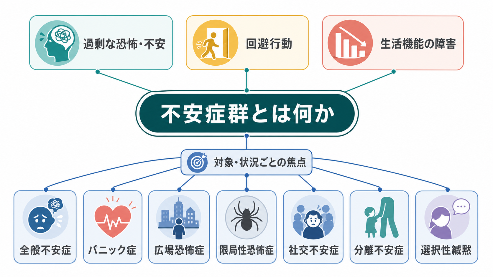
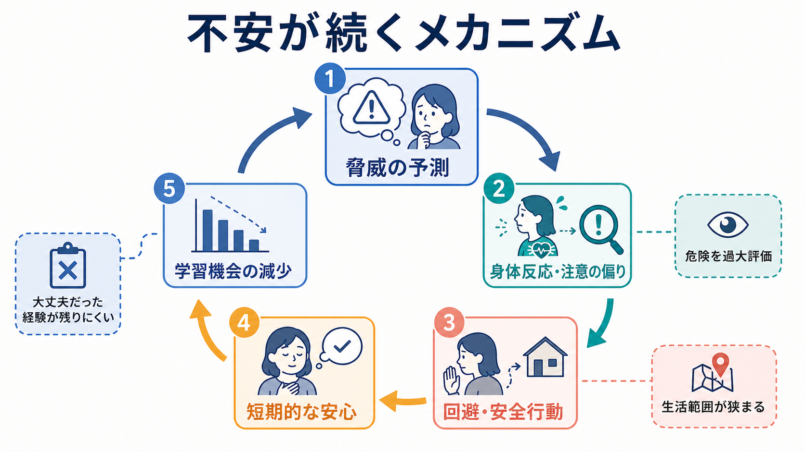
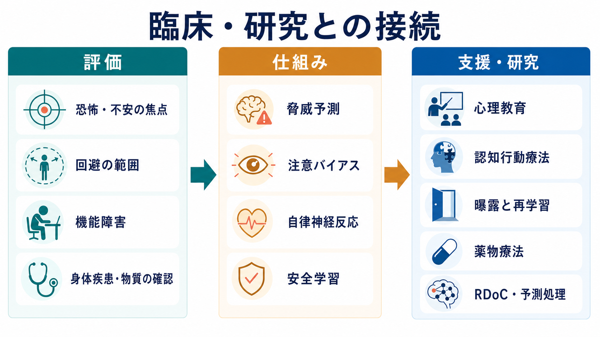

# 不安症群とは何か

## 要点

- 不安症群は、過剰な[[恐怖とは何か|恐怖]]や[[不安とは何か|不安]]、それに伴う[[回避行動とは何か|回避行動]]が持続し、生活・学業・仕事・対人関係を妨げる疾患群である[1][2]。
- DSM-5-TR と ICD-11 では細部は異なるが、全般不安症、パニック症、広場恐怖症、限局性恐怖症、社交不安症、分離不安症、選択性緘黙などが中心に置かれる[1][2]。
- 区別の鍵は「どの対象・状況を脅威として予測しているか」であり、症状の強さだけではなく、回避の範囲、持続、機能障害、身体疾患や物質の影響を評価する必要がある[1][3]。
- 回避や安全行動は短期的には安心をもたらすが、危険予測を検証する機会を減らし、不安を維持しやすい[3][5]。
- 本稿は教育・研究目的の概説であり、個別の診断や治療指示ではない。

## この記事で答える問い

1. 不安症群は、通常の不安や一時的な緊張と何が違うのか。
2. 不安症群にはどのような診断カテゴリーが含まれるのか。
3. なぜ不安、身体反応、注意、回避が悪循環を作るのか。
4. 臨床評価や研究では、どのような観点から不安症群を捉えるのか。

## まず結論

不安症群は「不安が強い人」という性格記述ではない。中核にあるのは、脅威の予測が過剰または柔軟性を失い、その予測に沿って注意、身体反応、解釈、回避がまとまり、生活の選択肢を狭めていくことである[3][7]。そのため、評価では「どの場面で不安になるか」だけでなく、「何を恐れているのか」「どのように避けているのか」「避けることで何が失われているのか」を見る。

## 背景

不安は、将来の危険に備えるための適応的な反応である。試験前に準備をする、体調変化に注意する、危険な場所を避けるといった反応は、状況によっては役に立つ。問題になるのは、不安や恐怖が状況に比べて過剰で、持続し、本人の行動範囲や役割遂行を狭める場合である[6][7]。

ICD-11 では「不安または恐怖関連症群」は、過剰な恐怖・不安と関連する行動上の障害により、個人・家族・社会・教育・職業などの重要領域に苦痛や機能障害をもたらすものとして整理される[1]。DSM-5-TR でも、不安症群は過剰な恐怖・不安と関連する行動障害を共有するカテゴリーとして扱われる[2]。この分類上の考え方は、[[症状と徴候は何が違うのか]]や[[精神症状の横断的評価とは何か]]で扱う「主観体験と観察可能な機能障害を合わせて読む」視点と接続する。

## 基本概念

### 恐怖と不安

恐怖は、比較的差し迫った脅威への反応として理解しやすい。たとえば目の前の危険、特定の動物、注射、他者からの注目などが引き金になる。一方、不安は、まだ起きていない出来事、曖昧な可能性、低確率だが重大に感じられる事態への予測として現れやすい[8]。ただし臨床では両者はしばしば重なり、[[予期不安とは何か|予期不安]]、身体感覚への警戒、回避行動として観察される。

### 代表的なカテゴリー

不安症群の代表的カテゴリーは、脅威の焦点によって整理できる。全般不安症では日常の多様な出来事への制御しにくい心配が中心になる。パニック症では[[パニック発作とは何か|パニック発作]]の再発やその結果への恐怖が問題になりやすい。広場恐怖症では逃げにくい、助けを得にくいと感じる場所や状況が焦点になる。限局性恐怖症では特定の対象や状況、社交不安症では他者から否定的に評価される可能性が焦点になる[1][2]。

| カテゴリー | 主な焦点 | 典型的に問題になること |
|---|---|---|
| 全般不安症 | 日常の複数領域の心配 | 心配の制御困難、緊張、疲労、睡眠問題 |
| パニック症 | 発作の再発や結果 | 身体感覚の監視、救急受診、発作を避ける行動 |
| 広場恐怖症 | 逃げにくい・助けが得にくい状況 | 交通機関、混雑、外出、単独行動の制限 |
| 限局性恐怖症 | 特定の対象・状況 | 動物、高所、血液・注射、飛行などの回避 |
| 社交不安症 | 否定的評価 | 発表、会食、雑談、対人場面の回避 |
| 分離不安症 | 愛着対象からの分離 | 離れることへの強い苦痛、単独行動の困難 |
| 選択性緘黙 | 特定場面で話すこと | 学校や社会場面での発話困難 |

## 仕組み

不安症群では、脅威を予測する認知、身体反応、注意の向き、行動選択が互いに強め合う。たとえば「ここで具合が悪くなったら逃げられない」と予測すると、心拍や息苦しさへの注意が増える。その感覚が「やはり危険だ」という証拠として読まれ、さらに不安が強まる。そこで場面を避けると短期的には安心するが、「実際には対処できたかもしれない」という反証経験が得られにくくなる[3][5]。

この悪循環は、[[恐怖条件づけとは何か|恐怖条件づけ]]や安全学習の問題としても理解できる。危険を知らせる手がかりが学習される一方で、その手がかりが常に危険ではないことを学ぶ機会が減ると、脅威予測は更新されにくい。[[認知バイアスとは何か|認知バイアス]]の観点では、曖昧な情報を危険寄りに解釈する、脅威手がかりに注意が偏る、身体感覚を破局的に解釈する、といった過程が不安を維持しうる[3][8]。

## 図解

上の2枚は、疾患群の全体像と維持メカニズムを示す。重要なのは、不安症群を「脳の一部の異常」だけに還元しないことである。扁桃体、前頭前野、海馬、自律神経系、HPA軸などの関与は研究されているが、実際の症状は、発達、学習、環境、身体疾患、生活史、文化的意味づけと組み合わさって現れる[3][8]。

## 臨床・研究との接続

臨床評価では、まず苦痛と機能障害の程度を確認する。次に、不安の焦点、回避の具体的パターン、発症時期、持続期間、併存する抑うつ・物質使用・身体疾患、薬剤やカフェインなどの影響を確認する[3][6]。発作や身体症状が前景に出る場合には、身体疾患を見逃さないことも重要である。

支援や治療研究では、心理教育、認知行動療法、曝露を含む再学習、薬物療法などが検討されてきた[5][6]。ただし、個別の治療選択は、症状の重症度、併存症、年齢、妊娠・授乳、薬剤リスク、本人の希望、利用可能な支援資源によって変わる。この記事では治療指示ではなく、評価と理解の枠組みを示すに留める。

研究面では、診断カテゴリーを横断して、不安を「潜在的脅威への反応」として測る発想もある。NIMH の RDoC では、潜在的脅威、不確実性、警戒、身体反応、行動、自己報告を複数レベルで扱う[8]。この視点は、診断名だけでは説明しきれない個人差を研究するうえで有用だが、臨床診断そのものを置き換えるものではない。

## よくある誤解

### 誤解1: 不安症群は「心が弱い」だけである

不安症群は、性格の弱さではなく、脅威予測、身体反応、注意、学習、回避、生活環境が組み合わさった状態である[3][7]。本人の努力不足として扱うと、評価や支援の入口を狭めてしまう。

### 誤解2: 避けなければすぐ治る

回避を急にやめることが常に安全で有効とは限らない。危険が現実にある場合もあり、強い症状がある場合には段階づけや環境調整が必要になる。重要なのは、回避を責めることではなく、何を避け、何を失い、どのような学習機会が閉じているのかを丁寧に見ることである[5][6]。

### 誤解3: 不安症群はすべて同じである

全般不安症、パニック症、社交不安症、限局性恐怖症では、焦点、時間経過、身体反応、回避の形が異なる[1][2]。診断名はラベルではなく、評価すべき問いを整理するための地図である。

### 誤解4: 身体症状があるなら精神医学の問題ではない

動悸、息苦しさ、胃腸症状、筋緊張、発汗、めまいなどは不安で起こりうるが、身体疾患や薬剤・物質の影響でも生じる。したがって、身体面の評価と精神症状の評価は対立せず、むしろ併せて行う必要がある[6][7]。

## 関連ノート

- [[不安とは何か]]
- [[恐怖とは何か]]
- [[予期不安とは何か]]
- [[回避行動とは何か]]
- [[パニック発作とは何か]]
- [[恐怖条件づけとは何か]]
- [[認知バイアスとは何か]]
- [[精神症状の横断的評価とは何か]]

今後の作成候補: `全般不安症とは何か`, `パニック症とは何か`, `広場恐怖症とは何か`, `限局性恐怖症とは何か`, `社交不安症とは何か`, `分離不安症とは何か`, `選択性緘黙とは何か`, `曝露療法とは何か`。

MOC更新候補: `content/00_MOC/MOC｜精神医学.md`, `content/00_MOC/MOC｜症候学.md`, `content/00_MOC/MOC｜臨床実践・治療.md`。並列編集を避けるため、本タスクでは MOC 本体は更新していない。

## 理解チェック

1. 通常の不安と不安症群を分けるとき、強度以外にどのような観点を確認するか。
2. パニック症と広場恐怖症では、恐れている焦点がどのように異なりうるか。
3. 回避行動が短期的な安心と長期的な維持の両方に関わる理由を説明できるか。
4. RDoC の「潜在的脅威」という見方は、診断カテゴリーとどのように補完し合うか。

## 未解決問題

- 不安症群の診断カテゴリーと、脅威予測・安全学習・身体感覚処理などの次元的指標を、どのように統合すれば臨床的に有用か。
- 回避や安全行動のどの部分が症状維持に強く関与し、どの部分が現実的な安全確保として必要なのかを、個別にどう見分けるか。
- 文化、発達段階、神経発達特性、身体疾患、社会的ストレスが、不安症群の表現型をどのように変えるか。
- デジタル計測や生理指標を、過剰診断や自己監視の増加につなげずに支援へ活かす方法。

## 参考文献

[1] World Health Organization. (2026). *ICD-11 for Mortality and Morbidity Statistics: Anxiety or fear-related disorders*. https://icd.who.int/browse/2026-01/mms/en#1336943699

[2] American Psychiatric Association. (2022). *Diagnostic and Statistical Manual of Mental Disorders, Fifth Edition, Text Revision (DSM-5-TR)*. https://doi.org/10.1176/appi.books.9780890425787

[3] Craske, M. G., Stein, M. B., Eley, T. C., Milad, M. R., Holmes, A., Rapee, R. M., & Wittchen, H.-U. (2017). Anxiety disorders. *Nature Reviews Disease Primers, 3*, 17024. https://doi.org/10.1038/nrdp.2017.24

[4] Stein, D. J., Scott, K. M., de Jonge, P., & Kessler, R. C. (2017). Epidemiology of anxiety disorders: From surveys to nosology and back. *Dialogues in Clinical Neuroscience, 19*(2), 127-136. https://doi.org/10.31887/DCNS.2017.19.2/dstein

[5] Bandelow, B., Michaelis, S., & Wedekind, D. (2017). Treatment of anxiety disorders. *Dialogues in Clinical Neuroscience, 19*(2), 93-107. https://doi.org/10.31887/DCNS.2017.19.2/bbandelow

[6] National Institute for Health and Care Excellence. (2011, updated 2020). *Generalised anxiety disorder and panic disorder in adults: Management (CG113)*. https://www.nice.org.uk/guidance/cg113

[7] National Institute of Mental Health. (2024). *Anxiety disorders*. https://www.nimh.nih.gov/health/topics/anxiety-disorders/index.shtml

[8] National Institute of Mental Health. (n.d.). *Definitions of the RDoC domains and constructs*. https://www.nimh.nih.gov/research/research-funded-by-nimh/rdoc/definitions-of-the-rdoc-domains-and-constructs
