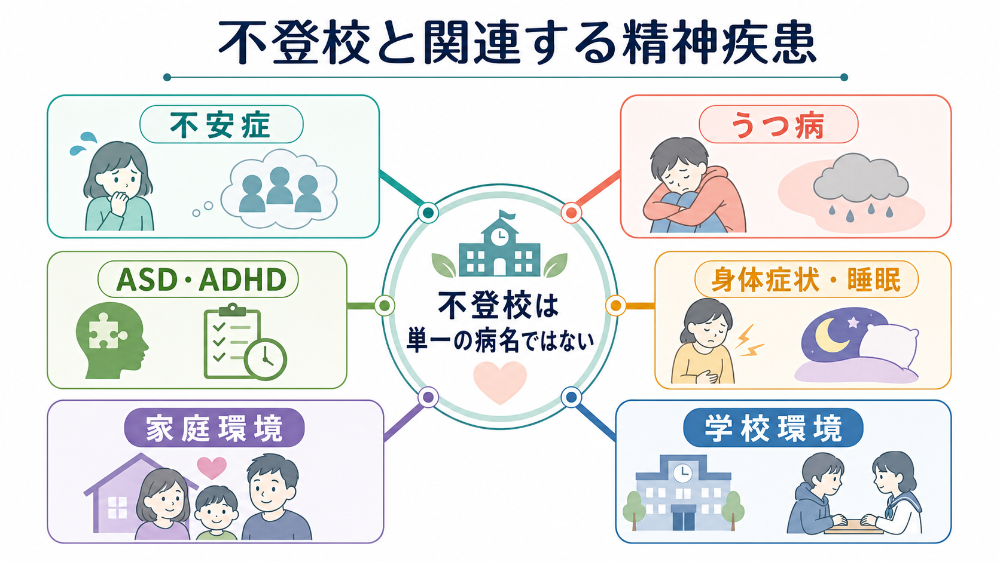
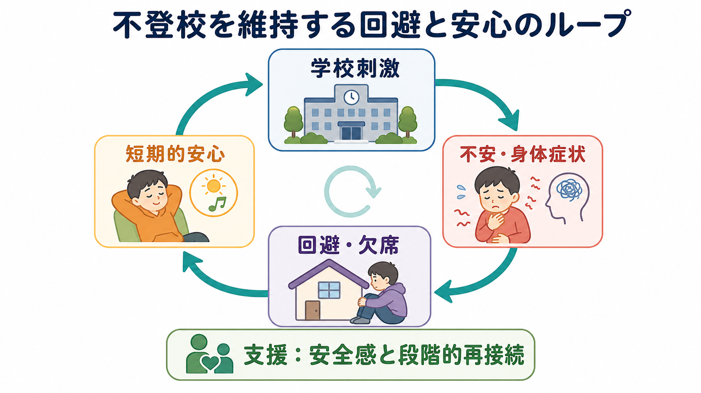
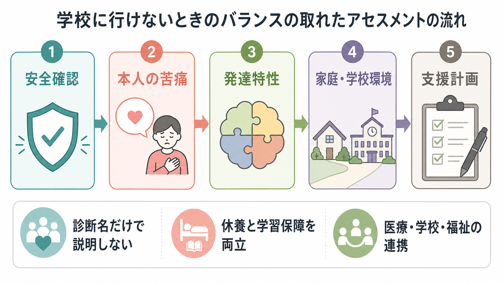

# 不登校に関連する精神疾患には何があるのか

## 要点

- 不登校は、それ自体が単一の精神疾患名ではない。文部科学省の調査では、心理的・情緒的・身体的・社会的要因を背景に年間30日以上登校しない、または登校したくてもできない状態として扱われる[1]。
- 関連しやすい精神疾患・状態には、[[不安症群とは何か|不安症群]]、[[分離不安症とは何か|分離不安症]]、社交不安、[[うつ病とは何か|うつ病]]、[[大うつ病性障害とは何か|大うつ病性障害]]、[[ADHDとは何か|ADHD]]、ASD、[[PTSDとは何か|PTSD]]、[[不眠障害とは何か|睡眠問題]]、身体症状がある。
- ただし「診断名があるから不登校になる」「不登校だから精神疾患である」とは言えない。家庭、学校、対人関係、いじめ、学業困難、感覚過敏、生活リズム、身体疾患が重なって、登校が維持できなくなる。
- 支援では、登校の可否だけで評価せず、安全確認、本人の苦痛、発達特性、家庭・学校環境、学習保障を同時に見る必要がある[2]。

## この記事で答える問い

この記事では、「不登校に関連する精神疾患には何があるのか」を、診断名のリストとしてではなく、児童青年精神医学的な見立ての地図として整理する。医療・教育・福祉で共有しやすいように、本人の苦痛、学校環境、家族関係、発達特性、身体症状を分けて考える。

## まず結論

不登校に関連する精神疾患として最も頻繁に問題になるのは、不安症とうつ病である。学校場面での評価、友人関係、分離、失敗予期、身体症状が強いと、登校そのものが強い脅威として経験される。臨床研究でも、学校拒否行動は診断的にかなり不均一であり、不安関連診断、分離不安、抑うつ、反抗挑発的な行動、診断閾値に満たない苦痛が混在することが示されている[4]。

一方で、ASDやADHDなどの神経発達症も重要である。感覚過敏、集団場面の負荷、曖昧な対人ルール、実行機能の困難、読み書き・学習のつまずきが続くと、学校は「努力すれば行ける場所」ではなく、慢性的な過負荷の場になる。ASDと学校不参加に関するレビューでは、いじめ、不安の併存、学校側の理解不足が重要な背景として整理されている[7]。

## 背景

日本では小・中学校の不登校児童生徒数が増加しており、令和6年度調査では約35.4万人と報告されている[1]。この数字は医療診断の人数ではなく、教育行政上の状態像を示す。したがって、不登校を見たときに最初に問うべきことは「どの病名か」だけではなく、「何が登校を難しくし、何が休むことで一時的に軽くなっているのか」である。

文部科学省のCOCOLOプランは、不登校支援を「学校復帰」だけに狭めず、多様な学びの場、校内教育支援センター、教育支援センター、オンライン支援、医療・福祉との連携を含めて位置づけている[2]。これは、医学的には「症状を減らす」、教育的には「学びを保障する」、福祉的には「生活と家族を支える」という複数の目的を同時に扱う必要があることを意味する。

## 基本概念

### 不登校は病名ではなく状態像である

不登校は、精神疾患の診断名ではない。小児心身医学の解説でも、不登校の原因は多岐にわたり、必ずしも医学的原因があるとは限らず、身体疾患、精神疾患、神経発達症、家庭環境、学校環境の鑑別が必要とされる[3]。

この区別は実践上重要である。病名だけで説明すると、学校の環境調整や学習保障が見落とされる。逆に「環境の問題だけ」と考えると、強い不安、抑うつ、自傷リスク、睡眠障害、摂食の問題、トラウマ反応を見逃す。

### 関連しやすい精神疾患・状態

| 領域 | 関連しやすい状態 | 見立てのポイント |
|---|---|---|
| 不安症 | 分離不安、社交不安、全般不安、パニック症状 | 学校場面、評価場面、対人場面、朝の身体症状で悪化しやすい |
| 抑うつ | うつ病、大うつ病性障害、適応反応 | 意欲低下、睡眠変化、希死念慮、自己否定、疲労感を見る |
| 神経発達症 | ASD、ADHD、限局性学習症、知的発達症 | 感覚過敏、実行機能、学習困難、集団適応、二次障害を見る |
| トラウマ・ストレス | PTSD、いじめ被害、虐待、家庭内葛藤 | 安全確認を優先し、本人が語れない被害を想定する |
| 身体・睡眠 | 起立性調節障害、頭痛、腹痛、不眠、概日リズムの乱れ | 「仮病」と決めつけず、身体評価と生活リズムを確認する |
| 行動・依存 | 反抗挑発症、ゲーム行動症、昼夜逆転 | 背景に不安、抑うつ、孤立、報酬環境がないかを見る |

## 仕組み

### 回避は短期的には楽にするが、長期的には負荷を増やす

不安が強い子どもにとって、学校を休むことは短期的には安心をもたらす。朝の腹痛、吐き気、動悸、泣き、パニック、強い疲労が軽くなるため、「行かないと楽になる」という学習が起こりやすい。学校拒否行動の機能分析モデルでは、学校関連の不快刺激を避ける、社会的・評価的場面から逃れる、重要な他者の注意を得る、学校外の報酬を得る、といった複数の機能が区別される[4]。

しかし欠席が続くと、授業の遅れ、友人関係の不安、先生との連絡負担、家族の疲弊、生活リズムの乱れが積み重なる。結果として、最初の理由が小さく見えても、再登校のハードルは時間とともに上がりやすい。心理社会的介入のメタ分析でも、学校拒否への支援では不安だけでなく出席・参加の回復をアウトカムとして扱う必要が示されている[5]。

### 「本人の問題」と「環境の問題」を分けすぎない

不登校の見立てでは、本人の症状と環境要因を対立させないことが大切である。生態学的レビューでは、学校拒否は不安症状だけでなく、学業、対人関係、教師との関係、家庭、より広い社会的文脈の要因と関連することが整理されている[6]。

たとえば社交不安がある子どもに、発表、ペアワーク、昼食、体育、休み時間が重なると、学校の一日全体が評価場面になる。ASD特性がある子どもに、騒音、急な予定変更、暗黙のルール、いじめが重なると、学校は予測不能で危険な環境になる。ADHD特性がある子どもに、忘れ物叱責、課題未提出、遅刻、衝動的な対人トラブルが重なると、自己効力感が急速に低下する。

## 図解

以下の図は、実際の支援で確認する順番を単純化したものである。最初に安全確認を置くのは、自傷、虐待、いじめ、家庭内暴力、深刻な抑うつを見逃さないためである。そのうえで、本人の苦痛、発達特性、家庭・学校環境、学習保障を同時に検討する。

## 臨床・研究との接続

臨床では、まずリスク評価を行う。希死念慮、自傷、摂食不良、急激な体重減少、睡眠の著しい乱れ、虐待・いじめの疑い、家庭内暴力、精神病症状があれば、登校目標より安全確保を優先する。うつ病については、児童青年では気分の落ち込みだけでなく、いらだち、興味の低下、睡眠・食欲の変化、集中困難、自己否定、希死念慮を含めて評価する必要がある[8]。

次に、欠席の機能を具体化する。「朝だけ無理なのか」「校門までは行けるのか」「特定の授業・教師・同級生が関係するのか」「家では元気なのか」「休日はどうか」「オンラインなら参加できるのか」を分けて聞く。これにより、単なる登校刺激への暴露ではなく、安全な足場を作りながら段階的に再接続する計画が立てやすくなる。

研究上は、不登校を一つの診断群として扱うよりも、学校出席問題、学校拒否、怠学、排除、保護者による家庭内保持、慢性欠席を区別する方向に進んでいる。臨床的には、本人の苦痛が強い学校拒否と、学校外報酬や家庭・地域の構造が強い欠席では、支援の重点が異なる。

## よくある誤解

### 「甘え」や「怠け」と考えればよい

これは危険な単純化である。不登校には本人の不安、抑うつ、発達特性、身体症状、いじめ、家庭環境が関係しうる。叱責や強制だけでは、短期的に登校しても、長期的には不安、自己否定、家族関係の悪化を強めることがある。

### 診断名が付けば原因がわかる

診断名は重要だが、十分ではない。たとえば「不安症」と診断されても、何が怖いのか、どの場面で悪化するのか、学校側で何を調整できるのかは別に評価する必要がある。診断は地図の一部であり、支援計画そのものではない。

### 休ませるか登校させるかの二択である

実際には、完全休養、短時間登校、別室登校、オンライン参加、教育支援センター、家庭学習、医療・福祉支援を組み合わせる。重要なのは「休むこと」と「学び・対人・生活の足場を失わないこと」を対立させないことである[2]。

### 家庭環境を見れば親のせいだとわかる

家庭環境の評価は、責任追及ではなく支援資源を増やすために行う。保護者も疲弊、不安、孤立、仕事との両立困難を抱えやすい。学校、医療、福祉がばらばらに助言すると家庭の負担が増えるため、情報共有と役割分担が必要である。

## 関連ノート

- [[不安症群とは何か]]
- [[分離不安症とは何か]]
- [[全般不安症とは何か]]
- [[パニック症とは何か]]
- [[不安症とうつ病はどう併存するのか]]
- [[うつ病とは何か]]
- [[大うつ病性障害とは何か]]
- [[ADHDとは何か]]
- [[ASDは脳ネットワークの違いとして理解できるのか]]
- [[PTSDとは何か]]
- [[不眠障害とは何か]]
- [[ゲーム行動症とは何か]]
- [[反抗挑発症とは何か]]

MOC更新候補: [[MOC｜精神医学]]、[[MOC｜発達・愛着・社会心理]]、[[MOC｜臨床実践・治療]]

## 理解チェック

1. 不登校を精神疾患名そのものとして扱うと、どのような見落としが起こりやすいか。
2. 不安症、うつ病、神経発達症が不登校に関わるとき、それぞれ学校場面でどのような負荷として現れうるか。
3. 「休ませるか登校させるか」の二択ではなく、どのような中間的支援が考えられるか。
4. 安全確認を最初に置く理由は何か。

## 未解決問題

- 不登校の背景にある精神疾患、発達特性、環境要因を、学校現場で過不足なく評価する標準的手順はまだ十分に共有されていない。
- ASDやADHDのある子どもの不登校について、どの学校環境調整が長期的な出席、学習、心理的安全に最も有効かは、さらに研究が必要である。
- 「出席日数」だけではなく、本人の安全感、学習参加、睡眠、家族負担、社会的孤立を含むアウトカム設計が必要である。

## 参考文献

[1] 文部科学省. 児童生徒の問題行動・不登校等生徒指導上の諸課題に関する調査. 令和6年度調査結果. https://www.mext.go.jp/a_menu/shotou/seitoshidou/1302902.htm

[2] 文部科学省. 不登校対策（COCOLOプラン等）について. https://www.mext.go.jp/a_menu/shotou/seitoshidou/1397802_00005.htm

[3] 一般社団法人日本小児心身医学会. 不登校. https://www.jisinsin.jp/general/typical_diseases/%E4%B8%8D%E7%99%BB%E6%A0%A1/

[4] Kearney, C. A., & Albano, A. M. (2004). The functional profiles of school refusal behavior: Diagnostic aspects. *Behavior Modification*, 28(1), 147-161. https://doi.org/10.1177/0145445503259263

[5] Maynard, B. R., Heyne, D., Esposito Brendel, K., Bulanda, J. J., Thompson, A. M., & Pigott, T. D. (2018). Treatment for school refusal among children and adolescents: A systematic review and meta-analysis. *Research on Social Work Practice*, 28(1), 56-67. https://doi.org/10.1177/1049731515598619

[6] Leduc, K., Tougas, A. M., & Boulanger, M. (2022). School refusal in youth: A systematic review of ecological factors. *Child Psychiatry & Human Development*. https://pmc.ncbi.nlm.nih.gov/articles/PMC9686247/

[7] Escoffier, C., Rousselon-Charles, V., Dubreucq, J., et al. (2025). School refusal: What if it’s an autism spectrum disorder? A scoping review. *Current Psychology*, 44, 6170-6189. https://doi.org/10.1007/s12144-025-07593-6

[8] National Institute for Health and Care Excellence. (2019). *Depression in children and young people: identification and management* (NICE guideline NG134). https://www.nice.org.uk/guidance/ng134
