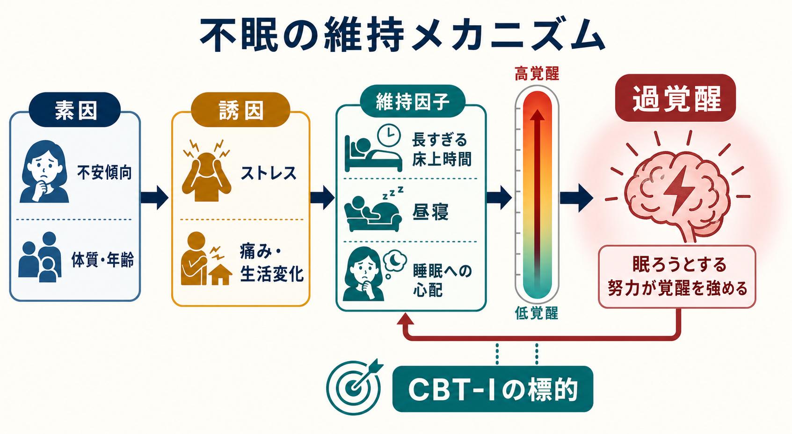

# 不眠障害とは何か

## 要点

- 不眠障害は、単に「睡眠時間が短い」状態ではなく、入眠困難・中途覚醒・早朝覚醒などの夜間症状と、疲労、集中困難、気分の不調、生活・仕事・学業上の支障などの日中機能障害が結びついた状態である[1][2]。
- 慢性不眠障害では、症状が十分な睡眠機会のもとで週3回以上、3か月以上続くことが診断上の重要な目安になる[1][2]。
- 仕組みとしては、素因・誘因・維持因子を区別する「3Pモデル」と、認知的・身体的・皮質性の過覚醒が重要な説明枠組みになる[4][5]。
- 治療・支援では、個別の診断や治療指示としてではなく、教育・研究上の整理として、認知行動療法、とくに CBT-I が第一選択として推奨される点を理解しておくとよい[6][7]。

## この記事で答える問い

1. 不眠障害は、普通の寝不足や一時的な眠れなさと何が違うのか。
2. 入眠困難・中途覚醒・早朝覚醒は、どのように日中機能障害へつながるのか。
3. なぜ「眠ろうとする努力」が、かえって不眠を維持することがあるのか。
4. 臨床評価や研究では、不眠障害をどのように整理すればよいのか。

## まず結論

不眠障害は、「夜に眠れない」という主観的苦痛だけで定義されるのではない。中心にあるのは、十分な睡眠機会があるにもかかわらず、入眠困難、睡眠維持困難、早朝覚醒が繰り返され、その結果として日中の注意、記憶、気分、意欲、社会的・職業的機能が損なわれるという組み合わせである[1][2]。

したがって、評価では「何時間眠ったか」だけでなく、「眠る機会はあったか」「眠れなさが週にどの程度あるか」「3か月以上続いているか」「日中にどの機能がどの程度損なわれているか」「他の睡眠障害、身体疾患、精神疾患、薬剤・物質で説明できないか」を確認する必要がある[2]。この発想は、[[精神科初診で何を確認するべきか]]、[[現病歴はどのように構造化するべきか]]、[[鑑別診断とは何か]]で扱う評価の基本とつながる。

## 背景

不眠は非常にありふれた訴えであり、成人のおよそ10%が不眠障害に該当し、さらに約20%が時々の不眠症状を経験するとされる[3]。ただし、ありふれていることは軽いという意味ではない。慢性化した不眠は、疲労、注意・記憶の低下、気分の不調、事故リスク、生活の質の低下と関係し、身体疾患や精神疾患の経過とも相互に影響しうる[3][8]。

以前は「一次性不眠」「二次性不眠」のように、原因疾患があれば二次性として分ける考え方が強かった。しかし現在の診断枠組みでは、うつ病、不安症、疼痛、身体疾患などが併存していても、不眠そのものが独立した臨床的注意を要する場合があると考える。つまり、不眠は「別の問題のおまけ」として見過ごすのではなく、生活機能に影響する症候群として評価する必要がある[2][8]。

## 基本概念

### 夜間症状

不眠障害の夜間症状は、主に次の3つに整理できる[1][2]。

| 症状 | 内容 | 評価で見る点 |
|---|---|---|
| 入眠困難 | 寝床に入ってもなかなか眠れない | 就床時刻、入眠潜時、寝床での心配、スマートフォン使用、カフェインなど |
| 中途覚醒 | 夜間に何度も目が覚める、再入眠しにくい | 覚醒回数、覚醒時間、痛み、夜間頻尿、睡眠時無呼吸、悪夢など |
| 早朝覚醒 | 予定より早く目覚め、再び眠れない | 起床時刻、気分症状、概日リズム、加齢、生活スケジュールなど |

重要なのは、これらが本人の主観的な睡眠困難として経験される点である。睡眠ポリグラフ検査などの客観指標は鑑別に役立つことがあるが、不眠障害の通常評価では、臨床面接、睡眠日誌、質問紙が中心になる[2]。尺度を使う場合も、数値だけで診断するのではなく、[[精神科診断面接で尺度をどう使うか]]や[[心理尺度はどのように作られるのか]]で扱うように、面接情報と組み合わせて解釈する。

### 日中機能障害

不眠障害では、夜間症状に加えて日中の支障が必要である[1][2]。典型的には、疲労感、集中困難、記憶の低下、意欲低下、気分の落ち込みやいらだち、仕事・学業・家事の効率低下、事故やミスへの不安が挙げられる。

ここで注意したいのは、「眠い」と「疲れている」は同じではないことである。不眠では、強い疲労感があっても日中に眠れない、眠ろうとしても頭が冴えてしまう、という形をとることがある。これは過覚醒モデルと整合的であり、単純な睡眠不足だけでは説明しきれない[5]。

### 慢性不眠障害の目安

慢性不眠障害では、一般に次の条件が重要になる[1][2]。

| 軸 | 内容 |
|---|---|
| 頻度 | 週3回以上 |
| 持続 | 3か月以上 |
| 条件 | 十分な睡眠機会と適切な睡眠環境がある |
| 影響 | 日中の苦痛または機能障害がある |
| 鑑別 | 他の睡眠障害、身体疾患、精神疾患、薬剤・物質の影響を評価する |

この基準は、短い睡眠時間そのものを病理化するためのものではない。短時間睡眠でも日中機能が保たれている人もいれば、睡眠時間が極端に短くなくても、強い不眠感と日中機能障害を示す人もいる。臨床的には、本人の苦痛、機能、経過、生活文脈を合わせて判断する。

## 仕組み

### 3Pモデル

不眠の代表的な心理行動モデルに、Spielman らの 3P モデルがある[4]。これは、不眠を「素因」「誘因」「維持因子」に分けて考える。

| 要素 | 例 | 役割 |
|---|---|---|
| 素因 | 不安傾向、睡眠反応性、年齢、遺伝的脆弱性、慢性疾患 | 不眠になりやすい土台を作る |
| 誘因 | ストレス、疼痛、生活変化、喪失、勤務変化 | 急性の眠れなさを引き起こす |
| 維持因子 | 長すぎる床上時間、昼寝、寝床での心配、睡眠への過度な努力 | 誘因が弱まった後も不眠を続かせる |

このモデルの利点は、「最初の原因」と「今も続いている理由」を分けられることにある。たとえば、最初は仕事上のストレスで眠れなくなったとしても、数か月後には、寝床で時計を見る、早めに寝床に入る、日中の活動を減らす、昼寝を増やす、といった補償行動が不眠を維持している場合がある[4]。この区別は、[[生物心理社会モデルとは何か]]の視点とも相性がよい。

### 過覚醒モデル

不眠障害は、しばしば過覚醒の障害として理解される[5]。過覚醒には、少なくとも次の層がある。

| 層 | 例 |
|---|---|
| 認知的過覚醒 | 「眠れなかったら明日だめになる」という反復思考、時計確認、睡眠への過度な注意 |
| 情動的過覚醒 | 不安、焦り、失敗感、いらだち |
| 身体的過覚醒 | 筋緊張、心拍亢進、胃腸症状、リラックス困難 |
| 皮質性過覚醒 | EEG 高周波活動などで議論される脳活動水準の上昇 |

「眠らなければ」と努力するほど、睡眠が達成課題になり、覚醒が高まることがある。この逆説が、不眠の中心的な難しさである。寝床は本来、眠気と結びつく手がかりだが、長く覚醒したまま過ごすと、寝床そのものが心配・覚醒・失敗予期と結びつく。これが条件づけられた覚醒であり、CBT-I の刺激制御や睡眠制限が標的にする部分である[6]。

## 図解

### 図解1：不眠障害の概念地図

1枚目の図は、不眠障害を「夜の症状」「日中機能障害」「診断の軸」に分けている。入眠困難・中途覚醒・早朝覚醒だけではなく、それが集中困難、疲労感、気分の不調などに結びつく点を中心に読む。

### 図解2：不眠の維持メカニズム

2枚目の図は、3Pモデルと過覚醒を結びつけたものである。誘因としてのストレスが消えても、長すぎる床上時間、昼寝、睡眠への心配が残ると、寝床と覚醒の結びつきが強まり、不眠が維持される。

## 臨床・研究との接続

### 評価

診断・評価では、睡眠だけを切り出さず、生活全体の時間構造を確認する。就床時刻、起床時刻、昼寝、休日の睡眠、勤務形態、カフェイン・アルコール、運動、画面使用、疼痛、夜間頻尿、服薬、気分症状、不安、トラウマ、物質使用を整理する。これは[[現病歴はどのように構造化するべきか]]で扱う時系列評価に近い。

欧州ガイドラインでは、診断手続きとして臨床面接、睡眠・医学的既往、質問紙、睡眠日誌を重視し、アクチグラフィや睡眠ポリグラフ検査は routine に全例で行うものではなく、鑑別や治療抵抗例などで適応を考えると整理している[2]。

### 鑑別

不眠を訴える人では、少なくとも次の鑑別を考える。

| 鑑別対象 | 不眠との見分けで重要な点 |
|---|---|
| 睡眠関連呼吸障害 | いびき、無呼吸、日中の強い眠気、肥満、高血圧 |
| むずむず脚症候群 | 下肢の不快感、動かすと軽減、夕方から夜に悪化 |
| 概日リズム睡眠・覚醒障害 | 眠れない時刻と起きられない時刻が一貫してずれている |
| うつ病・不安症 | 気分、興味、希死念慮、不安発作、反復思考 |
| 薬剤・物質 | カフェイン、アルコール、刺激薬、ステロイド、離脱症状 |
| 疼痛・身体疾患 | 夜間疼痛、呼吸困難、頻尿、かゆみ、内分泌疾患 |

鑑別は「どれか一つを選ぶ」作業ではない。不眠障害と他疾患は併存しうる。したがって、[[精神科診断における除外診断とは何か]]で扱うように、説明可能性と併存可能性を分けて考える必要がある。

### 介入研究

慢性不眠障害に対しては、CBT-I が第一選択として複数のガイドラインで推奨されている[6][7]。CBT-I は単なる睡眠衛生指導ではなく、刺激制御、睡眠制限、認知的介入、リラクセーション、睡眠教育などを組み合わせる多要素介入である[6]。

薬物療法は有用な場合があるが、長期使用の利益・害、依存、転倒、翌日への持ち越し、併存疾患との相互作用を考える必要がある。ACP ガイドラインは、CBT-I を初期治療とし、効果不十分な場合に薬物療法の利益・害・費用を共有意思決定で検討することを推奨している[7]。この記事は教育・研究目的の整理であり、個別の服薬開始・中止を指示するものではない。

## よくある誤解

### 誤解1：眠れない日はすべて不眠障害である

一時的なストレスで数日眠れないことは珍しくない。不眠障害として問題になるのは、十分な睡眠機会があるのに、睡眠困難と日中機能障害が反復し、慢性化している場合である[1][2]。

### 誤解2：睡眠時間が短いほど重症である

睡眠時間は重要な情報だが、それだけでは重症度を判断できない。本人の苦痛、日中機能、睡眠機会、生活リズム、併存疾患、睡眠へのとらわれを合わせて見る必要がある。

### 誤解3：睡眠衛生を守れば必ず治る

睡眠衛生は土台として重要だが、慢性不眠障害ではそれだけでは不十分なことが多い。寝床と覚醒の条件づけ、睡眠への心配、長すぎる床上時間などが維持因子になっている場合、CBT-I のような構造化された介入が必要になることがある[6]。

### 誤解4：不眠は他の精神疾患の付随症状にすぎない

不眠はうつ病や不安症と併存しやすいが、それだけで「本丸ではない」とみなすべきではない。不眠が独自に苦痛と機能障害を生み、併存疾患の経過にも影響する可能性がある[8]。

## 関連ノート

- [[精神科初診で何を確認するべきか]]
- [[現病歴はどのように構造化するべきか]]
- [[鑑別診断とは何か]]
- [[精神科診断における除外診断とは何か]]
- [[精神科診断面接で尺度をどう使うか]]
- [[心理尺度はどのように作られるのか]]
- [[生物心理社会モデルとは何か]]

### MOC更新候補

- [[MOC｜精神医学]]
- [[MOC｜臨床実践・治療]]
- [[MOC｜総論・診断・面接]]

### 今後の作成候補

- 睡眠日誌とは何か
- CBT-Iとは何か
- 概日リズム睡眠・覚醒障害とは何か
- むずむず脚症候群とは何か
- 睡眠関連呼吸障害とは何か

## 理解チェック

1. 不眠障害の診断で、夜間症状だけでなく日中機能障害を確認するのはなぜか。
2. 入眠困難、中途覚醒、早朝覚醒は、それぞれどのような生活・身体・心理要因と結びつきうるか。
3. 3Pモデルでいう「誘因」と「維持因子」はどう違うか。
4. 「眠ろうとする努力」が不眠を維持する場合、どのような過覚醒や条件づけが考えられるか。
5. 不眠を訴える人で、睡眠時無呼吸、概日リズム障害、うつ病、不安症、薬剤・物質の影響を確認する理由は何か。

## 参考文献

[1] National Center for Biotechnology Information. *Introduction - Management of Insomnia Disorder*. NCBI Bookshelf. https://www.ncbi.nlm.nih.gov/books/NBK343490/

[2] Riemann, D., Espie, C. A., Altena, E., et al. (2023). The European Insomnia Guideline: An update on the diagnosis and treatment of insomnia 2023. *Journal of Sleep Research*, 32(6), e14035. https://doi.org/10.1111/jsr.14035

[3] Morin, C. M., & Jarrin, D. C. (2022). Epidemiology of Insomnia: Prevalence, Course, Risk Factors, and Public Health Burden. *Sleep Medicine Clinics*, 17(2), 173-191. https://doi.org/10.1016/j.jsmc.2022.03.003

[4] Spielman, A. J., Caruso, L. S., & Glovinsky, P. B. (1987). A behavioral perspective on insomnia treatment. *Psychiatric Clinics of North America*, 10(4), 541-553. https://doi.org/10.1016/S0193-953X(18)30532-X

[5] Levenson, J. C., Kay, D. B., & Buysse, D. J. (2015). The pathophysiology of insomnia. *Chest*, 147(4), 1179-1192. https://doi.org/10.1378/chest.14-1617

[6] Edinger, J. D., Arnedt, J. T., Bertisch, S. M., et al. (2021). Behavioral and psychological treatments for chronic insomnia disorder in adults: an American Academy of Sleep Medicine clinical practice guideline. *Journal of Clinical Sleep Medicine*, 17(2), 255-262. https://pmc.ncbi.nlm.nih.gov/articles/PMC7853203/

[7] Qaseem, A., Kansagara, D., Forciea, M. A., Cooke, M., & Denberg, T. D. (2016). Management of Chronic Insomnia Disorder in Adults: A Clinical Practice Guideline From the American College of Physicians. *Annals of Internal Medicine*, 165(2), 125-133. https://doi.org/10.7326/M15-2175

[8] Buysse, D. J. (2013). Insomnia. *JAMA*, 309(7), 706-716. https://doi.org/10.1001/jama.2013.193

## 未解決問題

- 不眠障害のサブタイプを、症状型、過覚醒、睡眠反応性、併存疾患、治療反応性のどの軸で分けるのが最も有用か。
- デジタル CBT-I を、対面治療、薬物療法、プライマリケア、産業保健の中でどう組み込むべきか。
- 睡眠客観指標と主観的不眠感のずれを、臨床的にどのように説明し、治療計画に反映するべきか。
