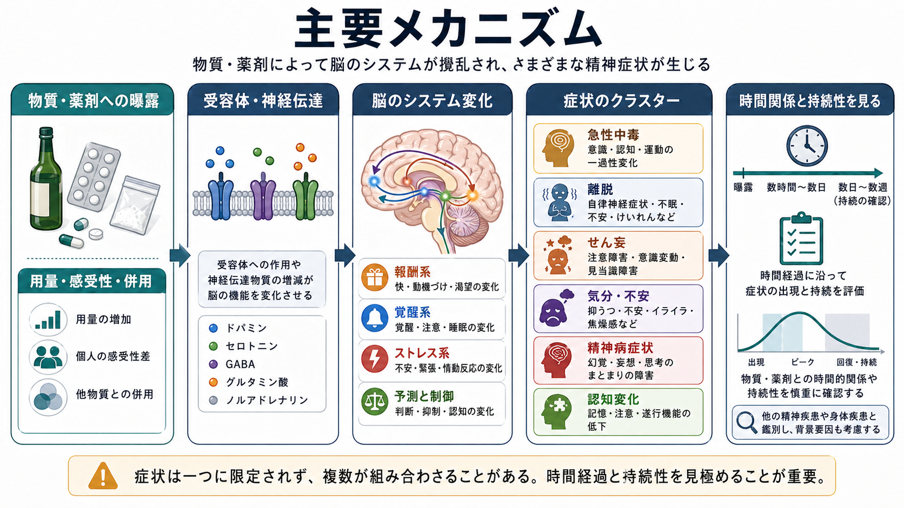
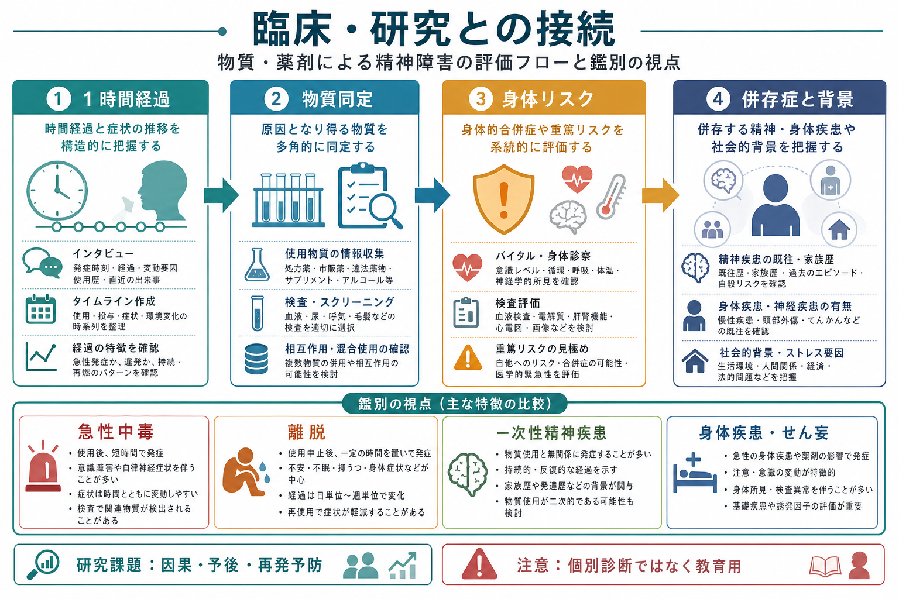

# 中毒性精神障害とは何か

## 要点

- 中毒性精神障害は、物質・薬剤の使用、過量、相互作用、中止・減量によって、意識、認知、気分、知覚、行動、自律神経機能が変化する状態を広く指す。
- 分類上は、急性中毒、離脱、離脱せん妄、物質・医薬品誘発性の精神病・気分症状・不安症状・認知障害などに分けて考えると整理しやすい [1][2]。
- 診断名を急いで固定するより、まず「時間関係」「原因となり得る物質」「身体リスク」「一次性精神疾患や身体疾患との鑑別」を見ることが重要である [3][4]。
- 本記事は教育・研究目的の整理であり、個別の診断や治療指示ではない。

## この記事で答える問い

1. 「中毒性精神障害」とは、[[アルコール使用障害とは何か]]や[[オピオイド使用障害とは何か]]のような依存症と何が違うのか。
2. 急性中毒、離脱、[[物質誘発性精神病とは何か]]、[[薬剤性精神病とは何か]]、[[薬剤性うつ症状とは何か]]は、どのように同じ地図の上で理解できるのか。
3. 臨床・研究では、どのような視点で一次性精神疾患、[[器質性精神病とは何か]]、[[認知症とは何か]]、せん妄と区別するのか。

## まず結論

中毒性精神障害は、「悪い薬物を使った人にだけ起こる特殊な精神症状」ではない。アルコール、鎮静薬、刺激薬、大麻、オピオイド、カフェイン、抗コリン薬、ステロイドなど、合法・違法、処方薬・市販薬を問わず、脳と身体に作用する物質によって起こり得る状態である [1][3]。

重要なのは、症状名だけでなく、症状が「いつ」「何の後に」「どのくらい続き」「身体所見や検査所見とどう対応するか」を追うことである。たとえば不眠、焦燥、幻覚、抑うつ、意識混濁は、[[うつ病とは何か]]、[[不安症群とは何か]]、[[双極性障害とは何か]]、[[初回エピソード精神病とは何か]]でも見られる。しかし、物質使用・中止・増量・併用との時間的関係が明瞭であれば、中毒性の機序を優先して考える必要がある [3][6]。

## 背景

DSM-5-TR では、物質関連障害を「物質使用症」と「物質誘発性障害」に大きく分ける。前者は使用のコントロール困難、役割障害、危険使用、耐性・離脱などの持続的パターンを評価する。一方、後者は中毒、離脱、物質・医薬品誘発性精神障害など、物質の生理作用に伴って出現する症候群を扱う [1]。

ICD-10 の F10-F19 も、精神作用物質による精神・行動の障害を、急性中毒、依存症候群、離脱状態、離脱せん妄、精神病性障害、健忘症候群、残遺性・遅発性精神病性障害などに分ける。急性中毒は、意識水準、認知、知覚、気分、行動、その他の精神生理機能の障害として記述される [2]。

この分類の価値は、「依存症かどうか」と「いま出ている精神症状が物質の直接作用かどうか」を分けて考えられる点にある。処方薬を短期間使った後の離脱様症状や、医療上必要な薬剤による一過性の精神症状は、必ずしも物質使用症を意味しない [4]。

## 基本概念

### 急性中毒

急性中毒は、物質を摂取した後に生じる可逆的な精神・行動変化である。知覚変化、多幸感、認知障害、判断力低下、気分不安定、攻撃性、眠気、運動失調、呼吸抑制、自律神経症状などが、物質ごとの薬理作用に応じて現れる [2][4]。

ここでの「中毒」は、日常語の「依存している」という意味ではなく、急性の薬理作用による状態変化を指す。したがって、急性中毒は物質使用症がなくても起こり得る。

### 離脱

離脱は、持続的に使用していた物質を中止・減量した後に生じる、身体・認知・行動の変化である。[[アルコール離脱とは何か]]では不眠、振戦、不安、自律神経亢進、けいれん、[[振戦せん妄とは何か]]が問題になり、鎮静薬やオピオイド、刺激薬でも物質ごとに異なる離脱像が見られる [2][4]。

離脱は「物質が抜けたから正常に戻る」だけではなく、脳が物質存在下に適応していた状態から急に外れることで、反跳的な過覚醒、ストレス系の亢進、報酬系の低下が表面化する過程として理解できる [5]。

### 物質・医薬品誘発性精神障害

物質・医薬品誘発性精神障害は、物質使用や離脱に伴って、独立した精神疾患に似た症状が生じる状態である。DSM-5-TR では、精神病症状、双極・抑うつ症状、不安症状、強迫症状、睡眠障害、性機能障害、せん妄、神経認知障害などが、物質・医薬品誘発性の枠組みで扱われる [1][3]。

ポイントは、症状の形だけでは一次性疾患と区別できないことが多い点である。たとえば幻覚・妄想があれば[[物質誘発性精神病とは何か]]を考えるが、同時に[[初回エピソード精神病とは何か]]、[[急性一過性精神病性障害とは何か]]、身体疾患、せん妄も検討する必要がある [6][7]。

## 仕組み

物質や薬剤は、神経伝達物質、受容体、トランスポーター、ホルモン系、自律神経系に作用する。作用点は物質によって異なるが、精神症状として現れるときには、おおむね次の回路が問題になる。

| 系 | 関連する変化 | 症状としての出方 |
|---|---|---|
| 報酬系 | ドパミン、内因性オピオイド、カンナビノイド、GABA、グルタミン酸系の変化 | 多幸感、渇望、快感低下、意欲低下 |
| 覚醒系 | ノルアドレナリン、ヒスタミン、アセチルコリン、GABA 系の変化 | 眠気、不眠、焦燥、注意障害、意識変容 |
| ストレス系 | 扁桃体、HPA 軸、自律神経反応の変化 | 不安、易刺激性、発汗、動悸、離脱時の苦痛 |
| 予測と制御 | 前頭前野、線条体、サリエンスネットワークの変化 | 判断力低下、衝動性、病識低下、再使用リスク |

NIDA の解説では、薬物は神経伝達の送受信や処理を乱し、報酬回路、拡張扁桃体、前頭前野などに影響する。反復使用では報酬への感受性低下、ストレス反応の増大、自己制御の低下が組み合わさり、[[依存症における渇望とは何か]]や再使用リスクにもつながる [5]。

ただし、この記事で扱う中毒性精神障害は依存症だけに限られない。抗コリン薬による[[抗コリン性せん妄とは何か]]、ステロイドによる[[ステロイド精神病とは何か]]、処方薬の相互作用、腎機能・肝機能低下による薬物濃度上昇なども、同じ「物質が脳機能を変える」という地図上で考えられる。

## 図解

## 臨床・研究との接続

臨床では、まず安全確保と身体評価が優先される。意識障害、けいれん、呼吸抑制、高体温、循環不安定、脱水、外傷、自殺リスク、他害リスク、妊娠、感染症、肝腎機能障害などは、精神症状の解釈より前に見落とせない [2][4][8]。

評価では、次の 4 点が軸になる。

| 視点 | 見ること | 例 |
|---|---|---|
| 時間関係 | 使用、増量、中止、再使用、併用、症状出現の順序 | 使用直後の興奮、中止後数日の不眠 |
| 物質同定 | 処方薬、市販薬、サプリメント、アルコール、違法薬物、カフェイン | 本人申告、家族情報、薬剤リスト、検査 |
| 身体リスク | バイタル、意識、神経所見、肝腎機能、脱水、感染、外傷 | せん妄、低酸素、低血糖、電解質異常 |
| 鑑別 | 一次性精神疾患、身体疾患、認知症、てんかん、睡眠障害 | 症状の持続性、既往、家族歴、回復過程 |

研究上は、因果推論が難しい。物質が精神症状を引き起こしたのか、精神症状を抱える人が物質を使いやすかったのか、共通する脆弱性が両者を説明するのかを分ける必要がある。物質誘発性精神病では、時間的近接だけでは十分でなく、一定期間の断薬後にも症状が持続するかどうかが一次性精神病との鑑別に関わる [6]。

また、物質誘発性精神病は一過性で終わるとは限らない。システマティックレビューとメタ解析では、物質誘発性精神病から統合失調症への移行リスクが示され、特に大麻関連などでは長期フォローの重要性が議論されている [7]。これは、物質が「一時的な原因」か「脆弱性を顕在化させるトリガー」かを、単純に二分できないことを意味する。

NICE は、重度精神疾患と物質使用の併存がある人を、物質使用を理由に精神医療や身体・社会的支援から除外しないことを推奨している [8]。これは中毒性精神障害の理解にも重要で、臨床では「原因探し」と同時に、住居、孤立、身体疾患、家族支援、スティグマを含む背景評価が必要になる。

## よくある誤解

### 誤解1: 中毒性精神障害は違法薬物だけの問題である

処方薬、市販薬、アルコール、カフェイン、ニコチン、サプリメント、複数薬剤の相互作用でも起こり得る。合法性と神経精神リスクは同じではない [3][4]。

### 誤解2: 物質が原因なら、抜ければすぐ治る

急性中毒では可逆的な経過をとることが多いが、離脱、せん妄、健忘症候群、遷延する精神病症状、認知機能低下はより長く続くことがある [2][6]。

### 誤解3: 幻覚や妄想があれば、必ず統合失調症である

幻覚・妄想は、物質誘発性精神病、せん妄、気分症、てんかん、内分泌疾患、神経疾患でも起こる。逆に、物質使用歴があるからといって一次性精神病を否定できるわけでもない [6][7]。

### 誤解4: 本人の意思の弱さとして説明できる

物質使用症や離脱は、報酬系、ストレス系、自己制御系の変化と関係する。道徳的評価だけでは、身体リスク、精神症状、社会的背景、再発予防を見落とす [5][8]。

## 関連ノート

- [[アルコール使用障害とは何か]]
- [[アルコール離脱とは何か]]
- [[振戦せん妄とは何か]]
- [[抗コリン性せん妄とは何か]]
- [[物質誘発性精神病とは何か]]
- [[薬剤性精神病とは何か]]
- [[薬剤性うつ症状とは何か]]
- [[依存症における渇望とは何か]]
- [[器質性精神病とは何か]]
- [[認知症とは何か]]
- [[初回エピソード精神病とは何か]]

## 理解チェック

1. 急性中毒、離脱、物質・医薬品誘発性精神障害は、それぞれどの時間軸で起こるか。
2. 物質使用症がなくても、中毒性精神障害が起こり得るのはなぜか。
3. 幻覚・妄想が出たとき、物質誘発性精神病と一次性精神病を区別するために、どの情報が必要か。
4. なぜ中毒性精神障害の評価では、精神症状だけでなく身体リスクと社会的背景を見る必要があるか。

## 関連ノート候補

- 急性中毒とは何か
- 物質・医薬品誘発性精神障害とは何か
- 鎮静薬・睡眠薬離脱とは何か
- 刺激薬誘発性精神病とは何か
- 大麻誘発性精神病とは何か
- 薬物相互作用によるせん妄とは何か

## MOC更新候補

- `content/00_MOC/` 配下の精神医学 MOC または物質関連障害 MOC に、本記事へのリンクを追加する。
- 並列生成ジョブとの競合を避けるため、本タスクでは MOC 本体は更新しない。

## 未解決問題

- 物質誘発性精神症状が一次性精神疾患へ移行する機序は、物質の直接毒性、遺伝的脆弱性、発達期曝露、社会的要因が絡み合い、単一因子では説明しにくい。
- 新規精神作用物質は種類が増え続け、臨床像、検出法、長期予後の知見が追いつきにくい。
- 処方薬・市販薬・サプリメントの併用による精神症状は、研究データが限られ、個別症例の慎重な薬歴評価に依存しやすい。

## 参考文献

[1] American Psychiatric Association. (2022). *Diagnostic and Statistical Manual of Mental Disorders: DSM-5-TR*. American Psychiatric Association Publishing. https://doi.org/10.1176/appi.books.9780890425787

[2] World Health Organization. (2010). *ICD-10: Mental and behavioural disorders due to psychoactive substance use (F10-F19)*. https://icd.who.int/browse10/2010/en#/F10-F19

[3] Merck Manual Professional Edition. (2026). *Substance-Related Psychiatric Disorders*. https://www.merckmanuals.com/professional/psychiatric-disorders/substance-related-disorders/substance-related-psychiatric-disorders

[4] Merck Manual Professional Edition. (2025). *Substance Use Disorders*. https://www.merckmanuals.com/professional/psychiatric-disorders/substance-related-disorders/substance-use-disorders

[5] National Institute on Drug Abuse. *Drugs, Brains, and Behavior: The Science of Addiction: Drugs and the Brain*. https://nida.nih.gov/publications/drugs-brains-behavior-science-addiction/drugs-brain

[6] Fiorentini, A., Cantù, F., Crisanti, C., Cereda, G., Oldani, L., & Brambilla, P. (2021). Substance-Induced Psychoses: An Updated Literature Review. *Frontiers in Psychiatry, 12*, 694863. https://doi.org/10.3389/fpsyt.2021.694863

[7] Murrie, B., Lappin, J., Large, M., & Sara, G. (2020). Transition of Substance-Induced, Brief, and Atypical Psychoses to Schizophrenia: A Systematic Review and Meta-analysis. *Schizophrenia Bulletin, 46*(3), 505-516. https://doi.org/10.1093/schbul/sbz102

[8] National Institute for Health and Care Excellence. (2016, reviewed 2024). *Coexisting severe mental illness and substance misuse: community health and social care services (NG58)*. https://www.nice.org.uk/guidance/ng58
