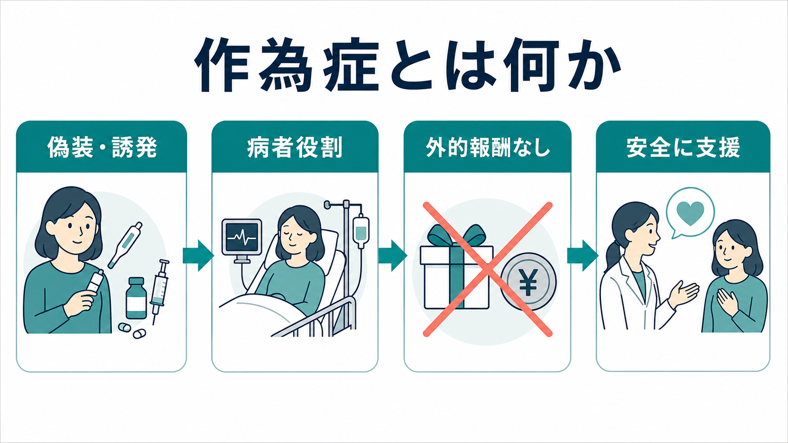
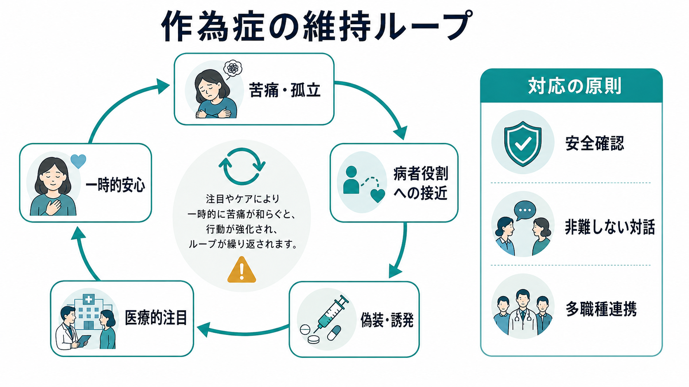
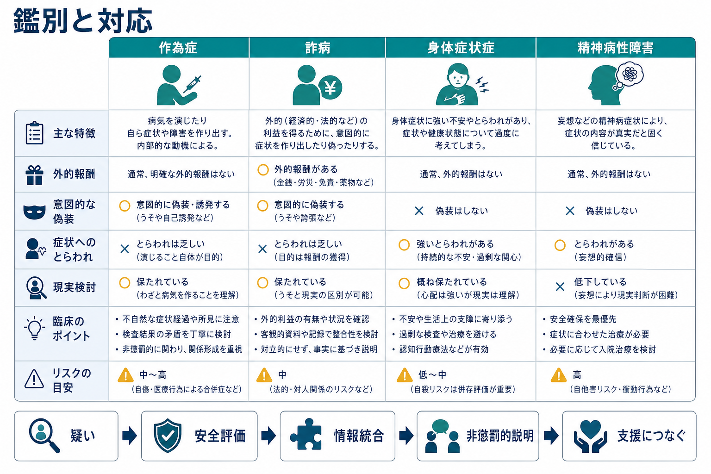

# 作為症とは何か

## 要点

- 作為症は、身体症状または心理症状を意図的に偽装・誇張・誘発し、自分が病者であるという役割に入ることが中心になる病態である[1][2]。
- 似た概念である詐病では、金銭、休職、刑事責任の回避、薬物入手などの明白な外的報酬が前景化しやすい。作為症では、外的報酬が全くないとは限らないが、主目的としては目立たない[1][3]。
- 診断は「うそを見破る」作業ではなく、医学的安全、不要な検査・治療の回避、関係形成、多職種連携を同時に扱う臨床判断である[3][6]。
- 患者を非難したり、証拠を突きつけて対決したりすると、離脱、医療機関の渡り歩き、さらなる危険行動につながることがある[6][7]。

## この記事で答える問い

1. 作為症は、詐病や[[身体症状症とは何か]]と何が違うのか。
2. なぜ「病者役割」が中心概念になるのか。
3. 臨床では、疑いをどう安全に扱うべきか。
4. 研究・臨床上、どこに限界と未解決問題があるのか。

## まず結論

作為症とは、本人が症状の偽装、誇張、検査所見の改ざん、服薬・自己損傷・感染操作などによって病気らしさを作り出し、その結果として「患者としてケアされる」「医療者に関わってもらう」「苦痛を病気という形で表現する」といった病者役割に近づく病態である[1][4]。DSM-5-TR では身体症状症および関連症群の一部として整理され、ICD-11 でも意図的な症状の偽装・誘発と、明白な外的報酬の欠如が中心に置かれる[1][2]。

ただし、作為症は「単なるうそ」ではない。虚偽性は重要だが、臨床的には、背景にある孤立、トラウマ、医療体験、人格機能、依存性、自己像の不安定さ、併存する気分・不安・物質使用の問題などを含めて理解する必要がある[4][5]。したがって、対応の目標は暴露や処罰ではなく、安全確保、被害の最小化、信頼関係の維持、精神科・心理支援への接続である[6][7]。

## 背景

作為症は古くは「ミュンヒハウゼン症候群」という名称で論じられてきたが、現在の診断体系では、より広い「作為症／虚偽性障害」として扱われる。自分自身に症状を作る場合と、子どもや高齢者など他者に症状を作り出す場合があり、後者は虐待・保護の問題として特に重大である[1][2]。この記事では、主に自分自身に課される作為症を扱う。

臨床で問題になるのは、症状が本物か偽物かという二分法だけではない。実際には、身体疾患が一部存在し、その上に誇張や誘発が重なることもある。検査所見が矛盾していても、すべてを心理的問題に還元すると重大な身体疾患を見落とす危険がある[3][4]。このため、作為症の評価は「医学的評価」と「心理社会的理解」を分けずに進める必要がある。

## 基本概念

DSM-5-TR では、作為症の中核は、身体的または心理的な徴候・症状を偽装すること、あるいは傷害や疾病を誘発すること、そしてその人が自分を病者・障害者・負傷者として提示することである[1]。詐病と異なり、外的報酬が主要な動機として明確ではない点が重視される[1][3]。

ICD-11 でも、症状を偽装または誘発し、検査や医療的ケアを受けるような病者役割をとること、そして明白な外的誘因がないことが診断概念の中心にある[2]。名称や分類には体系差があるため、診断分類の読み替えでは[[DSMとICDは何が違うのか]]も参照するとよい。

作為症では、次のような行動が見られることがある[3][4]。

- 症状や病歴を一貫しない形で語る。
- 検査結果や診療記録を改ざんする。
- 薬物、インスリン、抗凝固薬、下剤などを使って症状を誘発する。
- 傷を作る、感染を起こす、治癒を妨げる。
- 多数の医療機関を受診し、過去の情報提供を避ける。

これらは診断の「チェックリスト」ではない。むしろ、医学的リスク、記録の不一致、説明しにくい経過、医療介入によってかえって悪化するパターンを、慎重に統合して評価するための手がかりである。

## 仕組み

作為症の機序は単一ではない。臨床的には、心理的苦痛や孤立があり、症状を作ることで病者役割に接近し、医療者からの注目・保護・構造化された関係を得る。その結果、一時的に安心や自己像の安定が得られ、行動が維持される、というループで理解できることがある[4][6]。

重要なのは、このループが「本人の責任だから放置してよい」という意味ではない点である。むしろ、本人にも周囲にも危険がある。不要な手術、感染、薬物有害事象、医療資源の浪費、家族関係の悪化、医療者との不信が生じうる[5][7]。症例集積研究では、作為症は女性、医療職歴、若年から中年、気分障害・人格障害・物質使用などとの併存が報告されることがあるが、報告バイアスが大きく、有病率や典型像を単純化することはできない[5]。

## 図解

作為症の理解では、次の三つを分けると混乱が減る。

| 概念 | 症状の作られ方 | 主な焦点 | 臨床上の注意 |
|---|---|---|---|
| 作為症 | 意図的な偽装・誘発がある | 病者役割、ケア、注目、安心 | 非難せず、安全と連携を優先する |
| 詐病 | 意図的な偽装がある | 金銭、休職、刑事責任回避などの外的報酬 | 法的・社会的文脈を慎重に確認する |
| [[身体症状症とは何か]] | 偽装ではなく、症状への過度なとらわれが中心 | 不安、苦痛、生活障害 | 「気のせい」と扱わず、機能回復を支援する |
| [[妄想性障害とは何か]]・[[身体型妄想性障害とは何か]] | 症状や病気への確信が妄想的に固定することがある | 現実検討の低下 | 安全評価と精神病症状への治療を検討する |

この比較は、実際の診断を機械的に決めるものではない。臨床では、作為症、身体疾患、[[強迫症とは何か]]、気分障害、不安症、物質使用、パーソナリティ機能、トラウマ関連症状が重なりうる。疑いがあるときほど、単一の説明に飛びつかないことが重要である。

## 臨床・研究との接続

臨床対応の第一歩は、安全評価である。現在の身体的危険、薬物使用、感染、自己損傷、自殺リスク、他者への危害、子どもや依存的立場の人への関与を確認する[3][6]。特に他者に課される作為症が疑われる場合は、児童・高齢者・障害者保護の枠組みが必要になる[1][2]。

第二に、情報統合が重要である。単一の面接印象ではなく、過去の診療記録、検査データ、処方歴、他院情報、家族や支援者からの情報を、同意と法的枠組みに従って整理する[3][7]。ただし、調査的態度が強すぎると治療関係を損なうため、目的は「追及」ではなく「安全に治療を組み立てること」と明確にする。

第三に、説明は非懲罰的に行う。たとえば「検査結果と症状の経過に合わない部分があり、これ以上の侵襲的治療は危険です。安全を優先しながら、身体とストレスの両方を一緒に見ていきたい」という形で、矛盾を扱いながらも相手を人格的に否定しない[6][7]。

研究上は、ランダム化比較試験が少なく、治療法の確立度は高くない。系統的レビューでは、管理方針として、主治医の一元化、不要な検査・処置の抑制、精神科・心理療法への段階的接続、チーム内の一貫した方針が推奨されるが、エビデンスは主に症例報告・症例系列に依存している[5][6]。

## よくある誤解

### 「症状を作っているなら、治療対象ではない」

誤りである。症状を偽装・誘発する行動自体が、重大な身体的危険や心理的苦痛の表現になっていることがある[4][6]。治療対象は「うそ」だけではなく、危険行動、孤立、併存症、医療との関係パターンである。

### 「作為症と詐病は同じ」

同じではない。どちらも意図的な偽装を含みうるが、詐病では明白な外的報酬が前景化する。作為症では病者役割そのものが中心になる[1][3]。ただし現実の症例では境界が曖昧なことがあり、断定的なラベリングは避ける。

### 「身体疾患が見つからなければ作為症である」

誤りである。身体疾患が証明できないことは、作為症の証明ではない。[[身体症状症とは何か]]、不安症、抑うつ、痛み、薬剤影響、まれな身体疾患など、多くの可能性がある。作為症を考えるには、意図的な偽装・誘発を示す複数の手がかりと、経過全体の整合性評価が必要である[3][4]。

### 「対決して認めさせるのがよい」

多くの場合、急な対決は有害になりうる。治療離脱、医療機関の変更、自己誘発行動の悪化、医療者への不信が起こりうるため、段階的で非難しない説明が望ましい[6][7]。

## 関連ノート

- [[身体症状症とは何か]]
- [[身体型妄想性障害とは何か]]
- [[妄想性障害とは何か]]
- [[強迫症とは何か]]
- [[DSMとICDは何が違うのか]]

MOC 更新候補:

- `content/00_MOC/` 配下の精神医学・疾患分類・診断関連 MOC に、本記事へのリンクを追加する。
- 作為症、身体症状症、詐病、鑑別診断、医療面接を束ねる小見出しを後続の統合ジョブで検討する。

## 理解チェック

1. 作為症と詐病を分けるとき、症状の偽装の有無だけでなく何を見る必要があるか。
2. 作為症が疑われるとき、なぜ「証拠を突きつける」よりも安全評価と関係維持が重視されるのか。
3. 身体疾患が見つからないことと、作為症であることはなぜ同じではないのか。
4. 多職種チームで方針を一貫させることは、どのようなリスクを減らすか。

## 未解決問題

- 作為症の有病率、自然経過、再発率は、症例報告に依存しやすく、一般化可能なデータが限られる[5][6]。
- 心理療法、家族介入、ケースマネジメント、身体診療の一元化のどの組み合わせが最も有効かは、十分に検証されていない[6]。
- 詐病、身体症状症、トラウマ関連症状、パーソナリティ機能との境界は臨床的に曖昧で、単純な診断ラベルが支援を妨げることがある[7]。
- 他者に課される作為症では、精神医学的理解と保護・司法・倫理的判断をどう接続するかが実践上の大きな課題である[1][2]。

## 参考文献

[1] American Psychiatric Association. (2022). *Diagnostic and Statistical Manual of Mental Disorders, Fifth Edition, Text Revision (DSM-5-TR).* American Psychiatric Association Publishing. https://www.appi.org/Products/DSM-Library/Diagnostic-and-Statistical-Manual-of-Mental-Disorders-DSM-5-TR

[2] World Health Organization. (2025). *ICD-11 for Mortality and Morbidity Statistics: Factitious disorder imposed on self / another.* https://icd.who.int/browse/2025-01/mms/en

[3] Merck Manual Professional Edition. Factitious Disorder Imposed on Self. https://www.merckmanuals.com/professional/psychiatric-disorders/somatic-symptom-and-related-disorders/factitious-disorder-imposed-on-self

[4] StatPearls. Factitious Disorder. NCBI Bookshelf. https://www.ncbi.nlm.nih.gov/books/NBK557547/

[5] Yates, G. P., & Feldman, M. D. (2016). Factitious disorder: A systematic review of 455 cases in the professional literature. *General Hospital Psychiatry, 41*, 20-28. https://doi.org/10.1016/j.genhosppsych.2016.05.002

[6] Eastwood, S., & Bisson, J. I. (2008). Management of factitious disorders: A systematic review. *Psychotherapy and Psychosomatics, 77*(4), 209-218. https://doi.org/10.1159/000126072

[7] Bass, C., & Halligan, P. (2014). Factitious disorders and malingering: Challenges for clinical assessment and management. *The Lancet, 383*(9926), 1422-1432. https://doi.org/10.1016/S0140-6736(13)62186-8

