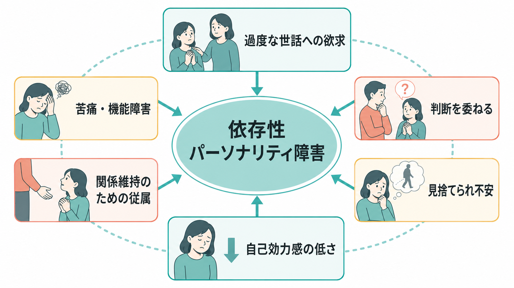
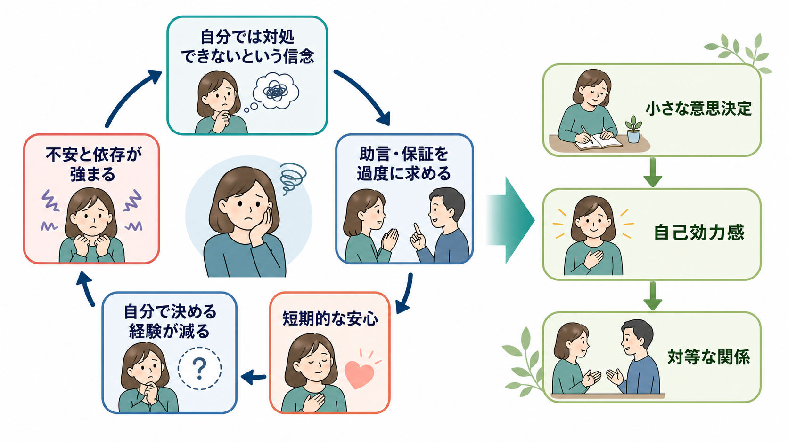

# 依存性パーソナリティ障害とは何か

## 要点

- 依存性パーソナリティ障害は、世話をされたいという広範で過度な欲求を背景に、従属的行動、しがみつき、見捨てられ不安が持続し、生活機能や対人関係に支障をきたす状態として記述される[1][2]。
- DSM-5-TR ではクラスターCのパーソナリティ障害に含まれ、日常的な意思決定に過剰な助言を必要とする、責任を他者に委ねる、不同意を表明しにくい、孤独を恐れるなどの特徴が重視される[1][2]。
- ICD-11 では、旧来の個別パーソナリティ障害名よりも、パーソナリティ障害の重症度と特性領域を評価する次元的な枠組みが中心であり、依存性の問題は関係性、自己機能、否定的感情、服従的・回避的な対人パターンとして理解されやすい[3]。
- 維持メカニズムとしては、「自分では対処できない」という信念、短期的な安心をもたらす保証希求、自分で決める経験の減少、自己効力感の低下が循環しやすい[4][5]。
- 本稿は教育・研究目的の概説であり、個別の診断や治療指示ではない。臨床判断では、併存症、発達歴、文化的背景、対人環境、安全性を含む包括的評価が必要である[2][6]。

## この記事で答える問い

1. 依存性パーソナリティ障害は、単なる甘えや優柔不断と何が違うのか。
2. 診断概念としては、DSM-5-TR と ICD-11 でどのように扱われるのか。
3. なぜ「助けを求めるほど、かえって自分で決めにくくなる」循環が生じるのか。
4. 臨床・研究では、どのような評価と支援の観点が重要になるのか。

## まず結論

依存性パーソナリティ障害の中心は、「他者を必要とすること」そのものではない。人は誰でも支え合いながら生きており、援助を求めることは適応的な行動である。問題になるのは、判断や責任を広範に他者へ委ねないと不安が耐えがたくなり、その結果として自律的な選択、対等な関係、学業・仕事・生活上の役割が狭まっていく場合である[1][2]。

この病態を理解する鍵は、依存を「性格の弱さ」とみなすことではなく、自己効力感、見捨てられ不安、対人学習、環境からの強化が絡み合ったパターンとして見ることである。短期的には助言や保証で安心できるが、長期的には「自分で決めて乗り切れた」という経験が蓄積しにくくなり、依存の循環が強まりうる[4][5]。

## 背景

パーソナリティ障害は、認知、感情、対人関係、衝動制御などの持続的なパターンが、文化的期待から著しく偏り、柔軟性を欠き、苦痛や機能障害をもたらす場合に問題となる[1][2]。依存性パーソナリティ障害は、その中でも「他者からの世話と承認なしには自分を保ちにくい」という対人依存の様式が前景に立つ。

DSM-5-TR では、依存性パーソナリティ障害は回避性パーソナリティ障害、強迫性パーソナリティ障害とともに、恐れや不安を背景にしたクラスターCに分類される[1]。このため、[[不安症群とは何か]]、[[分離不安症とは何か]]、[[社交不安症とは何か]]と重なる見え方をすることがある。ただし、依存性パーソナリティ障害では、不安の対象が特定の場面だけでなく、日常的な判断、責任、親密な関係の維持にまで広がりやすい。

疫学的には、一般人口での有病率は高くはないが、臨床場面では[[うつ病とは何か]]、[[大うつ病性障害とは何か]]、不安症、物質使用、他のパーソナリティ障害と併存して評価されることがある[2][4]。併存症があると、依存性の問題が目立たなくなったり、逆に治療関係や家族関係の中で強く現れたりする。

## 基本概念

### 診断概念

DSM-5-TR の枠組みでは、依存性パーソナリティ障害は成人期早期までに始まり、さまざまな状況で認められる、世話をされたいという過度な欲求と、それに伴う従属的・しがみつき行動として説明される[1][2]。典型的には、日常的な決定にも過剰な助言を必要とする、生活上の重要な領域を他者に任せる、支持を失うことを恐れて反対意見を言いにくい、自分一人で物事を始めることが難しい、といった特徴が挙げられる[1][2]。

一方、ICD-11 では、パーソナリティ障害を軽度・中等度・重度などの重症度で評価し、必要に応じて否定的感情、離隔、非社会性、脱抑制、強迫性、境界型パターンなどの特性領域を付記する[3]。この枠組みでは、「依存性パーソナリティ障害」という名称だけで説明するよりも、自己機能、対人機能、情動調整、関係の不均衡を具体的に記述することが重視される。分類体系の違いは、[[DSMとICDは何が違うのか]]とも接続して読める。

### 通常の依存との違い

依存はそれ自体が病的なのではない。病気、妊娠・出産、災害、喪失、発達段階、文化的規範によって、他者への依存が適応的になる場面は多い。臨床的に問題となるのは、依存が過度で持続的であり、本人の選択肢を狭め、搾取的・不均衡な関係に留まりやすくし、役割機能を損なう場合である[2][4]。

この区別では、行動の表面だけでなく、本人の内的体験を見る必要がある。たとえば同じ「相談が多い」でも、情報収集として相談しているのか、相手の承認がなければ決定できないのか、反対されると見捨てられるように感じるのかで意味が異なる。

## 仕組み

依存性パーソナリティ障害を維持する一つのモデルは、信念、感情、行動、対人反応の循環である。まず、「自分だけでは対処できない」「一人になると危険だ」「反対すると相手が離れる」といった信念があると、意思決定場面で不安が強くなる。その不安を下げるために、助言、保証、代行、同意を求める行動が増える[4][5]。

この行動は短期的には有効である。相手が決めてくれれば不安は下がり、孤独感も和らぐ。しかし、長期的には自分で決めて結果を引き受ける経験が減り、「やはり自分には無理だ」という信念が更新されにくくなる。周囲も、本人を守ろうとして代行を続けると、本人の自律経験がさらに減ることがある[5][6]。

発達的には、過保護、予測不能な養育、慢性的な病気、いじめ、喪失、トラウマ、家族内役割などが関連する可能性が議論されているが、単一の原因で説明できるものではない[4][5]。遺伝、気質、愛着、学習、文化、社会経済的条件が相互作用する。したがって、原因を一つに還元するよりも、「どの場面で、何が不安を強め、どの行動が短期的に報酬化されているか」を具体的に見るほうが臨床的には有用である。

## 図解

上の2枚の図は、依存性パーソナリティ障害を「固定した性格」ではなく、対人関係の中で維持されるパターンとして読むための補助である。1枚目は概念地図として、過度な世話への欲求、判断の委任、見捨てられ不安、自己効力感の低さ、関係維持のための従属、苦痛・機能障害を並べている。2枚目は維持メカニズムとして、短期的な安心が長期的な自律経験の減少につながる循環を示している。

図を読むときの注意点は、依存を単純に「減らすべきもの」と見ないことである。臨床的な支援では、孤立させることではなく、安心できる関係の中で、小さな意思決定、自己効力感、対等な関係を段階的に増やすことが目標になりやすい[6][7]。

## 臨床・研究との接続

臨床評価では、本人の訴えだけでなく、関係性のパターン、意思決定場面、生活史、併存症、安全性を丁寧に確認する。特に、[[境界性パーソナリティ障害とは何か]]、[[統合失調型パーソナリティ障害とは何か]]、[[不安症群とは何か]]、[[大うつ病性障害とは何か]]、[[物質使用障害とは何か]]との鑑別・併存評価が重要になる。依存性の問題は、抑うつや不安の背後に隠れることも、治療関係の中で「先生が決めてください」という形で現れることもある[2][4]。

治療研究では、パーソナリティ障害全般やクラスターCに対して、認知行動療法、短期精神力動的心理療法、スキーマ療法、対人関係に焦点を当てた心理療法などが検討されてきた[6][7]。依存性パーソナリティ障害だけを対象にした大規模試験は限られるため、治療効果を語る際には、研究対象が依存性単独なのか、クラスターC全体なのか、他のパーソナリティ障害を含むのかを区別する必要がある。

支援の方向性としては、本人の依存を責めるのではなく、意思決定を細分化し、予測可能な範囲で試行し、結果を振り返ることが重視される。たとえば「すべて自分で決める」ではなく、「今日の予定の一部を自分で選ぶ」「相談前に選択肢を二つ書く」「反対意見を安全な場面で一文だけ言う」といった小さな経験が、自己効力感を支える足場になる[5][7]。

研究上は、カテゴリ診断から次元評価への移行、文化差、ジェンダー規範、愛着、自己効力感、対人依存尺度、併存症の影響などが重要な論点である[3][4][5]。ICD-11 の枠組みは、診断名だけでなく、重症度と機能障害を記述することで、個別化された評価につなげやすいという利点がある[3]。

## よくある誤解

### 誤解1: 依存性パーソナリティ障害は「甘え」である

「甘え」という道徳的な言葉だけでは、苦痛、見捨てられ不安、自己効力感の低さ、対人学習、機能障害を説明できない。本人が楽をしたいから依存しているとは限らず、むしろ不安を下げるための行動が、結果として選択肢を狭めている場合がある[2][4]。

### 誤解2: 自立させるには、助けをすぐ断てばよい

急な突き放しは、不安、抑うつ、危機的行動、治療中断を強めることがある。支援では、依存を許容し続けることと、急に切り離すことの両極を避け、関係の安全性を保ちながら意思決定の練習を増やす視点が重要である[6][7]。

### 誤解3: 依存性パーソナリティ障害は女性だけの問題である

診断・受診・文化的期待にはジェンダー差が影響しうるが、依存性の問題を特定の性別に固定することは適切ではない[4][5]。評価では、性別役割、家族内の期待、経済的依存、暴力や支配の有無を区別して見る必要がある。

### 誤解4: 診断名があれば支援方針は一つに決まる

同じ診断名でも、重症度、併存症、発達歴、支援資源、危機リスクは大きく異なる。ICD-11 が重症度と特性領域を重視するのは、この個人差を臨床記述に反映しやすくするためである[3]。

## 関連ノート

- [[DSMとICDは何が違うのか]]
- [[境界性パーソナリティ障害とは何か]]
- [[統合失調型パーソナリティ障害とは何か]]
- [[不安症群とは何か]]
- [[分離不安症とは何か]]
- [[社交不安症とは何か]]
- [[うつ病とは何か]]
- [[大うつ病性障害とは何か]]
- [[物質使用障害とは何か]]

今後の作成候補: `回避性パーソナリティ障害とは何か`, `強迫性パーソナリティ障害とは何か`, `自己効力感とは何か`, `愛着とパーソナリティ障害`, `スキーマ療法とは何か`, `対人依存とは何か`

MOC更新候補: `content/00_MOC/MOC・精神医学.md`, `content/00_MOC/MOC・疾患・症候群.md`, `content/00_MOC/MOC・臨床心理学.md`

## 理解チェック

1. 通常の援助希求と、依存性パーソナリティ障害で問題となる依存は、どの観点で区別できるか。
2. 短期的な安心が、長期的には自己効力感を下げることがあるのはなぜか。
3. DSM-5-TR のカテゴリ診断と ICD-11 の次元的評価は、依存性の問題をどう違う角度から捉えるか。
4. 依存を責めずに自律を支える支援として、どのような小さな練習が考えられるか。

## 未解決問題

- 依存性パーソナリティ障害に特化した治療研究は限られており、クラスターC全体の知見をどこまで一般化できるかは慎重に扱う必要がある。
- 文化的に望ましい相互依存と、臨床的に問題となる従属・機能障害をどのように区別するかは、評価上の重要な課題である。
- ICD-11 の次元的枠組みが、依存性の問題を持つ人の治療計画や予後予測をどの程度改善するかは、今後の実証研究が必要である。

## 参考文献

[1] American Psychiatric Association. (2022). *Diagnostic and Statistical Manual of Mental Disorders, Fifth Edition, Text Revision (DSM-5-TR)*. https://doi.org/10.1176/appi.books.9780890425787

[2] Merck Manual Professional Edition. (2026). *Dependent Personality Disorder (DPD)*. https://www.merckmanuals.com/professional/psychiatric-disorders/personality-disorders/dependent-personality-disorder-dpd

[3] World Health Organization. (2026). *ICD-11 for Mortality and Morbidity Statistics: Personality disorder*. https://icd.who.int/browse/2026-01/mms/en#941859884

[4] Disney, K. L. (2013). Dependent personality disorder: A critical review. *Clinical Psychology Review, 33*(8), 1184-1196. https://doi.org/10.1016/j.cpr.2013.10.001

[5] Bornstein, R. F. (2012). From dysfunction to adaptation: An interactionist model of dependency. *Annual Review of Clinical Psychology, 8*, 291-316. https://doi.org/10.1146/annurev-clinpsy-032511-143058

[6] Hansen, B. J., Thomas, J., & Torrico, T. J. (2026). *Dependent Personality Disorder*. StatPearls, NCBI Bookshelf. https://www.ncbi.nlm.nih.gov/books/NBK606086/

[7] Svartberg, M., Stiles, T. C., & Seltzer, M. H. (2004). Randomized, controlled trial of the effectiveness of short-term dynamic psychotherapy and cognitive therapy for cluster C personality disorders. *American Journal of Psychiatry, 161*(5), 810-817. https://doi.org/10.1176/appi.ajp.161.5.810

[8] Gjerde, L. C., Czajkowski, N., Røysamb, E., Ørstavik, R. E., Knudsen, G. P., Østby, K., Torgersen, S., Myers, J., Kendler, K. S., & Reichborn-Kjennerud, T. (2012). The heritability of avoidant and dependent personality disorder assessed by personal interview and questionnaire. *Acta Psychiatrica Scandinavica, 126*(6), 448-457. https://doi.org/10.1111/j.1600-0447.2012.01862.x
