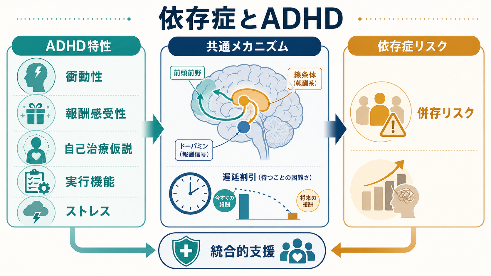
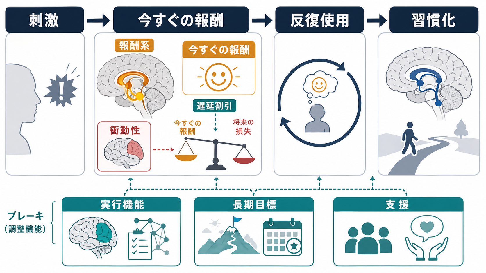
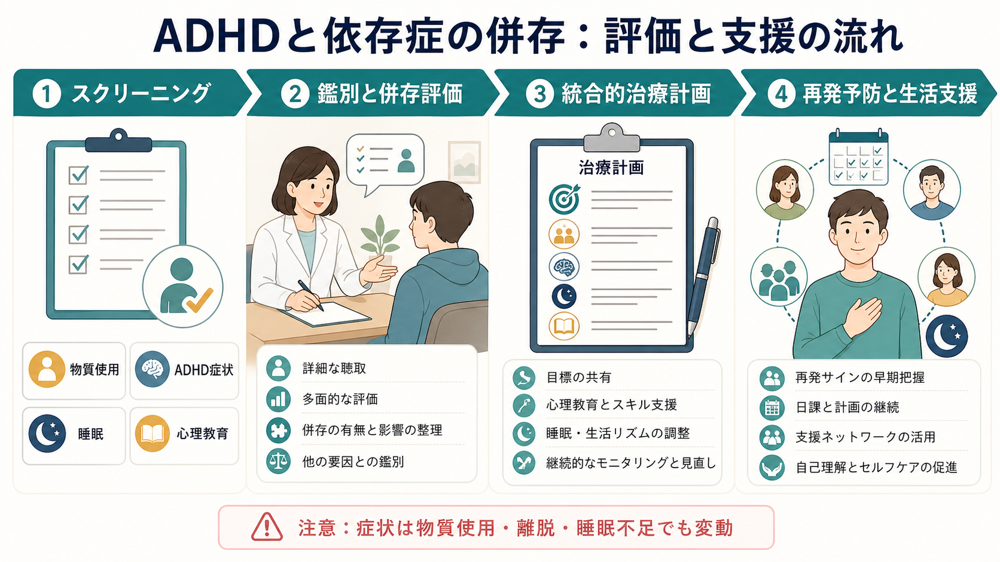

# 依存症とADHDはどう関係するのか

## 要点

- [[ADHDとは何か]] と [[物質使用障害とは何か]] はしばしば併存するが、ADHDがある人が必ず依存症になるわけではない。
- 関係を考える軸は、衝動性、遅延割引、報酬感受性、実行機能の弱さ、ストレスや睡眠、併存する不安・抑うつ・反抗性/素行症状などである。
- 「自己治療仮説」は、物質や行動が一時的に落ち着き・集中・気分調整をもたらすため使用が強化される、という説明を与える。ただし、全例を説明する万能仮説ではない。
- 臨床では、依存症だけ、ADHDだけを切り出すより、物質使用歴、離脱・中毒、発達歴、睡眠、生活機能、併存症を同時に評価する必要がある。

## この記事で答える問い

この記事では、依存症とADHDの併存を「性格の弱さ」や「意志の問題」としてではなく、注意・衝動・報酬・自己調整の仕組みとして整理する。対象は主に成人のADHDと、[[アルコール使用障害とは何か]]、[[ニコチン使用障害とは何か]]、[[大麻使用障害とは何か]]、[[覚醒剤使用障害とは何か]]、[[オピオイド使用障害とは何か]] などの物質使用障害である。ただし、[[ギャンブル障害とは何か]]、[[ゲーム行動症とは何か]]、[[インターネット依存とは何か]] のような行動嗜癖にも共通する論点がある。

## まず結論

依存症とADHDの関係は、単純な因果関係ではなく「リスクが重なりやすい関係」と考えるのがよい。縦断研究のメタ分析では、小児期ADHDは後年の物質使用・乱用/依存のリスク上昇と関連しており、特にニコチン、アルコール、大麻などで関連が検討されてきた [1]。また、物質使用障害の治療を受ける集団では成人ADHDの併存が一般人口より高く、国際多施設研究やメタ分析でも、SUD臨床群でADHDが無視できない頻度で見つかることが示されている [2], [3]。

ただし、この関連は「ADHDだから依存症になる」という意味ではない。ADHD特性に、アクセスしやすい物質、ストレス、睡眠不足、外傷体験、うつ・不安、反社会的行動、家庭・学校・職場環境などが加わると、使用開始、反復使用、問題化、再発が起こりやすくなる、という多因子モデルで理解する必要がある [4], [5]。

## 背景

ADHDは不注意、多動性、衝動性を中核とする神経発達症であり、成人期にも症状や機能障害が続くことがある。依存症は、短期的な報酬や苦痛の軽減が行動を強化し、長期的な損失があっても使用・行動が反復される状態として理解できる。

この2つが重なると、いくつかの臨床的問題が生じる。第一に、ADHDの不注意や生活リズムの乱れが、治療予約、服薬、支援機関との連絡、金銭管理を難しくする。第二に、物質使用や離脱、睡眠不足そのものが不注意・落ち着かなさ・情動不安定を悪化させ、ADHD症状と見分けにくくする。第三に、依存症治療の場では物質使用に注目が集まり、発達歴や小児期からの注意特性が見落とされやすい [4]。

国際コンセンサスは、SUD患者ではADHDをルーチンにスクリーニングし、陽性なら発達歴、現在症状、物質使用歴、禁酒・断薬期間の症状変化、併存症を含めて診断を進めることを推奨している [4]。これは、診断名を増やすためではなく、再発予防や生活支援の標的を見落とさないためである。

## 基本概念

### 衝動性

衝動性とは、長期的な結果を十分に見積もる前に行動が出やすい傾向である。ADHDでは、待つ、止める、切り替える、計画を保持する、といった制御が難しくなることがある。依存症では、渇望や手がかりに反応して「今使う」「今賭ける」「今見る」という行動が起こりやすくなる。両者が重なると、[[依存症における渇望とは何か]] に対するブレーキが弱まりやすい。

### 報酬感受性と遅延割引

遅延割引とは、将来の大きな報酬よりも、今すぐ得られる小さな報酬を高く評価する傾向である。ADHDの人では、対照群より金銭的遅延割引が大きいことを示すメタ分析があり、これは「将来の利益より目の前の報酬に引き寄せられやすい」という行動経済学的な衝動性と関係する [6]。依存症でも、即時の快感・安心・集中感が強化されるため、長期的損失が見えにくくなる。

### 実行機能

実行機能とは、目標を立て、注意を保ち、誘惑を抑え、失敗後に立て直す働きである。ADHDではこの調整が不安定になりやすく、依存症では反復使用によって手がかり反応、習慣化、生活の単純化が進む。したがって、併存例では「やめる意思」だけでなく、環境調整、予定の外部化、睡眠、金銭管理、支援者との接点など、実行機能を外から補う設計が重要になる。

### 自己治療仮説

自己治療仮説は、物質使用が苦痛な感情、落ち着かなさ、空虚感、集中困難などを一時的に和らげるため、使用が維持されるという考え方である [7]。ADHDでは、ニコチン、カフェイン、刺激薬の非医療的使用、アルコール、大麻などが「集中できる」「落ち着く」「眠れる」「嫌な感覚が薄れる」と主観的に経験されることがある。

しかし、自己治療仮説は「本人にとって一時的な機能があった」ことを説明する仮説であり、物質使用を正当化するものではない。一時的に楽になる行動ほど、長期的には睡眠、感情調整、学業・仕事、対人関係、身体健康を悪化させ、さらに使用を増やす循環を作ることがある。

## 仕組み

ADHDと依存症の接点は、少なくとも3層に分けて考えられる。

第一に、神経認知レベルでは、報酬予測、待つこと、抑制、注意の切り替えに関わる回路が関与する。ADHDでは「報酬が遠い課題」への持続が難しく、依存性のある物質や行動は、強く、速く、予測しやすい報酬を与える。これにより、日常の遅い報酬より依存行動が選ばれやすくなる。

第二に、学習レベルでは、反復使用が手がかりと結びつく。疲れた、退屈、怒り、スマートフォンを開いた、店の前を通った、給料日になった、という手がかりが使用行動を呼び出す。ADHDの不注意や衝動性があると、この手がかりに気づいて止めるまでの時間が短くなりやすい。

第三に、生活史レベルでは、失敗経験、叱責、低い自己効力感、学校・職場での困難、睡眠リズムの乱れが背景になる。物質や行動が「自分を動かす道具」「嫌な感覚を消す道具」になると、依存症の問題は単なる快楽追求ではなく、生活を回すための不安定な対処として固定される。

## 図解

| 観点 | ADHD側の特徴 | 依存症側の特徴 | 併存時に起こりやすいこと |
|---|---|---|---|
| 衝動性 | 思いついた行動を止めにくい | 渇望や手がかりに反応しやすい | 使用・賭け・視聴・購入が自動化する |
| 報酬 | すぐ得られる刺激に引き寄せられやすい | 即時報酬が使用を強化する | 長期目標より短期的な安堵が勝ちやすい |
| 実行機能 | 計画、持続、片づけ、時間管理が難しい | 治療継続や再発予防が途切れやすい | 支援の予定や安全計画が維持しにくい |
| 自己治療 | 落ち着かなさ、集中困難、睡眠問題がある | 物質・行動が一時的に苦痛を下げる | 「効くから使う」が長期的悪化につながる |
| 鑑別 | 発達早期からの特性 | 中毒・離脱・睡眠不足で症状が変動 | 発達歴と禁酒・断薬期間の観察が重要 |

## 臨床・研究との接続

ADHD-SUD併存の評価では、現在の症状だけを見て判断しない。物質使用の量・頻度・文脈、使用していない期間の注意症状、幼少期からの不注意・多動・衝動性、学校記録や家族からの情報、睡眠、気分、不安、トラウマ、反社会的行動、自殺リスクを合わせてみる [4]。

支援では、ADHDと依存症を順番に完全分離するより、同時並行で扱うことが多い。コンセンサスでは、SUD患者のADHDスクリーニング、診断過程、心理療法と薬物療法を組み合わせた統合的治療、処方薬の乱用・転売リスクへの注意が挙げられている [4]。薬物療法の要否や種類は個別に専門家が判断する領域であり、この記事は具体的な服薬指示を目的としない。

研究上は、ADHD症状そのもの、反抗挑戦症・素行症状、気分・不安症状、家庭環境、遺伝的脆弱性、外傷体験、社会経済的要因を切り分ける必要がある。ADHDから依存症へのリスク上昇は観察されるが、その一部は併存する行動問題や環境リスクを介している可能性がある [1], [5]。したがって、予防研究では「ADHD症状を下げる」だけでなく、学校支援、家族支援、睡眠、仲間関係、物質へのアクセス、ストレス対処を含む多層的介入が重要になる。

## よくある誤解

### 誤解1: ADHDがあると必ず依存症になる

ADHDはリスク因子の一つだが、決定因ではない。支援環境、治療アクセス、睡眠、家族・学校・職場の調整、本人の強み、物質へのアクセスによって経過は大きく変わる。

### 誤解2: 依存症がある人の不注意はすべてADHDである

中毒、離脱、睡眠不足、抑うつ、不安、外傷反応でも不注意や落ち着かなさは生じる。ADHD診断では、発達早期からの持続性、複数場面での機能障害、物質使用の影響を受けない期間の症状を確認する。

### 誤解3: 自己治療なら問題ではない

自己治療仮説は、使用が本人にとって一時的な機能を持つことを説明する。しかし、短期的に楽になる行動が長期的には睡眠、気分、対人関係、身体健康、仕事・学業を悪化させることがある。説明と正当化は分けて考える必要がある。

### 誤解4: 依存症治療が終わるまでADHDは扱えない

重い中毒や離脱がある時期には安全確保が優先されるが、ADHD特性を無視すると治療継続の困難や再発リスクを見落とす。国際コンセンサスは、可能な範囲で早期にスクリーニングし、統合的に支援することを勧めている [4]。

## 関連ノート

- [[ADHDとは何か]]
- [[物質使用障害とは何か]]
- [[依存症における渇望とは何か]]
- [[アルコール使用障害とは何か]]
- [[ニコチン使用障害とは何か]]
- [[大麻使用障害とは何か]]
- [[覚醒剤使用障害とは何か]]
- [[オピオイド使用障害とは何か]]
- [[ギャンブル障害とは何か]]
- [[ゲーム行動症とは何か]]
- [[インターネット依存とは何か]]

## MOC更新候補

- `content/00_MOC/` 配下の精神医学・依存症・神経発達症関連MOCに追加候補。
- 並列編集を避けるため、本ジョブではMOC本文の更新は行わない。

## 理解チェック

1. ADHDと依存症の併存を、単純な「意志の弱さ」ではなく、どのような報酬・自己制御の問題として説明できるか。
2. 遅延割引が大きいと、なぜ依存行動が維持されやすくなるのか。
3. 自己治療仮説は、依存行動を説明するうえで何を説明でき、何を説明しすぎてはいけないか。
4. ADHD-SUD併存の評価で、物質使用歴と発達歴を同時に確認する理由は何か。

## 未解決問題

- ADHD症状そのもの、素行症状、環境リスク、遺伝的脆弱性のどれが依存症リスクをどの程度媒介するかは、物質種・年齢・性別・文化によって異なる可能性がある。
- ADHD治療が長期的な依存症予防にどの程度寄与するかは、薬物療法、心理社会的支援、家族・学校・職場調整を分けて検討する必要がある。
- 行動嗜癖におけるADHD特性の役割は、物質使用障害と共通する部分と異なる部分を整理する余地がある。

## 参考文献

[1] Lee, S. S., Humphreys, K. L., Flory, K., Liu, R., & Glass, K. (2011). Prospective association of childhood attention-deficit/hyperactivity disorder (ADHD) and substance use and abuse/dependence: A meta-analytic review. *Clinical Psychology Review*, 31(3), 328-341. https://doi.org/10.1016/j.cpr.2011.01.006

[2] van de Glind, G., Konstenius, M., Koeter, M. W. J., et al. (2014). Variability in the prevalence of adult ADHD in treatment seeking substance use disorder patients: Results from an international multi-center study exploring DSM-IV and DSM-5 criteria. *Drug and Alcohol Dependence*, 134, 158-166. https://doi.org/10.1016/j.drugalcdep.2013.09.026

[3] Rohner, H., Gaspar, N., Philipsen, A., & Schulze, M. (2023). Prevalence of Attention Deficit Hyperactivity Disorder (ADHD) among Substance Use Disorder (SUD) Populations: Meta-Analysis. *International Journal of Environmental Research and Public Health*, 20(2), 1275. https://doi.org/10.3390/ijerph20021275

[4] Crunelle, C. L., van den Brink, W., Moggi, F., et al. (2018). International Consensus Statement on Screening, Diagnosis and Treatment of Substance Use Disorder Patients with Comorbid Attention Deficit/Hyperactivity Disorder. *European Addiction Research*, 24(1), 43-51. https://doi.org/10.1159/000487767

[5] Wilens, T. E., & Morrison, N. R. (2011). The intersection of attention-deficit/hyperactivity disorder and substance abuse. *Current Opinion in Psychiatry*, 24(4), 280-285. https://doi.org/10.1097/YCO.0b013e328345c956

[6] Jackson, J. N. S., & MacKillop, J. (2016). Attention-deficit/hyperactivity disorder and monetary delay discounting: A meta-analysis of case-control studies. *Biological Psychiatry: Cognitive Neuroscience and Neuroimaging*, 1(4), 316-325. https://doi.org/10.1016/j.bpsc.2016.01.007

[7] Khantzian, E. J. (1997). The self-medication hypothesis of substance use disorders: A reconsideration and recent applications. *Harvard Review of Psychiatry*, 4(5), 231-244. https://doi.org/10.3109/10673229709030550

[8] National Institute on Drug Abuse. (2024). Mental Health and Substance Use. https://nida.nih.gov/research-topics/mental-health
