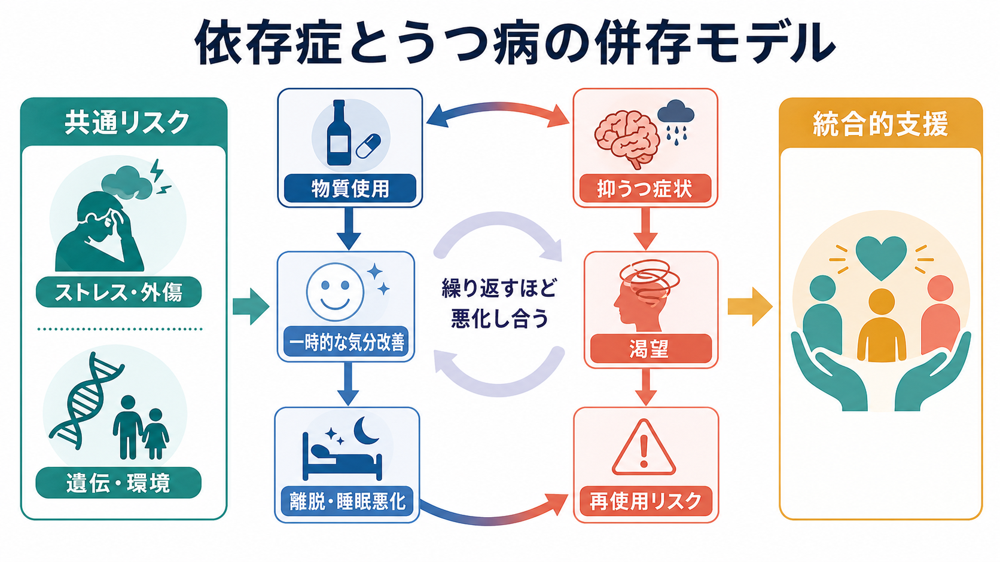
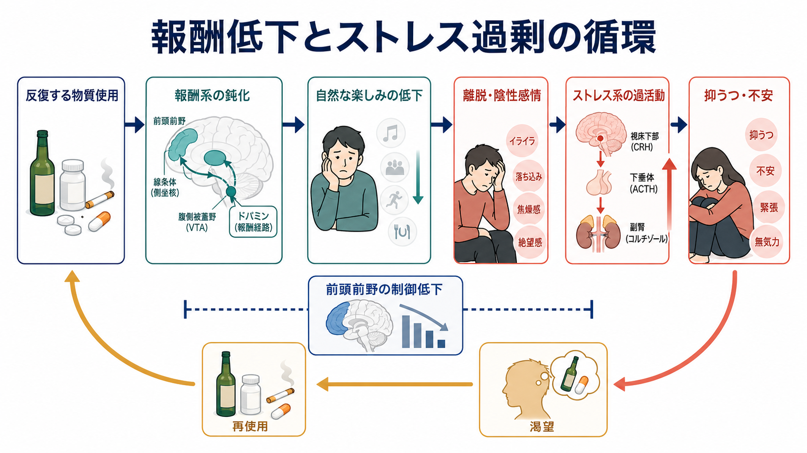
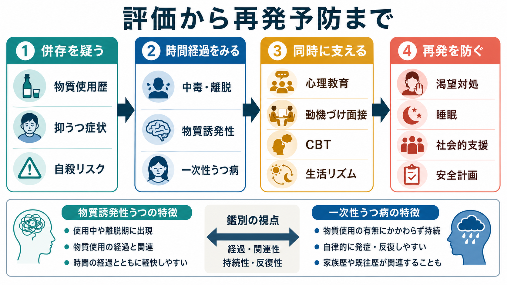

# 依存症とうつ病はどう併存するのか

## 要点

- 依存症とうつ病の併存は、「片方がもう片方に偶然重なる」だけではない。物質使用が睡眠、報酬系、ストレス系、対人・生活機能を乱し、抑うつ症状を強める一方、抑うつ症状は物質使用を気分調整の手段として選びやすくし、渇望と再使用リスクを高める[1][2]。
- 物質使用後の一時的な気分改善は、長期的には報酬系の鈍化、離脱時の陰性感情、ストレス反応の過活動、前頭前野の制御低下と結びつきやすい。これは「意志が弱い」ではなく、学習・神経適応・生活環境が絡んだ循環である[4]。
- 臨床では、物質誘発性の抑うつ症状、一次性の[[うつ病とは何か|うつ病]]、両者の併存を時間経過で見分ける必要がある。中毒・離脱・断酒断薬後の経過、家族歴、以前からの気分エピソード、自殺リスクを合わせて評価する[7][8]。
- 併存例では、依存症だけ、うつ病だけを順番に扱うより、両方を同時に評価し支援する統合的な方針が重要になる。これは教育・研究目的の整理であり、個別の診断や治療指示ではない[6][7]。

## この記事で答える問い

1. 依存症とうつ病は、どのような経路で互いを悪化させるのか。
2. 物質使用は、なぜ短期的には気分を軽くしても、長期的には抑うつと再発リスクを高めるのか。
3. 「物質誘発性の抑うつ」と「一次性うつ病」は、どのように考え分けるのか。
4. 研究・臨床では、どのような評価と支援の視点が必要になるのか。

## まず結論

依存症とうつ病の併存は、少なくとも三つの層で理解すると見通しがよい。

第一に、自己治療仮説の層である。抑うつ、不安、孤立、不眠、身体痛があると、アルコール、ニコチン、鎮静薬、オピオイド、刺激薬、大麻などが「今だけ楽になる手段」として使われやすくなる。NIDA は、うつ、不安、ストレス、痛みを軽くしようとして薬物を使うことが、物質使用障害につながる一つの経路だと整理している[2]。

第二に、物質が気分症状を作る層である。物質使用は、使用中の気分変化だけでなく、離脱時の不眠、焦燥、無快感、疲労、罪責感、社会的問題を通じて抑うつを強めうる。DSM-5 系の整理では、物質誘発性の精神症状は中毒または離脱と時間的に結びついて出現し、経過観察が鑑別の鍵になる[7][8]。

第三に、共通脆弱性の層である。遺伝的脆弱性、幼少期逆境、外傷体験、慢性ストレス、貧困、孤立、睡眠障害、痛みなどは、物質使用障害とうつ病の両方に関わる。SAMHSA は、精神疾患と物質使用障害が併存する理由として、物質による精神症状、自己治療、脳・遺伝・ストレスや外傷などの共通要因を挙げている[1]。

## 背景

物質使用障害と精神疾患の併存は、米国の公的資料では co-occurring disorders と呼ばれる。SAMHSA は、物質使用障害と精神疾患が同時にある状態を併存障害として整理し、2024 年の NSDUH では成人約 2,120 万人が精神疾患と物質使用障害を併存していたと報告している[1]。

なかでもうつ病との関係は重要である。NIAAA は、アルコール使用障害では大うつ病性障害、不安症、外傷・ストレス関連障害、睡眠障害などが高頻度に併存すると説明している。大うつ病性障害の人におけるアルコール使用障害の併存は、生涯で 27-40%、12か月で最大 22% とされる[3]。アルコール以外でも、オピオイド、刺激薬、ニコチン、大麻などは、報酬、睡眠、ストレス反応、社会機能を通じて気分症状と絡みやすい。

ここで注意したいのは、併存は単純な因果の一方向ではないという点である。「うつ病だから飲む」「飲むからうつになる」のどちらかだけではなく、同じ人の中で両方が時期によって入れ替わる。たとえば、最初は抑うつへの対処として使用が増え、その後に離脱・睡眠悪化・対人問題が抑うつを深め、さらに渇望が強まる、という循環が起こりうる。

## 基本概念

### 依存症・物質使用障害

この記事では、依存症を主に物質使用障害の文脈で扱う。物質使用障害は、物質の使用が本人の意図や生活上の目標に反して続き、健康、対人関係、仕事・学業、安全、役割遂行に問題を生じても制御が難しい状態である。関連ノートとして、[[アルコール使用障害とは何か]]、[[オピオイド使用障害とは何か]]、[[ニコチン使用障害とは何か]]を参照できる。

ただし、ギャンブルやゲームなどの行動嗜癖でも、報酬学習、渇望、気分調整、再発リスクという構造は一部重なる。この記事の主題は物質使用が気分症状を悪化させる仕組みだが、[[ギャンブル障害とは何か]]や[[インターネット依存とは何か]]を読むと、行動の反復と報酬学習の観点が補助線になる。

### うつ病と抑うつ症状

うつ病は、抑うつ気分または興味・喜びの低下を中心に、睡眠、食欲、疲労、集中困難、罪責感、精神運動の変化、希死念慮などが持続し、機能障害を伴う状態として整理される。詳しくは[[うつ病とは何か]]で扱う。

依存症との併存を考えるときは、「診断としてのうつ病」と「物質使用に伴う抑うつ症状」を分けて見る必要がある。離脱時の無快感や不眠はうつ病に似るが、時間経過と物質使用との関係が鑑別に重要である[8]。

### 物質誘発性の抑うつ

物質誘発性の抑うつとは、使用・中毒・離脱・薬剤の影響と時間的に結びついて抑うつ症状が出る状態である。SAMHSA TIP 42 は、DSM-5 の物質誘発性精神障害として、抑うつ障害、不安障害、双極関連障害、精神病性障害などを整理している[7]。StatPearls の概説でも、物質誘発性気分障害の鑑別では、症状が物質使用と時間的に連動するか、急性中毒・離脱後に軽快するかが重要だとされる[8]。

臨床的には、一次性うつ病と物質誘発性抑うつは排他的とは限らない。物質誘発性の症状が何度も繰り返されるうちに、生活機能の低下、孤立、慢性ストレスが加わり、独立したうつ病エピソードが前景化することもある。

## 仕組み

### 1. 短期の気分改善が長期の悪化に変わる

多くの物質は、短期的には不安、緊張、空虚感、痛み、眠れなさを軽くするように感じられる。この即時の効果は強い学習信号になる。つらい気分の直後に物質使用が起こり、その直後に苦痛が軽くなると、「つらいときには使う」という行動が強化される。

しかし長期的には、同じ効果を得るために使用量や頻度が増えやすくなり、使用していない時間の気分が悪くなる。ここで問題になるのは、快感を得るための使用だけではない。不快感、離脱、焦燥、無快感を避けるための使用が中心になると、依存症とうつ病の循環はさらに抜けにくくなる[4]。

### 2. 報酬系の鈍化と無快感

Koob と Volkow の神経回路モデルでは、依存症は「過剰な報酬を求める状態」だけでなく、報酬系の低下、ストレス系の過活動、実行制御の低下が組み合わさる状態として説明される[4]。反復する物質使用は、自然な報酬への反応を弱め、日常の楽しみ、達成感、人とのつながりから得られる価値を感じにくくする。

この報酬低下は、うつ病の無快感とよく似た形で現れる。食事、趣味、学業、仕事、人間関係から得られる満足が薄くなると、本人にとって短期的に効きやすい物質がますます目立つ。すると、日常の報酬経験がさらに減り、抑うつと使用が互いに強化される。

### 3. 離脱・睡眠悪化・陰性感情

物質使用は、使用中だけでなく「切れた後」に気分へ強く作用する。アルコールや鎮静薬では不眠、焦燥、不安、抑うつが目立ちやすく、刺激薬では反動として疲労、無快感、過眠または不眠、希死念慮が問題になることがある[8]。

睡眠の乱れは特に重要である。睡眠不足は、情動調整、衝動制御、痛み、記憶、意思決定を悪化させる。抑うつ症状が強いほど眠れず、眠れないほど翌日の渇望や衝動性が高まる、という形で循環ができる。

### 4. ストレス系の過活動

依存症の神経回路モデルでは、報酬系だけでなく、扁桃体、視床下部、HPA軸、コルチコトロピン放出因子などを含むストレス系が重視される[4]。反復使用と離脱は、身体にとって慢性的なストレス負荷になり、通常なら回復に向かうはずの情動反応を長引かせる。

この状態では、些細な対人摩擦、仕事上の失敗、孤独、身体症状が過大に感じられやすい。ストレス反応が強いほど抑うつは深まり、抑うつが深いほど「今すぐ楽になりたい」という動機が強まる。

### 5. 前頭前野の制御低下と意思決定

依存症では、報酬・ストレス・習慣系の変化に加えて、前頭前野を中心とする実行制御が弱くなると考えられる[4]。これは「考えればわかるのに止められない」という臨床像と対応する。

うつ病でも、将来の見通しが狭まり、自己評価が低下し、行動開始が難しくなる。すると、長期的な回復目標よりも、短期的な不快感の軽減が優先されやすい。依存症とうつ病が併存すると、制御低下、悲観、回避、再使用が同じ方向に働きやすい。

### 6. 生活問題が症状を増幅する

物質使用は、経済問題、対人葛藤、学業・仕事の失敗、法的問題、身体疾患、孤立を引き起こすことがある。これらはうつ病の維持因子にもなる。逆に、うつ病による活動低下や孤立は、支援資源へのアクセスを弱め、使用パターンを見直す機会を減らす。

縦断研究では、物質使用頻度が高い時期ほど抑うつ症状が高くなり、抑うつ症状と使用リスクが一緒に変動することが示されている[5]。この知見は、再発を「単発の失敗」と見るより、気分、睡眠、ストレス、環境が変化したサインとして読む必要を示している。

## 図解

図1は、依存症とうつ病の併存を、自己治療、物質誘発性症状、共通脆弱性、統合的支援の四つから整理した概念地図である。短期的な気分改善が、長期的には離脱、睡眠悪化、渇望、再使用リスクへつながる点を強調している。

図2は、最も重要なメカニズムとして、報酬低下とストレス過剰の循環を示した。反復する物質使用が報酬系の鈍化と自然報酬の低下を招き、離脱・陰性感情・ストレス過活動を通じて、抑うつと渇望を強める。

図3は、評価から支援までの臨床・研究上の流れである。併存を疑う、時間経過を見る、同時に支える、再発を防ぐ、という順で整理している。

## 臨床・研究との接続

### 評価では「時間経過」を見る

併存例の評価では、物質使用の種類、量、頻度、最終使用日、離脱症状、過去の断酒・断薬期間、抑うつ症状の始まり、以前からのうつ病エピソード、家族歴、外傷体験、睡眠、痛み、自殺リスクを組み合わせて見る。

物質誘発性の抑うつが疑われる場合でも、症状が軽いと決めつけてはいけない。離脱期には希死念慮や衝動性が強まることがあり、安全確保が優先される。教育・研究上の文章では、ここを「鑑別の問題」と「安全の問題」に分けて記述するのがよい。

### 支援では「同時に扱う」

SAMHSA は、併存障害では精神疾患と物質使用障害の両方をスクリーニングし、統合的に扱うことを重視している[1][7]。NIAAA も、アルコール使用障害と併存する精神疾患は、両方が治療対象になると回復可能性が高まると説明している[3]。

アルコール使用障害とうつ病の統合管理レビューでは、両者の双方向性、診断の複雑さ、統合ケアの重要性が整理されている[6]。心理社会的には、心理教育、動機づけ面接、認知行動療法、行動活性化、睡眠と生活リズムの支援、家族・社会資源の調整が重要な柱になる。薬物療法については物質、重症度、併存疾患、相互作用、本人の希望により異なるため、個別評価の領域に置く。

### 研究では「平均効果」だけでは足りない

依存症とうつ病の併存研究では、平均的な併存率や治療効果だけでなく、時間的順序と個人差が重要である。ある人では抑うつが先にあり、ある人では物質使用が先にあり、ある人では共通の外傷・ストレスが両方を同時に押し上げる。

したがって、研究上は縦断データ、日誌法、ウェアラブル睡眠指標、渇望評価、生活イベント、社会的支援、物質別の効果を組み合わせる必要がある。臨床でも同じく、単発のスクリーニング点数より、「どの時期に、何が引き金になり、何が症状を軽くし、何が再使用につながったか」を追うことが重要になる。

## よくある誤解

### 誤解1: 依存症が治ってからでないとうつ病は扱えない

依存症とうつ病は互いに影響するため、順番に完全に切り分けると支援が遅れることがある。安全確保、睡眠、生活リズム、抑うつ症状、渇望、社会的支援は同時に見たほうがよい[6][7]。

### 誤解2: うつ病があるなら物質使用は仕方ない

抑うつが物質使用の背景になることはあるが、それは物質使用を放置してよいという意味ではない。物質使用が睡眠、気分、対人関係、自殺リスク、治療継続に影響する場合、うつ病の回復も妨げられやすい。

### 誤解3: 物質誘発性なら本当のうつ病ではない

物質誘発性の抑うつでも苦痛とリスクは現実である。時間経過で軽快する可能性がある一方、自殺リスクや離脱リスクは評価が必要になる。一次性か物質誘発性かは、本人を責めるためではなく、支援のタイミングと内容を調整するための区別である[8]。

### 誤解4: 再使用はすべて治療失敗である

再使用は望ましい出来事ではないが、気分、渇望、睡眠、ストレス、環境のどこに弱点があったかを示す情報でもある。抑うつ症状と使用頻度が時間的に一緒に変動するという研究は、再使用を評価と支援計画の材料として扱う必要を示している[5]。

## 関連ノート

### 既存ノート

- [[うつ病とは何か]]: 抑うつ症状、診断概念、臨床評価の基礎。
- [[アルコール使用障害とは何か]]: 依存症とうつ病の併存を考える代表例。
- [[オピオイド使用障害とは何か]]: 身体依存、離脱、過量摂取、支援の観点。
- [[ニコチン使用障害とは何か]]: 気分調整、離脱、再使用の身近な例。
- [[ギャンブル障害とは何か]]: 行動嗜癖における報酬学習と再発リスク。
- [[インターネット依存とは何か]]: 行動パターンと気分調整の関連。
- [[依存症における渇望とは何か]]: 再使用リスクを高める中核症状。

### 今後の作成候補

- 物質誘発性うつ病とは何か
- 依存症とうつ病の統合治療とは何か
- アルコールとうつ病はなぜ悪循環を作るのか
- 抑うつ症状は再使用リスクをどう高めるのか
- 依存症における睡眠障害とは何か

### MOC更新候補

- `content/00_MOC/` 配下の精神医学・依存症・うつ病関連 MOC に `[[依存症とうつ病はどう併存するのか]]` を追加する候補。
- 並列ジョブとの競合を避けるため、このタスクでは MOC 本体は更新しない。

## 理解チェック

1. 依存症とうつ病の併存を、自己治療、物質誘発性症状、共通脆弱性の三つから説明できるか。
2. 物質使用が短期的には気分を軽くしても、長期的には抑うつを悪化させる理由を、報酬系、離脱、睡眠、ストレス系から説明できるか。
3. 物質誘発性の抑うつと一次性うつ病を考え分けるとき、時間経過のどこを見るべきか。
4. 再使用を「失敗」だけでなく、評価情報として扱うと、支援計画はどう変わるか。
5. 依存症とうつ病を同時に支える統合的支援には、どのような要素が含まれるか。

## 参考文献

[1] Substance Abuse and Mental Health Services Administration. *Co-Occurring Disorders and Other Health Conditions*. https://www.samhsa.gov/substance-use/treatment/co-occurring-disorders

[2] National Institute on Drug Abuse. *Mental Health*. https://nida.nih.gov/research-topics/mental-health

[3] National Institute on Alcohol Abuse and Alcoholism. *Mental Health Issues: Alcohol Use Disorder and Common Co-occurring Conditions*. https://www.niaaa.nih.gov/health-professionals-communities/core-resource-on-alcohol/mental-health-issues-alcohol-use-disorder-and-common-co-occurring-conditions

[4] Koob, G. F., & Volkow, N. D. (2016). Neurobiology of addiction: a neurocircuitry analysis. *The Lancet Psychiatry, 3*(8), 760-773. https://doi.org/10.1016/S2215-0366(16)00104-8

[5] Worley, M. J., Trim, R. S., Tate, S. R., Hall, S. A., Brown, S. A., & Schuckit, M. A. (2012). Comorbid depression and substance use disorder: Longitudinal associations between symptoms in a controlled trial. *Journal of Substance Abuse Treatment, 43*(3), 291-302. https://doi.org/10.1016/j.jsat.2011.12.010

[6] Bahji, A., Tang, V., & Danilewitz, M. (2025). Integrated Management of Co-Occurring Alcohol Use Disorder and Depression: Clinical Approaches for Concurrent Disorders. *The Canadian Journal of Psychiatry*. https://doi.org/10.1177/07067437251374564

[7] Substance Abuse and Mental Health Services Administration. (2020). *Substance Use Disorder Treatment for People With Co-Occurring Disorders: Updated 2020* (TIP 42). NCBI Bookshelf. https://www.ncbi.nlm.nih.gov/books/NBK571020/

[8] Revadigar, N., & Gupta, V. (2022). *Substance-Induced Mood Disorders*. StatPearls, NCBI Bookshelf. https://www.ncbi.nlm.nih.gov/books/NBK555887/

## 未解決問題

- 物質別に、抑うつ症状の改善・悪化の時間経過をどこまで予測できるか。
- 睡眠、渇望、抑うつ、ストレスを日単位で測定したとき、どの指標が再使用の早期警告になるか。
- 統合的支援の中で、どの要素がどのタイプの併存例に最も効きやすいか。
- 物質誘発性抑うつと一次性うつ病の境界を、臨床的に過度に単純化せずにどう説明するか。
