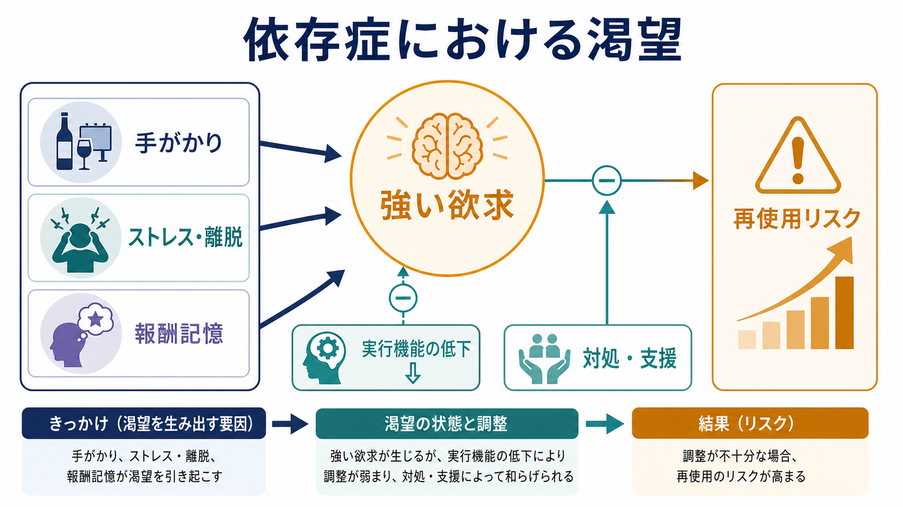
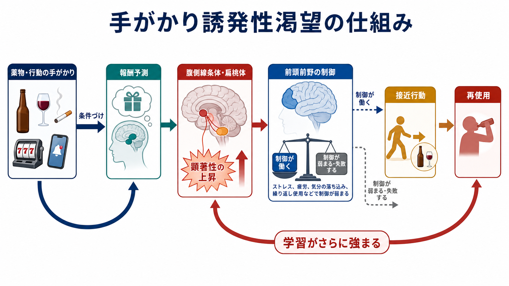
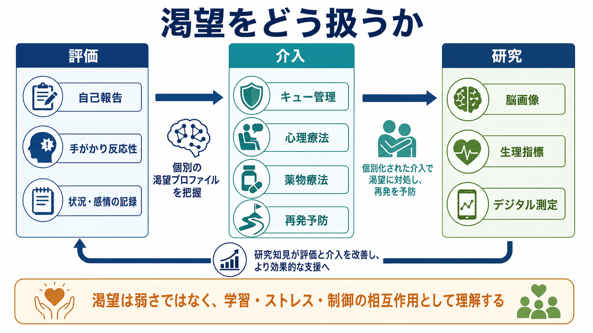

# 依存症における渇望とは何か

## 要点

- 渇望とは、物質や行動を「使いたい」「したい」と感じる強い欲求であり、単なる好みや意志の弱さではない。
- 依存症では、薬物・アルコール・ギャンブル・ゲームなどに結びついた手がかり、ストレス、離脱、感情状態、報酬記憶が渇望を引き起こしうる。
- 渇望は DSM-5 以降の物質使用障害の診断基準にも入り、ICD-11 でも依存の中核的特徴に近い「強い内的駆動」と関連づけられている [1], [2]。
- 神経科学的には、報酬予測、顕著性、習慣、ストレス系、前頭前野による制御の相互作用として理解される [3], [4]。
- 渇望があることは再使用リスクを高めうるが、渇望そのものが必ず再使用を意味するわけではない。評価、環境調整、心理療法、薬物療法、支援関係によって扱える臨床ターゲットである [5], [6]。

## この記事で答える問い

この記事では、[[オピオイド使用障害とは何か]]、[[ニコチン使用障害とは何か]]、[[ギャンブル障害とは何か]]、[[ゲーム行動症とは何か]]のような依存症関連ノートを読む前提として、渇望が何を指し、なぜ再使用や再発に関わるのかを整理する。中心的な問いは次の 4 つである。

1. 渇望は「欲しい気持ち」とどう違うのか。
2. 手がかり、ストレス、離脱、報酬記憶はどのように渇望を強めるのか。
3. 渇望は脳内の報酬系・ストレス系・制御系とどう関係するのか。
4. 臨床や研究では、渇望をどのように評価し、再発予防に接続するのか。

## まず結論

依存症における渇望は、「快楽を求める気持ち」だけではなく、学習された手がかりに注意が捕まること、報酬を予測するシステムが過敏になること、ストレスや離脱によって不快感を下げたい動機が高まること、そして前頭前野による行動制御が一時的に弱まることが重なって生じる状態である [3], [4]。

したがって渇望は、本人の道徳性を測るものではない。むしろ「どの状況で、どの感情や身体感覚を伴って、どの手がかりに反応して、どれくらい持続するか」を記録することで、再使用リスクを下げるための介入点になる [5], [7]。

## 背景

依存症は、物質や行動を繰り返すなかで、使用・実行をやめたい意思があっても制御しにくくなる状態として理解される。DSM-5 では物質使用障害の基準に「その物質を使いたいという強い欲求または衝動」が加えられ、DSM-IV から DSM-5 への変更点としても渇望の追加が明示されている [1]。ICD-11 では、依存は「使用を調節できない状態」として記述され、強い内的駆動、使用の優先順位上昇、害があっても続く使用、しばしば伴う主観的な urge/craving が重視される [2]。

この位置づけは重要である。渇望は「診断名をつけるための項目」にとどまらず、再使用リスク、治療経過、介入効果の評価と結びつく臨床的な変数である [5]。ただし、渇望は主観的体験なので、測り方、質問のタイミング、物質や行動の種類、環境文脈によって値が変わる [6]。

## 基本概念

### 渇望は強い欲求だが、単純な快感ではない

渇望は、英語では craving と呼ばれ、「強い欲求」「切迫した使用衝動」「頭から離れない感じ」などとして経験される。ここで大切なのは、渇望が「好きだから欲しい」という単純な快感ではない点である。インセンティブ感作理論では、依存症では薬物や関連手がかりへの「欲しい」反応が過敏化しうる一方で、実際の快感である「好き」とは分離しうると説明される [4]。

たとえば、本人は「もう楽しくない」「後悔すると分かっている」と感じていても、特定の場所、匂い、時間帯、スマートフォン通知、現金、対人ストレスなどが引き金となり、使用や行動への接近が強くなることがある。このとき渇望は、価値判断というよりも、学習された注意・予測・身体反応のまとまりとして現れる。

### 手がかり誘発性渇望

手がかり誘発性渇望とは、過去の使用や行動と結びついた刺激に触れたとき、渇望が強まる現象である。アルコールであれば酒瓶や飲み会の場面、ニコチンであれば喫煙場所や休憩時間、ギャンブルであれば広告や入金画面、ゲームであれば通知やログイン報酬が手がかりになりうる。キュー反応性研究のメタ分析では、依存関連刺激に対して自己報告の渇望や生理反応が変化することが示されてきた [7]。

この仕組みは、古典的条件づけだけでなく、報酬予測、注意の捕捉、接近行動、習慣化を含む。つまり、手がかりは単なる「思い出」ではなく、行動を始める準備状態を作る信号として働く。

### 負の強化としての渇望

渇望は「快を得たい」方向だけでなく、「不快を下げたい」方向にも生じる。離脱症状、不安、いらだち、抑うつ気分、孤立、睡眠不足、身体痛などがあると、使用や行動が一時的な緩和手段として想起されやすくなる。Koob と Volkow の神経回路モデルでは、依存症のサイクルは酩酊・報酬、離脱・負の感情、渇望・予期の段階として整理され、ストレス系や拡張扁桃体の関与が重視される [3]。

## 仕組み

### 1. 報酬記憶が手がかりに意味を与える

物質や行動が繰り返されると、「何をしたら、どのような効果が得られるか」という記憶が形成される。腹側線条体、扁桃体、海馬、前頭前野などは、報酬、感情、文脈、行動選択を結びつける。依存症では、このネットワークが特定の物質・行動や関連手がかりに過剰な顕著性を与えやすくなる [3], [4]。

ここでいう顕著性とは、「それが重要に見える」「注意が引っ張られる」「今すぐ対処すべき対象に感じられる」という性質である。渇望が強いとき、本人は理屈では危険性を理解していても、手がかりが行動選択の中心に入り込みやすい。

### 2. ストレスと離脱が「使えば楽になる」という予測を強める

離脱やストレスは、渇望を強める代表的な内的手がかりである。依存症では報酬系の反応低下とストレス系の亢進が重なり、通常の活動では十分な報酬感が得にくくなる一方、不快感から逃れる動機が強くなる [3]。この状態では、使用や行動が「快楽」よりも「不快の軽減」として選ばれやすい。

### 3. 前頭前野の制御が文脈によって揺らぐ

前頭前野は、長期的目標、抑制、計画、リスク評価に関わる。睡眠不足、強い情動、ストレス、急な手がかり、社会的圧力が重なると、前頭前野による制御が一時的に弱まり、接近行動が出やすくなる。渇望はこの「報酬・顕著性が上がり、制御が下がる」瞬間に強く経験される [3]。

## 図解

渇望は、次のような連鎖として整理できる。

| 段階 | 何が起きるか | 介入点 |
|---|---|---|
| 手がかり | 場所、人、感情、通知、身体感覚が使用記憶を呼び起こす | 手がかりの把握、環境調整、刺激統制 |
| 報酬予測 | 「使えば変わる」「楽になる」という予測が強まる | 認知再評価、代替行動、遅延方略 |
| 身体・感情反応 | 緊張、焦燥、期待、不安、離脱感が高まる | 呼吸、マインドフルネス、睡眠・ストレス管理 |
| 制御の揺らぎ | 長期目標よりも短期的接近が優勢になる | 支援者への連絡、危険場面の回避、薬物療法 |
| 再使用 | 一時的軽減や報酬が学習を強化する | 再発予防計画、再使用後の早期立て直し |

この表は臨床判断の代替ではない。渇望の評価や介入は、物質・行動の種類、身体状態、併存する精神症状、生活環境、治療歴によって変わる。

## 臨床・研究との接続

### 評価

渇望は、自己報告尺度、面接、日誌、スマートフォンを用いた生態学的瞬間評価、手がかり反応性課題、生理指標、脳画像などで評価される。Sayette は、渇望研究では「何を craving と呼ぶか」「どの時間幅で測るか」「使用可能性がある状況か」「自己報告と行動がどの程度対応するか」が重要な方法論的問題だと整理している [6]。

日常生活内での測定を扱うレビューでは、渇望と使用の関連は多くの研究で支持され、特に使用に近い時間で測った渇望ほど再使用との関連が見えやすいとされる [8]。これは、外来面接で週 1 回だけ尋ねるよりも、生活場面で「いつ、どこで、何に反応したか」を見ることの重要性を示している。

### 介入

渇望への介入は、渇望をゼロにすることだけを目標にしない。むしろ、渇望が起きたときに行動へ直結しにくくすること、危険場面を予測すること、使用以外の調整手段を増やすことが中心になる。認知行動療法、動機づけ面接、再発予防、 contingency management、家族・社会的支援、物質ごとの薬物療法などが組み合わされる。

たとえば[[ニコチン使用障害とは何か]]では喫煙手がかり、[[オピオイド使用障害とは何か]]では離脱・疼痛・過量服用リスク、[[ギャンブル障害とは何か]]では金銭・広告・オンライン環境、[[ゲーム行動症とは何か]]では通知・報酬スケジュール・社会的接続が、それぞれ渇望の文脈として重要になる。

### 研究

研究上は、渇望を単独の症状として扱うだけでなく、報酬学習、ストレス反応、習慣、実行機能、環境手がかり、デジタル行動ログと結びつけて測る方向に進んでいる。脳画像研究では、腹側線条体、扁桃体、前頭前野、島皮質などの関与が検討されるが、特定の脳部位だけで渇望を説明するのは単純化しすぎである。渇望は、脳、身体、環境、学習史、社会的文脈の相互作用として理解する必要がある。

## よくある誤解

### 誤解1: 渇望があるなら、本人は本気でやめたいと思っていない

渇望は、やめたい意思と同時に存在しうる。むしろ依存症では、「やめたい」という長期目標と「今すぐ使いたい」という短期的衝動が競合する。渇望を意思の欠如とみなすと、本人が状況を記録し、支援を求め、再発予防策を使う機会を減らしてしまう。

### 誤解2: 渇望は快楽への欲求だけである

渇望には、快を得たい欲求だけでなく、不快、ストレス、離脱、空虚感、痛みを下げたい欲求も含まれる。特に長期化した依存では、使用や行動は「楽しいから」ではなく「つらさを一時的に下げるから」続くことがある [3]。

### 誤解3: 渇望が出たら再発は避けられない

渇望は再使用リスクを上げうるが、決定論ではない。渇望の強さ、持続時間、手がかり、使用可能性、支援へのアクセス、代替行動、治療薬、睡眠やストレス状態によって、行動につながるかどうかは変わる [5], [8]。

### 誤解4: 渇望は物質依存にだけ関係する

渇望は物質使用障害で特に研究されてきたが、ギャンブルやゲームのような行動嗜癖でも、手がかり、報酬予測、接近行動、制御の揺らぎという類似した枠組みで理解できる。ただし、物質と行動では身体依存、離脱、薬物療法、社会的影響の性質が異なるため、同じ説明を機械的に当てはめるべきではない。

## 関連ノート

- [[DSMとICDは何が違うのか]]
- [[オピオイド使用障害とは何か]]
- [[ニコチン使用障害とは何か]]
- [[ギャンブル障害とは何か]]
- [[ゲーム行動症とは何か]]
- [[カフェイン関連障害とは何か]]

## MOC更新候補

- `content/00_MOC/` 内の精神医学、依存症、臨床心理、神経科学関連 MOC に、本記事へのリンクを追加候補とする。
- 並列ジョブとの競合を避けるため、この作業では MOC 本体は更新しない。

## 理解チェック

1. 渇望が「好き」と同じではない理由を、インセンティブ感作理論の言葉で説明できるか。
2. 手がかり誘発性渇望の例を、物質依存と行動嗜癖から 1 つずつ挙げられるか。
3. ストレスや離脱が渇望を強める仕組みを、負の強化として説明できるか。
4. 渇望が再使用リスクを高めても、再使用を必ず意味しない理由を説明できるか。

## 未解決問題

- 渇望の自己報告、行動指標、生理指標、脳画像指標は、どの程度同じ現象を測っているのか。
- 渇望を標的にした介入効果は、物質や行動の種類、併存症、社会環境によってどのように変わるのか。
- スマートフォンやウェアラブルによるリアルタイム測定は、プライバシーを守りながら再発予防にどこまで使えるのか。

## 参考文献

[1] Substance Abuse and Mental Health Services Administration. "The DSM-IV and DSM-5 estimates for SUD are so different. Which set is right?" https://www.samhsa.gov/data/faq/release-faqs/dsm-iv-and-dsm-5-estimates-sud-are-so-different-which-set-right

[2] Heinz, A., Kiefer, F., Smolka, M. N., et al. (2022). ICD-11: changes in the diagnostic criteria of substance dependence. *European Archives of Psychiatry and Clinical Neuroscience*, 272, 213-221. https://doi.org/10.1007/s00406-020-01233-7

[3] Koob, G. F., & Volkow, N. D. (2016). Neurobiology of addiction: a neurocircuitry analysis. *The Lancet Psychiatry*, 3(8), 760-773. https://doi.org/10.1016/S2215-0366(16)00104-8

[4] Robinson, T. E., & Berridge, K. C. (2008). The incentive sensitization theory of addiction: some current issues. *Philosophical Transactions of the Royal Society B*, 363(1507), 3137-3146. https://doi.org/10.1098/rstb.2008.0093

[5] Tiffany, S. T., & Wray, J. M. (2012). The clinical significance of drug craving. *Annals of the New York Academy of Sciences*, 1248(1), 1-17. https://doi.org/10.1111/j.1749-6632.2011.06298.x

[6] Sayette, M. A. (2016). The role of craving in substance use disorders: theoretical and methodological issues. *Annual Review of Clinical Psychology*, 12, 407-433. https://doi.org/10.1146/annurev-clinpsy-021815-093351

[7] Carter, B. L., & Tiffany, S. T. (1999). Meta-analysis of cue-reactivity in addiction research. *Addiction*, 94(3), 327-340. https://doi.org/10.1046/j.1360-0443.1999.9433273.x

[8] Serre, F., Fatseas, M., Swendsen, J., & Auriacombe, M. (2015). Ecological momentary assessment in the investigation of craving and substance use in daily life: a systematic review. *Drug and Alcohol Dependence*, 148, 1-20. https://doi.org/10.1016/j.drugalcdep.2014.12.024
