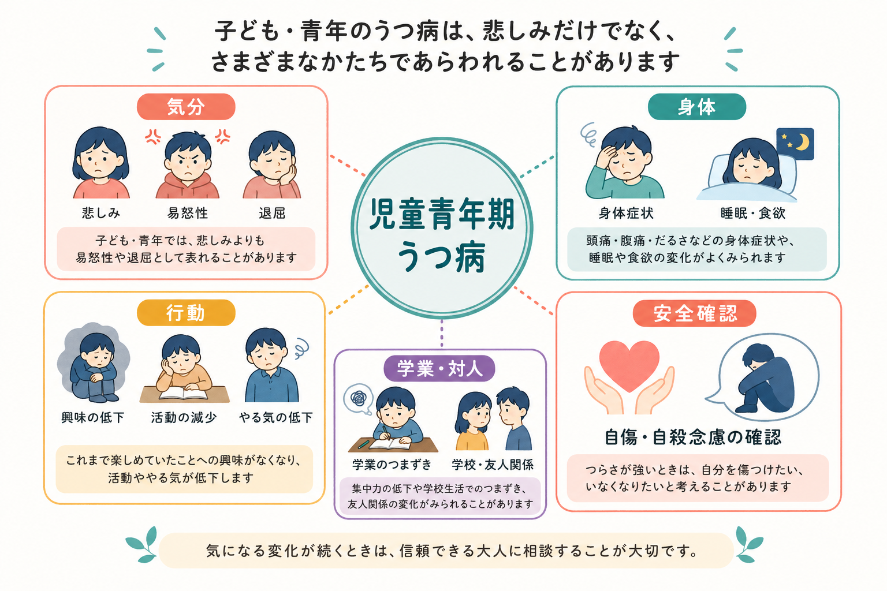
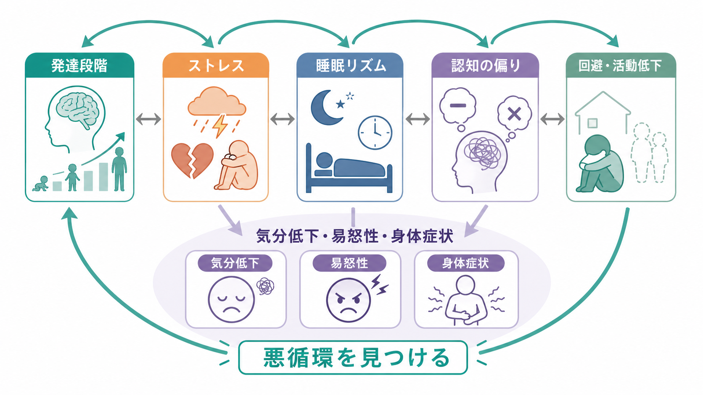
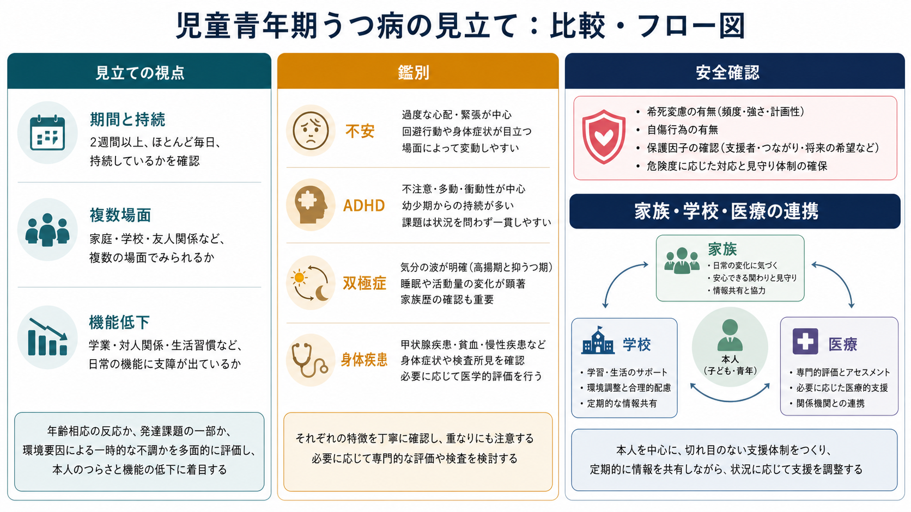

# 児童青年期うつ病とは何か

## 要点

- 児童青年期うつ病は、成人の[[うつ病とは何か|うつ病]]と同じく抑うつ気分または興味・喜びの低下を中核とするが、子どもでは「悲しい」と言語化されず、易怒性、かんしゃく、退却、学業低下、身体症状として目立つことがある[1][2]。
- 2週間以上の持続、以前からの変化、家庭・学校・友人関係など複数領域での機能低下を合わせて見る。単なる反抗、怠け、性格の問題として片づけない[1][3]。
- 頭痛、腹痛、疲労、睡眠・食欲変化は重要な手がかりだが、身体疾患、薬剤、睡眠障害、[[不安症群とは何か|不安症]]、[[ADHDとは何か|ADHD]]、[[双極性障害とは何か|双極性障害]]、[[PTSDとは何か|PTSD]]などとの鑑別も必要になる[2][4]。
- 自傷、希死念慮、いじめ、虐待、物質使用は、本人だけでなく保護者・支援者からも情報を集めつつ、本人が安全に話せる場を確保して確認する[3][5]。
- 治療は、心理教育、家族・学校との環境調整、心理療法、必要時の薬物療法を組み合わせる。薬物療法は利益とリスクを慎重に説明し、特に自殺関連事象を継続的にモニターする[5][6][7]。

## この記事で答える問い

1. 児童青年期うつ病は、成人のうつ病と何が同じで、何が違うのか。
2. 易怒性、身体症状、学業低下は、どのように抑うつの表現として理解できるのか。
3. 臨床・研究では、何を評価し、何と鑑別し、どのように支援へつなげるのか。

## まず結論

児童青年期うつ病は、「悲しそうに見える子」だけを指す概念ではない。子どもや青年は、気分を言葉で説明する力、自己観察の精度、周囲に助けを求める方法が発達途上にあるため、抑うつは怒りっぽさ、反抗、ひきこもり、身体の不調、成績低下、友人関係の変化として現れやすい[1][2]。

したがって見立ての中心は、「気分が落ちているか」だけではなく、「以前ならできていた生活・遊び・学習・対人関係が、どの程度失われているか」である。本人の主観、保護者の観察、学校での変化、身体評価、安全確認を合わせて、発達段階に応じて理解する必要がある[3][5]。

## 背景

青年期のうつ病は世界的に重要な健康課題であり、思春期以降に頻度が上がり、学業、家族関係、友人関係、将来の精神健康、自殺リスクに影響する[8]。一方で、青年期は気分の波、睡眠相の変化、対人葛藤、進路ストレスが増える時期でもある。そのため、日常的な不機嫌や反抗と、治療・支援を要する抑うつ状態を見分けるには、持続性、重症度、機能低下、危険性を見る必要がある。

児童期ではさらに、本人が「憂うつ」「空虚」「無価値感」といった内的状態を直接語れないことがある。AACAP の実践パラメータは、子どものうつ病では気分の不安定さ、易怒性、欲求不満耐性の低下、かんしゃく、身体愁訴、社会的ひきこもりが、抑うつ気分の言語化に代わって前景化しうると整理している[1]。

## 基本概念

### 診断名より先に見るべきこと

臨床診断としての大うつ病エピソードでは、抑うつ気分または興味・喜びの低下を含む複数症状が、ほとんど毎日、少なくとも2週間続き、苦痛や機能低下をもたらすことが重視される。小児・青年では、抑うつ気分が「易怒的な気分」として現れる点が重要である[1][2]。

ただし、この記事の目的は診断基準を暗記することではない。実際の見立てでは、次の4点を同時に確認する。

| 視点 | 見るポイント |
|---|---|
| 持続 | 数時間の不機嫌ではなく、日単位・週単位で続いているか |
| 変化 | その子にとって以前と比べて何が変わったか |
| 機能 | 家庭、学校、友人関係、遊び、睡眠、食事への影響 |
| 安全 | 自傷、希死念慮、いじめ、虐待、物質使用の有無 |

### 子どもに特有の抑うつ表現

児童青年期うつ病では、次のような表現が目立つことがある。

- **易怒性**: 些細なことで怒る、泣く、かんしゃくを起こす、反抗的に見える。
- **身体症状**: 頭痛、腹痛、吐き気、疲れやすさ、痛み、朝の不調。
- **行動変化**: 登校しぶり、宿題に手がつかない、部活動や遊びをやめる、部屋にこもる。
- **睡眠・食欲の変化**: 眠れない、寝すぎる、昼夜逆転、食欲低下または過食。
- **認知・自己評価の変化**: 「どうせ無理」「自分が悪い」「消えたい」といった考え。
- **対人変化**: 友人を避ける、SNS や対人トラブルに過敏になる、孤立する。

Merck Manual も、子どものうつ病では悲しみより易怒性が優勢になり、過活動、攻撃的・反社会的行動として見えることがあると説明している[2]。この点は、[[ADHDとうつ病はどう鑑別するのか]]や[[双極性障害とうつ病はどう鑑別するのか]]と接続して考えると理解しやすい。

## 仕組み

### 発達段階と表現型

児童青年期うつ病の「仕組み」は、単一の脳内物質や単一の心理要因では説明できない。発達段階、遺伝的脆弱性、家族歴、いじめや喪失などの心理社会的ストレス、睡眠・概日リズム、認知様式、報酬系、対人環境が相互に作用する[8]。

児童期では、気分を言語化する前に身体や行動に出る。青年期では、自己評価、対人比較、将来不安、拒絶への感受性が強まり、抑うつが「自分は価値がない」「誰にも必要とされていない」という意味づけと結びつきやすい。これは[[身体症状症とうつ病はどう関係するのか]]、[[不安症とうつ病はどう併存するのか]]とも重なる。

### 悪循環として理解する

抑うつが続くと、活動量が下がり、楽しい経験や達成経験が減る。すると報酬経験が減り、さらに気分が沈み、学校や友人関係から退く。睡眠リズムが乱れると、疲労、集中困難、易怒性が増し、保護者や教師から叱責されやすくなる。この叱責や失敗経験が、自己評価の低下をさらに強める。

この悪循環モデルは、「本人が努力していない」という説明ではない。むしろ、どこに介入可能な輪があるかを探すための地図である。睡眠、登校負荷、家庭内葛藤、いじめ、身体疾患、学習困難、発達特性、孤立、活動低下など、輪のどこが強く働いているかを見立てる。

## 図解

上の1枚目は、症状を「気分」「身体」「行動」「学業・対人」「安全確認」に分けて眺めるための概念地図である。2枚目は、ストレス、睡眠リズム、認知の偏り、回避・活動低下が循環して症状を維持する流れを示している。

3枚目は、鑑別と支援接続のための図である。児童青年期うつ病の見立てでは、期間、複数場面での変化、機能低下、安全確認、併存・鑑別を順番に確認する。

## 臨床・研究との接続

### 評価

NICE は、うつ病の子ども・若者を評価するとき、アルコール・薬物使用、いじめや虐待、自傷、希死念慮を直接確認することを勧めている[3]。ここで重要なのは、危険な質問を避けることではなく、安全に尋ねることである。本人が保護者の前では話せない内容もあるため、年齢と状況に応じて、本人だけで話せる時間を確保する。

GLAD-PC は、青年期うつ病の初期評価で、危険因子、併存症、機能低下、家族・学校・地域資源を含めた評価を重視する[5]。尺度は有用だが、点数だけで診断や重症度判断を完結させない。家庭、学校、友人関係での機能を追跡し、症状改善と機能改善が同時に進むとは限らないことも意識する[6]。

### 鑑別と併存

児童青年期うつ病で特に注意する鑑別は次の通りである。

| 鑑別・併存 | 見るポイント |
|---|---|
| [[不安症群とは何か]] | 回避、身体症状、登校困難が不安を中心に生じていないか |
| [[ADHDとは何か]] | 不注意・衝動性が以前から広範にあるか、抑うつ後に悪化したか |
| [[双極性障害とは何か]] | 高揚気分、睡眠欲求低下、誇大性、活動性亢進のエピソード |
| [[PTSDとは何か]] | トラウマ再体験、過覚醒、回避、解離、虐待・暴力体験 |
| [[身体疾患による気分障害とは何か]] | 内分泌疾患、貧血、慢性疼痛、薬剤、睡眠障害など |
| [[身体症状症とは何か]] | 身体症状へのとらわれが主病像か、抑うつに伴う身体化か |

鑑別は、どれか一つに排他的に決める作業ではない。実際には、不安、発達特性、睡眠問題、家族葛藤、身体疾患が併存し、抑うつを強めることがある。併存を見落とすと、うつ病だけに焦点化した支援が届きにくくなる。

### 支援と治療

軽症では、心理教育、支持的関わり、生活リズムの調整、家族・学校との連携、定期的なモニタリングが基本になる。GLAD-PC は、軽症例では一定期間の能動的支援とモニタリングを考慮し、中等症・重症例、精神病症状、物質使用、強い自殺リスクなどがあれば専門家との連携を勧めている[6]。

心理療法では、認知行動療法、対人関係療法、家族を含む支援が代表的である。薬物療法については、Cochrane のネットワークメタ解析が、新世代抗うつ薬には症状軽減の可能性がある一方、自殺関連アウトカムや有害事象のリスクを慎重に扱う必要があると整理している[7]。したがって、薬物療法は「飲めば解決」でも「絶対に使ってはいけない」でもなく、重症度、本人・家族の希望、心理療法へのアクセス、リスク、継続的モニタリングを含めて判断される。

## よくある誤解

### 「子どもはうつ病にならない」

子どもや青年もうつ病になりうる。むしろ、表現が成人と違うため見落とされやすい。悲しみの言語化がなくても、易怒性、身体症状、登校困難、興味の低下、友人関係の撤退が続く場合は評価が必要である[1][2]。

### 「怒りっぽいなら、うつ病ではない」

小児・青年では、易怒性が抑うつ気分の主要な表現になることがある。もちろん、すべての怒りがうつ病ではない。発達特性、家庭・学校環境、トラウマ、睡眠不足、双極性障害、破壊的気分調節不全症なども含めて、持続と機能低下を見る。

### 「身体症状があるなら、精神的な問題ではない」

身体症状があるからといって抑うつを除外できない。同時に、抑うつを疑うからといって身体評価を省略してよいわけでもない。頭痛、腹痛、疲労、体重変化、睡眠障害は、身体疾患・薬剤・生活リズム・心理的要因の交点として評価する。

### 「自殺の話を聞くと危険になる」

自殺念慮や自傷について、落ち着いて直接尋ねることは安全確認の一部である。NICE も、自傷や希死念慮を直接尋ねることを推奨している[3]。重要なのは、責めるのではなく、具体的な危険、手段へのアクセス、保護因子、支援者とのつながりを確認することである。

## 関連ノート

- [[うつ病とは何か]]
- [[大うつ病性障害とは何か]]
- [[持続性抑うつ障害とは何か]]
- [[非定型うつ病とは何か]]
- [[メランコリー型うつ病とは何か]]
- [[気分障害における自殺リスクとは何か]]
- [[自殺関連行動障害とは何か]]
- [[非自殺性自傷とは何か]]
- [[ADHDとうつ病はどう鑑別するのか]]
- [[双極性障害とうつ病はどう鑑別するのか]]
- [[不安症とうつ病はどう併存するのか]]
- [[身体症状症とうつ病はどう関係するのか]]

### MOC更新候補

- `content/00_MOC/` 配下の精神医学・気分障害・児童青年精神医学系 MOC があれば、本記事を追加候補にする。
- 並列ジョブとの競合を避けるため、このタスクでは MOC 本体は更新しない。

### 今後の作成候補

- 児童青年期うつ病の評価尺度とは何か
- 児童青年期うつ病と登校困難はどう関係するのか
- 破壊的気分調節不全症とうつ病はどう鑑別するのか
- 児童青年期うつ病における家族支援とは何か

## 理解チェック

1. 児童青年期うつ病で、悲しみよりも易怒性や身体症状が目立つことがあるのはなぜか。
2. 一時的な不機嫌と、臨床的に問題となる抑うつ状態を分ける視点は何か。
3. 登校困難を伴う抑うつで、うつ病以外に確認すべき鑑別・併存は何か。
4. 自傷・希死念慮を確認するとき、本人だけで話せる場を設ける意義は何か。
5. 薬物療法を考える際、利益だけでなくどのようなリスクを継続的に見る必要があるか。

## 参考文献

[1] Birmaher, B., Brent, D., & AACAP Work Group on Quality Issues. (2007). Practice Parameter for the Assessment and Treatment of Children and Adolescents With Depressive Disorders. *Journal of the American Academy of Child & Adolescent Psychiatry*, 46(11), 1503-1526. https://doi.org/10.1097/chi.0b013e318145ae1c

[2] Merck Manual Professional Edition. Depressive Disorders in Children and Adolescents. Reviewed/Revised Oct 2025. https://www.merckmanuals.com/en-ca/professional/pediatrics/psychiatric-disorders-in-children-and-adolescents/depressive-disorders-in-children-and-adolescents

[3] National Institute for Health and Care Excellence. (2019). *Depression in children and young people: identification and management* (NG134). https://www.nice.org.uk/guidance/ng134/chapter/Recommendations

[4] National Institute of Mental Health. Child and Adolescent Mental Health. https://www.nimh.nih.gov/health/topics/child-and-adolescent-mental-health/index.shtml

[5] Zuckerbrot, R. A., Cheung, A., Jensen, P. S., Stein, R. E. K., Laraque, D., & GLAD-PC Steering Group. (2018). Guidelines for Adolescent Depression in Primary Care (GLAD-PC): Part I. Practice Preparation, Identification, Assessment, and Initial Management. *Pediatrics*, 141(3), e20174081. https://doi.org/10.1542/peds.2017-4081

[6] Cheung, A. H., Zuckerbrot, R. A., Jensen, P. S., Laraque, D., Stein, R. E. K., & GLAD-PC Steering Group. (2018). Guidelines for Adolescent Depression in Primary Care (GLAD-PC): Part II. Treatment and Ongoing Management. *Pediatrics*, 141(3), e20174082. https://doi.org/10.1542/peds.2017-4082

[7] Hetrick, S. E., McKenzie, J. E., Bailey, A. P., Sharma, V., Moller, C. I., Badcock, P. B., Cox, G. R., Merry, S. N., & Meader, N. (2021). New generation antidepressants for depression in children and adolescents: a network meta-analysis. *Cochrane Database of Systematic Reviews*, CD013674. https://doi.org/10.1002/14651858.CD013674.pub2

[8] Thapar, A., Collishaw, S., Pine, D. S., & Thapar, A. K. (2012). Depression in adolescence. *The Lancet*, 379(9820), 1056-1067. https://doi.org/10.1016/S0140-6736(11)60871-4
