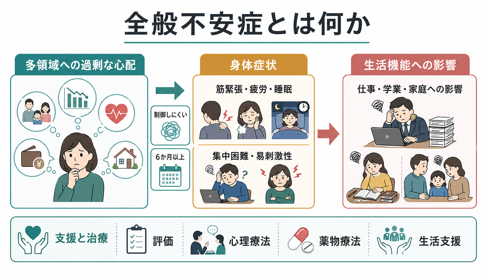
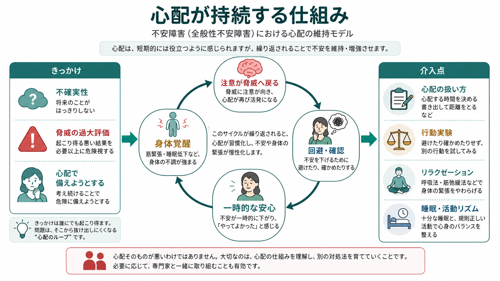
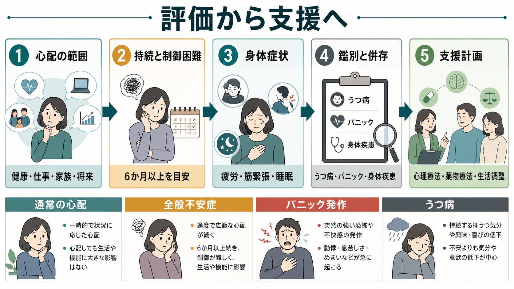

# 全般不安症とは何か

## 要点

- 全般不安症は、健康、仕事・学業、家族、経済、将来など複数領域への心配が長く続き、本人が制御しにくく、生活機能を妨げる状態である[1][2]。
- 中核は「心配が多い性格」ではなく、心配、身体覚醒、回避・確認行動、睡眠低下、集中困難が循環して、[[不安とは何か|不安]]が持続することである[3][4]。
- 身体症状として、筋緊張、疲労、落ち着かなさ、易刺激性、集中困難、睡眠障害が目立つ。本人は「身体がずっと警戒している」「考えを止められない」と表現することがある[1][2]。
- 臨床では、[[うつ病とは何か|うつ病]]、パニック発作、身体疾患、薬物・物質、睡眠問題、発達特性、生活上のストレスをあわせて評価する[2][6]。
- 心理療法、とくに認知行動療法に基づく介入には短期的な症状軽減の根拠があり、薬物療法も選択肢になる。ただし治療選択は重症度、併存症、本人の希望、副作用リスクを踏まえて個別に行う[6][7][8]。

## この記事で答える問い

1. 全般不安症は、通常の心配や一時的なストレス反応と何が違うのか。
2. なぜ心配は「考えれば考えるほど解決する」ではなく、持続するループになりうるのか。
3. 身体症状や認知的特徴は、診断・支援・研究でどのように扱われるのか。

## まず結論

全般不安症は、特定の対象だけを怖がる病態ではない。むしろ、生活のさまざまな領域にわたる「もし悪いことが起きたら」という予測が広がり、心配を止めにくくなる状態である。心配は短期的には備えや安心をもたらすように感じられるが、長期的には注意を脅威へ戻し、身体覚醒や回避・確認を増やし、睡眠や集中を妨げることがある[3][4]。

このノートは教育・研究目的の整理であり、個別の診断や治療指示ではない。症状が生活を妨げる場合、自傷念慮がある場合、身体疾患や薬剤の影響が疑われる場合は、医療・心理の専門職による評価が優先される。

## 背景

心配は本来、将来の問題に備えるための認知的機能である。予定を立てる、危険を見積もる、失敗を避けるといった働きは適応的になりうる。しかし全般不安症では、心配の範囲が広く、頻度と強度が高く、制御が難しく、生活上の役割を妨げる点が問題になる[1][2]。

NIMHの説明では、全般不安症では健康、金銭、学校、仕事、家族など日常的な事柄への心配が、状況に比べて過度に、より頻繁または強く現れる。診断上は、少なくとも6か月、多くの日に心配を制御しにくく、落ち着かなさ、疲労、集中困難、易刺激性、筋緊張、睡眠問題などが伴うことが重視される[1]。DSMやICDの分類の違いは [[DSMとICDは何が違うのか]] と合わせて読むと整理しやすい。

不安症群は、臨床的にも公衆衛生上も重要である。Nature Reviews Disease Primers のレビューは、不安症を、過度で持続する恐怖・不安・回避を特徴とし、役割機能の制限から重度の障害まで幅広い影響をもつ疾患群として整理している[3]。全般不安症はその中でも「多領域の心配」と「制御困難」が中心にある。

## 基本概念

### 通常の心配との違い

通常の心配は、問題が具体的で、時間や場面にある程度結びつき、行動によって収束しやすい。たとえば「明日の発表が心配なので資料を確認する」は、状況に対応した心配である。

全般不安症では、心配の対象が次々と移り、確認しても安心が長続きしにくい。健康、仕事、家族、将来、対人関係、経済など、複数の領域が同時に心配の対象になる。本人は「考えすぎだと分かっているが止められない」「安心してもすぐ次の心配が出る」と感じることがある[1][2]。

### 身体症状

全般不安症は「頭の中の心配」だけではない。筋緊張、肩こり、頭痛、胃腸症状、疲労、発汗、ふるえ、息苦しさ、睡眠困難など、身体の警戒反応として現れることが多い[1][2]。[[ノルアドレナリン系は不安と覚醒にどう関わるのか]] や [[扁桃体過活動は不安症やPTSDにどう関わるのか]] と接続すると、覚醒、注意、脅威検出の観点から理解しやすい。

### 鑑別で見ること

全般不安症に似た訴えは多い。パニック発作では急激な強い恐怖と身体症状が前景に出やすく、[[予期不安とは何か|予期不安]]は特定の発作や出来事への予測不安として現れることがある。うつ病では抑うつ気分、興味・喜びの低下、希死念慮、睡眠・食欲・活動性の変化が中心になることがある。甲状腺機能、循環器・呼吸器疾患、カフェインや薬剤、アルコール、睡眠不足も不安症状を強めうるため、臨床評価では幅広い確認が必要である[2][6]。

## 仕組み

### 不確実性への弱さ

全般不安症の認知モデルでは、不確実性を不快で危険なものとして扱いやすいことが重要視される。Dugasらのモデルでは、不確実性への不耐性、心配への肯定的信念、問題志向の否定性、認知的回避が、心配の重症度と関係する要素として整理されている[5]。

ここでいう不確実性への不耐性は、「分からないことがあると落ち着かない」という単純な好みではない。将来を完全に予測できないことを危険として読み、悪い可能性を消すまで考え続ける傾向である。その結果、心配は問題解決ではなく、安心を得るための反復的な確認になる。

### 心配の短期的報酬と長期的維持

心配には短期的な機能がある。心配している間は「備えている」「油断していない」と感じられ、最悪の事態を想像することで不意打ちを避けられるように思える。Newmanらのレビューは、全般不安症の心配が、強い情動変化を避けるために持続的な否定的情動状態を保つという、コントラスト回避モデルを提示している[4]。

しかし、この短期的な安心は長期的な維持因子になりうる。心配によって一時的に不安が下がると、「心配したから大丈夫だった」と学習される。回避や確認が増えると、不確実性に耐える経験や、予測が外れても対処できる経験が得られにくくなる。そのため、次の不確実な場面でも再び心配が起動しやすい。

### 身体覚醒と注意のループ

身体覚醒は、心配の燃料にも結果にもなる。筋緊張や動悸、胃腸の違和感が出ると、「何か悪いことが起きているのではないか」と解釈され、さらに注意が身体や脅威へ向く。睡眠が悪化すると疲労と集中困難が増え、仕事や学業の効率低下が新たな心配の材料になる。

この循環は、[[5Pモデルとは何か]] の「誘因・素因・維持因子・保護因子・問題」の枠組みで整理しやすい。発症のきっかけだけでなく、現在症状を保っている維持因子を見ることが、支援計画につながる。

## 図解

この記事の図は、全般不安症を3つの視点から整理している。

1. 1枚目は、全般不安症の全体像を、多領域の心配、身体症状、生活機能への影響、支援と治療の関係として示す。
2. 2枚目は、心配が持続するループを、不確実性、脅威評価、回避・確認、身体覚醒、短期的安心から示す。
3. 3枚目は、臨床評価から支援計画へ進む流れを、鑑別と併存も含めて示す。

## 臨床・研究との接続

### 評価

評価では、心配の範囲、持続期間、制御困難、身体症状、生活機能への影響を確認する[1][2]。また、抑うつ、自殺リスク、パニック発作、強迫症状、トラウマ関連症状、身体疾患、薬剤・物質、睡眠、発達歴、家族・職場・学校環境をあわせて見る。尺度はスクリーニングや経過観察に役立つが、尺度だけで診断が完結するわけではない。

### 心理療法

NICEは、全般不安症の支援を段階的ケアとして整理し、同定・評価、心理教育、能動的モニタリング、低強度心理介入、高強度の認知行動療法や応用リラクセーション、薬物療法、専門的治療へ進むモデルを示している[6]。Cochraneレビューでは、成人の全般不安症に対する認知行動療法に基づく心理療法が、短期的には通常治療・待機群より不安症状を減らす根拠があるとまとめられている[7]。

心理療法では、心配を完全に消すことよりも、心配との距離をとる、不確実性に少しずつ触れる、回避・確認行動を減らす、問題解決と反復的心配を区別する、睡眠と活動リズムを整える、といった方針が検討される。

### 薬物療法

薬物療法では、SSRI、SNRI、プレガバリンなどが研究されている。BMJの系統的レビュー・メタ解析は、成人の全般不安症に対する複数の薬剤について、反応、寛解、忍容性を比較している[8]。ただし薬剤選択は、効果だけでなく、副作用、併存症、妊娠可能性、依存・離脱リスク、過去の反応、本人の希望を含めて判断される。ベンゾジアゼピン系薬は即効性がある一方で、依存、認知・運動機能への影響、長期使用の問題があるため、慎重な扱いが必要である[6][8]。

### 研究

研究では、全般不安症を単一の原因で説明するよりも、認知、情動調整、身体覚醒、睡眠、発達歴、対人関係、遺伝・神経生物学、社会環境を組み合わせた多層モデルとして扱う方向にある[3][4]。不確実性への不耐性、心配のメタ認知、回避行動、脅威注意、情動の急変への敏感さは、臨床評価と介入研究の橋渡しになる。

## よくある誤解

### 「心配性なだけで病気ではない」

心配の多さだけで全般不安症とみなすわけではない。重要なのは、心配が制御しにくく、持続し、身体症状や生活機能の障害を伴うかである[1][2]。

### 「原因は性格の弱さである」

全般不安症は、性格の弱さでは説明できない。遺伝的・発達的要因、ストレス経験、認知的特徴、身体覚醒、睡眠、対人環境などが重なって生じる[3][4]。

### 「身体症状があるなら精神疾患ではない」

不安は身体に現れる。筋緊張、胃腸症状、発汗、疲労、睡眠障害は全般不安症でもよく見られる[1][2]。ただし身体疾患や薬剤の影響を除外・評価することは重要である。

### 「心配をなくせばよい」

目標は心配をゼロにすることではなく、心配が生活を支配しないようにすることである。心配を問題解決に使える場面と、反復して不安を維持している場面を区別することが支援の入口になる。

## 関連ノート

- [[不安とは何か]]
- [[予期不安とは何か]]
- [[うつ病とは何か]]
- [[DSMとICDは何が違うのか]]
- [[5Pモデルとは何か]]
- [[ノルアドレナリン系は不安と覚醒にどう関わるのか]]
- [[扁桃体過活動は不安症やPTSDにどう関わるのか]]

今後の作成候補:

- 全般不安症の認知行動療法とは何か
- 不確実性への不耐性とは何か
- GAD-7は何を測っているのか
- 全般不安症とうつ病はどう併存するのか
- パニック症と全般不安症はどう鑑別するのか

MOC更新候補:

- 精神医学・不安症関連MOCに `[[全般不安症とは何か]]` を追加する。
- 疾患・症候群の索引に、全般不安症、全般性不安障害、GAD の別名で追加する。
- 並列ジョブとの競合を避けるため、このタスクではMOC本体は更新しない。

## 理解チェック

1. 通常の心配と全般不安症を分ける観点を、持続、制御困難、身体症状、生活機能の4点から説明できるか。
2. 心配が短期的な安心をもたらしながら、長期的には不安を維持する理由を説明できるか。
3. 全般不安症を評価するとき、うつ病、パニック発作、身体疾患、薬剤・物質、睡眠を確認する理由を説明できるか。
4. 認知行動療法や薬物療法を、個別の治療指示ではなく、エビデンスに基づく選択肢として説明できるか。

## 参考文献

[1] National Institute of Mental Health. *Generalized Anxiety Disorder: What You Need to Know*. https://www.nimh.nih.gov/health/publications/generalized-anxiety-disorder-gad

[2] Munir, S., & Takov, V. (2024). *Generalized Anxiety Disorder*. StatPearls. https://www.ncbi.nlm.nih.gov/books/NBK441870/

[3] Craske, M. G., Stein, M. B., Eley, T. C., Milad, M. R., Holmes, A., Rapee, R. M., & Wittchen, H.-U. (2017). Anxiety disorders. *Nature Reviews Disease Primers, 3*, 17024. https://doi.org/10.1038/nrdp.2017.24

[4] Newman, M. G., & Llera, S. J. (2011). A novel theory of experiential avoidance in generalized anxiety disorder: A review and synthesis of research supporting a contrast avoidance model of worry. *Clinical Psychology Review, 31*(3), 371-382. https://doi.org/10.1016/j.cpr.2011.01.008

[5] Dugas, M. J., Savard, P., Gaudet, A., Turcotte, J., Laugesen, N., Robichaud, M., Francis, K., & Koerner, N. (2007). Can the components of a cognitive model predict the severity of generalized anxiety disorder? *Behavior Therapy, 38*(2), 169-178. https://doi.org/10.1016/j.beth.2006.07.002

[6] National Institute for Health and Care Excellence. (2011, last reviewed 2024). *Generalised anxiety disorder and panic disorder in adults: management* (CG113). https://www.nice.org.uk/guidance/cg113

[7] Hunot, V., Churchill, R., Teixeira, V., & Silva de Lima, M. (2007). Psychological therapies for generalised anxiety disorder. *Cochrane Database of Systematic Reviews*, CD001848. https://doi.org/10.1002/14651858.CD001848.pub4

[8] Baldwin, D., Woods, R., Lawson, R., & Taylor, D. (2011). Efficacy of drug treatments for generalised anxiety disorder: systematic review and meta-analysis. *BMJ, 342*, d1199. https://www.bmj.com/content/342/bmj.d1199

## 未解決問題

- 全般不安症の異質性を、心配、身体覚醒、睡眠、対人機能、発達歴の組み合わせからどこまで層別化できるか。
- 不確実性への不耐性を標的にした介入が、どの患者群で最も有効か。
- 心配の持続ループを、神経生理、日常生活データ、主観報告を統合してどのように測定できるか。
- 再発予防では、薬物療法、心理療法、生活リズム、職場・学校調整をどの順序で組み合わせるのがよいか。
