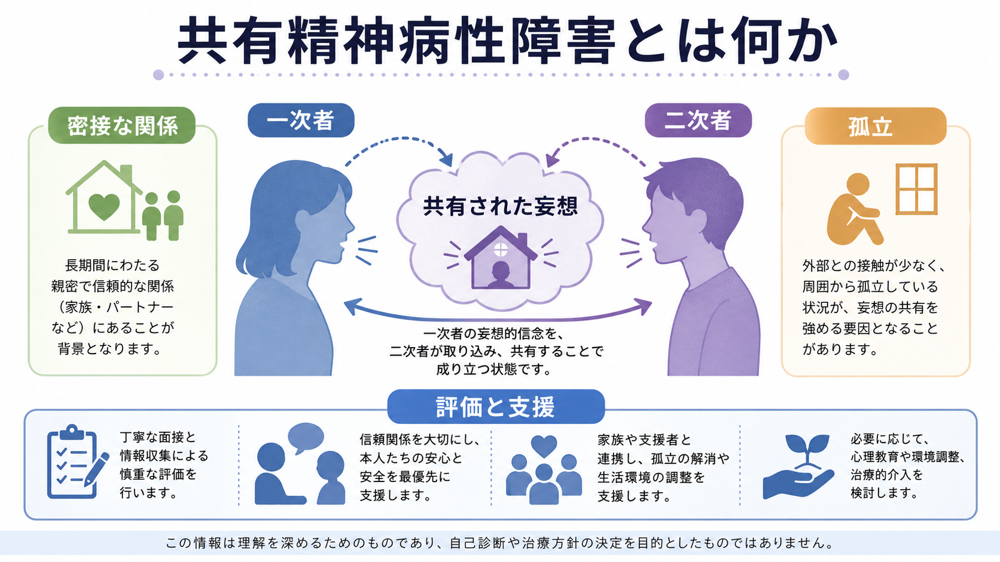
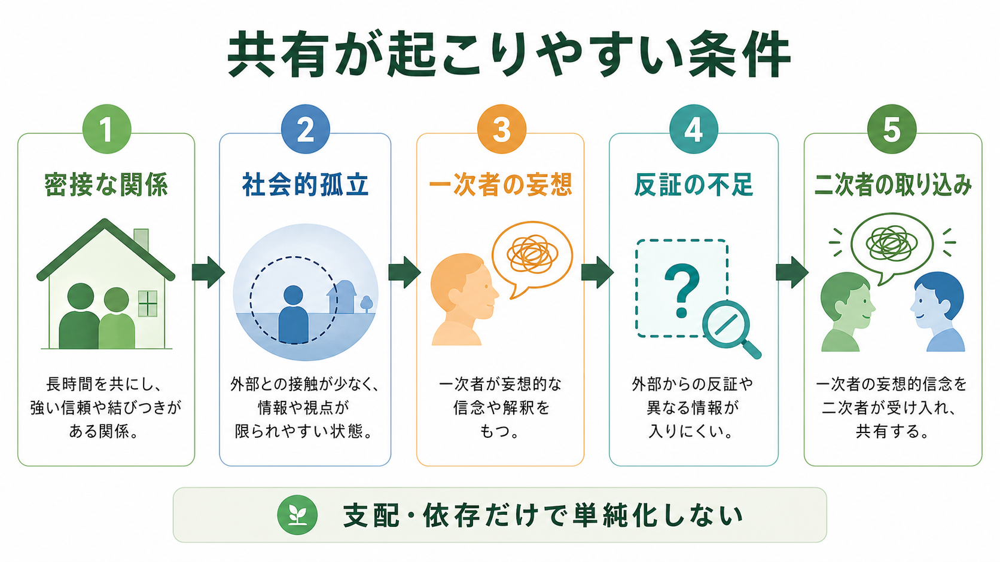
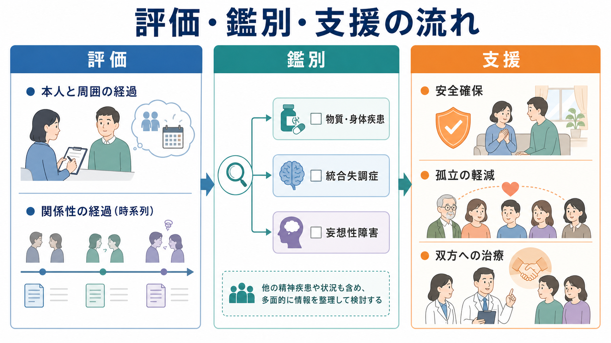

# 共有精神病性障害とは何か

## 要点

- 共有精神病性障害とは、密接な関係にある人びとのあいだで、一次者の妄想的信念が二次者にも取り込まれ、同じ、またはよく似た妄想として保たれる状態を指す。古典的には *folie à deux* と呼ばれてきた[3][6]。
- DSM-5-TR では独立した「共有精神病性障害」という診断名ではなく、「顕著な妄想をもつ個人との関係の文脈における妄想症状」として、他の特定される統合失調症スペクトラム障害および他の精神病性障害の例に位置づけられる[1][2]。
- 起こりやすい条件として、長期の密接な関係、社会的孤立、外部からの反証や比較の少なさ、一次者の未治療または不十分な治療、二次者側の脆弱性やストレスが挙げられる[3][4][5]。
- 評価では、本人だけでなく関係性・生活史・第三者情報を含め、[[妄想性障害とは何か]]、[[統合失調症とは何か]]、[[短期精神病性障害とは何か]]、[[物質誘発性精神病とは何か]]、身体疾患などを慎重に鑑別する[2][3]。
- 「離せば治る」と単純化しない。分離が役立つことはあるが、それだけでは不十分な場合や、関係喪失・不安・安全上の問題を増やす場合もあるため、双方への包括的支援が必要である[3][4]。

## この記事で答える問い

1. 共有精神病性障害は、現在の診断分類ではどこに置かれるのか。
2. どのような関係性や環境で、妄想的信念が共有されやすくなるのか。
3. 臨床では、何を評価し、何と鑑別し、どのような支援を考えるのか。

## まず結論

共有精神病性障害は、「妄想が感染する」という単純な現象ではない。より正確には、密接で閉じた関係のなかで、一次者の妄想的解釈が、二次者にとっても生活世界を説明する強い枠組みになり、外部からの反証が入りにくくなる状態である。

この病態を理解するうえで重要なのは、妄想内容そのものよりも、関係性、孤立、情報環境、生活上の脅威、一次者と二次者それぞれの精神医学的状態を同時に見ることである。二次者が「だまされた」「弱いから信じた」と捉えるだけでは不十分で、双方の苦痛、安全、生活機能を評価する必要がある[3][4]。

## 背景

共有精神病性障害は、19世紀フランス精神医学で *folie à deux* として記述された。Baillarger による「伝達される精神病」の記述、Lasègue と Falret による *folie à deux* の命名を経て、親密な二者、家族、夫婦、きょうだい、親子などにみられる共有妄想の症候群として論じられてきた[3][6]。

DSM-IV では「共有精神病性障害」として扱われたが、DSM-5 以降は独立診断から外れた。DSM-5-TR では、恋愛関係の「パートナー」に限定される誤解を避けるため、「顕著な妄想をもつ個人との関係の文脈における妄想症状」という表現に更新されている。これは、一次者が[[妄想性障害とは何か]]に限らず、[[統合失調症とは何か]]や統合失調感情障害など、顕著な妄想を伴う慢性精神病性障害でありうることを明確にする変更である[1]。

## 基本概念

### 一次者と二次者

古典的説明では、妄想を先に形成し、関係内で影響を与える人を一次者、影響を受けて同じ、または類似した妄想を共有する人を二次者と呼ぶ。ただし、実際の症例では役割が固定的とは限らない。二者が同時に精神病性脆弱性をもつ場合、互いに信念を補強する場合、片方の役割が経過の中で変わる場合もある[4][5]。

### DSM-5-TR での位置づけ

現在の臨床分類では、共有精神病性障害は「他の特定される統合失調症スペクトラム障害および他の精神病性障害」の一例として扱われる。つまり、独立した病名というより、精神病性症状が特定の関係性の文脈で形成・維持されていることを記述する診断的表現である[1][2]。

この点は実務上重要である。共有された妄想があるからといって、二次者が必ず一次者の影響だけで説明できるわけではない。[[統合失調感情障害とは何か]]、気分障害に伴う精神病症状、認知症、せん妄、物質使用、身体疾患などが背景にある可能性も評価する必要がある[2][3]。

## 仕組み

共有が起こりやすい条件は、単一の原因ではなく、複数の条件の重なりとして理解するとよい。

| 条件 | 何が起こるか | 評価で見る点 |
|---|---|---|
| 密接な関係 | 一次者の説明が生活上の主要な意味づけになる | 夫婦、親子、きょうだい、介護関係、同居歴 |
| 社会的孤立 | 外部の情報や反証が入りにくくなる | 友人・支援者・職場・地域との接点 |
| 一次者の顕著な妄想 | 体系化された信念が関係内で反復される | 妄想内容、確信度、行動化、安全リスク |
| 二次者側の脆弱性 | 不安、依存、認知機能低下、抑うつ、発達特性などが影響する | 既往歴、認知機能、ストレス、生活機能 |
| 反証の不足 | 代替説明が検討されず、信念が固定される | 第三者情報、事実確認、文化的背景 |

古典的には「支配的な一次者」と「依存的な二次者」という図式が強調されてきた。しかし、レビュー研究では、一次者と二次者の診断、家族歴、精神医学的脆弱性は想定より多様であり、二次者を受動的な存在としてだけ扱うと実態を見落とす可能性がある[4][5]。

## 図解

この記事の図は、共有精神病性障害を三つの角度から整理している。

1枚目は、概念地図である。一次者、二次者、密接な関係、孤立、共有された妄想、評価と支援を一画面にまとめている。

2枚目は、メカニズム図である。密接な関係と社会的孤立が、外部からの反証不足を通じて、一次者の妄想的信念の取り込みを促しうる流れを示している。

3枚目は、臨床での評価・鑑別・支援の流れである。共有妄想だけを見るのではなく、関係の経過、物質・身体疾患、[[統合失調症とは何か]]や[[妄想性障害とは何か]]との鑑別、安全確保、孤立の軽減、双方への治療を並行して考える。

## 臨床・研究との接続

### 評価

評価では、二者を別々に、かつ関係性の文脈の中で見る必要がある。本人の語りだけでなく、家族、支援者、医療者、地域関係者などからの情報を組み合わせ、どの信念がいつ始まり、誰から誰へどのように共有され、生活や安全にどの程度影響しているかを確認する[3]。

重要なのは、妄想の真偽をその場で説得して決着させることではない。むしろ、苦痛、睡眠、食事、仕事、対人関係、金銭、暴力・自傷他害リスク、子どもや高齢者の安全、服薬や受診状況を評価することが優先される。

### 鑑別

鑑別では、少なくとも次の可能性を検討する。

- [[妄想性障害とは何か]]: 体系化された妄想が主で、幻覚や思考のまとまりの崩れが目立たない場合。
- [[統合失調症とは何か]]: 幻覚、思考の解体、陰性症状、機能低下が独立してみられる場合。
- [[短期精神病性障害とは何か]]: 急性発症で、短期間に回復する経過をとる場合。
- [[物質誘発性精神病とは何か]]: 覚醒剤、大麻、アルコール、処方薬、離脱などとの時間関係が強い場合。
- 気分障害に伴う精神病症状: 躁病や重いうつ状態と妄想内容が連動する場合。
- せん妄、認知症、神経疾患、内分泌疾患など身体医学的要因。

二次者が一次者から離れたあとも妄想が持続する場合、一次者の影響だけで説明せず、二次者自身の精神病性障害や認知症などを再評価する必要がある[2][3]。

### 支援

支援は、分離、薬物療法、心理社会的支援、家族支援、安全計画を、状況に応じて組み合わせる。一次者に未治療の精神病性障害がある場合、その治療が重要になる。二次者にも不安、抑うつ、睡眠障害、トラウマ、認知機能低下、生活困難がある場合は、それ自体への支援が必要である[3][7]。

「分離」は古典的には有効とされてきたが、近年のレビューでは、分離だけで十分とは限らず、かえって不安や関係喪失を強める場合があるとされる。安全確保が必要な場合を除き、関係を切るかどうかよりも、外部の支援を増やし、孤立を減らし、双方が評価と治療につながることが中心になる[3][4]。

## よくある誤解

### 誤解1: 妄想が「感染」する病気である

比喩としては分かりやすいが、実際には感染症のように信念が機械的に移るわけではない。長期の関係、孤立、信頼、恐怖、依存、情報不足、既存の精神医学的脆弱性が重なり、妄想的説明が共有されやすくなる。

### 誤解2: 二次者は健康で、一次者にだまされただけである

二次者にも精神疾患、認知機能低下、抑うつ、不安、発達上の脆弱性、生活上のストレスがある場合がある。二次者を単なる被害者としてだけ見ると、必要な評価や支援を逃す[4][5]。

### 誤解3: 二人を離せば必ず治る

分離が有効な場合はある。しかし、分離だけでは不十分な場合、妄想が残る場合、関係喪失による危機が起こる場合もある。臨床的には、安全、生活、治療関係、支援ネットワークを含めた計画が必要である[3][7]。

### 誤解4: 珍しいので臨床では考えなくてよい

頻度は高くないが、見逃されやすい。一次者だけが受診している場合、家族や同居者が同じ妄想を共有していても評価対象にならないことがある。特に、家族全体が外部から孤立している場合、子どもや高齢者が巻き込まれている場合、安全上の問題がある場合は注意が必要である[3][7]。

## 関連ノート

- [[妄想性障害とは何か]]
- [[被害型妄想性障害とは何か]]
- [[嫉妬型妄想性障害とは何か]]
- [[統合失調症とは何か]]
- [[統合失調感情障害とは何か]]
- [[初回エピソード精神病とは何か]]
- [[短期精神病性障害とは何か]]
- [[物質誘発性精神病とは何か]]
- MOC更新候補: [[MOC｜精神医学]], [[MOC｜症候学]], [[MOC｜臨床実践・治療]]

## 理解チェック

1. DSM-5-TR では、共有精神病性障害は独立診断として扱われるか、それとも他の特定される精神病性障害の一例として扱われるか。
2. 共有妄想が起こりやすい条件として、密接な関係以外に何が重要か。
3. 二次者が一次者から離れた後も妄想を保つ場合、どのような再評価が必要か。
4. 支援を「分離」だけに還元すると、どのような問題が起こりうるか。

## 未解決問題

- 共有精神病性障害は症例報告に依存した知見が多く、発生頻度、予後、介入効果を推定する大規模研究は限られている。
- 一次者・二次者という二分法で説明しきれない、相互補強的な関係やオンライン環境での共有妄想をどう扱うかは、今後の研究課題である。
- 文化的信念、宗教的信念、陰謀論的コミュニティ、家族内信念、精神病性妄想をどのように区別するかには、臨床的にも倫理的にも慎重な検討が必要である。

## 参考文献

[1] American Psychiatric Association. (2022). *Other Specified Schizophrenia Spectrum and Other Psychotic Disorder: DSM-5-TR rationale for change*. https://www.psychiatry.org/getmedia/2f985d86-684c-485f-b03d-b599180e3124/APA-DSM5TR-OtherSpecifiedSchizophrenia.pdf

[2] Keshavan, M. S. (2025). Other schizophrenia spectrum and psychotic disorders. *MSD Manual Professional Edition*. https://www.msdmanuals.com/professional/psychiatric-disorders/schizophrenia-and-related-disorders/other-schizophrenia-spectrum-and-psychotic-disorders

[3] Al Saif, F., & Al Khalili, Y. (2023). Shared Psychotic Disorder. In *StatPearls*. StatPearls Publishing. https://www.ncbi.nlm.nih.gov/books/NBK541211/

[4] Arnone, D., Patel, A., & Tan, G. M. Y. (2006). The nosological significance of Folie à Deux: a review of the literature. *Annals of General Psychiatry, 5*, 11. https://doi.org/10.1186/1744-859X-5-11

[5] Silveira, J. M., & Seeman, M. V. (1995). Shared psychotic disorder: A critical review of the literature. *The Canadian Journal of Psychiatry, 40*(7), 389-395. https://doi.org/10.1177/070674379504000705

[6] Shimizu, M., Kubota, Y., Toichi, M., & Baba, H. (2007). Folie à Deux and shared psychotic disorder. *Current Psychiatry Reports, 9*, 200-205. https://doi.org/10.1007/s11920-007-0019-5

[7] Bhutani, S., & Huremovic, D. (2021). Folie a Deux: Shared Psychotic Disorder in a Medical Unit. *Case Reports in Psychiatry, 2021*, 5520101. https://doi.org/10.1155/2021/5520101
