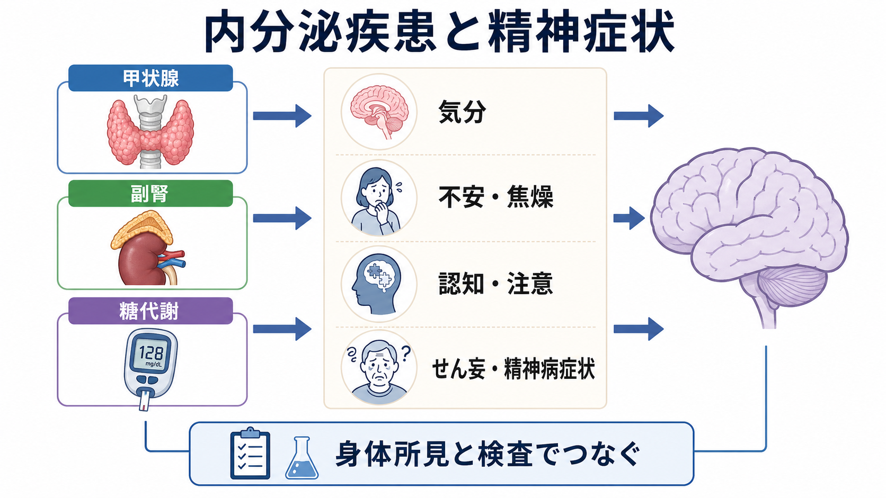
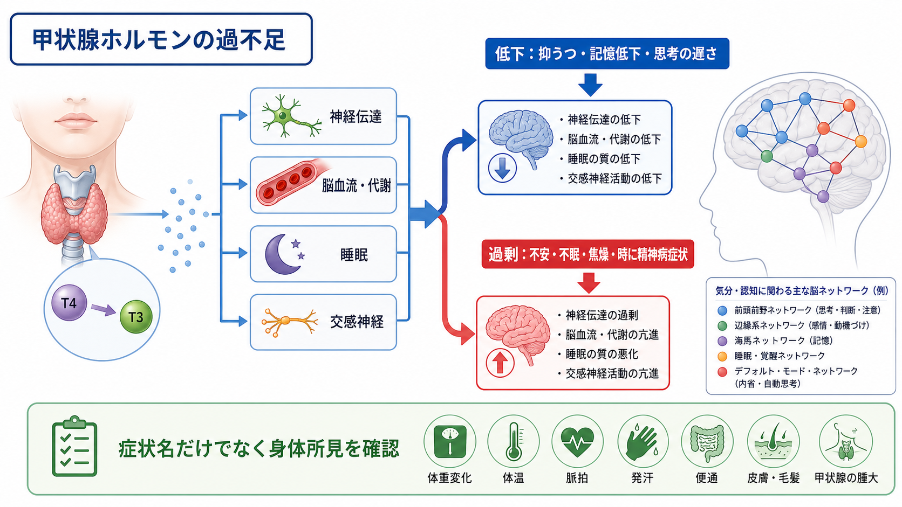
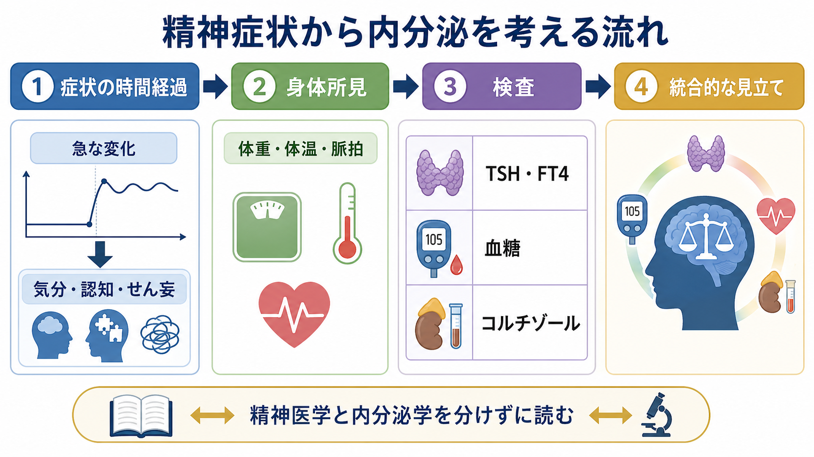

# 内分泌疾患に伴う精神症状とは何か

## 要点

- 内分泌疾患に伴う精神症状とは、甲状腺ホルモン、コルチゾール、血糖、電解質などの恒常性の変化が、気分、覚醒、睡眠、注意、記憶、思考内容に影響して現れる症状群である。
- 代表例は、甲状腺機能亢進症の不安・焦燥・不眠、甲状腺機能低下症の抑うつ・思考緩慢・記憶低下、クッシング症候群の抑うつ・不安・精神病症状、低血糖の行動変化・混乱・意識障害である[1][2][3][4]。
- 精神症状だけを見て「一次性の[[うつ病とは何か|うつ病]]」「[[不安症群とは何か|不安症]]」「[[双極性障害とは何か|双極性障害]]」と決めるのではなく、時間経過、身体所見、薬剤、血液検査、意識・注意の変動を合わせて読む必要がある[2][5][6]。
- この記事は教育・研究目的の概説であり、個別の診断や治療指示ではない。急な意識変容、重い低血糖、脱水、発熱、著しい興奮などが疑われる場合は、臨床的には緊急評価の対象になりうる。

## この記事で答える問い

1. どのような内分泌疾患が、気分や認知の変化として見えるのか。
2. 甲状腺、副腎、糖代謝異常は、それぞれどのような精神症状と結びつきやすいのか。
3. 一次性の精神疾患と、内分泌・代謝異常に伴う精神症状をどう区別して考えるのか。
4. 研究や臨床では、精神症状をどのように身体の恒常性と接続して読むべきか。

## まず結論

内分泌疾患に伴う精神症状は、「身体疾患が精神に影響する例外」ではなく、脳がホルモン、代謝、炎症、睡眠、循環、自律神経の中で働くことの自然な帰結である。甲状腺ホルモンは脳の代謝、交感神経系、睡眠、認知処理速度に関わり、過剰でも不足でも気分や注意に影響しうる[1][2]。コルチゾールはストレス応答の中心にあり、過剰では抑うつ、不安、認知障害、時に精神病症状を伴うことがある[3][5]。血糖は脳の燃料供給そのものに関わるため、低血糖では不安、ふるえ、発汗だけでなく、行動変化、会話困難、混乱、けいれん、意識障害まで起こりうる[4]。

したがって実践上の要点は、精神症状を「こころだけの問題」とも「検査値だけの問題」とも見ないことである。症状名、身体所見、検査値、服薬、生活リズム、時間経過を統合し、[[器質性精神病とは何か|器質性精神病]]、[[神経認知障害群とは何か|神経認知障害]]、[[振戦せん妄とは何か|せん妄]]、一次性の気分・不安症と鑑別しながら理解する。

## 背景

精神医学では、抑うつ、不安、不眠、集中困難、記憶低下、幻覚、妄想、興奮などを症候として扱う。しかし同じ症候は、甲状腺機能異常、副腎疾患、糖代謝異常、電解質異常、下垂体疾患、薬剤性内分泌変化でも起こりうる。これは、精神症状の背後に常に「心理的原因」があるという意味ではなく、脳が身体の内部環境に強く依存するという意味である。

内分泌疾患が精神症状として見えるとき、臨床的には二つの危険がある。第一に、身体疾患を見落として精神疾患だけとして扱ってしまう危険である。第二に、内分泌異常が見つかった瞬間に、本人の心理社会的文脈や併存する精神疾患をすべて無視してしまう危険である。たとえば糖尿病とうつ病は双方向に関連し、抑うつ症状は血糖管理や合併症リスクとも関わるため、どちらか一方に単純化できない[7][8]。

## 基本概念

### 内分泌疾患に伴う精神症状

ここでいう「内分泌疾患に伴う精神症状」は、特定の診断名ではなく、内分泌・代謝の異常が精神症状の発症、悪化、見え方、持続に関与している状態を指す。代表的な領域は次の通りである。

| 領域 | 代表的な異常 | 精神・認知への現れ方 |
|---|---|---|
| 甲状腺 | 甲状腺機能亢進症、甲状腺機能低下症 | 不安、焦燥、不眠、抑うつ、思考緩慢、記憶低下、まれに精神病症状[1][2] |
| 副腎 | クッシング症候群、副腎不全 | 抑うつ、不安、易怒性、認知低下、疲労、低血糖や電解質異常を介した意識変化[3][5][6] |
| 糖代謝 | 低血糖、高血糖、糖尿病 | 行動変化、混乱、集中困難、抑うつ、糖尿病 distress、認知機能への影響[4][7][8] |
| 下垂体・多腺性疾患 | 下垂体機能低下、複数ホルモン異常 | 疲労、意欲低下、性機能変化、認知変化、複合的な気分症状 |

### 症状名と原因名を分ける

「抑うつがある」ことと「大うつ病性障害である」ことは同じではない。抑うつは[[大うつ病性障害とは何か|大うつ病性障害]]にも、甲状腺機能低下症にも、クッシング症候群にも、慢性疾患の負担にも、薬剤の影響にも現れる。同様に、不眠や焦燥は[[不眠障害とは何か|不眠障害]]や不安症だけでなく、甲状腺機能亢進症、低血糖、ステロイド曝露でも見られる。

このため、内分泌疾患に伴う精神症状を考えるときは、症候名、精神医学的診断、身体疾患名、薬剤・物質要因を分けて記述することが重要である。

## 仕組み

### 1. 甲状腺ホルモンと脳の処理速度

甲状腺ホルモンは成人脳でも代謝、神経伝達、脳血流、認知処理に関わる。甲状腺機能低下症では、注意範囲の低下、記憶障害、計算困難、反応時間の遅さ、抑うつ、まれな精神病症状が報告されている[1]。重い低下では、本人は「怠けている」のではなく、脳と身体のエネルギー利用そのものが鈍くなったように見える。

一方、甲状腺機能亢進症では、体重減少、動悸、振戦、発汗、熱不耐、頻脈などの身体症状に加えて、不安、落ち着かなさ、不眠、気分変動、時に軽躁・躁状態や抑うつを思わせる精神状態が見られる[2]。高齢者では、典型的な活動性亢進ではなく、無気力や抑うつのように見えることもある。

### 2. コルチゾールとストレス応答

コルチゾールはストレス応答、血糖維持、免疫、睡眠・覚醒、記憶に関わる。クッシング症候群では慢性的な高コルチゾール状態が続き、抑うつ、不安、易怒性、記憶・注意の問題、精神病症状、希死念慮などが報告される[3][5]。2020年の系統的レビューでは、クッシング症候群の精神症状は病初期、疾患経過中、寛解後にも問題になりうると整理されている[3]。

副腎不全では、コルチゾール不足、低血圧、低ナトリウム血症、低血糖、脱水などが重なり、疲労、意欲低下、食欲低下、抑うつ様の見え方、意識・注意の変動につながることがある[6]。ここで重要なのは、「元気がない」「気力がない」という主観的訴えが、精神疾患だけでなく内分泌・循環・電解質の異常からも生じうる点である。

### 3. 血糖と脳の燃料

脳は通常、血糖を重要な燃料として使う。低血糖では、発汗、ふるえ、動悸、不安などの自律神経症状に加え、神経糖欠乏症状として、行動変化、視覚や発話の変化、混乱、めまい、嗜眠、けいれん、意識障害が起こりうる[4]。この状態は、パニック、怒り、奇異な行動、せん妄、けいれん発作のように見えることがある。

糖尿病とうつ病の関係は、単に「糖尿病があると落ち込む」という一方向ではない。糖尿病患者では抑うつが多く、抑うつはセルフケア、血糖管理、合併症、生活の質に影響する。一方で抑うつ症状は将来の糖代謝悪化とも関わる可能性があり、血糖指標と抑うつ症状の縦断的関連を示すメタ分析もある[7][8]。

## 図解

### 精神症状から内分泌を考える評価フロー

図で示した流れは、診断を機械的に決めるためのものではない。急な症状変化、意識・注意の変動、体重変化、体温・脈拍・血圧の変化、発汗や振戦、皮膚や粘膜の変化、月経・性機能の変化、服薬歴、ステロイド使用、糖尿病治療薬、内分泌疾患の既往を合わせて読むための枠組みである。

## 臨床・研究との接続

### 鑑別診断としての接続

内分泌疾患を疑う手がかりは、症状の内容そのものよりも、しばしば「時間経過」と「身体所見」に現れる。数日から数週間で急に不眠、焦燥、体重減少、動悸が目立つ場合、甲状腺機能亢進症は鑑別に入る。徐々に寒がり、便秘、体重増加、眠気、思考緩慢が進む場合、甲状腺機能低下症は候補になる。中心性肥満、皮膚線条、筋力低下、高血圧、糖代謝異常が抑うつや不安に重なる場合、クッシング症候群を考える余地がある[2][3][5]。

検査は、精神症状を否定するためではなく、精神症状の成り立ちをより正確に読むために使う。TSH・FT4、血糖、HbA1c、電解質、朝のコルチゾール、ACTH、薬剤歴などは、状況に応じて鑑別を支える情報になる。ただし、軽度の検査値異常が見つかっただけで、すべての精神症状をその異常に帰すことはできない。

### 研究としての接続

研究上は、内分泌疾患に伴う精神症状は、脳と身体を結ぶ自然実験として重要である。甲状腺ホルモンは処理速度、記憶、睡眠に関わり、コルチゾールは海馬、情動処理、ストレス応答に関わり、血糖は認知の即時的な安定性に関わる。これらは、[[統合失調症の認知機能障害とは何か|認知機能障害]]、気分症状、せん妄、身体疾患併存の研究をつなぐ接点になる。

同時に、内分泌疾患の精神症状研究には限界もある。希少疾患では症例報告や小規模研究に依存しやすく、うつ・不安・認知障害の評価尺度や時点が研究ごとに異なる。さらに、ホルモン値、罹病期間、治療歴、睡眠、薬剤、合併症、心理社会的負担が複雑に絡むため、単一ホルモンと単一症状の単純対応としては扱えない。

## よくある誤解

### 誤解1：内分泌異常があれば精神疾患ではない

内分泌異常と精神疾患は排他的ではない。甲状腺疾患や糖尿病がある人に、一次性のうつ病や不安症が併存することもある。重要なのは、どちらか一方に決め打ちすることではなく、症状の時系列、重症度、身体所見、検査値、生活機能を統合して見立てることである。

### 誤解2：検査値が正常なら身体要因は関係ない

検査値が正常であれば主要な内分泌異常の可能性は下がるが、睡眠不足、薬剤、炎症、疼痛、低栄養、アルコール、カフェイン、生活リズムの乱れなど、身体を介した要因は残る。内分泌だけに視野を狭めず、身体全体と心理社会的文脈を読む必要がある。

### 誤解3：精神症状はホルモン値に比例する

ホルモン値と精神症状は単純な比例関係ではない。甲状腺機能亢進症でも不安が強い人と無気力が目立つ人がいる。クッシング症候群でも抑うつ、不安、精神病症状、認知低下の組み合わせは多様である[3][5]。脳の感受性、年齢、既往、睡眠、ストレス、薬剤、社会的状況が症状の形を変える。

## 関連ノート

- [[器質性精神病とは何か]]
- [[うつ病とは何か]]
- [[大うつ病性障害とは何か]]
- [[双極性障害とは何か]]
- [[不安症群とは何か]]
- [[不眠障害とは何か]]
- [[神経認知障害群とは何か]]
- [[認知症とは何か]]
- [[統合失調症の認知機能障害とは何か]]
- [[振戦せん妄とは何か]]

MOC更新候補: `content/00_MOC/` 配下の精神医学、臨床精神医学、神経精神医学、身体疾患と精神症状に関する MOC。並列生成ジョブとの衝突を避けるため、本記事では MOC 本体は更新しない。

## 理解チェック

1. 甲状腺機能亢進症が、不安症や躁状態に似て見えるのはなぜか。
2. 甲状腺機能低下症の抑うつ様症状と、一次性のうつ病を区別するとき、どのような身体所見や時間経過を見るべきか。
3. クッシング症候群で精神症状が問題になるとき、抑うつ以外にどのような症状を考える必要があるか。
4. 低血糖が「精神症状」に見えるのは、どのような神経糖欠乏症状があるためか。
5. 糖尿病とうつ病の関係を、一方向の因果ではなく双方向の関連として見る理由は何か。

## 参考文献

[1] Wiersinga WM. Adult Hypothyroidism. In: Feingold KR, et al., editors. *Endotext*. MDText.com, Inc. https://www.ncbi.nlm.nih.gov/sites/books/NBK285561/

[2] Ross DS, Burch HB, Cooper DS, et al.; Endotext authors. Diagnosis and Treatment of Graves' Disease. In: Feingold KR, et al., editors. *Endotext*. MDText.com, Inc. https://www.ncbi.nlm.nih.gov/books/NBK285548/

[3] Lin TY, Hanna J, Ishak WW. Psychiatric Symptoms in Cushing's Syndrome: A Systematic Review. *Innovations in Clinical Neuroscience*. 2020;17(1-3):30-35. https://pmc.ncbi.nlm.nih.gov/articles/PMC7239565/

[4] Feingold KR. Hypoglycemia. In: Feingold KR, et al., editors. *Endotext*. Updated 2025 Nov 20. MDText.com, Inc. https://www.ncbi.nlm.nih.gov/sites/books/NBK279137/

[5] Lhul RV da S, Nunes KG, de Almeida TS, Czepielewski MA, Czepielewski LS. Cushing's syndrome: a systematic review of psychiatric and cognitive symptoms in case studies. *Archives of Endocrinology and Metabolism*. 2026;70(3):e260029. https://pmc.ncbi.nlm.nih.gov/articles/PMC13055640/

[6] Charmandari E, Nicolaides NC, Chrousos GP. Adrenal Insufficiency. In: Feingold KR, et al., editors. *Endotext*. MDText.com, Inc. https://www.ncbi.nlm.nih.gov/sites/books/NBK279083/

[7] Alzoubi A, Abunaser R, Khassawneh A, Alfaqih M, Khasawneh A, Abdo N. The Bidirectional Relationship between Diabetes and Depression: A Literature Review. *Korean Journal of Family Medicine*. 2018;39(3):137-146. https://doi.org/10.4082/kjfm.2018.39.3.137

[8] American Diabetes Association Professional Practice Committee for Diabetes. 4. Comprehensive Medical Evaluation and Assessment of Comorbidities: Standards of Care in Diabetes-2026. *Diabetes Care*. 2026;49(Suppl 1):S61-S88. https://pmc.ncbi.nlm.nih.gov/articles/PMC12690184/

## 未解決問題

- 軽度の甲状腺機能異常や境界域の血糖異常が、どの程度まで気分・認知症状の原因として扱えるかは、個人差と研究デザインの影響が大きい。
- 内分泌疾患の治療後に残る抑うつ、不安、認知障害が、どの程度可逆的で、どの介入に反応しやすいかは疾患ごとに十分整理されていない。
- 精神症状評価、ホルモン測定、睡眠・活動量、認知検査を同時に追う縦断研究がさらに必要である。
