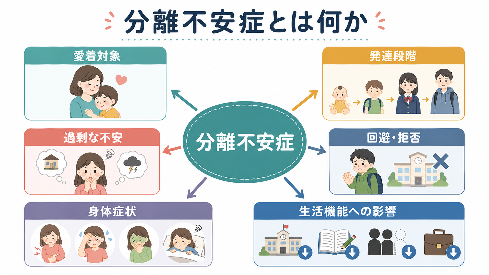
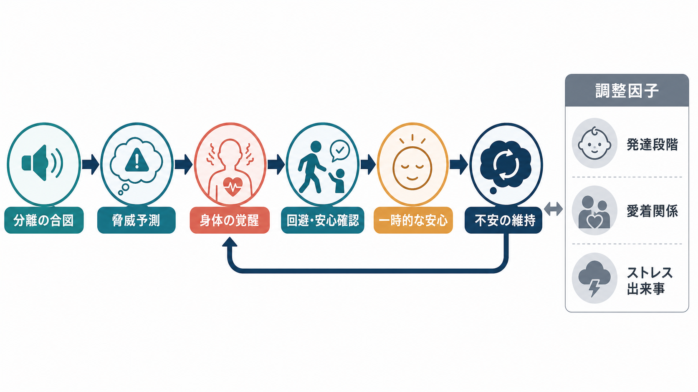
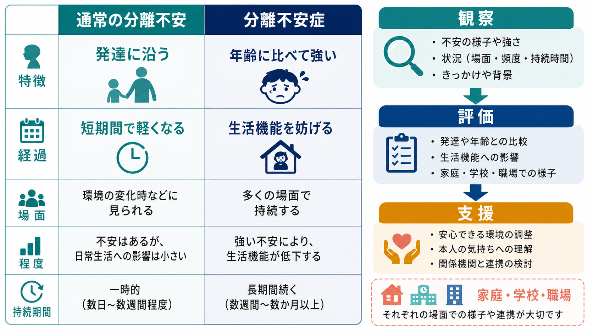

# 分離不安症とは何か

## 要点

- 分離不安症は、家や主要な[[愛着とは何か|愛着対象]]から離れること、または離れる可能性に対して、年齢や発達段階から見て過剰で持続的な不安が生じ、学校・仕事・睡眠・対人関係などの生活機能を妨げる状態である[1][2]。
- 乳幼児期の分離不安は通常の発達現象であり、病気そのものではない。問題になるのは、不安の強さ、持続、文脈、生活への影響が[[発達段階理論とは何か|発達段階]]に比べて大きい場合である[1][2]。
- 維持には、分離の合図を危険として予測すること、身体の覚醒、回避、安心確認、短期的な安心による学習が関わる。これは[[恐怖条件づけとは何か|恐怖条件づけ]]や回避学習の観点から理解できる[2]。
- 臨床では、本人だけでなく家族、学校、職場、身体症状、併存症、ストレス出来事を含めて評価する。この記事は教育・研究目的の整理であり、個別診断や治療指示ではない。

## この記事で答える問い

1. 分離不安症は、普通の分離不安と何が違うのか。
2. なぜ「愛着対象から離れること」が強い恐怖や身体症状につながるのか。
3. 発達段階、家族関係、学校・職場環境をどう見ればよいのか。
4. 臨床・研究では、何を評価し、どのような支援につなげるのか。

## まず結論

分離不安症は、「甘え」や「親離れできない性格」として片づけるより、発達上の愛着システムが過剰に作動し、分離の場面を危険として予測し続ける状態として理解すると見通しがよい。通常の分離不安は、乳幼児が養育者を安全基地として使いながら、対象の永続性や自律性を少しずつ獲得する過程に含まれる[1][6]。しかし、年齢相応の範囲を超えて、登校・登園・出勤、睡眠、外出、留守番、家族の不在に強い苦痛や回避が続く場合、臨床的な評価が必要になる[1][2]。

## 背景

子どもは、危険や不確実性があるときに養育者へ近づこうとする。これは[[愛着スタイルにはどのような種類があるのか|愛着スタイル]]の良し悪し以前に、保護を得るための基本的な発達システムである。乳幼児期には、養育者が見えなくなると泣く、後追いをする、再会すると落ち着く、といった反応がみられる。これは多くの場合、認知発達、探索行動、安心できる関係の積み重ねとともに弱まっていく[1][6]。

分離不安症では、この通常のシステムが年齢や状況に比べて強く作動し続ける。本人は「離れたら何か悪いことが起きる」「戻ってこられない」「大切な人が事故や病気で失われる」と予測しやすくなり、回避や安心確認が増える。結果として、一時的には安心しても、分離に慣れる経験が減り、不安が維持される[2]。

## 基本概念

### 診断上の位置づけ

DSM-5-TR では、分離不安症は不安症群の一つとして扱われる。中心は、愛着対象からの実際の分離または予期される分離に対する、発達的に不適切で過剰な恐怖・不安である[1][2]。症状には、分離時の強い苦痛、愛着対象を失うことへの反復的な心配、事故・病気・災害などで離れ離れになることへの心配、外出・登校・出勤の拒否、一人でいることの拒否、近くに愛着対象がいないと眠れないこと、分離に関する悪夢、頭痛や腹痛などの身体症状が含まれる[2]。

持続期間は、子ども・青年では少なくとも4週間、成人では典型的には6か月以上が目安とされる[2]。ただし、期間だけで機械的に判断するのではなく、生活機能の障害、本人の苦痛、文化的文脈、発達水準、他の精神疾患や身体疾患による説明可能性を合わせて考える必要がある。これは[[DSMとICDは何が違うのか|DSMとICD]]を使うときの一般的な注意点でもある。

### 通常の分離不安との違い

通常の分離不安は、発達の一時期に多くの子どもにみられ、養育者が戻ってくる経験、予測可能な生活リズム、探索の成功によって弱まる。一方、分離不安症では、不安が年齢に比べて強く、回避が固定化し、学校・家庭・睡眠・友人関係・仕事に支障が出る[1][7]。

重要なのは、泣くか泣かないかだけで判断しないことである。愛着対象がいると落ち着いて見えるため、周囲からは「問題が小さい」と誤解されることがある[1]。しかし、離れる前後に強い予期不安や身体症状があり、本人や家族の行動範囲が狭まっている場合には、表面上の落ち着きだけでは評価できない。

## 仕組み

分離不安症の仕組みは、愛着、脅威予測、身体反応、回避学習の循環として整理できる。

1. 分離の合図が出る。登校、出勤、就寝、親の外出、連絡が取れない時間などが合図になる。
2. 「危険が起きる」「自分では対処できない」という予測が強まる。
3. 心拍上昇、腹痛、頭痛、吐き気、震え、涙、怒りなどの身体・情動反応が出る。
4. 回避、付き添い要求、電話・メッセージでの確認、寝室への同伴などが増える。
5. その場では安心するが、「離れなくてよかったから安全だった」と学習され、次の分離がさらに難しくなる。

この循環は、本人の努力不足ではない。むしろ、短期的な安心を得る行動が、長期的には分離場面への耐性や安全学習を妨げるという学習上の問題である。[[発達精神病理学とは何か|発達精神病理学]]の観点では、同じ不安反応でも、年齢、家族の状況、学校環境、喪失体験、転居、いじめ、病気、養育者側の不安によって意味が変わる。

## 図解

3枚の図は、同じ現象を別の粒度で見ている。1枚目は、分離不安症を「愛着対象」「発達段階」「過剰な不安」「回避・拒否」「身体症状」「生活機能への影響」の関係として整理した。2枚目は、分離の合図から回避・安心確認を経て不安が維持される流れを示した。3枚目は、通常の分離不安と分離不安症を比較し、観察・評価・支援への接続を示している。

## 臨床・研究との接続

臨床評価では、症状の有無だけでなく、いつ、誰から、どのくらい離れると不安が起きるのかを具体化する。登校しぶり、保健室利用、睡眠困難、腹痛・頭痛、家族の予定変更、親の勤務への影響などは、生活機能の手がかりになる[1][7]。鑑別では、[[鑑別診断とは何か|鑑別診断]]として、社交不安症、全般不安症、パニック症、限局性恐怖症、PTSD、うつ病、自閉スペクトラム症、身体疾患、いじめや虐待などを検討する。

支援の研究では、児童青年の不安症に対する認知行動療法の有効性が比較的よく検討されている。Cochrane レビューでは、児童青年の不安症に対して、待機・無治療に比べて CBT が診断寛解を高める可能性が示されている[4]。AACAP の臨床ガイドラインも、児童青年の不安症の評価と治療において、心理療法、家族・学校との連携、必要に応じた薬物療法の検討を位置づけている[3]。

成人の分離不安症も重要である。DSM-5 以降、分離不安症は子どもだけの診断ではなく、成人にも適用されるようになった。成人では、親だけでなく、配偶者、恋人、子どもなどが愛着対象となり、外出、出張、単身生活、連絡不能への不安として現れることがある[5]。

## よくある誤解

### 「分離不安は小さい子だけの問題である」

乳幼児期に多いのは確かだが、分離不安症は年長児、青年、成人にもみられる。DSM-5 以降は成人発症や成人期の持続も診断上扱われるようになった[5]。

### 「親が甘やかしたから起きる」

家族の関わりは維持要因になりうるが、単一原因として親を責める説明は不正確である。気質、ストレス出来事、学習、身体症状、学校環境、家族側の不安、過去の喪失体験などが組み合わさる[1][2]。[[養育環境は発達にどう影響するのか|養育環境]]は責任追及ではなく、支援の手がかりとして見る。

### 「離れれば慣れるので、無理に突き放せばよい」

分離経験は重要だが、強制的な分離だけで安全学習が進むとは限らない。本人の発達水準、準備性、家族・学校の連携、身体症状、併存症を見ながら、段階的に扱う必要がある[3][4]。

## 関連ノート

- [[愛着とは何か]]
- [[愛着スタイルにはどのような種類があるのか]]
- [[発達段階理論とは何か]]
- [[発達精神病理学とは何か]]
- [[養育環境は発達にどう影響するのか]]
- [[恐怖条件づけとは何か]]
- [[鑑別診断とは何か]]
- [[DSMとICDは何が違うのか]]

## 理解チェック

1. 通常の分離不安と分離不安症を分けるとき、年齢以外に何を見るべきか。
2. 回避や安心確認は、なぜ短期的には役立っても長期的には不安を維持しうるのか。
3. 分離不安症の評価で、本人以外に家族・学校・職場の情報が重要になるのはなぜか。
4. 成人の分離不安症では、どのような愛着対象が問題になりうるか。

## 関連ノート候補

- 分離不安症と登校しぶりはどう関係するのか
- 児童青年期の不安症では家族支援をどう考えるのか
- 安心確認行動とは何か
- 不安症における回避学習とは何か

## MOC更新候補

- `content/00_MOC/MOC｜精神医学.md`
- `content/00_MOC/MOC｜発達・愛着・社会心理.md`

## 未解決問題

- 分離不安症の経過は、発症年齢、愛着対象、併存症、家族環境によってどの程度異なるのか。
- 児童青年期の CBT 研究で得られた知見を、成人の分離不安症にどの程度一般化できるのか。
- 学校・家庭・医療の連携を、本人の自律性を損なわずに設計するには何が重要か。

## 参考文献

[1] Merck Manual Professional Edition. (2025). *Separation Anxiety Disorder*. https://www.merckmanuals.com/professional/pediatrics/psychiatric-disorders-in-children-and-adolescents/separation-anxiety-disorder

[2] Feriante, J., Torrico, T. J., & Bernstein, B. (2023). *Separation Anxiety Disorder*. StatPearls, NCBI Bookshelf. https://www.ncbi.nlm.nih.gov/books/NBK560793/

[3] Walter, H. J., Bukstein, O. G., Abright, A. R., Keable, H., Ramtekkar, U., Ripperger-Suhler, J., & Rockhill, C. (2020). Clinical Practice Guideline for the Assessment and Treatment of Children and Adolescents With Anxiety Disorders. *Journal of the American Academy of Child & Adolescent Psychiatry, 59*(10), 1107-1124. https://doi.org/10.1016/j.jaac.2020.05.005

[4] James, A. C., Reardon, T., Soler, A., James, G., & Creswell, C. (2020). Cognitive behavioural therapy for anxiety disorders in children and adolescents. *Cochrane Database of Systematic Reviews*, CD013162. https://doi.org/10.1002/14651858.CD013162.pub2

[5] Bögels, S. M., Knappe, S., & Clark, L. A. (2013). Adult separation anxiety disorder in DSM-5. *Clinical Psychology Review, 33*(5), 663-674. https://doi.org/10.1016/j.cpr.2013.03.006

[6] Ainsworth, M. D. S., Blehar, M. C., Waters, E., & Wall, S. (1978). *Patterns of Attachment: A Psychological Study of the Strange Situation*. Lawrence Erlbaum Associates. https://cir.nii.ac.jp/crid/1970586434861379334?lang=en

[7] National Institute of Mental Health. (2024). *Anxiety Disorders*. https://www.nimh.nih.gov/health/topics/anxiety-disorders/index.shtml
