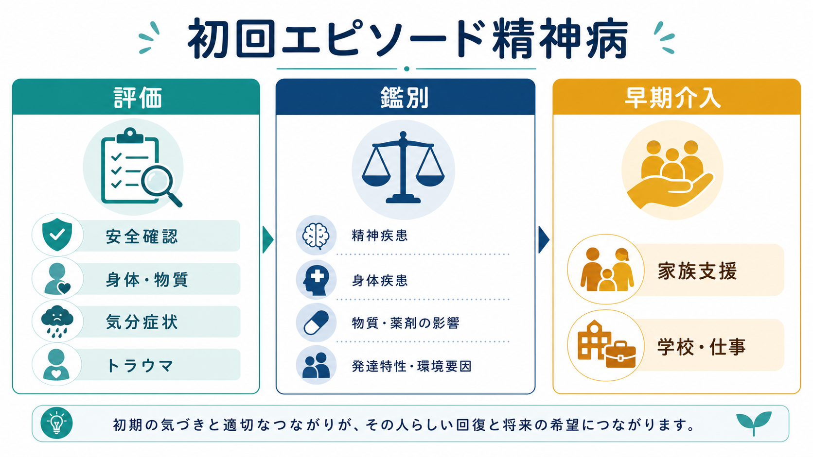
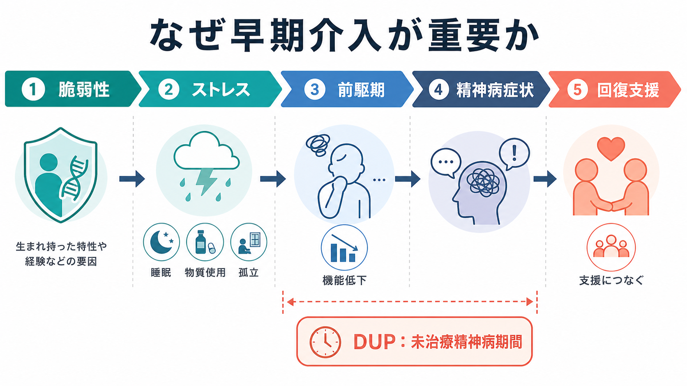
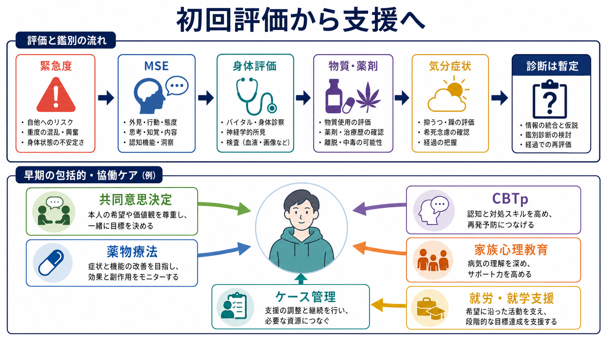

# 初回エピソード精神病とは何か

## 要点

- 初回エピソード精神病（first episode psychosis: FEP）は、初めて明確な幻覚・妄想・思考のまとまりにくさなどが持続し、生活機能に影響している段階を指す臨床的な入口であり、最終診断名そのものではない。
- 初回評価では、[[MSEで知覚異常をどう聞くか|精神状態診察]]、自傷他害リスク、身体疾患、薬剤・物質、気分症状、トラウマ、発達歴、家族・学校・職場機能を同時に見る。
- 早期介入の目的は「早く病名を固定すること」ではなく、未治療精神病期間（duration of untreated psychosis: DUP）を短くし、安全、関係性、機能、希望を保ちながら経過を見直せる支援につなぐことである[1][2]。
- 医療・支援の内容は、本人の希望と価値観を踏まえた共同意思決定、心理教育、家族支援、CBTp、就労・就学支援、ケース管理、必要に応じた薬物療法を組み合わせる[3][4]。

## この記事で答える問い

1. 初回エピソード精神病は、統合失調症や双極性障害とどう違うのか。
2. 初回評価では、何を急いで確認し、何を時間をかけて見直すのか。
3. 早期介入は、なぜ症状だけでなく生活機能・家族・学校・仕事を扱うのか。

## まず結論

初回エピソード精神病とは、「精神病症状が初めて臨床的な閾値に達した状態」を指す。NICE は成人の精神病・統合失調症ガイドラインで、初回または初発の精神病を呈する人が年齢やDUPにかかわらず早期介入サービスへアクセスできるべきだとしている[1]。子ども・若者では、持続する精神病症状を初めて呈した場合、専門サービスで包括的な多職種評価を受けることが推奨される[2]。

ただし、初回時点の診断はしばしば暫定的である。統合失調症スペクトラム、双極性障害や精神病性うつ病、物質・薬剤による精神病、[[せん妄とは何か|せん妄]]、神経疾患、内分泌・感染・自己免疫性疾患、[[カタトニアとは何か|カタトニア]]、[[解離とは何か|解離]]やトラウマ反応などを、経過と検査で鑑別していく必要がある。したがって、FEPは「早期に支援へつなぐための臨床ステージ」と理解するのがよい。

## 背景

精神病症状は、本人にとっても周囲にとっても「突然の異常」に見えることが多い。しかし実際には、睡眠の乱れ、孤立、学業・仕事の低下、不安、[[抑うつ気分とは何か|抑うつ]]、奇妙な確信、過敏さ、物質使用などが先行している場合がある。これらは非特異的で、思春期・青年期の発達課題、ストレス反応、[[躁状態とは何か|躁状態]]、発達特性、トラウマ反応とも重なる。

早期介入が重視される理由の一つはDUPである。DUPは、精神病症状が明確に出現してから適切な治療・支援が始まるまでの期間を指す。古典的なメタ解析では、DUPが短いほど治療反応、陰性症状、機能転帰が良い傾向が示された[5]。近年の早期発見・早期介入研究でも、DUPの短縮は介入目標の一つとして扱われている[6]。ただし、DUPは原因そのものというより、アクセス、スティグマ、家族や学校・職場の気づき、医療制度、症状の見え方が重なった指標でもある。

## 基本概念

### 精神病症状

精神病症状には、典型的には幻覚、妄想、思考・発話のまとまりにくさ、現実検討の障害、著しいまとまりのない行動などが含まれる。加えて、意欲低下、感情表出の乏しさ、社会的引きこもり、認知機能低下などが目立つこともある。知覚体験を聞くときは、内容の奇異さだけでなく、苦痛、確信度、行動への影響、安全性、文化的背景を分けて確認する。

### 初回エピソード

「初回」は、人生で初めて精神病症状が臨床的支援を必要とする水準になった、という意味である。本人や家族が以前から違和感を感じていても、医療につながった時点が初回接触になることもある。逆に、急性一過性の症状が完全に回復する場合もあるため、初回接触だけで長期診断を固定しない。

### 早期介入

早期介入は、抗精神病薬を早く出すことだけを意味しない。NICE は、早期介入サービスが薬物療法、心理療法、社会的・職業的・教育的介入を含む包括的支援を提供することを推奨している[1]。NIMHのRAISE研究で普及した coordinated specialty care（CSC）も、本人・家族・専門職が共同意思決定を行い、心理社会的支援、家族教育、就労・就学支援、個別化された薬物療法を組み合わせる多職種モデルである[4][7]。

## 仕組み

FEPを説明する単一の機序はない。実践上は、次のような多層モデルで考えると整理しやすい。

| 層 | 見ること | 臨床的な意味 |
|---|---|---|
| 脆弱性 | 家族歴、神経発達、認知機能、発達特性、既往歴 | 症状の出やすさや支援設計に関わる |
| 誘因 | 睡眠不足、ストレス、物質使用、身体疾患、薬剤、孤立 | 修正可能な要因を探す |
| 症状 | 幻覚、妄想、混乱、興奮、陰性症状、気分症状 | 安全確認と鑑別の入口 |
| 機能 | 学校・仕事、対人関係、セルフケア、生活リズム | 回復目標を症状以外にも置く |
| 文脈 | 家族、文化、スティグマ、サービスへのアクセス | 支援につながるかどうかを左右する |

この枠組みは[[ストレス脆弱性モデルとは何か|ストレス脆弱性モデル]]に近いが、FEPでは「個人の脆弱性」だけに還元しないことが重要である。医療アクセスの遅れ、[[スティグマとは何か|スティグマ]]、家族や学校の理解不足、経済的困難、トラウマ、物質使用環境も、DUPや機能転帰に関わる。

## 図解

初回評価は「診断名を一回で当てる作業」ではなく、リスクを下げながら仮説を更新する作業である。最初に確認するのは、自傷他害、重度の混乱、摂食・睡眠・脱水、身体疾患、薬剤・物質、家族や生活環境の安全である。そのうえで、精神状態診察、身体診察、必要な検査、情報提供者からの経過聴取を組み合わせる。

## 臨床・研究との接続

### 評価

初回評価では、[[鑑別診断とは何か|鑑別診断]]のために以下を分けて記録する。

- 症状の時間経過: 急性発症か、数週間から数か月の変化か、前駆的な機能低下があったか。
- 精神状態: 幻覚、妄想、思考過程、気分、認知、病識、判断力。
- リスク: [[自殺リスク評価では何を聞くべきか|自殺念慮・自殺企図]]、他害、被害体験、セルフネグレクト、家族内の安全。
- 身体・神経: 発熱、意識変容、けいれん、頭部外傷、内分泌、感染、自己免疫、薬剤。
- 物質: [[物質使用歴はどのように聞くべきか|大麻、覚醒剤、アルコール、鎮静薬、処方薬、サプリメント]]など。
- 心理社会: トラウマ、いじめ、移住、喪失、孤立、学校・仕事、家族の負担。

NICEの子ども・若者向けガイドラインでは、初回エピソード精神病の評価に精神医学的、医学的、心理・心理社会的、発達的、身体健康、社会的ネットワークや教育を含めることが示されている[2]。成人でも、包括的な多職種評価、トラウマ、併存する抑うつ・不安・物質使用、身体健康を扱うことが推奨される[1]。

### 鑑別

鑑別では、少なくとも次の群を意識する。

| 鑑別群 | 手がかり |
|---|---|
| 統合失調症スペクトラム | 妄想、幻覚、思考障害、陰性症状、認知機能低下、6か月前後の経過 |
| 気分障害に伴う精神病 | 抑うつ、躁、混合状態、気分エピソードと精神病症状の時間関係 |
| 物質・薬剤性精神病 | 使用開始・増量・離脱との時間関係、尿検査、処方薬・市販薬 |
| 身体疾患・神経疾患 | 意識変容、発熱、けいれん、神経局在徴候、急性の認知変化 |
| トラウマ・解離 | フラッシュバック、解離、過覚醒、対人安全感、症状の文脈依存性 |
| 発達特性・文化的文脈 | 長期の対人・感覚特性、文化的信念、言語・移住背景 |

初回時点で「統合失調症」と断定するより、時間経過、機能変化、気分症状との関係、身体・物質要因の除外、本人の語りを統合して暫定診断を更新する方が安全である。

### 介入

介入は、危機対応と中長期の回復支援を分けて考える。急性期には安全、睡眠、栄養、身体状態、家族への説明、本人の苦痛軽減を優先する。薬物療法が必要な場合も、効果と副作用、本人の希望、過去の治療経験、身体健康を踏まえ、専門家の関与のもとで検討する。WHOは、初回精神病エピソードで寛解した成人に対し、効果・副作用・本人の希望を慎重に比較しながら、一定期間の抗精神病薬維持療法を検討することを推奨している[3]。

中長期では、[[コンコーダンスとは何か|共同意思決定]]、心理教育、CBTp、家族支援、ケース管理、就労・就学支援、身体健康モニタリング、再発サインの共有が重要になる。RAISE-ETPの2年転帰研究では、NAVIGATE型の包括的CSCが通常ケアよりも生活の質、治療継続、就労・就学参加、症状で良い結果を示した[7]。

## よくある誤解

### 「初回エピソード精神病 = 統合失調症」である

誤りである。FEPは臨床ステージであり、最終診断ではない。経過の中で統合失調症スペクトラム、気分障害、物質・薬剤性、身体疾患、短期精神病性障害などに整理されることがある。

### 「精神病症状があれば、すぐ一つの原因がわかる」

誤りである。精神病症状は最終共通経路のように見えることがあり、身体疾患、物質、睡眠、気分、トラウマ、発達歴、社会環境を統合しなければならない。

### 「早期介入は薬物療法だけである」

誤りである。薬物療法は重要な選択肢だが、早期介入の核は多職種での包括的支援である。本人の生活目標、家族支援、学校・仕事、心理的対処、身体健康、スティグマ軽減を同時に扱う。

### 「診断が未確定なら支援しない方がよい」

誤りである。診断が暫定でも、安全確認、苦痛の軽減、家族への説明、学校・職場調整、睡眠や物質使用への介入は可能である。むしろ支援を遅らせることが、DUPや機能低下を長引かせる可能性がある。

## 関連ノート

- [[MSEで知覚異常をどう聞くか]]
- [[鑑別診断とは何か]]
- [[物質使用歴はどのように聞くべきか]]
- [[せん妄とは何か]]
- [[躁状態とは何か]]
- [[抑うつ気分とは何か]]
- [[カタトニアとは何か]]
- [[自殺リスク評価では何を聞くべきか]]
- [[トラウマ歴はどのように聞くべきか]]
- [[アドヒアランスとは何か]]
- [[コンコーダンスとは何か]]
- [[スティグマとは何か]]

## MOC更新候補

- `content/00_MOC/` 配下の精神医学、疾患・症候群、総論・診断・面接、早期介入に関するMOCへ追加候補。
- 並列作業との競合を避けるため、このジョブではMOC本文は更新しない。

## 理解チェック

1. 初回エピソード精神病を、最終診断名ではなく臨床ステージとして扱う理由は何か。
2. DUPを短くすることが重要とされる一方で、DUPだけを個人の問題に還元してはいけない理由は何か。
3. 初回評価で、精神状態診察と同時に身体疾患・薬剤・物質・トラウマを確認する理由は何か。
4. 早期介入サービスやCSCが、薬物療法だけでなく家族支援、就労・就学支援、心理社会的介入を含む理由は何か。

## 参考文献

[1] National Institute for Health and Care Excellence. (2014). *Psychosis and schizophrenia in adults: prevention and management (CG178).* https://www.nice.org.uk/guidance/cg178/chapter/1-Recommendations

[2] National Institute for Health and Care Excellence. (2013, updated 2016). *Psychosis and schizophrenia in children and young people: recognition and management (CG155).* https://www.nice.org.uk/guidance/cg155/chapter/recommendations

[3] World Health Organization. (2023 update). *Duration of antipsychotic treatment in individuals with a first psychotic episode.* https://www.who.int/teams/mental-health-and-substance-use/treatment-care/mental-health-gap-action-programme/evidence-centre/psychosis-and-bipolar-disorders/duration-of-antipsychotic-treatment-in-individuals-with-a-first-psychotic-episode

[4] National Institute of Mental Health. (n.d.). *Recovery After an Initial Schizophrenia Episode (RAISE).* https://www.nimh.nih.gov/RAISE

[5] Perkins, D. O., Gu, H., Boteva, K., & Lieberman, J. A. (2005). Relationship between duration of untreated psychosis and outcome in first-episode schizophrenia: a critical review and meta-analysis. *American Journal of Psychiatry, 162*(10), 1785-1804. https://doi.org/10.1176/appi.ajp.162.10.1785

[6] Maric, N. P., Andric Petrovic, S., Rojnic Kuzman, M., Riecher-Rossler, A., & Fusar-Poli, P. (2024). Duration of untreated psychosis and outcomes in first-episode psychosis: systematic review and meta-analysis of early detection and intervention strategies. *Schizophrenia Bulletin, 50*(4), 771-784. https://academic.oup.com/schizophreniabulletin/article/50/4/771/7630391

[7] Kane, J. M., Robinson, D. G., Schooler, N. R., et al. (2016). Comprehensive versus usual community care for first-episode psychosis: 2-year outcomes from the NIMH RAISE early treatment program. *American Journal of Psychiatry, 173*(4), 362-372. https://doi.org/10.1176/appi.ajp.2015.15050632

[8] Fusar-Poli, P., McGorry, P. D., & Kane, J. M. (2017). Improving outcomes of first-episode psychosis: an overview. *World Psychiatry, 16*(3), 251-265. https://pmc.ncbi.nlm.nih.gov/articles/PMC5608829/

## 未解決問題

- 初回時点で、どの評価指標が長期転帰を最もよく予測するのか。
- DUP短縮の介入効果は、医療制度、地域資源、家族・学校・職場の支援体制によってどの程度変わるのか。
- 物質使用、トラウマ、発達特性、社会的逆境が重なるFEPで、どの介入の組み合わせが最も機能回復に寄与するのか。
