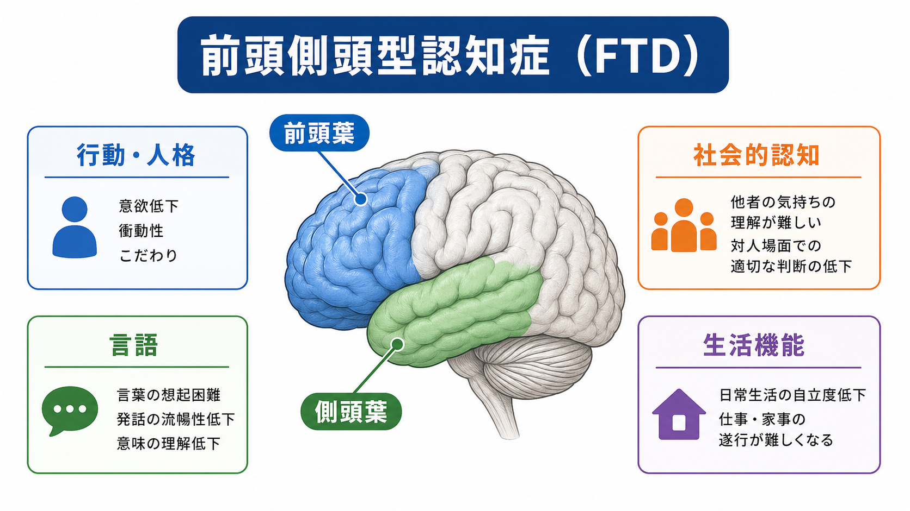
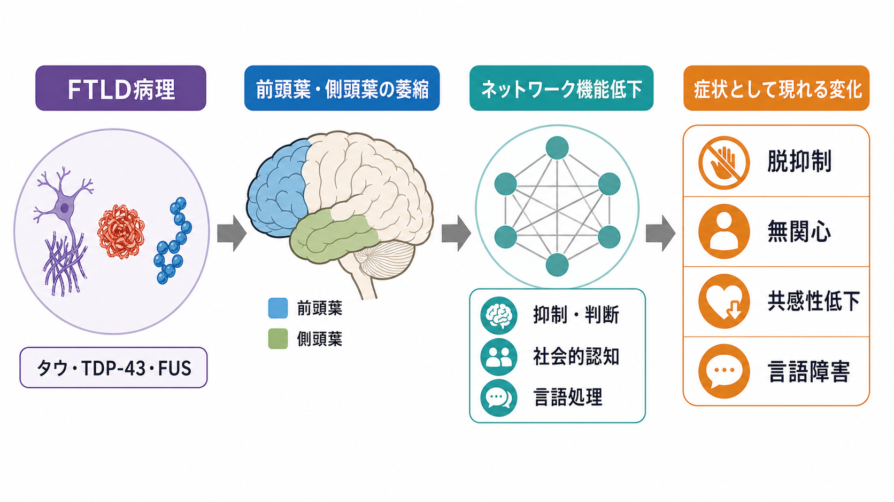
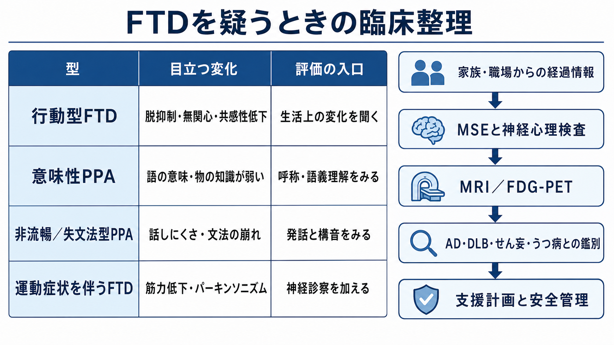

# 前頭側頭型認知症とは何か

## 要点

- 前頭側頭型認知症（frontotemporal dementia: FTD）は、単一疾患というより、前頭葉・側頭葉を中心とする神経変性によって、行動、人格、社会的認知、実行機能、言語が進行性に変化する臨床症候群である[1][2]。
- 典型的には、初期から記憶障害だけが目立つとは限らない。脱抑制、無関心、共感性低下、常同行動、食行動変化、語想起困難、語義理解低下、発話のぎこちなさが入口になる[2][3]。
- 行動型FTDでは「性格の問題」や「反抗」と誤解されやすく、一次進行性失語（primary progressive aphasia: PPA）では「もの忘れ」よりも言語ネットワークの変性が前景に立つ[3][4]。
- 現時点で進行を止める確立治療は限られるため、評価では診断名だけでなく、安全管理、生活機能、家族負担、法的・経済的準備、コミュニケーション支援を同時に考える[1][6]。

## この記事で答える問い

1. 前頭側頭型認知症は、アルツハイマー型認知症や通常の加齢性物忘れと何が違うのか。
2. なぜ人格変化・行動異常・言語障害が中心に見えるのか。
3. 臨床では何を観察し、何と鑑別し、どのような支援につなげるのか。

## まず結論

FTDを理解する鍵は、「記憶が悪くなる病気」と狭く見るのではなく、前頭葉・側頭葉ネットワークの変性が、社会的行動、抑制、価値判断、共感、言語意味処理を変える病態として読むことである。行動型FTDでは、本人の内省や病識が乏しいまま、周囲から見て不適切な発言、衝動的行動、同じ行動の反復、無関心、食行動変化が目立つことがある[2]。PPAでは、記憶や視空間機能より先に、語の意味、文法、発話運動、語想起が進行性に障害される[3]。

したがって評価では、本人の訴えだけでなく、家族・職場・介護者から見た「以前と何が変わったか」を時系列で確認する。これは[[認知機能低下はどのように評価するのか]]、[[精神状態診察MSEとは何か]]、[[鑑別診断とは何か]]で扱う広い評価手順の中に位置づく。

## 背景

FTDは、若年発症認知症の重要な原因の一つであり、45-64歳で発症する人も多いとされる[1]。働き盛り、子育て、介護、家計管理、運転、職場責任と重なるため、医学的問題であると同時に、家族システムと生活基盤に大きな影響を与える。

認知症という語からは記憶障害が想起されやすいが、FTDでは初期から短期記憶が比較的保たれる場合がある。むしろ、「空気を読まない」「人が変わった」「気遣いがなくなった」「同じ食べ物ばかり欲しがる」「言葉が出ない」といった変化が先に気づかれる。ここで道徳的非難やパーソナリティ評価だけに寄せると、神経変性疾患としての評価が遅れる。

## 基本概念

### FTDとFTLD

FTDは臨床症候群の名称であり、FTLD（frontotemporal lobar degeneration）は主に病理学的な概念である。FTLDでは、タウ、TDP-43、FUSなどの異常タンパク蓄積を中心に病理分類される[5]。ただし、臨床像と病理型は一対一に対応しない。行動型FTD、PPA、皮質基底核症候群、進行性核上性麻痺、ALSを伴うFTDなどが、重なり合いながら現れることがある[1][6]。

### 行動型FTD

行動型FTDでは、脱抑制、無関心または自発性低下、共感性低下、保続・常同行動、口唇傾向や食行動変化、実行機能障害が診断上重要な特徴になる[2]。Rascovskyらの改訂基準では、これらの臨床特徴を組み合わせ、生活機能低下や前頭側頭部の画像所見を加えて、possible、probable、definiteの水準で整理する[2]。

### 一次進行性失語

PPAは、言語が主な初発症状となる進行性症候群である。Gorno-Tempiniらの国際基準では、非流暢／失文法型、意味性、ロゴペニック型の3類型が整理された[3]。このうち意味性PPAや非流暢／失文法型PPAはFTLD病理と関連しやすいが、ロゴペニック型はアルツハイマー病理と関連することも多く、FTDとPPAを単純に同一視しないことが重要である[3][6]。

## 仕組み

FTDでは、前頭葉・側頭葉の限局した部位だけが壊れるというより、大規模ネットワークの選択的脆弱性として理解すると見通しがよい。Seeleyらは、神経変性疾患が健常脳に存在する機能的結合ネットワークに沿った萎縮パターンを示すことを報告し、行動型FTDでは前部島皮質や前帯状皮質を含むサリエンスネットワークが重要な候補として示された[7]。

このネットワークが弱ると、目立つ刺激に注意を向ける、社会的状況の意味を読む、相手の感情を推測する、衝動を抑える、行動を切り替える、といった処理が崩れやすくなる。側頭葉、とくに前部側頭葉の障害では、単語、人物、物体、社会的概念の意味づけが揺らぎ、意味性PPAや社会的認知の変化につながる。

病理面では、FTLD-tau、FTLD-TDP、FTLD-FUSなどがあり、遺伝性FTDではMAPT、GRN、C9orf72が代表的である[1][5][6]。ただし、遺伝子、病理、症状の対応は複雑で、同じ遺伝子変異でも家族内で症状や発症年齢が異なることがある。教育・研究目的では、「遺伝子があるから必ず同じ経過をたどる」とは読まず、臨床像、画像、家族歴、必要に応じた遺伝カウンセリングを組み合わせて考える。

## 図解

図1は、FTDを「記憶障害の一種」としてではなく、前頭葉・側頭葉に支えられた行動、言語、社会的認知、生活機能の変化として読むための概念地図である。

図2は、FTLD病理、前頭葉・側頭葉萎縮、ネットワーク機能低下、症状の流れを単純化して示している。実際には、病理型、発症年齢、併存疾患、教育歴、職業、家族環境によって現れ方は大きく異なる。

図3は、臨床でFTDを疑うときに、型、目立つ変化、評価の入口を並べたものである。

## 臨床・研究との接続

### 評価の入口

FTDでは、本人が困り感を語らないことがある。したがって、家族や職場から見た変化、金銭管理、運転、火の管理、対人トラブル、食行動、身だしなみ、仕事のミス、性的脱抑制、反復行動を具体的に確認する。MSEでは、意識、注意、見当識、記憶だけでなく、発語量、語義理解、抽象思考、病識、判断力、共感性、衝動性を観察する。

### 鑑別診断

FTDと鑑別すべきものには、[[アルツハイマー型認知症とは何か]]、[[レビー小体型認知症とは何か]]、血管性認知症、[[せん妄とは何か]]、[[うつ病とは何か]]、双極性障害、統合失調症圏、発達特性、パーソナリティ障害、物質・薬剤性、脳腫瘍、てんかん、内分泌疾患がある。急性発症や日内変動が強ければ、まずせん妄や身体疾患を考える。幻視、注意変動、パーキンソニズム、レム睡眠行動異常が目立てば、レビー小体型認知症との鑑別が重要になる。

画像では、MRIで前頭葉・側頭葉萎縮を、FDG-PETで前頭側頭部の代謝低下を参照することがある。ただし、画像所見だけで診断は完結しない。病歴、神経心理検査、言語評価、生活機能、身体診察、薬剤、家族歴、必要に応じたバイオマーカーを統合する[6]。

### 支援とケア

FTD支援では、本人を説得して「反省」させるより、環境調整とリスク管理が重要になる場面が多い。たとえば、金銭トラブルを減らす仕組み、運転評価、過食や誤嚥への配慮、火気・刃物・外出の安全管理、予定の構造化、短く具体的な指示、言語障害に応じたコミュニケーション支援を検討する。

同時に、家族は「本人がわざとしている」と受け取りやすく、怒り、喪失感、疲弊を抱える。FTDは家族負担が大きい疾患であり、介護サービス、レスパイト、成年後見、就労・経済相談、地域連携を早めに考える必要がある[1][8]。

## よくある誤解

### 誤解1：記憶が保たれていれば認知症ではない

FTDでは、初期にエピソード記憶が比較的保たれることがある。記憶検査だけで否定せず、社会的行動、実行機能、言語、生活機能を確認する。

### 誤解2：人格変化は本人の性格や家庭問題で説明できる

生活歴や関係性は症状の見え方に影響するが、急に始まった脱抑制、共感性低下、無関心、常同行動を道徳的問題だけに還元すると評価が遅れる。神経変性による抑制・社会的認知ネットワークの変化として読む必要がある。

### 誤解3：FTDなら全員が同じ経過をたどる

FTDは臨床像、病理、遺伝、運動症状の有無が多様である。行動型、PPA、ALSやパーキンソニズムを伴う型では、必要な評価と支援が異なる。

### 誤解4：診断がつけば治療方針は自動的に決まる

現時点で疾患進行を止める標準治療は限られるが、診断は無意味ではない。安全管理、家族支援、コミュニケーション調整、身体合併症の予防、将来意思決定の準備を具体化するために重要である[6][8]。

## 関連ノート

- [[前頭側頭型認知症はなぜ人格や行動を変えるのか]]
- [[認知症とは何か]]
- [[神経認知障害群とは何か]]
- [[認知機能低下はどのように評価するのか]]
- [[認知機能検査は何を測っているのか]]
- [[MSEで認知機能をどう評価するか]]
- [[鑑別診断とは何か]]
- [[せん妄とは何か]]
- [[レビー小体型認知症とは何か]]
- [[アルツハイマー型認知症とは何か]]

MOC更新候補: `content/00_MOC/MOC｜精神医学.md`、認知症・神経変性・神経科学と精神疾患に関するMOCがあれば、本記事を「疾患・症候群」「認知症」「鑑別診断」枠へ追加する。

今後の作成候補: 行動型前頭側頭型認知症とは何か、一次進行性失語とは何か、意味性認知症とは何か、FTDとALSはどう関係するのか、FTDの家族支援とは何か、せん妄と認知症はどう違うのか。

## 理解チェック

1. FTDで、初期から記憶障害より行動変化や言語障害が目立つことがあるのはなぜか。
2. 行動型FTDの主要な臨床特徴を、脱抑制、無関心、共感性低下、常同行動、食行動変化、実行機能の観点から説明できるか。
3. PPAの3類型を、言語症状と関連する病変ネットワークの違いとして整理できるか。
4. せん妄、うつ病、アルツハイマー型認知症、レビー小体型認知症とFTDを鑑別するとき、どの情報を優先して集めるか。

## 未解決問題

- 臨床症状、画像、血液・髄液バイオマーカーから、FTLD-tau、FTLD-TDP、FTLD-FUSなどの病理型をどこまで生前に推定できるのか。
- 遺伝性FTDに対する疾患修飾治療が、どの病期・どのバイオマーカーを入口に実装されるのか。
- 社会的認知や共感性低下を、家族支援と安全管理に直結する形でどう評価・介入するのか。
- 日本の地域医療・介護制度の中で、若年発症FTDの就労、家計、家族負担をどのように早期支援へつなげるのか。

## 参考文献

[1] National Institute of Neurological Disorders and Stroke. Frontotemporal Dementia and Other Frontotemporal Disorders. https://www.ninds.nih.gov/health-information/disorders/frontotemporal-dementia-and-other-frontotemporal-disorders

[2] Rascovsky K, Hodges JR, Knopman D, et al. Sensitivity of revised diagnostic criteria for the behavioural variant of frontotemporal dementia. *Brain*. 2011;134(9):2456-2477. https://doi.org/10.1093/brain/awr179

[3] Gorno-Tempini ML, Hillis AE, Weintraub S, et al. Classification of primary progressive aphasia and its variants. *Neurology*. 2011;76(11):1006-1014. https://doi.org/10.1212/WNL.0b013e31821103e6

[4] Bang J, Spina S, Miller BL. Frontotemporal dementia. *Lancet*. 2015;386(10004):1672-1682. https://doi.org/10.1016/S0140-6736(15)00461-4

[5] Mackenzie IRA, Neumann M, Bigio EH, et al. Nomenclature for neuropathologic subtypes of frontotemporal lobar degeneration: consensus recommendations. *Acta Neuropathologica*. 2009;117(1):15-18. https://doi.org/10.1007/s00401-008-0460-5

[6] Boeve BF, Boxer AL, Kumfor F, Pijnenburg Y, Rohrer JD. Advances and controversies in frontotemporal dementia: diagnosis, biomarkers, and therapeutic considerations. *Lancet Neurology*. 2022;21(3):258-272. https://doi.org/10.1016/S1474-4422(21)00341-0

[7] Seeley WW, Crawford RK, Zhou J, Miller BL, Greicius MD. Neurodegenerative diseases target large-scale human brain networks. *Neuron*. 2009;62(1):42-52. https://doi.org/10.1016/j.neuron.2009.03.024

[8] Magrath Guimet N, Zapata-Restrepo LM, Miller BL. Advances in Treatment of Frontotemporal Dementia. *Journal of Neuropsychiatry and Clinical Neurosciences*. 2022;34(4):316-327. https://doi.org/10.1176/appi.neuropsych.21060166
