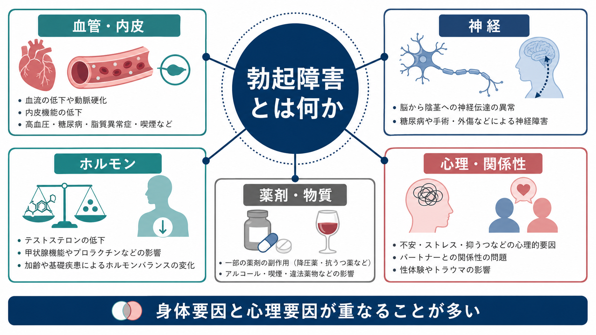
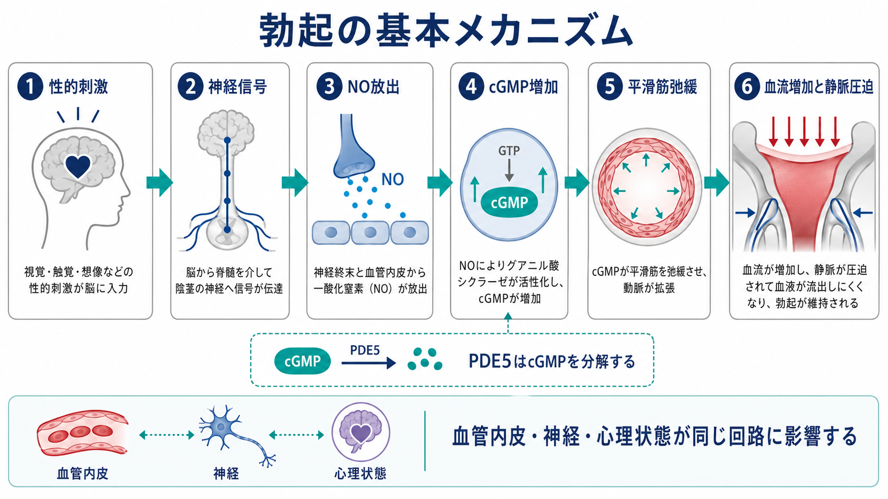
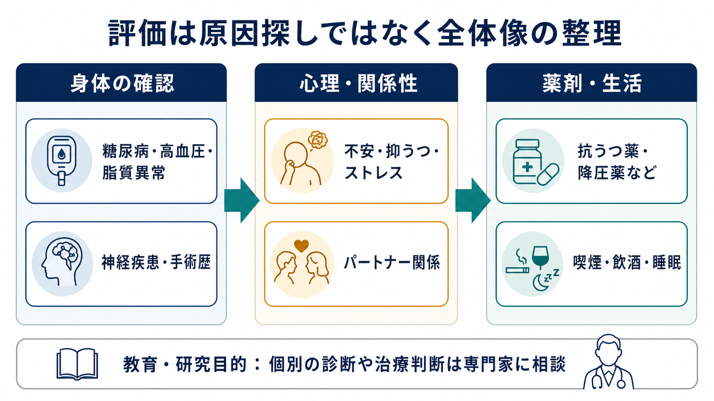

# 勃起障害とは何か

## 要点

- 勃起障害 erectile dysfunction: ED は、性的満足に十分な勃起を達成または維持することが一貫して難しい状態を指す。DSM-5 系の「勃起障害」では、勃起の獲得困難、維持困難、硬さの低下のいずれかが、多くの性活動で約6か月持続し、本人に臨床的に有意な苦痛をもたらすことが重視される[1]。
- 勃起は「気持ち」だけでも「血流」だけでも説明できない。性的刺激、神経信号、一酸化窒素 NO、cGMP、平滑筋弛緩、動脈血流増加、静脈流出の抑制が連鎖する神経血管反応である[2][3]。
- ED の背景には、糖尿病、高血圧、脂質異常、喫煙、神経疾患、骨盤手術、テストステロン低下、抑うつ・不安、関係性のストレス、薬剤やアルコールなどが重なりうる[2][4]。
- ED は生活の質や関係性の問題にとどまらず、心血管疾患のリスクマーカーとしても重要である。AUA ガイドラインは、ED を訴える男性に心血管疾患や他の健康問題の評価が必要になりうることを説明するよう推奨している[5]。
- この記事は教育・研究目的の整理であり、個別の診断や治療指示ではない。急な発症、胸痛、神経症状、強い苦痛、薬剤変更の希望がある場合は、医療専門職への相談が優先される。

## この記事で答える問い

1. 勃起障害は、どのような状態を指すのか。
2. 勃起は、神経・血管・心理のどのような連鎖で生じるのか。
3. 身体要因、心理要因、薬剤要因はどのように重なり合うのか。
4. 精神医学・心理学の文脈では、ED をどのように扱うべきか。

## まず結論

勃起障害は、単純な「性欲の低下」や「気合いの問題」ではない。勃起は、脳内の性的興奮や安心感、脊髄・末梢神経の信号、血管内皮からの NO 放出、cGMP を介した平滑筋弛緩、陰茎海綿体への血流増加、静脈流出の抑制がそろって成立する。したがって、血管疾患、糖尿病性神経障害、ホルモン異常、抑うつ・不安、パフォーマンス不安、パートナー関係、抗うつ薬や降圧薬などの薬剤、飲酒・喫煙・睡眠の問題は、同じ生理回路の異なる入口から ED に関わる[2][3][4]。

臨床的には、「身体か心理か」の二分法よりも、「どの要因がどの程度、どの場面で、どの順序で関わっているか」を整理する方が有用である。たとえば血管要因で始まった ED が失敗体験を通じて不安を強め、さらに交感神経系の緊張が勃起を妨げることがある。逆に、[[うつ病とは何か]]や[[不安症群とは何か]]に伴う性欲低下・回避・集中困難が先にあり、後から身体的評価が必要になる場合もある。

## 背景

ED は年齢とともに増えるが、加齢そのものだけで説明してよい状態ではない。血管内皮機能、動脈硬化、糖代謝、神経障害、薬剤、抑うつ、不安、関係性などが相互作用するため、ED はしばしば「性的な症状」と「全身の健康状態」の交差点に現れる[2][4]。

とくに血管性 ED は、心血管疾患の早期サインとして扱われることがある。2021年の umbrella review は、ED のある人では心血管疾患、冠動脈疾患、心筋梗塞、脳卒中、全死亡などのリスクが高いという複数のメタ解析の結果をまとめている[6]。これは ED が必ず心疾患を意味するということではないが、喫煙、高血圧、糖尿病、脂質異常、肥満、運動不足などを確認する入口になりうる。

精神医学では、ED は性機能障害の一部として扱われるだけでなく、[[うつ病とは何か]]、[[全般不安症とは何か]]、[[PTSDとは何か]]、物質使用、薬剤性副作用、身体疾患に伴う精神症状と接続して理解する必要がある。本人の苦痛、回避、自己評価の低下、パートナー関係の緊張が重なると、症状そのものよりも二次的な悪循環が生活の質を下げることがある。

## 基本概念

### ED と一時的な勃起困難の違い

疲労、飲酒、睡眠不足、緊張、相手や状況の変化によって、一時的に勃起が不十分になることは珍しくない。臨床的な ED では、勃起を得ること、維持すること、硬さを保つことのいずれかが反復し、本人に意味のある苦痛や生活上の支障を生む点が問題になる[1][4]。

DSM-5 系の「勃起障害」は、症状の頻度、約6か月という持続、本人の苦痛、薬剤・身体疾患・他の精神疾患・関係性ストレスでよりよく説明されないかを確認する枠組みをもつ[1]。一方、泌尿器科や一般診療では、ED はより広く「性的活動に十分な勃起の達成・維持が難しい状態」として評価される[5]。この違いは、精神医学的診断名と臨床症状名の違いとして理解するとよい。

### 獲得性・生涯性、全般性・状況性

ED は、以前は問題がなかったが途中から生じた「獲得性」と、性活動の初期から続く「生涯性」に分けられる。また、ほぼすべての状況で起こる「全般性」と、特定の相手、場面、刺激、ストレス条件で目立つ「状況性」に分けられる[1][4]。朝立ちや自慰での勃起が保たれるか、特定の場面だけで起こるかは、心理要因と身体要因の見立てに役立つが、単独で原因を決めるものではない。

## 仕組み

### 神経血管反応としての勃起

勃起は、心理的・感覚的刺激が脳と脊髄を介して自律神経系に伝わり、陰茎海綿体の血管と平滑筋を変化させる反応である。海綿体神経や血管内皮から NO が放出されると、グアニル酸シクラーゼが活性化し、cGMP が増える。cGMP は細胞内カルシウムを下げ、平滑筋を弛緩させ、動脈血流を増やす。海綿体が血液で満たされると、周囲の静脈が圧迫され、血液が流出しにくくなるため、勃起が維持される[3][7]。

PDE5 は cGMP を分解する酵素である。PDE5 阻害薬はこの分解を抑え、性的刺激に伴う NO/cGMP 経路を支えやすくする薬である[7]。ただし、薬が単独で性的興奮を作るわけではなく、硝酸薬などとの併用禁忌もあるため、自己判断での使用や薬剤変更は避ける必要がある[2][5]。

### 身体要因

身体要因は、血管、神経、ホルモン、構造、全身疾患に分けると整理しやすい。

| 要因 | 例 | ED へのつながり |
|---|---|---|
| 血管・内皮 | 高血圧、脂質異常、糖尿病、喫煙、動脈硬化 | 動脈血流低下、NO 産生低下、静脈閉鎖不全 |
| 神経 | 糖尿病性神経障害、脊髄損傷、脳卒中、骨盤手術 | 性的刺激から海綿体への信号伝達低下 |
| ホルモン | テストステロン低下、高プロラクチン血症、甲状腺疾患 | 性欲低下、NO 経路や勃起頻度への影響 |
| 構造 | Peyronie 病、骨盤外傷、手術・放射線後 | 海綿体や血管・神経の局所的障害 |
| 全身状態 | 慢性腎臓病、肥満、睡眠障害、慢性疼痛 | 血管・神経・内分泌・心理要因の複合 |

糖尿病では、微小血管障害、神経障害、内皮機能低下、テストステロン低下が重なりやすく、ED の代表的な身体リスクである[2][7]。また、[[内分泌疾患に伴う精神症状とは何か]]のように、内分泌異常は気分・意欲・性欲・身体感覚を同時に変化させるため、心理症状だけに見える場合にも身体評価が必要になる。

### 心理・関係性要因

心理要因には、パフォーマンス不安、失敗体験への予期不安、抑うつ、ストレス、トラウマ、関係性の緊張、性的コミュニケーションの困難が含まれる[2][4]。不安が強いと交感神経系の緊張が高まり、リラックスと血管拡張が必要な勃起反応を妨げやすい。[[うつ病とは何か]]では性欲低下、快感低下、疲労、自己評価低下が ED と重なりやすく、[[不安症群とは何か]]では身体感覚への過度な注意や回避が悪循環を作ることがある。

重要なのは、心理要因があるからといって「身体の問題ではない」とは言えない点である。身体要因が最初にあっても、失敗体験が不安を作り、関係性の緊張を通じて ED が維持されることがある。反対に、心理的ストレスが先行していても、高血圧、糖尿病、薬剤性副作用が併存していることがある。

### 薬剤・物質要因

ED に関わりうる薬剤には、降圧薬の一部、抗うつ薬、とくに SSRI、三環系抗うつ薬、抗精神病薬、抗アンドロゲン薬、5α還元酵素阻害薬、オピオイド、ベンゾジアゼピン系薬、抗コリン作用をもつ薬剤などがある[4]。アルコールは一時的にも慢性的にも勃起を妨げうる。[[アルコール使用障害とは何か]]や[[ニコチン使用障害とは何か]]は、性機能だけでなく血管・睡眠・気分の問題とも重なりやすい。

ただし、薬剤が疑われる場合でも自己判断で中止してはいけない。薬剤を止めることで、うつ病、不安症、血圧、前立腺疾患、疼痛などが悪化する可能性がある。臨床では、発症時期、用量変更、併用薬、代替薬の可能性、基礎疾患のリスクを整理して判断する。

## 図解

ED の評価は、単一原因を当てる作業ではなく、全体像を並べて悪循環を見つける作業である。たとえば、糖尿病と喫煙が血管内皮機能を下げ、SSRI が性反応を弱め、失敗体験が不安を増やし、睡眠不足がさらに性欲を下げる、というように複数の要因が同時に働く。

## 臨床・研究との接続

### 評価で確認されること

AUA ガイドラインは、ED を訴える男性に対し、医学的・性的・心理社会的な病歴、身体診察、選択的な検査を行うこと、重症度評価に質問紙を用いること、朝の総テストステロンを測定すること、ED が心血管疾患などのリスクマーカーになりうることを説明することを推奨している[5]。EAU の近年のガイドライン更新でも、ED は男性性機能の問題としてだけでなく、低テストステロン、Peyronie 病、射精障害、全身疾患と接続して扱われる[8]。

精神医学的評価では、以下を確認する。

- 発症時期: 急性か徐々にか、薬剤変更や疾患発症と同期するか。
- 状況性: 特定の相手・場面・刺激だけか、自慰や朝立ちではどうか。
- 併存症状: 抑うつ、不安、睡眠、トラウマ、物質使用、疼痛、疲労。
- 関係性: コミュニケーション、期待、回避、葛藤、パートナー側の性機能や健康。
- 身体リスク: 糖尿病、高血圧、脂質異常、喫煙、心血管症状、神経症状、手術歴。
- 薬剤: 抗うつ薬、降圧薬、ホルモン関連薬、鎮痛薬、睡眠薬、嗜好品。

### 介入の考え方

治療選択は原因の単純なラベルではなく、本人の希望、苦痛、身体リスク、薬剤、関係性、禁忌を踏まえた共同意思決定で行われる[5]。選択肢には、基礎疾患の管理、禁煙・運動・睡眠・飲酒の調整、薬剤の見直し、心理教育、性心理療法・カップル介入、PDE5 阻害薬、デバイス、注射薬、外科的治療などがある[2][5]。この記事では個別の治療指示は行わないが、ED の背景を多層的に整理すること自体が、適切な相談先を選ぶ助けになる。

研究上は、ED は神経血管機能、内皮機能、男性ホルモン、精神症状、薬剤性副作用、カップル関係、生活習慣、心血管リスクを結ぶテーマである。計測には IIEF や SHIM などの自己記入式尺度、性機能・苦痛・関係満足度の評価、ホルモン・代謝指標、心血管リスク評価などが使われる[5]。

## よくある誤解

### 「若ければ ED は心理的な問題だけである」

若年でも心理要因は多いが、薬剤、糖尿病、内分泌異常、神経疾患、睡眠不足、物質使用、骨盤外傷などはありうる。急な変化や全身症状を伴う場合は、年齢だけで身体要因を除外しない。

### 「朝立ちがあれば身体要因はない」

朝立ちや自慰での勃起が保たれることは心理・状況要因を示唆するが、身体要因を完全に否定するものではない。ED は複合的で、身体要因が軽度でも不安や関係性要因によって症状化することがある[2][4]。

### 「ED は本人の性格や魅力の問題である」

ED は神経血管反応の不調であり、本人の価値やパートナーへの好意を直接示すものではない。自己非難や相手への推測が強まると、回避と緊張が症状を保ちやすくなる。

### 「薬を飲めば心理面は関係なくなる」

PDE5 阻害薬は NO/cGMP 経路を支えるが、性的刺激、安心感、関係性、禁忌薬、基礎疾患の管理と切り離せない[5][7]。不安や抑うつが強い場合は、薬物療法だけでなく心理社会的支援が重要になる。

## 関連ノート

- [[うつ病とは何か]]
- [[不安症群とは何か]]
- [[全般不安症とは何か]]
- [[PTSDとは何か]]
- [[アルコール使用障害とは何か]]
- [[ニコチン使用障害とは何か]]
- [[内分泌疾患に伴う精神症状とは何か]]
- [[睡眠覚醒障害群とは何か]]
- [[パーキンソン病認知症とは何か]]

関連ノート候補:

- 男性性機能障害とは何か
- SSRI による性機能障害とは何か
- 心血管疾患とうつ病はどう関係するのか
- 糖尿病と精神症状はどう関係するのか
- 性心理療法とは何か

MOC 更新候補:

- `content/00_MOC/MOC・精神医学.md`
- `content/00_MOC/MOC・臨床実践.md`
- `content/00_MOC/MOC・身体医学と精神医学.md`

## 理解チェック

1. ED を「身体か心理か」の二分法だけで考えると、どのような見落としが起こるか。
2. NO/cGMP 経路は、勃起のどの段階に関わるか。
3. ED が心血管リスク評価の入口になりうるのはなぜか。
4. 薬剤性 ED が疑われるとき、自己判断で薬を中止してはいけない理由は何か。
5. ED の評価で、パートナー関係や状況性を確認する意義は何か。

## 参考文献

[1] American Psychiatric Association. (2013). *Diagnostic and Statistical Manual of Mental Disorders, Fifth Edition*. American Psychiatric Publishing. DSM-5 criteria summary: Medscape, Erectile Dysfunction Differential Diagnoses. https://emedicine.medscape.com/article/444220-differential

[2] Dean, R. C., & Lue, T. F. (2022). Medical and Surgical Therapy of Erectile Dysfunction. In *Endotext*. NCBI Bookshelf. https://www.ncbi.nlm.nih.gov/sites/books/NBK278925/

[3] Burnett, A. L. (2006). The role of nitric oxide in erectile dysfunction: implications for medical therapy. *Journal of Clinical Hypertension*, 8(12 Suppl 4), 53-62. https://doi.org/10.1111/j.1524-6175.2006.06026.x

[4] Merck Manual Professional Edition. (2024). Erectile Dysfunction. https://www.merckmanuals.com/professional/genitourinary-disorders/male-sexual-dysfunction/erectile-dysfunction

[5] Burnett, A. L., Nehra, A., Breau, R. H., et al. (2018). Erectile Dysfunction: AUA Guideline. *Journal of Urology*, 200(3), 633-641. https://doi.org/10.1016/j.juro.2018.05.004

[6] Mostafaei, H., Mori, K., Hajebrahimi, S., et al. (2021). Association of erectile dysfunction and cardiovascular disease: an umbrella review of systematic reviews and meta-analyses. *BJU International*, 128(1), 3-11. https://doi.org/10.1111/bju.15313

[7] Kim, J. H., & Carson, C. C. (2021). Sexual Dysfunction in Diabetes. In *Endotext*. NCBI Bookshelf. https://www.ncbi.nlm.nih.gov/books/NBK279101/

[8] Salonia, A., Capogrosso, P., Boeri, L., et al. (2025). European Association of Urology Guidelines on Male Sexual and Reproductive Health: 2025 Update on Male Hypogonadism, Erectile Dysfunction, Premature Ejaculation, and Peyronie's Disease. *European Urology*, 88(1), 76-102. https://doi.org/10.1016/j.eururo.2025.04.010

## 未解決問題

- ED の心理療法・カップル介入が、どのサブタイプで最も有効かを比較する研究はまだ十分ではない。
- 心血管リスクのスクリーニングに ED の重症度をどの程度組み込むべきかは、年齢、併存疾患、評価尺度によって変わる。
- 抗うつ薬による性機能障害では、症状改善、再発予防、性機能、本人の優先順位をどう統合するかが実践上の課題である。
