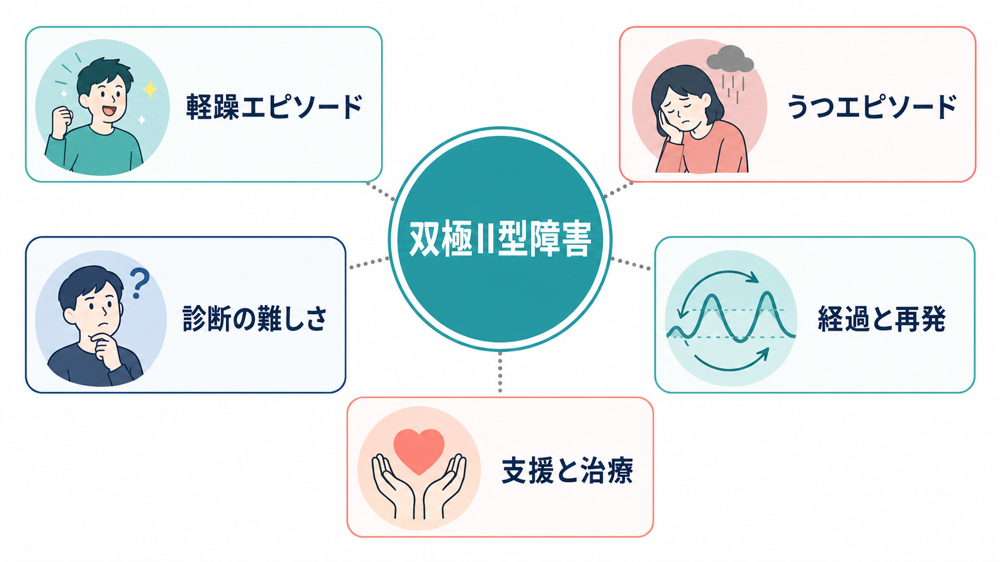
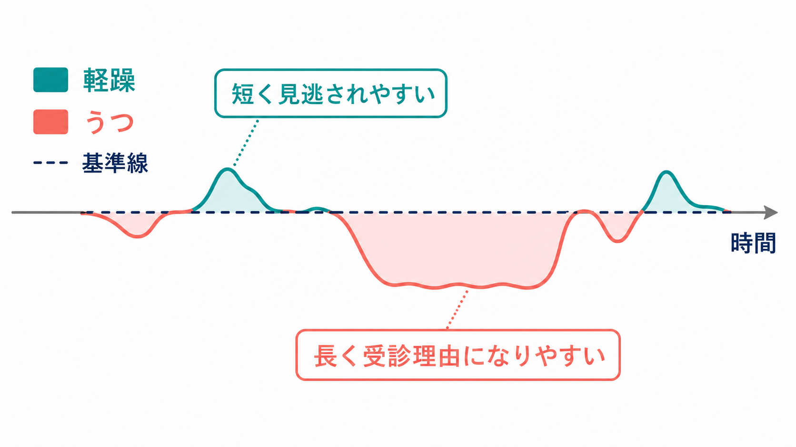
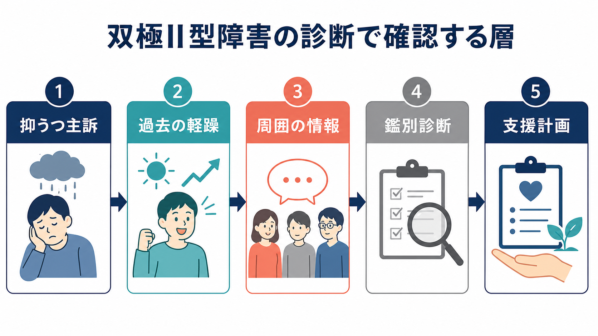

# 双極II型障害とは何か

## 要点

- 双極II型障害は、少なくとも 1 回の[[軽躁状態とは何か|軽躁エピソード]]と、少なくとも 1 回のうつエピソードを特徴とし、躁エピソードの既往がない病態である[1][2][3]。
- 診断の難しさは、本人が受診する時点ではうつ症状が前景に出やすく、軽躁は「調子がよい時期」「本来の自分」と解釈され、見逃されやすい点にある[3][6]。
- 「双極II型は軽い双極性障害」という理解は不正確である。抑うつ期間、機能障害、自殺リスク、併存症の負担は大きく、長期的な評価と支援が必要になる[3][4][6]。
- 治療や支援では、うつ症状だけでなく、睡眠、活動量、衝動性、抗うつ薬による気分高揚、家族歴、周囲から見た変化を含めて評価する[5][7]。
- この記事は教育・研究目的の整理であり、個別の診断や治療指示ではない。症状や安全面の懸念がある場合は、医療機関や地域の相談窓口につなぐことが優先される。

## この記事で答える問い

1. 双極II型障害は、うつ病や双極I型障害と何が違うのか。
2. なぜ軽躁エピソードは見逃されやすいのか。
3. 診断では、どのような経過、症状、鑑別を確認するのか。
4. 臨床・研究では、双極II型障害をどのように扱う必要があるのか。

## まず結論

双極II型障害を理解する鍵は、「うつ症状の病気」ではなく、「うつエピソードと軽躁エピソードが時間の中で交互に現れる病態」として見ることである。実際の受診理由は、気分の高まりよりも、抑うつ、疲労、過眠または不眠、仕事・学業の低下、希死念慮、不安、対人関係の悪化であることが多い[3][4]。

軽躁は、躁状態より重症度が低く、入院を要するほどの機能障害や精神病症状を伴わない。しかし、軽躁が「無害」という意味ではない。睡眠欲求の低下、活動量の増加、多弁、焦燥、衝動的な支出、対人トラブル、性的リスク、計画の過剰拡大などが生じ、その後に強いうつへ移行することがある[1][2][5]。

## 背景

NIMH は双極性障害を、気分、エネルギー、活動量、集中力が明確に変化する疾患として説明している[4]。この変化は、単なる気分の波ではなく、睡眠、判断、行動、対人関係、仕事・学業、身体健康に影響する。

双極II型障害が臨床的に重要なのは、頻度は低く見積もられやすい一方で、一般人口研究のメタ解析でも一定の有病率が示されており、初期には[[うつ病とは何か|うつ病]]として見えることが多いからである[8]。2025 年の state-of-the-art review は、双極II型障害ではうつ症状が軽躁症状を大きく上回り、反復するうつエピソードとして現れやすいことを整理している[3]。JAMA の総説でも、双極性障害では初発がうつであることが多く、診断と治療が遅れやすいとされる[6]。

このため、抑うつ主訴を評価するときは、「現在うつか」だけでなく、「過去に軽躁らしい時期がなかったか」を時間軸で確認する必要がある。これは[[鑑別診断とは何か|鑑別診断]]と[[精神状態診察MSEとは何か|精神状態診察MSE]]の基本である。

## 基本概念

### 双極II型障害の診断上の骨格

DSM-5-TR と ICD-11 は、双極II型障害を、軽躁エピソードとうつエピソードの組み合わせとして位置づける[1][2]。DSM-5-TR では、少なくとも 1 回の軽躁エピソードと少なくとも 1 回の大うつ病エピソードがあり、躁エピソードがないことが重要である[1]。ICD-11 でも、1 回以上の軽躁エピソードと少なくとも 1 回の抑うつエピソードを中核に置き、躁または混合エピソードの既往がないことを前提にする[2]。

ここで重要なのは、診断が「その日の気分」だけで決まらないことである。双極II型障害はエピソード性の経過をもつため、現在の状態だけでなく、過去の気分高揚、睡眠欲求低下、活動量増加、周囲から見た変化、うつエピソードの反復、家族歴、薬剤反応を組み合わせて判断する。

### 軽躁とうつの非対称性

軽躁エピソードは、本人にとって快適または生産的に感じられることがある。いつもより短い睡眠で動ける、話が速くなる、社交的になる、仕事や計画が増える、といった変化は、本人には問題として認識されにくい。一方、周囲からは「普段と違う」「落ち着かない」「攻撃的」「浪費が増えた」と見えることがある。

これに対して、うつエピソードは苦痛と機能低下を伴いやすく、受診理由になりやすい。[[抑うつ気分とは何か|抑うつ気分]]、興味・喜びの低下、疲労、睡眠・食欲変化、集中困難、罪責感、希死念慮などが前景化するため、初診時には単極性うつ病と区別しにくい。

## 仕組み

双極II型障害の仕組みは、単一の脳部位や神経伝達物質だけで説明できない。現在は、遺伝的脆弱性、睡眠・概日リズム、報酬処理、ストレス反応、情動調整、認知、環境要因が重なる多層モデルとして考えるのが実用的である[3][6]。

### 睡眠・概日リズム

軽躁では、睡眠時間が短くなっても疲れにくい、または睡眠欲求が低下することがある。これは単なる不眠とは異なり、本人が「寝なくても動ける」と感じる点が手がかりになる。[[不眠とは何か|不眠]]や[[過眠とは何か|過眠]]を評価するときも、睡眠時間、睡眠欲求、活動量、翌日の疲労感を分けて見る必要がある。

### 報酬・活動・衝動性

軽躁では、報酬への接近、活動量、計画、社交性、発話量が高まりやすい。これ自体は一時的に「よい変化」に見えることがあるが、判断の粗さ、衝動的な支出、対人摩擦、リスク行動につながることがある。うつ相では逆に、報酬への感受性や活動開始が低下し、生活機能の低下が前景化する。

### 診断を難しくする循環

双極II型障害では、うつが長く、軽躁が短く、軽躁が本人にとって問題化しにくい。そのため、医療者側が過去の軽躁を尋ねなければ、反復性のうつ病として扱われることがある[3][6]。さらに、抗うつ薬、刺激薬、ステロイド、物質使用、睡眠不足などで軽躁様の変化が起こることもあり、[[薬剤性精神症状とは何か|薬剤性精神症状]]との鑑別も必要になる[5][7]。

## 図解

3 枚目の図は、双極II型障害の診断で確認する層を示している。抑うつ主訴を出発点にしつつ、過去の軽躁、本人以外からの情報、身体疾患・薬剤・物質・発達特性・パーソナリティ特性などの鑑別、支援計画へ進む流れである。

重要なのは、診断を急いでラベル化することではなく、時間経過と安全性を丁寧に扱うことである。うつ症状が強いときには自殺リスク評価が必要であり、軽躁があるときには浪費、危険運転、性的リスク、対人トラブル、服薬中断、睡眠不足を確認する。

## 臨床・研究との接続

### 臨床評価

臨床では、現在の抑うつ症状だけでなく、過去の「普段と違う高揚・易刺激性・活動量増加」を聞く。本人が軽躁を問題として語らない場合があるため、家族、同居者、支援者、過去の診療録、生活リズムの記録が役立つことがある[5]。

NICE ガイドラインは、双極I型、双極II型、混合性、急速交代型を含む双極性障害の認識、評価、治療、長期管理を扱っている[5]。治療方針は、現在のエピソード、重症度、既往、併存症、妊娠可能性、身体健康、本人の希望を含めて検討される。抗うつ薬の単剤使用は双極性障害では慎重に扱われ、気分安定薬や一部の非定型抗精神病薬、心理教育、睡眠・生活リズム調整が重要になる[6][7]。

### 研究上の課題

双極II型障害は、研究でも扱いにくい対象である。軽躁の境界、双極I型との境界、単極性うつ病との境界、境界性パーソナリティ障害との重なり、抗うつ薬関連の気分高揚などが絡むためである[3]。診断分類だけでなく、睡眠、活動量、気分変動、認知、併存症、生活機能を縦断的に測る研究が必要になる。

また、既存の治療エビデンスは双極I型から外挿される部分が少なくない。CANMAT/ISBD ガイドラインは双極性障害全体のエビデンスに基づく治療推奨を整理しているが、双極II型に特化した試験は相対的に少ない[7]。そのため、臨床ではガイドラインを参照しつつ、個別の経過とリスクを見ながら調整する必要がある。

## よくある誤解

### 「双極II型は軽い病気である」

軽躁は躁状態より軽いが、双極II型障害全体が軽いという意味ではない。抑うつエピソードの負担、再発、生活機能の低下、自殺リスクは大きく、長期的な支援を要することがある[3][4][6]。

### 「うつ病と診断されたら双極II型ではない」

初診時にうつ症状が前景にあることは珍しくない。過去に軽躁エピソードが確認されれば、同じ抑うつ症状でも双極性障害の一部として理解する必要がある[1][3]。

### 「軽躁は本人が必ず困るので自覚できる」

軽躁は本人にとって快調に感じられる場合がある。むしろ周囲のほうが、睡眠不足、早口、浪費、焦燥、怒りっぽさ、過剰な自信、予定の詰め込みに気づくことがある。

### 「薬だけ、または心理療法だけで考えればよい」

双極II型障害では、薬物療法、心理教育、睡眠・生活リズム、身体健康、物質使用、家族・職場・学校での支援を組み合わせて考える必要がある[5][7]。単一の介入だけで全体を説明するより、経過に応じた層別化が重要である。

## 関連ノート

- [[うつ病とは何か]]
- [[軽躁状態とは何か]]
- [[躁状態とは何か]]
- [[抑うつ気分とは何か]]
- [[DSMとICDは何が違うのか]]
- [[精神状態診察MSEとは何か]]
- [[鑑別診断とは何か]]
- [[不眠とは何か]]
- [[過眠とは何か]]
- [[薬剤性精神症状とは何か]]

## 理解チェック

1. 双極II型障害の診断で、軽躁エピソードとうつエピソードはそれぞれどのような役割を持つか。
2. なぜ双極II型障害は、単極性うつ病として見逃されやすいのか。
3. 軽躁と躁状態を分けるうえで、重症度、機能障害、入院、精神病症状はなぜ重要か。
4. 抑うつ主訴の人に、過去の軽躁を尋ねるとき、どのような具体的変化を確認するか。
5. 本人の自己申告だけでなく、周囲からの情報が役立つのはなぜか。

## 参考文献

[1] American Psychiatric Association. (2022). *Diagnostic and Statistical Manual of Mental Disorders, Fifth Edition, Text Revision (DSM-5-TR).* American Psychiatric Association Publishing. https://doi.org/10.1176/appi.books.9780890425787

[2] World Health Organization. (2024). *Clinical descriptions and diagnostic requirements for ICD-11 mental, behavioural and neurodevelopmental disorders.* WHO. https://www.who.int/publications/i/item/9789240077263

[3] Berk, M., Corrales, A., Trisno, R., Dodd, S., Yatham, L. N., Vieta, E., McIntyre, R. S., Suppes, T., & Agustini, B. (2025). Bipolar II disorder: a state-of-the-art review. *World Psychiatry, 24*(2), 175-189. https://doi.org/10.1002/wps.21300

[4] National Institute of Mental Health. (2024). *Bipolar Disorder.* https://www.nimh.nih.gov/health/topics/bipolar-disorder

[5] National Institute for Health and Care Excellence. (2025). *Bipolar disorder: assessment and management* (Clinical guideline CG185). https://www.nice.org.uk/guidance/cg185

[6] Nierenberg, A. A., Agustini, B., Köhler-Forsberg, O., Cusin, C., Katz, D., Sylvia, L. G., Peters, A., & Berk, M. (2023). Diagnosis and Treatment of Bipolar Disorder: A Review. *JAMA, 330*(14), 1370-1380. https://doi.org/10.1001/jama.2023.18588

[7] Yatham, L. N., Kennedy, S. H., Parikh, S. V., Schaffer, A., Bond, D. J., Frey, B. N., Sharma, V., Goldstein, B. I., Rej, S., Beaulieu, S., et al. (2018). Canadian Network for Mood and Anxiety Treatments and International Society for Bipolar Disorders 2018 guidelines for the management of patients with bipolar disorder. *Bipolar Disorders, 20*(2), 97-170. https://doi.org/10.1111/bdi.12609

[8] Clemente, A. S., Diniz, B. S., Nicolato, R., Kapczinski, F. P., Soares, J. C., Firmo, J. O. A., & Castro-Costa, É. (2015). Bipolar disorder prevalence: a systematic review and meta-analysis of the literature. *Brazilian Journal of Psychiatry, 37*(2), 155-161. https://doi.org/10.1590/1516-4446-2012-1693

## 未解決問題

- 軽躁の境界を、通常の気分高揚、性格特性、発達特性、物質・薬剤の影響からどこまで安定して区別できるか。
- 双極II型障害に特化した治療研究を、双極I型や単極性うつ病からの外挿に頼らず、どのように増やせるか。
- スマートフォン、睡眠記録、活動量、音声特徴などのデジタル指標を、過剰診断を避けながら臨床評価にどう統合できるか。

## MOC更新候補

- `content/00_MOC/` 配下の精神医学・気分障害関連 MOC に、本記事 `[[双極II型障害とは何か]]` を追加する候補。
- 並列ジョブとの競合を避けるため、この作業では MOC ファイル自体は更新していない。
